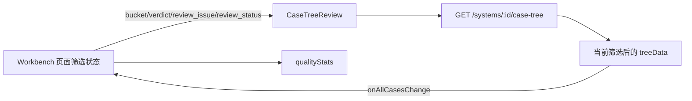
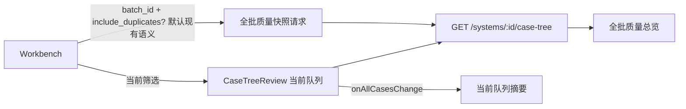

# 批次页质量分流总览稳定化设计

## 设计目标

在不改后端契约的前提下，让批次页同时拥有两个清楚分离的视角：

- 全批质量总览：用于判断整批质量结构，默认不随筛选变化。
- 当前队列：用于逐条审查当前筛选后的用例。

## 当前数据流

问题在于 `Stats` 使用的是筛选后的 `Tree`，所以它只能代表当前队列，不稳定代表全批。

## 目标数据流

## 技术边界

- 复用现有 `getCaseTree(systemId, params)`。
- 全批总览请求只传 `batch_id`，不传 `bucket`、`verdict`、`review_issue_type`、`review_status`。
- 当前队列继续由 `CaseTreeReview` 负责加载和展示。
- 总览统计只依赖 `CaseTreeCase` 已有字段：`bucket`、`verdict`、`review_issue_type`、`review_status`、`priority`。
- 若全批总览请求失败，显示 warning，不影响 `CaseTreeReview` 继续加载当前队列。
- 不新增后端 API，不改数据库，不改 worker，不改生成/核验逻辑。

## UI 设计

质量分流区拆成两个层次：

1. 顶部说明：“全批质量总览，不随下方筛选变化。”
2. 总览指标：主集候选、规格待澄清、生成待修正、与 PRD 冲突、需人工核对。
3. 当前队列摘要：当存在筛选时显示“当前队列：xxx”，并显示当前队列条数。
4. 快捷按钮继续使用原有筛选状态，点击后只改变当前队列，不改变全批总览。

## 兼容性

- 如果全批总览还没加载，指标显示 `-` 或 loading，不显示 0。
- 如果 batch/systemId 不存在，不发请求。
- 当前筛选、搜索、审查、迭代、落库动作保持原语义。
- `allCasesForIterate` 继续保存当前队列，用于“触发迭代”统计，避免误把全批需修改都提交迭代。

## 取舍

- 不新增后端聚合接口：少一次后端改动，但全批总览会多一次 case-tree 请求。当前切片优先降低集成风险。
- 不把审计报告塞进页面：页面只展示工作流必要摘要，深度质量分析仍在 `.audit` 报告或后续质量任务中完成。
- 不改变默认筛选：避免影响 QA 当前已经熟悉的审查行为。

## 批判性 Review

设计最薄弱处是“多一次 case-tree 请求”。如果批次非常大，前端拿全批树计算统计可能增加首屏压力。但当前页面本来已经加载用例树用于审查，本切片只在批次页补一份无筛选快照；相比新增后端统计接口，风险更小、更容易回滚。

另一个潜在问题是 `reviewFilter` 是否应影响全批总览。PRD 的用户价值是整批质量结构，因此全批总览不应受审查状态影响；当前队列摘要可以体现待审/已确认等状态。

本设计没有解决 `needs_spec` 内部混入生成错误的问题，这是刻意边界。那个问题属于生成质量分流策略，不属于批次页 UI 表达。
