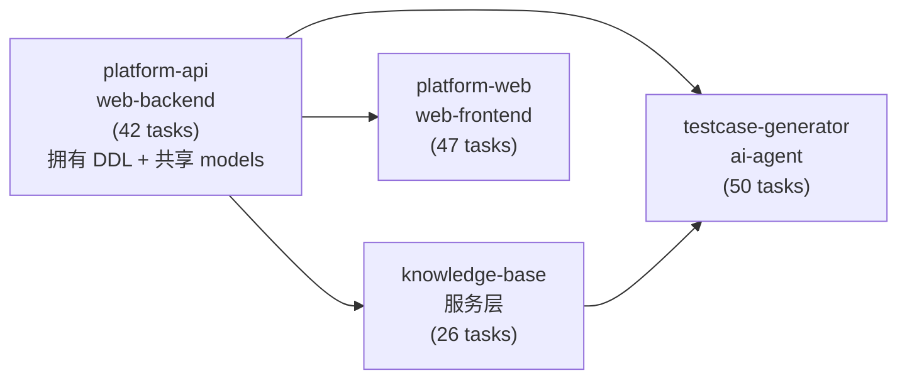

# 知识库搭建与AI用例生成核心闭环 跨模块协调视图

> 本文件是跨模块集成的导航与协调中心，不是任务汇总表。
> 各模块内部任务在对应 `task.md` 中管理，通过下方索引导航。

## 基本信息

| 属性 | 内容 |
| :--- | :--- |
| **变更编号** | CHG-20260605-001 |
| **变更名称** | 知识库搭建与AI用例生成核心闭环 |
| **生成时间** | 2026-06-08 |

---

## 1. 模块任务索引

| 模块 | 类型 | 任务文件 | 任务数 |
| :--- | :--- | :--- | :--- |
| knowledge-base | ai-agent (实际为服务层) | [`task.md`](./knowledge-base/task.md) | 26 |
| testcase-generator | ai-agent | [`task.md`](./testcase-generator/task.md) | 50 |
| platform-api | web-backend | [`task.md`](./platform-api/task.md) | 42 |
| platform-web | web-frontend | [`task.md`](./platform-web/task.md) | 47 |

**总计：165 个任务**

---

## 2. 跨模块执行顺序

<!--
  基于模块间依赖关系生成，展示推荐的启动和实现顺序。
  更细粒度的任务依赖可通过 xf-deps.mjs 脚本查询：
  node .xflow/scripts/xf-deps.mjs --module <name>
-->

**推荐启动顺序：**
1. **Wave 1**：platform-api 阶段1-2（环境+数据层+共享 models）—— 所有模块的 DDL 基础
2. **Wave 2**（可并行）：knowledge-base 全阶段 + platform-api 阶段3(系统/文档管理) + platform-web 阶段1-2
3. **Wave 3**（可并行）：testcase-generator 全阶段 + platform-api 阶段3(生成编排/导出) + platform-web 阶段3
4. **Wave 4**：全模块集成联调 + E2E + Golden-set 评估

---

## 3. 跨模块集成任务

<!--
  仅收录跨越模块边界的集成任务，不包含任何模块内部任务。
  任务编号依赖已更新对齐修复后的 task.md。
  具体编号可通过 xf-deps.mjs 验证。
-->

### 阶段：内部服务集成

- [ ] I001 P0 knowledge-base 服务层集成验证（platform-api 上传后触发 KB 解析+向量化，回调更新状态）
  depends: T022@knowledge-base, T036@platform-api

- [ ] I002 P0 testcase-generator Worker 与 platform-api 集成验证（Celery 任务派发 → 6 阶段流水线 → 阶段进度回调）
  depends: T039@testcase-generator, T037@platform-api

- [ ] I003 P0 testcase-generator 进程内调用 knowledge-base 检索验证（parse 阶段通过 RetrievalService 获取关联上下文）
  depends: T018@testcase-generator, T018@knowledge-base

### 阶段：前后端联调

- [ ] I004 P0 文档上传全链路联调（前端拖拽上传 → API 接收 → MinIO 存储 → KB 解析 → 状态反馈到前端）
  depends: T024@platform-api, T022@knowledge-base, T020@platform-web

- [ ] I005 P0 用例生成全链路联调（前端触发 → API 派发 → TC 流水线 → 阶段进度轮询 → 结果展示）
  depends: T029@platform-api, T037@platform-api, T030@platform-web

- [ ] I006 P0 Gate NO_GO 交互联调（流水线 interrupt → 前端展示澄清问题 → 用户回答 → 流水线 resume）
  depends: T029@platform-api, T030@platform-web, I002

- [ ] I007 P0 Review + 迭代联调（前端 review 操作 → API → TC 重跑 write-cases → 结果更新）
  depends: T029@platform-api, T030@platform-web

### 阶段：端到端验证

- [ ] I008 P0 核心链路 E2E 测试：上传需求文档 → 建立关联 → 生成用例 → Gate 交互 → review → 迭代 → 落库 → 导出
  depends: I004, I005, I006, I007

- [ ] I009 P0 质量验证：golden-set 评估跑通（3-5 个真实需求对照 diff，反推验收线）
  depends: I008, T045@testcase-generator

- [ ] I010 P1 性能验证：检索 P95 < 5s、API P95 < 2s、首屏 < 3s
  depends: I008

---

## 4. 质量门禁

- [ ] 所有模块 task.md P0 任务已完成
- [ ] 跨模块服务集成通过（I001-I003）
- [ ] 前后端联调通过（I004-I007）
- [ ] 核心链路 E2E 测试通过（I008）
- [ ] Golden-set 评估完成并得出验收线（I009）
- [ ] 验收标准全部覆盖（AC-01 ~ AC-09 per module）
- [ ] 代码审查完成
- [ ] 安全检查通过（文件上传安全、SQL 注入防护）
- [ ] 部署前检查完成（Docker Compose 本地环境可启动）
