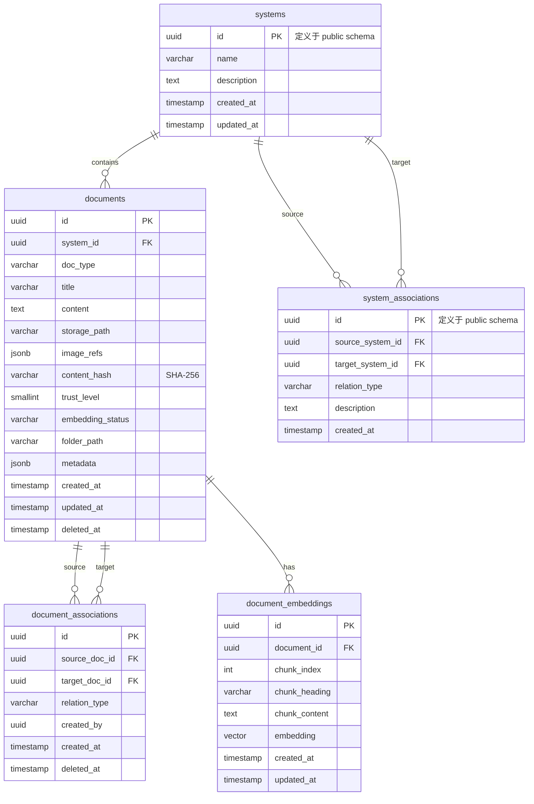

# knowledge-base 数据模型

> **⚠️ 物理 DDL 单一来源为 `platform-api/data-model.md`（拥有 Alembic + 三 schema 迁移权）。**
> **本文档为逻辑字段规格，描述 knowledge-base 模块的字段需求和业务规则。物理表结构、索引、迁移以 platform-api/data-model.md 为准。**

> **Schema：** `knowledge`（PostgreSQL 单库多 schema 方案中的知识库 schema）
> 上游文档：[hld.md](./hld.md) | [design.md](./design.md)

---

## 1. 概览

**本数据模型覆盖：** knowledge-base 模块的全部持久化需求——文档存储、关联图、系统管理、向量嵌入。

**持久化后端：**

| 后端 | 适用场景 |
|:--- | :--- |
| PostgreSQL 16+ (pgvector 扩展) | 结构化存储 + 向量检索统一在一个数据库 |
| MinIO (S3 兼容) | 原始文件存储（zip 包、图片） |

**Schema 隔离：** 使用 `knowledge` schema，与 `public`（平台基础）和 `testcase`（用例生成）隔离。通过 `SET search_path` 控制访问边界。

---

## 2. 实体关系总览



**数据流向：**
- `systems` 是顶层组织单元，每个系统下有多个 `documents`
- `system_associations` 记录系统间的数据流动关系（邻接表）
- `document_associations` 记录文档间的业务关联关系（邻接表）
- `document_embeddings` 存储文档分块的向量表示

---

## 3. systems — 业务系统

> **物理定义位于 `public` schema（platform-api/data-model.md § 3.3）。** knowledge-base 引用 `public.systems` 表，不独立定义 systems。

**用途：** QA 团队维护的业务系统注册表，是知识库的顶层组织维度。

| 字段 | 类型 | 约束 | 说明 |
|:--- | :--- | :--- | :--- |
| `id` | `UUID` | PK, DEFAULT gen_random_uuid() | 系统唯一标识 |
| `name` | `VARCHAR(100)` | NOT NULL, UNIQUE | 系统名称（全局唯一） |
| `description` | `TEXT` | 可空 | 系统描述 |
| `created_at` | `TIMESTAMPTZ` | NOT NULL, DEFAULT NOW() | 创建时间 |
| `updated_at` | `TIMESTAMPTZ` | NOT NULL, DEFAULT NOW() | 最后更新时间 |

**设计决策：**
- systems 是平台概念，物理表定义在 public schema，knowledge-base 通过 FK 引用 `public.systems.id`
- `metadata` 采用 JSONB 存储非结构化扩展字段，避免频繁 ALTER TABLE

---

## 4. system_associations — 系统间关联

> **物理定义位于 `public` schema（platform-api/data-model.md § 3.4）。** knowledge-base 引用 `public.system_associations` 表。

**用途：** 记录系统间的数据流动和接口调用关系，用于跨系统检索。

| 字段 | 类型 | 约束 | 说明 |
|:--- | :--- | :--- | :--- |
| `id` | `UUID` | PK, DEFAULT gen_random_uuid() | 关联唯一标识 |
| `source_system_id` | `UUID` | FK → public.systems.id, NOT NULL | 源系统 |
| `target_system_id` | `UUID` | FK → public.systems.id, NOT NULL | 目标系统 |
| `relation_type` | `VARCHAR(50)` | NOT NULL | 关联类型（api_call / data_share / event） |
| `description` | `TEXT` | 可空 | 关联说明（如"订单系统调用支付系统的支付接口"） |
| `created_at` | `TIMESTAMPTZ` | NOT NULL, DEFAULT NOW() | 创建时间 |

**约束：**
- `UNIQUE(source_system_id, target_system_id, relation_type)` 同类型关联不重复
- `CHECK(source_system_id != target_system_id)` 不允许自关联

---

## 5. documents — 知识文档

**用途：** 导入知识库的每个 md 文件对应一条记录，是关联图的节点。

| 字段 | 类型 | 约束 | 说明 |
|:--- | :--- | :--- | :--- |
| `id` | `UUID` | PK, DEFAULT gen_random_uuid() | 文档唯一标识 |
| `system_id` | `UUID` | FK → public.systems.id, NOT NULL | 所属系统 |
| `doc_type` | `VARCHAR(30)` | NOT NULL | 文档类型枚举 |
| `title` | `VARCHAR(500)` | NOT NULL | 文档标题 |
| `content` | `TEXT` | NOT NULL | md 全文内容 |
| `folder_path` | `VARCHAR(1000)` | NOT NULL | 文件在上传包中的相对路径 |
| `metadata` | `JSONB` | DEFAULT '{}' | 从 md frontmatter 解析的元数据 |
| `image_refs` | `JSONB` | DEFAULT '[]' | 图片引用列表 [{path, minio_key, status}] |
| `storage_path` | `VARCHAR(500)` | 可空 | 原始 md 文件的 MinIO 存储路径 |
| `trust_level` | `SMALLINT` | NOT NULL, DEFAULT 1 | 信任等级 1-5（1=PRD最高, 5=原型最低） |
| `embedding_status` | `VARCHAR(20)` | NOT NULL, DEFAULT 'pending' | 向量化状态：pending/completed/failed |
| `content_hash` | `VARCHAR(64)` | NOT NULL | SHA-256 内容哈希（去重用） |
| `created_at` | `TIMESTAMPTZ` | NOT NULL, DEFAULT NOW() | 导入时间 |
| `updated_at` | `TIMESTAMPTZ` | NOT NULL, DEFAULT NOW() | 最后更新时间 |
| `deleted_at` | `TIMESTAMPTZ` | 可空 | 软删除时间 |

**doc_type 枚举值：**

| 值 | 说明 | 默认 trust_level |
|:--- | :--- | :--- |
| `prd` | PRD 需求文档 | 1 |
| `tech_doc` | 技术设计/接口文档 | 2 |
| `test_rule` | 测试规则 | 2 |
| `test_case` | 历史测试用例 | 3 |
| `bug_record` | 漏测 Bug 记录 | 2 |
| `prototype` | 可交互原型链接 | 5 |
| `other` | 其他参考文档 | 4 |

**设计决策：**
- `content` 存储 md 全文而非纯文本，保留格式便于预览和检索
- `content_hash` 用于导入去重：同系统下相同 hash 的文档跳过
- `trust_level` 与信任顺序对齐：PRD(1) > 技术稿(2) > 口述(3) > UI(4) > 原型(5)
- 软删除（`deleted_at`）保证关联图完整性，已删除文档的关联也标记删除

---

## 6. document_associations — 文档关联（邻接表）

**用途：** 文档间的关联关系存储，构成知识关联图的边。

| 字段 | 类型 | 约束 | 说明 |
|:--- | :--- | :--- | :--- |
| `id` | `UUID` | PK, DEFAULT gen_random_uuid() | 关联唯一标识 |
| `source_doc_id` | `UUID` | FK → documents.id, NOT NULL | 源文档 |
| `target_doc_id` | `UUID` | FK → documents.id, NOT NULL | 目标文档 |
| `relation_type` | `VARCHAR(30)` | NOT NULL | 关联类型枚举 |
| `created_by` | `VARCHAR(50)` | 可空 | 创建者（可选记录操作者） |
| `created_at` | `TIMESTAMPTZ` | NOT NULL, DEFAULT NOW() | 创建时间 |
| `deleted_at` | `TIMESTAMPTZ` | 可空 | 软删除时间 |

**约束：**
- `UNIQUE(source_doc_id, target_doc_id, relation_type) WHERE deleted_at IS NULL` 活跃关联唯一
- `CHECK(source_doc_id != target_doc_id)` 不允许自关联

**relation_type 枚举值：**
- `req_to_tech`：需求 → 技术文档
- `req_to_case`：需求 → 测试用例
- `req_to_bug`：需求 → 漏测 Bug
- `req_to_proto`：需求 → 原型链接
- `tech_to_case`：技术文档 → 测试用例
- `case_to_bug`：用例 → 漏测 Bug
- `general`：通用关联（无特定方向语义）

**设计决策：**
- 邻接表模型（非闭包表）：写入频繁（QA 随时增删关联），邻接表写入 O(1)；图遍历通过 CTE 实现
- 双向关联存储：只存一条有向边（source→target），查询时 UNION 双向。理由是减少数据冗余和一致性维护成本
- 软删除：保留关联历史，支持审计和误操作恢复

---

## 7. document_embeddings — 文档向量

**用途：** 文档分块向量化存储，支持 pgvector 语义相似度检索。

| 字段 | 类型 | 约束 | 说明 |
|:--- | :--- | :--- | :--- |
| `id` | `UUID` | PK, DEFAULT gen_random_uuid() | 向量记录标识 |
| `document_id` | `UUID` | FK → documents.id, NOT NULL | 所属文档 |
| `chunk_index` | `SMALLINT` | NOT NULL | 分块序号（从 0 开始） |
| `chunk_heading` | `VARCHAR(200)` | 可空 | 分块所属标题 |
| `chunk_content` | `TEXT` | NOT NULL | 分块文本内容 |
| `embedding` | `VECTOR(1536)` | NOT NULL | text-embedding-3-small 向量（1536 维） |
| `created_at` | `TIMESTAMPTZ` | NOT NULL, DEFAULT NOW() | 创建时间 |
| `updated_at` | `TIMESTAMPTZ` | NOT NULL, DEFAULT NOW() | 最后更新时间 |

**设计决策：**
- 向量维度 1536：使用 OpenAI text-embedding-3-small 模型，性价比最优
- 按文档分块存储（非整文档一个向量）：提高检索精度，每块 512-1024 tokens
- 相似度度量：余弦相似度（cosine distance），pgvector 原生支持
- 文档更新时全量重建该文档的所有 embedding（DELETE + INSERT），不做增量

---

## 8. 索引设计

### 8.1 B-tree 索引

| 索引名 | 表 | 字段 | 用途 |
|:--- | :--- | :--- | :--- |
| `idx_docs_system_type` | documents | `(system_id, doc_type) WHERE deleted_at IS NULL` | 按系统+类型检索文档列表 |
| `idx_docs_content_hash` | documents | `(system_id, content_hash)` | 导入去重检查 |
| `idx_docs_embedding_status` | documents | `(embedding_status) WHERE embedding_status = 'pending'` | 后台向量化任务查找待处理文档 |
| `idx_assoc_source` | document_associations | `(source_doc_id) WHERE deleted_at IS NULL` | CTE 递归正向遍历 |
| `idx_assoc_target` | document_associations | `(target_doc_id) WHERE deleted_at IS NULL` | CTE 递归反向遍历 |
| `idx_assoc_type` | document_associations | `(relation_type) WHERE deleted_at IS NULL` | 按关联类型过滤 |
| `idx_embeddings_doc` | document_embeddings | `(document_id)` | 按文档获取所有分块向量 |
| `idx_sys_assoc_source` | system_associations | `(source_system_id)` | 系统间关联查询 |

### 8.2 全文检索索引

```sql
-- 文档内容全文检索（中文需 zhparser 或 pg_jieba 分词）
CREATE INDEX idx_docs_fts ON knowledge.documents
USING GIN (to_tsvector('simple', title || ' ' || content))
WHERE deleted_at IS NULL;
```

**分词策略：** 初期使用 `simple` 配置（按空格分词），中文场景后续接入 `zhparser` 扩展。全文检索用于文档管理界面的搜索功能，非检索接口主路径。

### 8.3 向量索引（HNSW）

```sql
-- pgvector HNSW 索引，支持高效 ANN 检索
CREATE INDEX idx_embeddings_hnsw ON knowledge.document_embeddings
USING hnsw (embedding vector_cosine_ops)
WITH (m = 16, ef_construction = 64);
```

**参数选择理由：**
- `m = 16`：默认值，适合千级到万级向量规模
- `ef_construction = 64`：构建时精度，影响索引质量但不影响查询
- `vector_cosine_ops`：余弦距离，适合文本语义相似度
- 查询时 `SET hnsw.ef_search = 100` 保证召回率

---

## 9. DDL 参考

> **注意：物理 DDL 以 platform-api/data-model.md 为唯一来源。以下 DDL 仅供本模块开发参考，实际迁移由 platform-api 的 Alembic 统一管理。**

```sql
-- 创建 schema
CREATE SCHEMA IF NOT EXISTS knowledge;

-- 启用扩展
CREATE EXTENSION IF NOT EXISTS vector;
CREATE EXTENSION IF NOT EXISTS "uuid-ossp";

-- systems 和 system_associations 表位于 public schema
-- 物理定义见 platform-api/data-model.md，此处不重复定义

-- documents 表
CREATE TABLE knowledge.documents (
    id UUID PRIMARY KEY DEFAULT gen_random_uuid(),
    system_id UUID NOT NULL REFERENCES public.systems(id),
    doc_type VARCHAR(30) NOT NULL,
    title VARCHAR(500) NOT NULL,
    content TEXT NOT NULL,
    storage_path VARCHAR(500) NOT NULL,
    image_refs JSONB NOT NULL DEFAULT '[]',
    content_hash VARCHAR(64) NOT NULL,
    trust_level SMALLINT NOT NULL DEFAULT 1,
    embedding_status VARCHAR(20) NOT NULL DEFAULT 'pending',
    folder_path VARCHAR(1000),
    metadata JSONB DEFAULT '{}',
    created_at TIMESTAMPTZ NOT NULL DEFAULT NOW(),
    updated_at TIMESTAMPTZ NOT NULL DEFAULT NOW(),
    deleted_at TIMESTAMPTZ
);

-- document_associations 表（邻接表）
CREATE TABLE knowledge.document_associations (
    id UUID PRIMARY KEY DEFAULT gen_random_uuid(),
    source_doc_id UUID NOT NULL REFERENCES knowledge.documents(id),
    target_doc_id UUID NOT NULL REFERENCES knowledge.documents(id),
    relation_type VARCHAR(30) NOT NULL,
    created_by VARCHAR(50),
    created_at TIMESTAMPTZ NOT NULL DEFAULT NOW(),
    deleted_at TIMESTAMPTZ,
    CHECK(source_doc_id != target_doc_id)
);

-- 活跃关联唯一约束（部分唯一索引，排除已删除关联）
CREATE UNIQUE INDEX idx_assoc_unique_active 
ON knowledge.document_associations(source_doc_id, target_doc_id, relation_type)
WHERE deleted_at IS NULL;

-- document_embeddings 表
CREATE TABLE knowledge.document_embeddings (
    id UUID PRIMARY KEY DEFAULT gen_random_uuid(),
    document_id UUID NOT NULL REFERENCES knowledge.documents(id) ON DELETE CASCADE,
    chunk_index SMALLINT NOT NULL,
    chunk_heading VARCHAR(200),
    chunk_content TEXT NOT NULL,
    embedding VECTOR(1536) NOT NULL,
    created_at TIMESTAMPTZ NOT NULL DEFAULT NOW(),
    updated_at TIMESTAMPTZ NOT NULL DEFAULT NOW(),
    UNIQUE(document_id, chunk_index)
);

-- 索引
CREATE INDEX idx_docs_system_type ON knowledge.documents(system_id, doc_type) WHERE deleted_at IS NULL;
CREATE INDEX idx_docs_content_hash ON knowledge.documents(system_id, content_hash);
CREATE INDEX idx_docs_embedding_status ON knowledge.documents(embedding_status) WHERE embedding_status = 'pending';
CREATE INDEX idx_assoc_source ON knowledge.document_associations(source_doc_id) WHERE deleted_at IS NULL;
CREATE INDEX idx_assoc_target ON knowledge.document_associations(target_doc_id) WHERE deleted_at IS NULL;
CREATE INDEX idx_embeddings_doc ON knowledge.document_embeddings(document_id);

-- HNSW 向量索引
CREATE INDEX idx_embeddings_hnsw ON knowledge.document_embeddings
USING hnsw (embedding vector_cosine_ops)
WITH (m = 16, ef_construction = 64);

-- 全文检索索引
CREATE INDEX idx_docs_fts ON knowledge.documents
USING GIN (to_tsvector('simple', title || ' ' || content))
WHERE deleted_at IS NULL;
```

---

## 10. 迁移方案

| 迁移编号 | 触发原因 | 操作 | 幂等保证 |
|:--- | :--- | :--- | :--- |
| `001_init_knowledge_schema` | 初始化 | CREATE SCHEMA + 所有表 + 索引 | `IF NOT EXISTS` |
| `002_add_embedding_status` | 异步向量化支持 | `ALTER TABLE ADD COLUMN embedding_status` | 检查列是否已存在 |
| `003_add_content_hash` | 导入去重 | `ALTER TABLE ADD COLUMN content_hash` + 回填 | 检查列 + 回填幂等 |

**迁移工具：** Alembic（SQLAlchemy 生态，与 FastAPI 项目一致）

**迁移原则：**
- 每次迁移只做一件事，向前兼容
- DDL 变更不锁表（使用 `ALTER TABLE ... ADD COLUMN` 不带 DEFAULT 的方式）
- 数据迁移与 DDL 迁移分离

---

## 11. 测试要求

| 测试目标 | 测试类型 | 通过条件 |
|:--- | :--- | :--- |
| 文档 CRUD | 集成测试 | 创建/读取/更新/软删除正确 |
| 关联幂等性 | 集成测试 | 重复创建同一关联不报错不产生重复 |
| CTE 递归查询 | 集成测试 | 3 跳遍历正确，环路不死循环 |
| 向量检索 | 集成测试 | 相似文档按余弦距离排序返回 |
| 全文检索 | 集成测试 | 关键词命中文档正确返回 |
| 内容哈希去重 | 集成测试 | 相同内容文档导入被跳过 |
| 级联删除 | 集成测试 | 文档删除时关联 embedding 被清理 |
| 迁移幂等 | 集成测试 | 重复执行不报错 |

---

## 3. sessions — 会话元数据 (必填)

本模块不涉及。knowledge-base 是无状态数据服务层，不维护会话。

## 4. messages — 对话消息 (必填)

本模块不涉及。

## 5. memories — 持久化记忆 (必填)

本模块不涉及 Agent 记忆。文档持久化通过 documents 表实现，向量化通过 document_embeddings 表实现。

## 6. memory_embeddings — 向量记忆（适用时填）

不适用。向量存储已在 document_embeddings 表中定义。

## 7. session_usage / kv — 用量与状态（适用时填）

不适用。

## 9. 迁移策略 (必填)

使用 Alembic 管理数据库迁移。物理 DDL 单一来源为 platform-api/data-model.md。

---

## 附录：物理 Schema 参考（可选）

物理 Schema DDL 统一由 platform-api/data-model.md 管理，本文档为逻辑字段规格。
