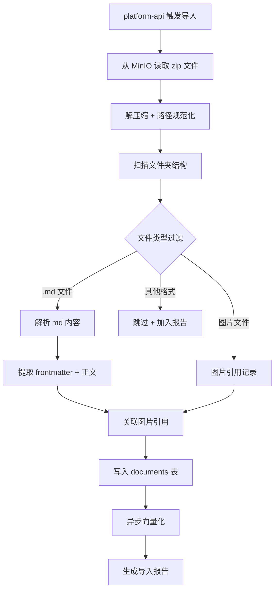
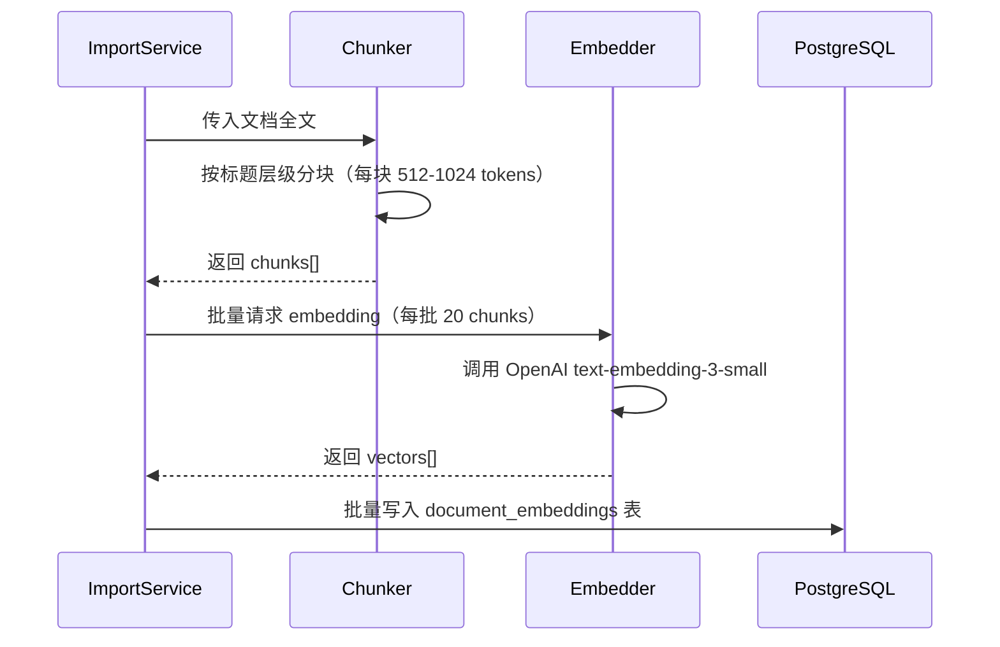
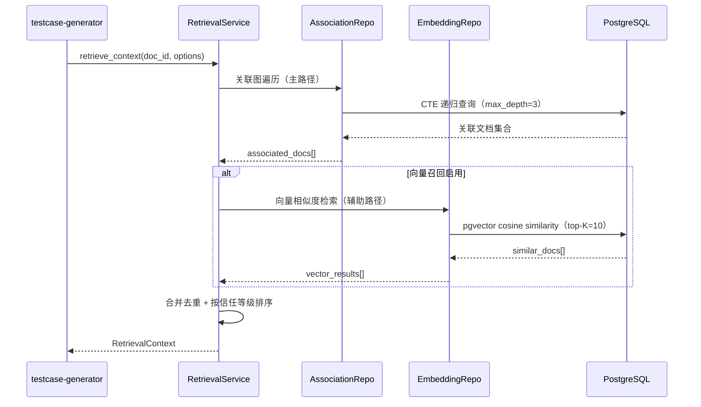
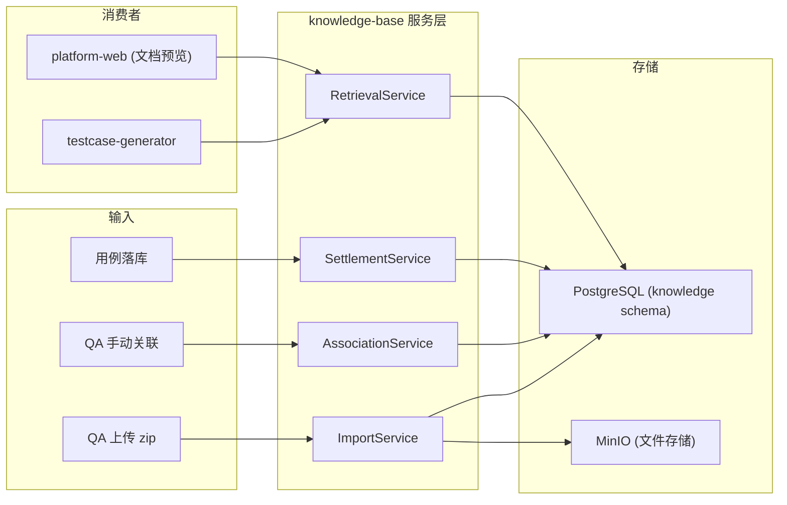

# knowledge-base 详细设计

> **定位：** knowledge-base 是结构化数据服务层（非 Agent），提供文档导入、关联图管理、智能检索三大能力。
> 上游文档：[hld.md](./hld.md) | [spec.md](./spec.md) | [data-model.md](./data-model.md)

---

## 1. 概览

**模块职责：** 将散乱的 QA 知识文档结构化存储，维护文档间关联图，为 testcase-generator 提供精确的上下文检索服务。

**源文件：** `src/knowledge_base/`

**上游依赖：**

| 文档类型 | 链接 |
|:--- | :--- |
| HLD | `xspec/changes/knowledge-base/hld.md` |
| Spec | `xspec/changes/knowledge-base/spec.md` |
| Data Model | `xspec/changes/knowledge-base/data-model.md` |

---

## 2. 模块职责边界

**负责：**
- 接收上传的 md+图片文件夹，解析为结构化文档记录并持久化
- 维护文档间的关联图（邻接表），支持 CRUD 和图遍历查询
- 为 testcase-generator 提供基于关联图遍历 + 向量召回的组合检索接口
- 用例落库时自动建立用例与需求文档的关联关系

**不负责（显式排除）：**
- 不负责 LLM 推理检索规划（精确的关联图查询已足够，不需要 Agent Loop）
- 不负责用户认证和权限校验（由 platform-api 处理）
- 不负责用例生成逻辑（由 testcase-generator 消费检索结果）
- 不负责文件存储（MinIO 由 platform-api 管理，本模块仅读取）

**调用关系：**

| 方向 | 模块 | 方式 |
|:--- | :--- | :--- |
| 被调用 | `platform-api` | HTTP 内部接口（导入触发、关联管理、检索请求） |
| 被调用 | `testcase-generator` | Python 内部方法调用（检索上下文） |
| 调用 | `PostgreSQL` | SQLAlchemy ORM + 原生 SQL（CTE 递归查询） |
| 调用 | `OpenAI Embedding API` | httpx 异步调用（文档向量化） |
| 调用 | `MinIO` | boto3 S3 协议（读取上传的原始文件） |

---

## 3. 模块内部分层

```
knowledge_base/
├── service/                  # 业务逻辑层
│   ├── import_service.py     # 导入流程编排
│   ├── association_service.py # 关联图管理
│   ├── retrieval_service.py  # 检索逻辑编排
│   └── settlement_service.py # 知识沉淀（用例落库关联）
├── repository/               # 数据访问层
│   ├── document_repo.py      # 文档 CRUD
│   ├── association_repo.py   # 关联关系 CRUD + 图遍历
│   ├── system_repo.py        # 系统 CRUD
│   └── embedding_repo.py     # 向量存取
├── embedding/                # 向量化能力层
│   ├── embedder.py           # Embedding 调用封装
│   └── chunker.py            # 文档分块策略
├── parser/                   # 文档解析层
│   ├── markdown_parser.py    # md 解析 + frontmatter 提取
│   └── image_extractor.py    # 图片引用提取
└── schema/                   # Pydantic 模型
    ├── document.py           # 文档相关 schema
    ├── association.py        # 关联关系 schema
    └── retrieval.py          # 检索请求/响应 schema
```

**分层设计决策理由：**
- service 层负责业务编排（事务边界、异步协调），不含 SQL
- repository 层负责数据存取，CTE 递归查询封装在此层
- embedding 层独立以便 Embedding Provider 切换（当前 OpenAI，未来可能换国产模型）
- parser 层独立以便支持更多格式（当前仅 md，未来可能支持 docx）

---

## 4. 导入流程详细设计

### 4.1 导入流程总览



### 4.2 解析 md 文件实现

```python
# parser/markdown_parser.py 核心逻辑

class ParsedDocument(BaseModel):
    title: str
    frontmatter: dict[str, Any]
    content: str                    # 纯文本正文（去除 frontmatter）
    headings: list[HeadingNode]     # 标题层级树
    image_refs: list[ImageRef]      # 图片相对路径引用
    folder_path: str                # 文件在上传文件夹中的相对路径

class ImageRef(BaseModel):
    original_path: str              # md 中的原始引用路径
    resolved_path: str              # 解析后的实际路径
    alt_text: str                   # alt 文本
    minio_key: str | None           # 上传后的 MinIO key
```

**解析流程：**
1. 使用 `python-frontmatter` 提取 YAML frontmatter（title、type、system 等元数据）
2. 使用正则提取所有图片引用 `` 和 ``
3. 规范化图片路径：相对路径以 md 文件所在目录为基准解析
4. 提取标题层级（`#` ~ `######`）构建文档结构树
5. 保留原始 md 内容（用于向量化和全文检索）

### 4.3 图片引用处理

| 场景 | 处理方式 |
|:--- | :--- |
| 图片文件存在于上传包中 | 上传到 MinIO，文档记录中保存 MinIO key |
| 图片路径指向不存在的文件 | 文档正常导入，image_ref 标记 `status=missing` |
| 图片路径包含 `../` | 规范化后校验是否仍在上传包根目录内，超出则拒绝 |
| 网络图片 URL | 保留原始 URL，不下载不代理 |

### 4.4 向量化流程



**分块策略选择理由：** 按标题层级分块而非固定长度分块，保证每个 chunk 语义完整。标题作为 chunk 的前缀元数据，提升检索时的上下文理解。

**容错：** Embedding API 调用失败时，文档仍正常导入，embedding 状态标记为 `pending`，由后台定时任务补跑。

---

## 5. 关联图管理详细设计

### 5.1 邻接表结构

关联图采用邻接表模型存储于 `document_associations` 表，每条记录表示一条有向关联边：

```
document_associations:
  source_doc_id  →  target_doc_id  (relation_type, created_by)
```

**设计决策：** 使用邻接表而非嵌套集合或闭包表的原因：
- 关联关系变更频繁（QA 随时可增删），邻接表写入成本最低
- 图遍历通过 PostgreSQL WITH RECURSIVE CTE 实现，性能在千级文档规模下可接受
- 结构简单透明，易于理解和调试

### 5.2 关联类型枚举

```python
class AssociationType(str, Enum):
    REQUIREMENT_TO_TECH = "req_to_tech"       # 需求 → 技术文档
    REQUIREMENT_TO_CASE = "req_to_case"       # 需求 → 测试用例
    REQUIREMENT_TO_BUG = "req_to_bug"         # 需求 → 漏测 Bug
    REQUIREMENT_TO_PROTOTYPE = "req_to_proto" # 需求 → 原型链接
    TECH_TO_CASE = "tech_to_case"             # 技术文档 → 测试用例
    CASE_TO_BUG = "case_to_bug"              # 用例 → 漏测 Bug
    GENERAL = "general"                       # 通用关联
```

### 5.3 CRUD 接口

| 操作 | 方法签名 | 业务规则 |
|:--- | :--- | :--- |
| 创建关联 | `create_association(source_id, target_id, type, created_by)` | 同对（source, target, type）幂等；自引用拒绝 |
| 删除关联 | `delete_association(source_id, target_id, type)` | 软删除（标记 deleted_at） |
| 查询直接关联 | `get_direct_associations(doc_id, direction, type_filter)` | 支持按方向和类型过滤 |
| 图遍历 | `traverse_graph(doc_id, max_depth, type_filter)` | CTE 递归，带环检测 |
| 批量关联 | `batch_create_associations(pairs[])` | 事务内批量写入 |

### 5.4 CTE 递归查询实现

```sql
-- 从指定文档出发，沿关联图遍历最多 N 跳，返回所有可达文档
WITH RECURSIVE graph_walk AS (
    -- 起点
    SELECT 
        target_doc_id AS doc_id,
        relation_type,
        1 AS depth,
        ARRAY[source_doc_id, target_doc_id] AS path
    FROM knowledge.document_associations
    WHERE source_doc_id = :start_doc_id
      AND deleted_at IS NULL
      AND (:type_filter IS NULL OR relation_type = ANY(:type_filter))
    
    UNION ALL
    
    -- 递归展开
    SELECT 
        da.target_doc_id,
        da.relation_type,
        gw.depth + 1,
        gw.path || da.target_doc_id
    FROM knowledge.document_associations da
    JOIN graph_walk gw ON da.source_doc_id = gw.doc_id
    WHERE gw.depth < :max_depth
      AND da.deleted_at IS NULL
      AND da.target_doc_id != ALL(gw.path)  -- 环检测
      AND (:type_filter IS NULL OR da.relation_type = ANY(:type_filter))
)
SELECT DISTINCT ON (doc_id) 
    doc_id, 
    MIN(depth) AS min_depth,
    relation_type
FROM graph_walk
GROUP BY doc_id, relation_type
ORDER BY doc_id, min_depth;
```

**环检测机制：** 通过 `path` 数组记录已访问节点，`target_doc_id != ALL(path)` 确保不重复访问，防止循环关联导致无限递归。

**性能保障：** `document_associations` 表在 `(source_doc_id, deleted_at)` 和 `(target_doc_id, deleted_at)` 上建立复合索引，CTE 每层展开仅走索引扫描。

---

## 6. 检索接口详细设计

### 6.1 检索策略：关联图遍历 + 向量召回组合



### 6.2 检索逻辑分步

| 步骤 | 操作 | 条件 |
|:--- | :--- | :--- |
| 1 | 获取目标文档的直接关联（1 跳） | 始终执行 |
| 2 | 获取同系统的测试规则文档 | 始终执行 |
| 3 | 获取同系统的漏测 Bug 记录 | 始终执行 |
| 4 | 沿关联图继续遍历（2-3 跳） | 始终执行 |
| 5 | 检查系统间关联，获取对端系统相关文档 | 目标文档所在系统存在 sys_to_sys 关联时执行 |
| 6 | 向量相似度召回 | 主路径返回 < 3 个文档时执行（补充） |
| 7 | 合并去重、按 trust_level 排序 | 始终执行 |

### 6.3 返回结构定义

```python
class RetrievalContext(BaseModel):
    target_doc: DocumentSummary
    associated_docs: list[AssociatedDoc]
    system_rules: list[DocumentSummary]
    bug_records: list[DocumentSummary]
    cross_system: list[CrossSystemContext]
    prototype_links: list[PrototypeLink]
    retrieval_meta: RetrievalMeta

class AssociatedDoc(BaseModel):
    doc_id: str
    doc_type: DocType
    relation: str              # "direct" | "indirect_2hop" | "indirect_3hop" | "vector"
    trust_level: int           # 1-5，按信源类型确定
    depth: int                 # 关联图中的跳数
    content: str
    title: str

class RetrievalMeta(BaseModel):
    graph_docs_count: int      # 关联图命中数
    vector_docs_count: int     # 向量召回数
    total_docs: int            # 去重后总数
    retrieval_duration_ms: int # 检索耗时
    vector_fallback_used: bool # 是否触发了向量补充
```

### 6.4 向量召回触发策略

| 触发条件 | 向量检索参数 | 设计理由 |
|:--- | :--- | :--- |
| 关联图返回 < 3 个文档 | top_k=10, threshold=0.75 | 关联图数据不足时才启用，避免噪声 |
| 用户显式请求"扩展检索" | top_k=20, threshold=0.70 | 探索性场景 |
| 新文档导入时推荐关联候选 | top_k=5, threshold=0.80 | 高阈值减少误推荐 |

---

## 7. 知识沉淀接口

### 7.1 自动关联机制

当 testcase-generator 生成的用例被 QA 确认落库时，自动建立以下关联：

```python
class SettlementService:
    async def settle_test_cases(
        self, 
        batch_id: str, 
        source_doc_id: str, 
        case_doc_ids: list[str]
    ) -> SettlementResult:
        """用例落库时自动建立关联"""
        associations = []
        for case_id in case_doc_ids:
            # 需求 → 用例 关联
            associations.append(
                Association(
                    source_doc_id=source_doc_id,
                    target_doc_id=case_id,
                    relation_type=AssociationType.REQUIREMENT_TO_CASE,
                    created_by="system:settlement"
                )
            )
        await self.association_repo.batch_create(associations)
        return SettlementResult(created_count=len(associations))
```

### 7.2 质量飞轮数据沉淀

当 QA 修改 AI 生成的用例时，settlement_service 负责将修改模式提取为测试规则文档：

| 沉淀场景 | 动作 | 存储位置 |
|:--- | :--- | :--- |
| QA 反复在某维度添加用例 | 提取为该系统的"必覆盖维度" | knowledge.documents（type=test_rule） |
| 漏测 Bug 关联确认 | 建立 Bug→需求关联 | knowledge.document_associations |
| QA 确认用例（无修改） | 标记为高质量样本候选 | testcase.quality_flywheel |

---

## 8. 数据流全景图



---

## 9. 错误处理与降级

| 失败场景 | 影响 | 处理策略 |
|:--- | :--- | :--- |
| OpenAI Embedding API 超时 | 新文档无法向量化 | 文档正常导入，embedding 标记 pending，后台补跑 |
| PostgreSQL 连接池耗尽 | 所有操作阻塞 | 连接池 max=20 + overflow=10，超出返回 503 |
| CTE 递归查询超时（>5s） | 检索接口超时 | 动态降低 max_depth（3→2→1），仍超时则仅返回直接关联 |
| MinIO 不可达 | 无法读取原始文件 | 导入失败返回错误，已导入的文档不受影响 |
| 单文件解析异常 | 该文件无法导入 | 跳过该文件，记录错误详情，其余文件继续 |

---

## 10. 性能设计

| 场景 | 目标 | 实现手段 |
|:--- | :--- | :--- |
| 100 文件批量导入 | < 60s | 并发解析（asyncio.gather）+ 批量 DB 写入 + 异步向量化 |
| 关联图检索（3 跳） | P95 < 5s | 邻接表索引 + CTE 优化 + 连接池预热 |
| 向量相似度检索 | P95 < 2s | HNSW 索引 + ef_search=100 |
| 文档 CRUD | P95 < 200ms | 主键/索引查询，无全表扫描 |

---

## 11. 测试要求

| 测试目标 | 测试类型 | 通过条件 |
|:--- | :--- | :--- |
| md 文件解析 | 单元测试 | frontmatter 正确提取、图片引用完整识别、标题树正确构建 |
| 图片引用缺失 | 单元测试 | 文档正常解析，缺失图片标记 status=missing |
| 路径遍历防护 | 单元测试 | `../` 攻击路径被规范化拒绝 |
| 关联图 CRUD | 集成测试 | 创建/删除/查询关联正确，幂等性保证 |
| CTE 递归查询 | 集成测试 | 3 跳遍历返回完整路径，环路不死循环 |
| 检索组合策略 | 集成测试 | 关联图 + 向量召回正确合并去重 |
| 向量化容错 | 集成测试 | Embedding API 失败时文档正常导入 |
| 批量导入性能 | 性能测试 | 100 文件导入 < 60s |
| 检索响应时间 | 性能测试 | P95 < 5s（1000 文档规模） |

---

## 3. Agent Turn 管线 (必填)

本模块不涉及。knowledge-base 是结构化数据服务层，不含 Agent Turn 管线。

---

## 4. Prompt 构建管线 (必填)

本模块不涉及。唯一的 LLM 交互是 OpenAI Embedding API，不需要 Prompt 构建。

---

## 5. 工具调度机制 (必填)

本模块不涉及。knowledge-base 不调度外部工具，它本身作为工具被调用。

---

## 6. 记忆操作实现 (适用时填)

不适用。

---

## 7. 安全执行 (必填)

- 文件上传：仅接受 .md 和图片格式，解压路径规范化拒绝 `../`
- 数据隔离：按项目/系统隔离存储（当前所有用户最高权限）
- Embedding：模型固定，不接受用户自定义向量
- SQL 注入：ORM 参数化查询
