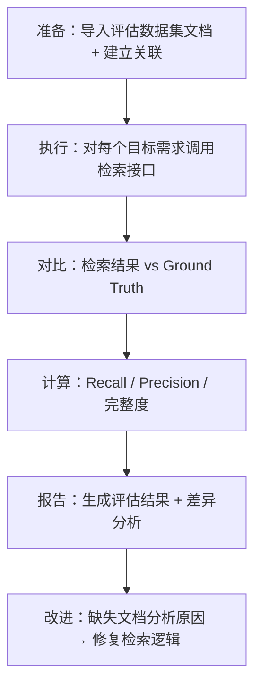

# knowledge-base 效果评估

> **评估定位：** knowledge-base 是结构化数据服务层，评估重点是检索精确度、向量召回相关性、导入完整性和性能基准。
> 不涉及 LLM 推理质量评估（本模块无 LLM 推理环节）。

---

## 1. 概览

| 字段 | 内容 |
|:--- | :--- |
| 评估对象 | knowledge-base 服务层 v1.0 |
| 评估范围 | 关联图检索精确度、向量召回相关性、文档导入完整性、接口性能 |
| 评估触发时机 | 每次检索策略或数据模型变更后；版本发布前 |
| 主要关注维度 | 检索精确度 > 导入完整性 > 性能 > 向量召回相关性 |

---

## 2. 评估维度一：检索精确度

### 2.1 评估目标

验证关联图查询是否返回完整的相关文档集合——即给定一个需求文档，检索结果是否包含所有应该被检索到的关联文档。

### 2.2 评估指标

| 指标 | 定义 | 目标值 | 测量方法 |
|:--- | :--- | :---: | :--- |
| 召回率 (Recall) | 应返回文档中实际被返回的比例 | ≥ 95% | 人工标注的 Ground Truth 对比 |
| 精确率 (Precision) | 返回文档中确实相关的比例 | ≥ 90% | 人工判定返回结果相关性 |
| 关联完整度 | 多跳关联是否完整遍历 | 100% | 已知图结构验证 |
| 跨系统覆盖 | 涉及跨系统文档是否被正确包含 | 100% | 跨系统场景用例验证 |

### 2.3 评估数据集

构建方式：从团队实际业务中选取 5 个典型需求文档，由资深 QA 标注每个需求的"完整上下文文档集"作为 Ground Truth。

| 数据集编号 | 需求描述 | 预期关联文档数 | 涉及系统 |
|:--- | :--- | :---: | :--- |
| KB-EVAL-01 | 单系统简单需求（仅直接关联） | 3-5 | 1 个 |
| KB-EVAL-02 | 单系统复杂需求（多跳关联） | 8-12 | 1 个 |
| KB-EVAL-03 | 跨系统接口需求 | 6-10 | 2 个 |
| KB-EVAL-04 | 有漏测 Bug 历史的需求 | 5-8 | 1 个 |
| KB-EVAL-05 | 新导入需求（关联稀疏） | 2-3 | 1 个 |

### 2.4 评估流程



### 2.5 失败分析维度

| 失败类型 | 可能原因 | 修复方向 |
|:--- | :--- | :--- |
| 漏召回（Recall 不达标） | 关联关系未建立 / CTE 深度不足 / 类型过滤过严 | 扩展遍历深度或放宽过滤条件 |
| 误召回（Precision 不达标） | 遍历深度过大带入不相关文档 | 引入相关性打分，低分文档降级展示 |
| 跨系统遗漏 | 系统间关联未配置 | 检查 system_associations 数据完整性 |

---

## 3. 评估维度二：向量召回相关性

### 3.1 评估目标

验证 pgvector 向量检索在辅助路径中返回的文档确实与查询文档语义相关。

### 3.2 评估指标

| 指标 | 定义 | 目标值 | 测量方法 |
|:--- | :--- | :---: | :--- |
| Top-5 相关率 | 前 5 个向量召回结果中真正相关的比例 | ≥ 60% | 人工判定 |
| Top-10 相关率 | 前 10 个向量召回结果中真正相关的比例 | ≥ 40% | 人工判定 |
| MRR (Mean Reciprocal Rank) | 第一个相关结果的排名倒数的平均值 | ≥ 0.6 | 自动计算 |
| 与关联图补充价值 | 向量召回提供的、关联图未覆盖的有价值文档比例 | ≥ 20% | 与关联图结果取差集后人工判定 |

### 3.3 评估方法

1. **单文档语义检索测试：** 选取 10 个已知相关的文档对，验证 A 的向量检索结果中是否包含 B
2. **关联图空缺补充测试：** 故意移除部分关联关系，验证向量检索是否能"补救"找回
3. **噪声排除测试：** 导入一批与目标文档无关的文档，验证 top-K 中噪声比例

### 3.4 评估数据集构建

| 场景 | 构建方式 | 预期结果 |
|:--- | :--- | :--- |
| 同功能域文档 | 选取描述同一功能的 PRD 和技术文档 | 互为 top-5 |
| 相似但不同功能 | 选取同系统但不同功能的文档 | 不在 top-5，可在 top-20 |
| 完全无关文档 | 不同系统不同领域 | 不在 top-20 |

### 3.5 阈值校准

向量检索的 cosine similarity 阈值需要通过评估数据校准：

| 阈值 | 预期含义 | 校准方法 |
|:--- | :--- | :--- |
| ≥ 0.85 | 高度相关（同一功能点的不同文档） | 已知相关对的平均相似度 |
| 0.75 - 0.85 | 中度相关（同系统相关功能） | 人工判定边界 |
| < 0.75 | 弱相关或无关 | 已知无关对的平均相似度 |

初始阈值设为 0.75，根据评估结果迭代调整。

---

## 4. 评估维度三：导入完整性

### 4.1 评估目标

验证 md+图片文件夹导入后，文档内容和图片引用是否完整保留。

### 4.2 评估指标

| 指标 | 定义 | 目标值 | 测量方法 |
|:--- | :--- | :---: | :--- |
| 文档导入成功率 | 合法 md 文件成功导入的比例 | ≥ 99% | 自动统计 |
| 内容完整度 | 导入后内容与原始文件的一致率 | 100% | SHA-256 哈希对比 |
| 图片关联正确率 | 图片引用正确解析和关联的比例 | ≥ 95% | 自动检查 image_refs 字段 |
| frontmatter 解析率 | 含 frontmatter 的文件正确解析的比例 | 100% | 自动校验结构 |
| 向量化完成率 | 导入后 24h 内向量化完成的比例 | ≥ 99% | 查询 embedding_status |

### 4.3 测试用例集

| 用例编号 | 测试场景 | 验证点 |
|:--- | :--- | :--- |
| IMP-01 | 标准文件夹（10 md + 5 图片） | 全部导入，图片正确关联 |
| IMP-02 | 含嵌套子文件夹（3 层深） | folder_path 正确记录层级 |
| IMP-03 | 图片引用路径缺失 | 文档导入成功，缺失图片标记 missing |
| IMP-04 | 含 frontmatter 的 md | frontmatter 字段正确解析 |
| IMP-05 | 100 文件大批量导入 | 全部成功，耗时 < 60s |
| IMP-06 | 重复导入相同内容 | 去重生效，不产生重复文档 |
| IMP-07 | 含非 md 文件（.docx, .pdf） | 非 md 跳过，其余正常导入 |
| IMP-08 | 空文件夹 | 返回"无可导入文件"提示 |
| IMP-09 | 图片路径含 `../` | 路径规范化后正确处理或拒绝 |
| IMP-10 | 超大单文件（>1MB md） | 正常导入，向量化分块正确 |

### 4.4 自动化验证脚本

每次导入完成后自动执行：
1. 对比源文件数量与 documents 表记录数
2. 对比源文件 SHA-256 与 content_hash 字段
3. 检查每个 image_ref 的 minio_key 是否可访问
4. 验证 frontmatter 解析结果类型正确

---

## 5. 评估维度四：性能基准

### 5.1 性能目标

| 指标 | P50 目标 | P95 目标 | 测试条件 |
|:--- | :--- | :---: | :--- |
| 检索接口响应时间 | < 2s | < 5s | 1000 文档、关联图 3 跳 + 向量召回 |
| 文件夹导入（100 文件） | < 40s | < 60s | 含向量化 |
| 单文档关联查询 | < 200ms | < 500ms | 直接关联（1 跳） |
| 向量相似度检索 | < 500ms | < 2s | top-10, HNSW 索引 |
| 关联 CRUD | < 50ms | < 200ms | 单条操作 |

### 5.2 性能测试方案

| 测试场景 | 数据规模 | 工具 | 持续时间 |
|:--- | :--- | :--- | :--- |
| 检索接口压测 | 1000 文档、5000 关联边 | locust | 5 分钟 |
| 导入吞吐测试 | 连续导入 10 个 100 文件包 | pytest benchmark | 单次 |
| 向量检索压测 | 10000 embedding 向量 | pgbench + 自定义 SQL | 5 分钟 |
| CTE 深度测试 | 构造 10 跳深的关联链 | pytest | 单次 |

### 5.3 性能退化监控

| 监控指标 | 告警阈值 | 动作 |
|:--- | :--- | :--- |
| `retrieval_duration_ms` P95 | > 5000ms | 检查 CTE 查询计划 |
| `import_duration_ms` P95 | > 60000ms | 检查 Embedding API 延迟 |
| `vector_search_duration_ms` P95 | > 2000ms | 检查 HNSW 索引状态 |
| 连接池等待时间 | > 1000ms | 扩展连接池或优化慢查询 |

---

## 6. 评估执行计划

### 6.1 评估触发时机

| 触发事件 | 评估范围 | 阻断发布 |
|:--- | :--- | :---: |
| 检索策略代码变更 | 检索精确度 + 性能 | 是 |
| 数据模型 schema 变更 | 全部维度 | 是 |
| Embedding 模型更换 | 向量召回相关性 | 是 |
| 版本发布前 | 全部维度 | 是 |
| 知识库文档量突破阈值（每 1000 文档） | 性能基准 | 否（仅告警） |

### 6.2 评估结果存档

评估结果以 YAML 格式存储于 `tests/evaluation/results/` 目录：

```yaml
evaluation_run:
  id: "eval-kb-20260605-001"
  trigger: "pre-release"
  date: "2026-06-05"
  results:
    retrieval_precision:
      recall: 0.96
      precision: 0.92
      pass: true
    vector_relevance:
      top5_relevant_rate: 0.65
      mrr: 0.72
      pass: true
    import_completeness:
      success_rate: 1.0
      content_integrity: 1.0
      pass: true
    performance:
      retrieval_p95_ms: 3200
      import_100files_s: 45
      pass: true
  overall: PASS
```

---

## 7. 评估结果反哺机制

| 评估发现 | 反哺动作 |
|:--- | :--- |
| 某类关联关系检索遗漏 | 扩展 CTE 查询的类型覆盖 |
| 向量召回噪声过高 | 提高 similarity 阈值 |
| 某文档格式导入失败 | 扩展 parser 支持的格式变体 |
| 性能退化（P95 超标） | 优化索引或降低遍历深度 |
| 跨系统检索遗漏 | 检查 system_associations 配置完整性 |

---

## 8. 当前基线与改进方向

### 8.1 当前基线（初次评估前）

| 维度 | 当前值 | 目标值 | 状态 |
|:--- | :---: | :---: | :---: |
| 检索召回率 | 待评估 | ≥ 95% | 待建立基线 |
| 向量 Top-5 相关率 | 待评估 | ≥ 60% | 待建立基线 |
| 导入成功率 | 待评估 | ≥ 99% | 待建立基线 |
| 检索 P95 | 待评估 | < 5s | 待建立基线 |

### 8.2 改进优先级

1. 首先建立评估数据集（5 个典型需求的 Ground Truth 标注）
2. 运行首次全量评估，建立基线
3. 针对不达标维度逐项优化
4. 将评估脚本集成到 CI 流程

---

## 2. 任务成功率指标（必填）

| 任务 | 成功定义 | 目标值 |
|:--- | :--- | :--- |
| 文档导入 | md+图片完整导入，无丢失 | > 99% |
| 关联图检索 | 返回完整的直接关联+同系统文档 | > 95% |
| 向量召回 | Top-10 中有 ≥3 个真正相关文档 | > 80% |

## 3. LLM-as-Judge 评估（适用时填）

不适用。knowledge-base 不生成自然语言输出，不需要 LLM-as-Judge。

## 4. Prompt 回归测试（Golden Set）（必填）

不适用。knowledge-base 不使用 Prompt（仅调用 Embedding API），无 Prompt 回归需求。

## 5. 安全红队测试（必填）

| 测试场景 | 预期行为 |
|:--- | :--- |
| 上传含恶意路径的 zip | 路径规范化拒绝 `../`，不写入目标外位置 |
| 上传超大文件 | 返回 413 错误，不消耗存储 |
| SQL 注入尝试（文档名/系统名） | ORM 参数化查询，注入无效 |

## 6. Cost / Latency 基准（必填）

| 指标 | 基准值 | 测试条件 |
|:--- | :--- | :--- |
| 导入 100 文件延迟 | < 60s | 含向量化 |
| 检索接口 P95 | < 5s | 关联图 3 跳 |
| Embedding 成本 | ~$0.01/文档 | OpenAI text-embedding-3-small |

## 7. 评估结论与改进计划（必填）

评估将在 MVP 部署后基于真实数据执行。改进方向：
- 检索精确度不达标 → 优化关联图权重或引入 re-ranking
- 向量召回相关性低 → 调整 chunk 策略或切换 Embedding 模型
- 导入性能瓶颈 → 批量并行向量化

## 附录

评估工具：自建评估脚本（Python），跑固定数据集对比结果。
