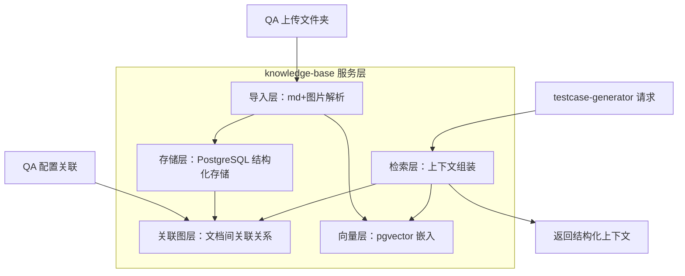
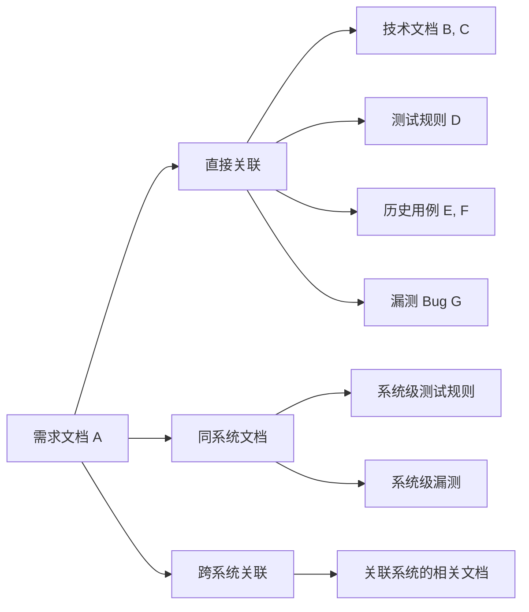
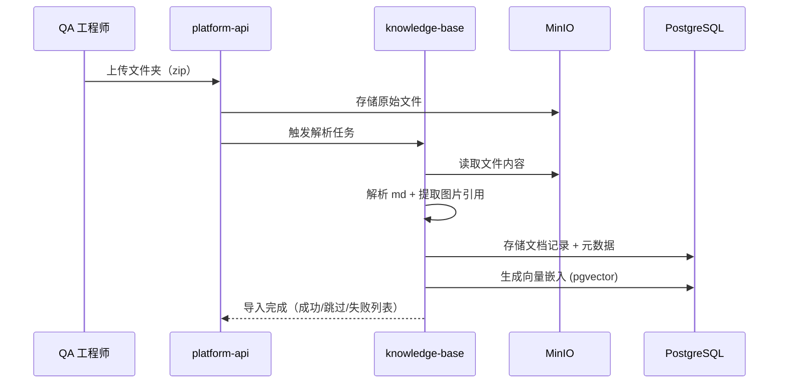

# AGENT-HLD: knowledge-base — 知识库管理与智能检索

> **设计哲学：** knowledge-base 的定位是**结构化知识底座**，而非"LLM 规划检索的 Agent"。它的核心价值是：把散乱的文档变成结构化的关联图，让 testcase-generator 的流水线能精确获取完整上下文。
>
> **pgvector 定位**：服务于"回归用例召回"和"相似用例推荐"，**不是**用例生成的质量引擎（质量引擎在 testcase-generator 的理解流水线 + 维度矩阵）。

---

## 1. 摘要

**交付物：** QA 团队的知识底座——按系统维度导入、结构化存储、关联管理所有测试相关知识，并为 testcase-generator 提供精确的上下文检索能力。

**范围边界：**

- **包含：** 文档导入（md+图片文件夹）、结构化解析存储、文档间关联图管理、按关联图精确检索上下文、向量化存储（服务回归/相似召回）、知识沉淀入口
- **不包含：** 用例生成逻辑（由 testcase-generator 处理）、LLM 驱动的"智能检索规划"（过度设计，精确检索已够用）、用户认证/权限（由 platform-api 处理）

**核心约束：** 检索接口响应 < 5s（P95）；导入 100 个 md 文件 < 60s；关联图查询不设深度限制（质量优先）。

---

## 2. 技术上下文

| 项 | 值 |
|:--- | :--- |
| **实现语言 / 框架** | Python（FastAPI 内部服务层） |
| **支持的 LLM Provider** | OpenAI Embedding API（文档向量化） |
| **记忆后端** | PostgreSQL + pgvector |
| **部署形态** | platform-api 进程内服务层（不独立部署） |
| **所属 Phase** | Phase 1 |

---

## 3. 架构总览

knowledge-base 不再是一个独立的 "AI Agent"（没有 Agent Loop、没有 LLM 推理检索规划）。它是一个**结构化数据服务层**，核心能力是：

1. **导入层**：把 md+图片文件夹解析为结构化文档记录
2. **关联图层**：维护文档间的关联关系（需求↔技术文档↔用例↔漏测 Bug）
3. **检索层**：基于关联图精确检索 testcase-generator 需要的完整上下文
4. **向量层**：pgvector 服务于相似文档/用例召回（辅助能力，非核心）

选择"服务层"而非"Agent"的原因：
- testcase-generator 的 Stage 1 (parse) 需要的是**精确的关联文档集合**，不是"让 LLM 想想该搜什么"
- 关联图查询是确定性的（沿关联边遍历），不需要 LLM 推理
- 宪章原则二要求"禁止无用抽象层"——LLM 检索规划在这里就是无用抽象



**组件说明：**

| 组件 | 职责 | 技术实现 |
|:--- | :--- | :--- |
| 导入层 | 解析 md 文件内容、提取 frontmatter、关联图片 | Python markdown parser |
| 存储层 | 文档元数据和内容的持久化 | PostgreSQL |
| 关联图层 | 文档间多对多关联关系管理 | PostgreSQL 关联表 + 图遍历查询 |
| 向量层 | 文档内容向量化，支持相似度搜索 | pgvector + OpenAI Embedding |
| 检索层 | 为 testcase-generator 组装完整上下文 | 关联图遍历 + 可选向量召回 |

---

## 4. 检索策略设计

### 4.1 主检索路径：关联图遍历（精确）

当 testcase-generator 请求某个需求文档的上下文时：



**检索逻辑（确定性，无 LLM）：**
1. 获取目标文档的直接关联（1 跳）
2. 获取同系统的测试规则和漏测 Bug
3. 如文档涉及跨系统交互（系统间已配置关联关系），获取对端系统的相关文档
4. 按文档类型和信任等级排序返回

### 4.2 辅助检索：向量相似度（召回）

用于以下场景（不是主路径）：
- 回归：需求变更时，召回可能受影响的历史用例
- 推荐：导入新文档时，推荐可能的关联候选
- 补充：主路径返回空时，尝试语义相似文档

### 4.3 返回格式

```yaml
retrieval_context:
  target_doc:
    id: "doc-001"
    type: "prd"
    content: "..."
  associated_docs:
    - id: "doc-002"
      type: "tech_doc"
      relation: "direct"
      trust_level: 2
      content: "..."
  system_rules:
    - id: "rule-001"
      content: "..."
  bug_records:
    - id: "bug-001"
      content: "..."
      related_feature: "F001"
  cross_system:
    - system: "系统B"
      docs: [...]
  prototype_links:
    - url: "https://..."
      note: "辅助参考级，可能有交互 bug"
```

---

## 5. 导入与解析设计

### 5.1 文件夹导入流程



### 5.2 解析规则

- 仅接受 `.md` 文件（其他格式跳过并报告）
- 图片通过相对路径关联（存入 MinIO，文档记录中保存引用）
- 文件夹层级结构保留（作为文档的组织路径元数据）
- 文件名 / 文件夹名作为文档类型推断的辅助信号

---

## 6. 关联图设计

### 6.1 关联类型

| 关联类型 | 说明 | 建立方式 |
|:--- | :--- | :--- |
| 需求↔技术文档 | 需求的技术实现文档 | QA 手动关联 |
| 需求↔测试用例 | 需求对应的用例 | 生成落库时自动关联 |
| 需求↔漏测 Bug | 需求相关的历史漏测 | QA 手动关联 |
| 系统↔系统 | 系统间数据流动/接口调用关系 | QA 配置 |
| 文档↔原型链接 | 需求的可交互原型 | QA 手动关联 |

### 6.2 图查询能力

- 1 跳：获取直接关联文档
- N 跳：获取通过中间文档间接关联的文档（如：需求→技术文档→其依赖的另一个技术文档）
- 系统级：获取同系统或跨关联系统的文档集
- 类型过滤：按文档类型筛选（如只要测试规则）

---

## 7. 安全设计

| 威胁 | 防御措施 |
|:--- | :--- |
| 恶意文件上传 | 仅接受 .md 和图片格式；文件大小限制；内容不执行 |
| 路径遍历 | 上传解压时规范化路径，拒绝 `../` |
| 数据隔离 | 按项目/系统隔离数据存储（当前阶段所有用户最高权限，不做细粒度权限控制） |
| 向量注入 | Embedding 模型固定，不接受用户自定义向量 |

---

## 8. 观测与运维

**质量目标：**

| 指标 | 目标值 | 测试条件 |
|:--- | :--- | :--- |
| 检索接口响应 P95 | < 5s | 关联图 3 跳 + 向量召回 |
| 文件夹导入（100 文件）| < 60s | 含向量化 |
| 导入成功率 | > 99% | 合法 md 文件 |

**关键监控指标：**

| 指标 | 说明 |
|:--- | :--- |
| `import_duration_ms` | 单次导入耗时 |
| `retrieval_duration_ms` | 检索接口耗时 |
| `graph_depth` | 关联图实际遍历深度 |
| `vector_recall_used` | 向量召回是否被触发（辅助路径使用频率） |
| `docs_total` | 知识库文档总量 |

---

## 9. 失败模式与降级

| 失败场景 | 影响 | 降级策略 | 恢复方式 |
|:--- | :--- | :--- | :--- |
| PostgreSQL 不可达 | 无法检索/存储 | 返回错误，testcase-generator 降级为仅基于需求文档 | DB 恢复后正常 |
| OpenAI Embedding 不可达 | 无法向量化新文档 | 文档正常导入但跳过向量化；检索退化为仅关联图 | API 恢复后补跑向量化 |
| MinIO 不可达 | 无法存储/读取文件 | 导入失败返回错误 | MinIO 恢复后重试 |
| 关联图过大（>1000 文档） | 检索变慢 | 限制遍历深度为 3 跳 + 分页 | 无需恢复，系统行为 |

---

## 4. Agent Loop 设计 (必填)

本模块不涉及。knowledge-base 是结构化数据服务层，不含 Agent Loop。检索逻辑是确定性的关联图遍历，不需要 LLM 推理循环。

---

## 5. LLM Provider 与 Prompt 管理 (必填)

本模块不涉及 LLM 推理。唯一的 LLM 调用是 OpenAI Embedding API（用于文档向量化），属于数据处理管道，不需要 Prompt 管理。

---

## 6. Skills 体系 (适用时填)

不适用。

---

## 7. 工具体系 (必填)

本模块不涉及。knowledge-base 不是 Agent，不含工具调度。它本身作为 testcase-generator 的"工具"被调用。

---

## 8. 记忆架构 (必填)

本模块不涉及 Agent 记忆。数据持久化通过 PostgreSQL + pgvector 实现，详见 data-model.md。

---

## 10. 概要设计确认

- [x] 技术范围已界定（结构化知识底座，非 Agent）
- [x] 架构方向已选定（服务层 + 关联图 + 辅助向量）
- [x] 检索策略明确（关联图遍历为主，向量召回为辅）
- [x] 技术选型符合宪章（简洁优先、无无用抽象）
- [x] 无待研究事项

👉 确认后进入详细设计阶段（`/xf/detail`）
