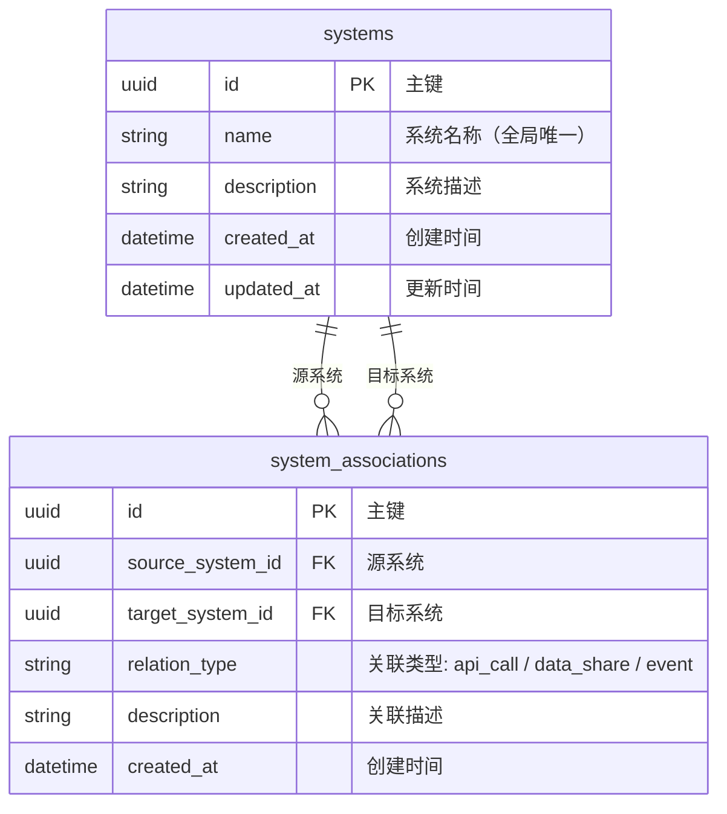
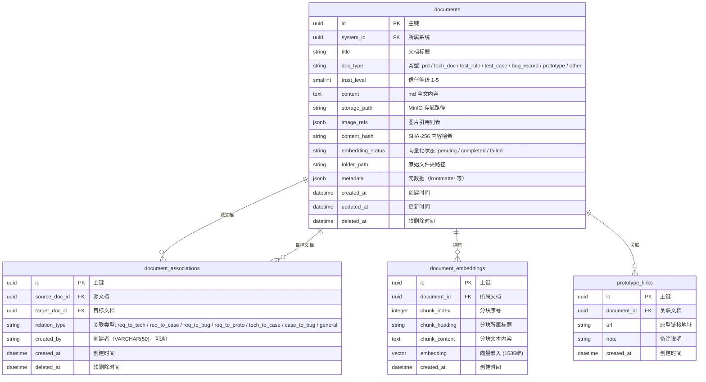
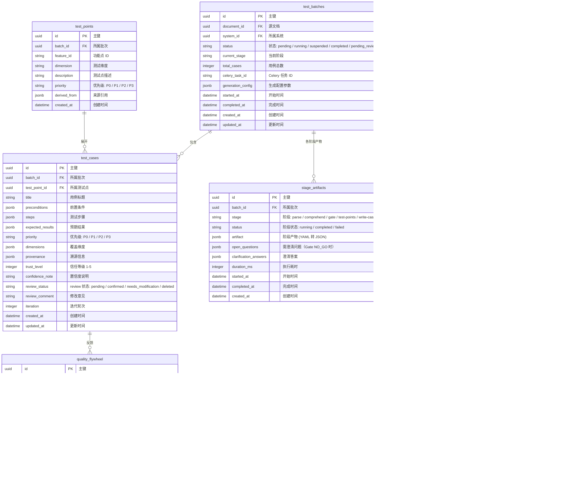

# platform-api Web 后端数据模型

## 1. 文档概述

本文档描述 platform-api 模块的数据库模型设计，包括实体结构、关系、索引策略、事务边界和迁移方案。

| 属性 | 内容 |
| :--- | :--- |
| **数据库类型** | PostgreSQL 15 + pgvector 扩展 |
| **ORM 框架** | SQLAlchemy 2.0（async） |
| **迁移工具** | Alembic |
| **Schema 划分** | public（平台基础）、knowledge（知识库）、testcase（用例） |
| **核心实体** | systems, documents, test_batches, test_cases, export_tasks |

---

## 2. 实体关系总览

| 关系 | 类型 | 说明 |
| :--- | :---: | :--- |
| System ↔ System | M:N | 系统间关联关系（通过 system_associations） |
| System → Document | 1:N | 一个系统下有多个文档 |
| Document ↔ Document | M:N | 文档间关联关系（通过 document_associations） |
| Document → TestBatch | 1:N | 一个文档可多次触发生成 |
| TestBatch → TestCase | 1:N | 一个批次下有多条用例 |
| TestBatch → StageArtifact | 1:N | 一个批次的各阶段产物 |
| TestCase → TestPoint | N:1 | 多条用例可归属同一测试点 |
| TestBatch → ExportTask | 1:N | 一个批次可多次导出 |

### ER 图 — public Schema



### ER 图 — knowledge Schema



### ER 图 — testcase Schema



---

## 3. 实体定义

### 3.1 systems（public schema）

**用途**：顶层业务系统划分

| 字段 | 逻辑类型 | 约束 | 说明 |
| :--- | :--- | :--- | :--- |
| `id` | `uuid` | PK，非空 | 主键 |
| `name` | `string(100)` | 非空，唯一 | 系统名称（全局唯一） |
| `description` | `text` | 可空 | 系统描述 |
| `created_at` | `datetime` | 非空，自动填充 | UTC |
| `updated_at` | `datetime` | 非空，自动更新 | UTC |

**唯一约束**：`UNIQUE(name)`

---

### 3.2 system_associations（public schema）

**用途**：系统间关联关系（邻接表）

| 字段 | 逻辑类型 | 约束 | 说明 |
| :--- | :--- | :--- | :--- |
| `id` | `uuid` | PK，非空 | 主键 |
| `source_system_id` | `uuid` | FK → systems.id，非空 | 源系统 |
| `target_system_id` | `uuid` | FK → systems.id，非空 | 目标系统 |
| `relation_type` | `enum` | 非空 | api_call / data_share / event |
| `description` | `text` | 可空 | 关联描述 |
| `created_at` | `datetime` | 非空，自动填充 | UTC |

**唯一约束**：`UNIQUE(source_system_id, target_system_id, relation_type)`

---

### 3.3 documents（knowledge schema）

**用途**：知识库中的文档记录

| 字段 | 逻辑类型 | 约束 | 说明 |
| :--- | :--- | :--- | :--- |
| `id` | `uuid` | PK，非空 | 主键 |
| `system_id` | `uuid` | FK → public.systems.id，非空 | 所属系统 |
| `title` | `string(255)` | 非空 | 文档标题（从文件名或 frontmatter 提取） |
| `doc_type` | `enum` | 非空 | prd / tech_doc / test_rule / test_case / bug_record / prototype / other |
| `trust_level` | `smallint` | 非空，默认 1 | 信任等级 1-5（1=PRD最高, 5=原型最低） |
| `content` | `text` | 非空 | md 全文内容 |
| `storage_path` | `string(500)` | 非空 | MinIO 对象存储路径 |
| `image_refs` | `jsonb` | 非空，默认 '[]' | 图片引用列表 [{path, minio_key, status}] |
| `content_hash` | `string(64)` | 非空 | SHA-256 内容哈希，用于去重 |
| `embedding_status` | `string(20)` | 非空，默认 `pending` | 向量化状态：pending / completed / failed |
| `folder_path` | `string(500)` | 可空 | 原始文件夹相对路径 |
| `metadata` | `jsonb` | 可空 | frontmatter 元数据 |
| `created_at` | `datetime` | 非空，自动填充 | UTC |
| `updated_at` | `datetime` | 非空，自动更新 | UTC |

**软删除策略**：`deleted_at` 时间戳（文档可能被关联引用，需保留记录）

---

### 3.4 document_associations（knowledge schema）

**用途**：文档间多对多关联关系（邻接表，支持 WITH RECURSIVE 图遍历）

| 字段 | 逻辑类型 | 约束 | 说明 |
| :--- | :--- | :--- | :--- |
| `id` | `uuid` | PK，非空 | 主键 |
| `source_doc_id` | `uuid` | FK → documents.id，非空 | 源文档 |
| `target_doc_id` | `uuid` | FK → documents.id，非空 | 目标文档 |
| `relation_type` | `enum` | 非空 | req_to_tech / req_to_case / req_to_bug / req_to_proto / tech_to_case / case_to_bug / general |
| `created_by` | `varchar(50)` | 可空 | 创建者标识（可选记录操作者） |
| `created_at` | `datetime` | 非空，自动填充 | UTC |
| `deleted_at` | `datetime` | 可空 | 软删除时间 |

**唯一约束**：`UNIQUE(source_doc_id, target_doc_id, relation_type) WHERE deleted_at IS NULL`（部分唯一索引，排除已删除关联）

---

### 3.5 document_embeddings（knowledge schema）

**用途**：文档内容的向量嵌入，支持语义检索

| 字段 | 逻辑类型 | 约束 | 说明 |
| :--- | :--- | :--- | :--- |
| `id` | `uuid` | PK，非空 | 主键 |
| `document_id` | `uuid` | FK → documents.id，非空 | 所属文档 |
| `chunk_index` | `integer` | 非空 | 分块序号（从 0 开始） |
| `chunk_heading` | `string(200)` | 可空 | 分块所属标题（检索上下文时显示段落标题） |
| `chunk_content` | `text` | 非空 | 分块原始文本 |
| `embedding` | `vector(1536)` | 非空 | OpenAI text-embedding-3-small 向量 |
| `created_at` | `datetime` | 非空，自动填充 | UTC |

---

### 3.6 prototype_links（knowledge schema）

**用途**：文档关联的可交互原型链接

| 字段 | 逻辑类型 | 约束 | 说明 |
| :--- | :--- | :--- | :--- |
| `id` | `uuid` | PK，非空 | 主键 |
| `document_id` | `uuid` | FK → documents.id，非空 | 关联文档 |
| `url` | `string(1000)` | 非空 | 原型地址 |
| `note` | `text` | 可空 | 备注（如"辅助参考级，可能有交互 bug"） |
| `created_at` | `datetime` | 非空，自动填充 | UTC |

---

### 3.7 test_batches（testcase schema）

**用途**：一次 AI 用例生成的批次记录

| 字段 | 逻辑类型 | 约束 | 说明 |
| :--- | :--- | :--- | :--- |
| `id` | `uuid` | PK，非空 | 主键 |
| `document_id` | `uuid` | FK → knowledge.documents.id，非空 | 源需求文档 |
| `system_id` | `uuid` | FK → public.systems.id，非空 | 所属系统 |
| `status` | `enum` | 非空，默认 `pending` | pending / running / suspended / completed / pending_review / reviewing / archived / failed |
| `current_stage` | `string(50)` | 可空 | 当前执行阶段 |
| `total_cases` | `integer` | 可空 | 生成用例总数 |
| `celery_task_id` | `string(255)` | 可空 | Celery 任务 ID |
| `generation_config` | `jsonb` | 可空 | 生成配置参数 |
| `started_at` | `datetime` | 可空 | 任务开始时间 |
| `completed_at` | `datetime` | 可空 | 任务完成时间 |
| `created_at` | `datetime` | 非空，自动填充 | UTC |
| `updated_at` | `datetime` | 非空，自动更新 | UTC |

---

### 3.8 test_points（testcase schema）

**用途**：测试点（Stage 3 产物，测试点树的节点）

| 字段 | 逻辑类型 | 约束 | 说明 |
| :--- | :--- | :--- | :--- |
| `id` | `uuid` | PK，非空 | 主键 |
| `batch_id` | `uuid` | FK → test_batches.id，非空 | 所属批次 |
| `feature_id` | `string(50)` | 非空 | 功能点 ID（如 F001） |
| `dimension` | `string(50)` | 非空 | 测试维度 |
| `description` | `text` | 非空 | 测试点描述 |
| `priority` | `enum` | 非空 | P0 / P1 / P2 / P3 |
| `derived_from` | `jsonb` | 非空 | 来源引用列表 |
| `created_at` | `datetime` | 非空，自动填充 | UTC |

---

### 3.9 test_cases（testcase schema）

**用途**：生成的测试用例

| 字段 | 逻辑类型 | 约束 | 说明 |
| :--- | :--- | :--- | :--- |
| `id` | `uuid` | PK，非空 | 主键 |
| `batch_id` | `uuid` | FK → test_batches.id，非空 | 所属批次 |
| `test_point_id` | `uuid` | FK → test_points.id，可空 | 所属测试点 |
| `title` | `string(500)` | 非空 | 用例标题 |
| `preconditions` | `jsonb` | 非空 | 前置条件列表 |
| `steps` | `jsonb` | 非空 | 测试步骤列表 [{step_number, action, input_data, expected_result}] |
| `expected_results` | `jsonb` | 非空 | 预期结果列表 |
| `priority` | `enum` | 非空 | P0 / P1 / P2 / P3 |
| `dimensions` | `jsonb` | 非空 | 覆盖维度列表 |
| `provenance` | `jsonb` | 非空 | 溯源信息 {derived_from, source_section, verbatim_excerpt, trust_level} |
| `trust_level` | `integer` | 非空 | 信任等级 1-5 |
| `confidence_note` | `text` | 可空 | 置信度说明（trust_level>=4 时必填） |
| `review_status` | `enum` | 非空，默认 `pending` | pending / confirmed / needs_modification / deleted |
| `review_comment` | `text` | 可空 | QA 修改意见 |
| `iteration` | `integer` | 非空，默认 1 | 迭代轮次 |
| `created_at` | `datetime` | 非空，自动填充 | UTC |
| `updated_at` | `datetime` | 非空，自动更新 | UTC |

---

### 3.10 stage_artifacts（testcase schema）

**用途**：6 阶段流水线各阶段的中间产物持久化

| 字段 | 逻辑类型 | 约束 | 说明 |
| :--- | :--- | :--- | :--- |
| `id` | `uuid` | PK，非空 | 主键 |
| `batch_id` | `uuid` | FK → test_batches.id，非空 | 所属批次 |
| `stage` | `enum` | 非空 | parse / comprehend / gate / test-points / write-cases / review-cases / export |
| `status` | `enum` | 非空 | running / completed / failed |
| `artifact` | `jsonb` | 可空 | 阶段产物（结构化数据） |
| `open_questions` | `jsonb` | 可空 | Gate NO_GO 时的待澄清问题列表 |
| `clarification_answers` | `jsonb` | 可空 | 用户提交的澄清答案 |
| `duration_ms` | `integer` | 可空 | 阶段执行耗时 |
| `started_at` | `datetime` | 可空 | 阶段开始时间 |
| `completed_at` | `datetime` | 可空 | 阶段完成时间 |
| `created_at` | `datetime` | 非空，自动填充 | UTC |

---

### 3.11 quality_flywheel（testcase schema）

**用途**：质量飞轮数据，存储 AI 生成版与 QA 终版的三元组

| 字段 | 逻辑类型 | 约束 | 说明 |
| :--- | :--- | :--- | :--- |
| `id` | `uuid` | PK，非空 | 主键 |
| `test_case_id` | `uuid` | FK → test_cases.id，非空 | 关联用例 |
| `system_id` | `uuid` | FK → public.systems.id，非空 | 所属系统 |
| `ai_version_yaml` | `text` | 非空 | AI 生成的原始版本完整 YAML |
| `qa_final_version_yaml` | `text` | 可空 | QA review 后的终版完整 YAML |
| `modification_reason` | `text` | 非空 | 修改理由 |
| `modification_type` | `string(30)` | 非空 | 修改类型：no_change / minor_edit / major_rewrite / deleted |
| `feature_types` | `jsonb` | 非空，默认 '[]' | 功能类型标签数组，用于 few-shot 匹配 |
| `dimensions` | `jsonb` | 非空，默认 '[]' | 涉及维度列表 |
| `is_few_shot_candidate` | `boolean` | 非空，默认 false | 是否入选 few-shot 样本库 |
| `created_at` | `datetime` | 非空，自动填充 | UTC |

---

### 3.12 golden_set_results（testcase schema）

**用途**：Golden-set 评估运行结果，跟踪内核迭代的质量变化

| 字段 | 逻辑类型 | 约束 | 说明 |
| :--- | :--- | :--- | :--- |
| `id` | `uuid` | PK，非空 | 主键 |
| `batch_id` | `uuid` | FK → test_batches.id，非空 | 评估使用的生成批次 |
| `golden_set_id` | `string(50)` | 非空 | Golden-set 数据集编号 |
| `kernel_version` | `string(20)` | 非空 | 被评估的内核版本 |
| `coverage_overlap` | `real` | 非空 | 覆盖重合度（AI ∩ QA / QA） |
| `ai_miss_rate` | `real` | 非空 | AI 漏点率（QA有AI无 / QA总数） |
| `ai_valuable_addition_rate` | `real` | 非空 | AI 新增有价值率 |
| `direct_usability_rate` | `real` | 非空 | 直接可用率（无需修改的比例） |
| `gate_accuracy` | `real` | 可空 | Gate 判定准确率 |
| `detail_report` | `jsonb` | 非空 | 详细对比报告 |
| `evaluated_at` | `datetime` | 非空，自动填充 | 评估执行时间 |

---

### 3.13 export_tasks（testcase schema）

**用途**：异步导出任务记录

| 字段 | 逻辑类型 | 约束 | 说明 |
| :--- | :--- | :--- | :--- |
| `id` | `uuid` | PK，非空 | 主键 |
| `batch_id` | `uuid` | FK → test_batches.id，可空 | 关联批次（批次级导出） |
| `system_id` | `uuid` | FK → public.systems.id，可空 | 关联系统（系统级导出） |
| `export_scope` | `enum` | 非空 | batch / system |
| `format` | `enum` | 非空 | markdown / excel |
| `status` | `enum` | 非空，默认 `processing` | processing / completed / failed |
| `file_url` | `string(1000)` | 可空 | MinIO 文件地址 |
| `total_cases` | `integer` | 可空 | 导出用例数 |
| `error_message` | `text` | 可空 | 失败原因 |
| `created_at` | `datetime` | 非空，自动填充 | UTC |
| `completed_at` | `datetime` | 可空 | 完成时间 |

---

## 4. 关系定义

### 4.1 外键约束

| 外键字段 | 引用表.字段 | ON DELETE | ON UPDATE | 说明 |
| :--- | :--- | :---: | :---: | :--- |
| `system_associations.source_system_id` | `systems.id` | CASCADE | CASCADE | 删除系统级联删除关联 |
| `system_associations.target_system_id` | `systems.id` | CASCADE | CASCADE | 同上 |
| `documents.system_id` | `systems.id` | RESTRICT | CASCADE | 删除系统前需先删除文档 |
| `document_associations.source_doc_id` | `documents.id` | CASCADE | CASCADE | 删除文档级联删除关联 |
| `document_associations.target_doc_id` | `documents.id` | CASCADE | CASCADE | 同上 |
| `document_embeddings.document_id` | `documents.id` | CASCADE | CASCADE | 删除文档级联删除嵌入 |
| `prototype_links.document_id` | `documents.id` | CASCADE | CASCADE | 删除文档级联删除原型链接 |
| `test_batches.document_id` | `documents.id` | RESTRICT | CASCADE | 有生成记录的文档不可删除 |
| `test_batches.system_id` | `systems.id` | RESTRICT | CASCADE | 同上 |
| `test_points.batch_id` | `test_batches.id` | CASCADE | CASCADE | 删除批次级联删除测试点 |
| `test_cases.batch_id` | `test_batches.id` | CASCADE | CASCADE | 删除批次级联删除用例 |
| `test_cases.test_point_id` | `test_points.id` | SET NULL | CASCADE | 测试点删除后用例保留 |
| `stage_artifacts.batch_id` | `test_batches.id` | CASCADE | CASCADE | 删除批次级联删除产物 |
| `quality_flywheel.test_case_id` | `test_cases.id` | CASCADE | CASCADE | 删除用例级联删除飞轮数据 |
| `quality_flywheel.system_id` | `systems.id` | RESTRICT | CASCADE | 系统存在时飞轮数据保留 |
| `export_tasks.batch_id` | `test_batches.id` | SET NULL | CASCADE | 批次删除后导出记录保留 |

---

## 5. 索引设计

| 索引名 | 所在实体 | 覆盖字段 | 访问模式 | 取舍说明 |
| :--- | :--- | :--- | :--- | :--- |
| `uniq_systems_name` | systems | `name` | 系统名称唯一校验 | 唯一索引 |
| `idx_documents_system_id` | documents | `system_id` | 按系统查文档列表 | 高频查询 |
| `idx_documents_system_status` | documents | `(system_id, status)` | 按系统+状态筛选文档 | 复合索引 |
| `idx_documents_deleted_at` | documents | `deleted_at` | 软删除过滤 | 部分索引 WHERE deleted_at IS NULL |
| `idx_doc_assoc_source` | document_associations | `source_doc_id` | 关联图遍历（出边） | 部分索引 WHERE deleted_at IS NULL |
| `idx_doc_assoc_target` | document_associations | `target_doc_id` | 关联图遍历（入边） | 部分索引 WHERE deleted_at IS NULL |
| `idx_embeddings_document` | document_embeddings | `document_id` | 按文档查分块嵌入 | 关联查询 |
| `idx_embeddings_vector` | document_embeddings | `embedding` | 向量相似度搜索 | HNSW 索引（m=16, ef_construction=64） |
| `idx_batches_document` | test_batches | `document_id` | 按文档查批次历史 | 高频查询 |
| `idx_batches_system_status` | test_batches | `(system_id, status)` | 按系统+状态筛选批次 | 复合索引 |
| `idx_cases_batch` | test_cases | `batch_id` | 按批次查用例 | 高频查询 |
| `idx_cases_batch_review` | test_cases | `(batch_id, review_status)` | 按批次+review状态筛选 | 复合索引 |
| `idx_points_batch` | test_points | `batch_id` | 按批次查测试点 | 关联查询 |
| `idx_artifacts_batch_stage` | stage_artifacts | `(batch_id, stage)` | 按批次+阶段查产物 | 复合索引 |
| `idx_flywheel_system` | quality_flywheel | `system_id` | 按系统查飞轮数据 | 分析查询 |
| `idx_flywheel_few_shot` | quality_flywheel | `is_few_shot_candidate` | 筛选 few-shot 样本 | 部分索引 WHERE is_few_shot_candidate = true |
| `idx_exports_status` | export_tasks | `status` | 查询进行中的导出 | 筛选查询 |
| `idx_golden_version` | golden_set_results | `(kernel_version, golden_set_id)` | 版本评估对比 | 复合索引 |

---

## 6. 关联图查询（WITH RECURSIVE）

文档关联图遍历使用 PostgreSQL 的 `WITH RECURSIVE` 实现 N 跳查询：

```sql
-- 查询文档 doc_id 的 N 跳关联文档
WITH RECURSIVE doc_graph AS (
    -- 起始节点
    SELECT target_doc_id AS doc_id, 1 AS depth, relation_type
    FROM knowledge.document_associations
    WHERE source_doc_id = :doc_id
    
    UNION ALL
    
    -- 递归展开
    SELECT da.target_doc_id, dg.depth + 1, da.relation_type
    FROM knowledge.document_associations da
    JOIN doc_graph dg ON da.source_doc_id = dg.doc_id
    WHERE dg.depth < :max_depth
)
SELECT DISTINCT d.*
FROM doc_graph dg
JOIN knowledge.documents d ON d.id = dg.doc_id
WHERE d.deleted_at IS NULL;
```

系统间关联查询同理，使用 `system_associations` 表的 `WITH RECURSIVE`。

---

## 7. Celery 任务状态（Redis 结构）

任务实时进度存储在 Redis Hash 中（不持久化到数据库，任务完成后清除）：

```
Key: task_progress:{batch_id}
Type: Hash
Fields:
  current_stage     → "write-cases"
  stage_progress    → "75"
  gate_result       → "GO"
  total_stages      → "6"
  completed_stages  → "3"
  started_at        → "2026-06-05T10:30:00Z"
  updated_at        → "2026-06-05T10:32:15Z"
TTL: 24 小时（任务完成后自动过期）
```

Gate NO_GO 挂起等待信号：
```
Key: clarification:{batch_id}
Type: List（BLPOP 阻塞等待）
Value: JSON string of answers
TTL: 7 天
```

---

## 8. 事务边界

| 操作场景 | 涉及实体 | 事务 | 隔离级别 | 说明 |
| :--- | :--- | :---: | :--- | :--- |
| 创建系统 | systems | 是 | Read Committed | 名称唯一约束由数据库保证 |
| 批量上传文档 | documents（多条） | 是 | Read Committed | 全部文件记录原子写入 |
| 触发生成 | test_batches + Celery 发布 | 是 | Read Committed | 记录创建和任务发布原子性 |
| Worker 写入用例 | test_cases（批量） | 是 | Read Committed | 同一阶段产物原子写入 |
| review 操作 | test_cases（单条） | 是 | Read Committed | 状态变更 |
| 落库操作 | test_batches + test_cases + quality_flywheel | 是 | Repeatable Read | 确保所有用例状态一致后变更批次状态 |
| 查询批次详情 | test_batches + test_cases | 否 | — | 只读 |

---

## 9. 迁移策略

### 9.1 迁移规则

- 所有结构变更通过 Alembic 迁移脚本完成，禁止手动修改生产库 Schema
- 每次迁移只做一件事（加列 / 加索引 / 建表单独成脚本）
- 首次部署时运行初始迁移创建全部表和索引

### 9.2 初始迁移顺序

1. 创建 `knowledge` 和 `testcase` Schema
2. 启用 `pgvector` 和 `uuid-ossp` 扩展
3. 创建 public schema 表（systems → system_associations）
4. 创建 knowledge schema 表（documents → document_associations → document_embeddings → prototype_links）
5. 创建 testcase schema 表（test_batches → test_points → test_cases → stage_artifacts → quality_flywheel → golden_set_results → export_tasks）
6. 创建所有索引

### 9.3 版本追踪

| 字段 | 内容 |
| :--- | :--- |
| 版本命名规范 | Alembic 自动生成 revision ID + 描述（如 `001_create_public_schema`） |
| 回滚策略 | 每个迁移必须提供 downgrade 方法；不可逆操作（如删列）先标记废弃再下个版本删除 |

---

## 10. 数据约束与规则

* **审计字段**：所有表包含 `created_at`（自动填充）和 `updated_at`（自动更新）
* **UUID 生成**：应用层使用 `uuid4()` 生成，避免依赖数据库函数
* **时间格式**：所有时间字段存储 UTC，应用层负责时区转换
* **JSONB 校验**：应用层通过 Pydantic 模型校验 JSONB 字段结构，数据库层不设 JSON Schema 约束
* **枚举实现**：使用 PostgreSQL 原生 ENUM 类型，通过 Alembic 管理枚举值变更
