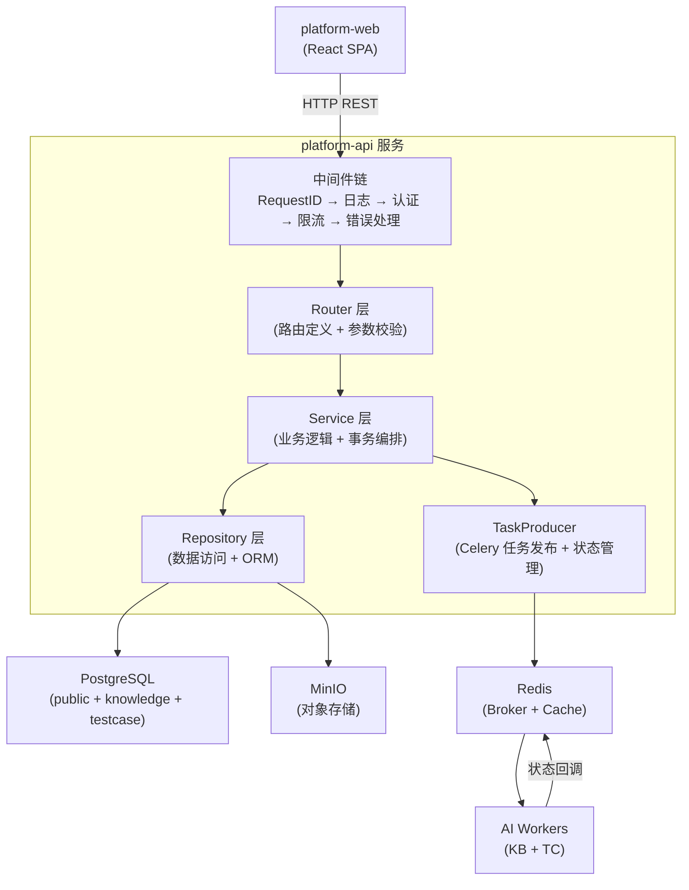
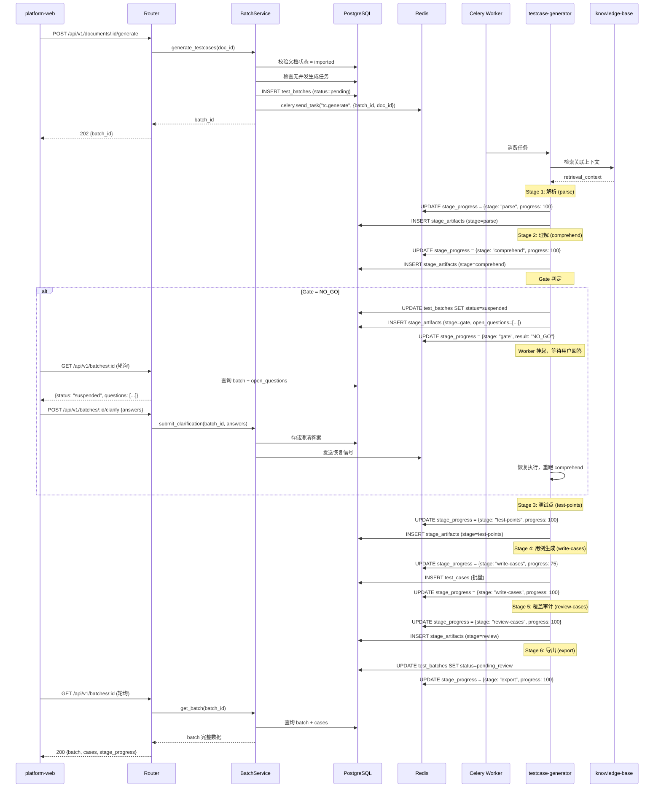
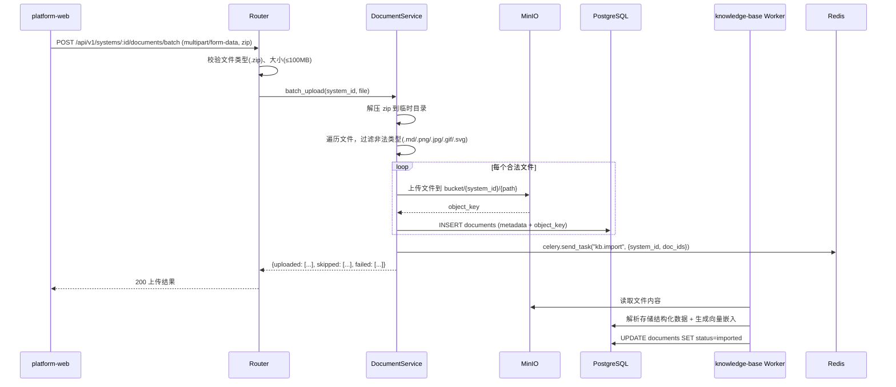
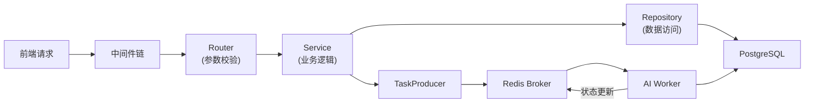
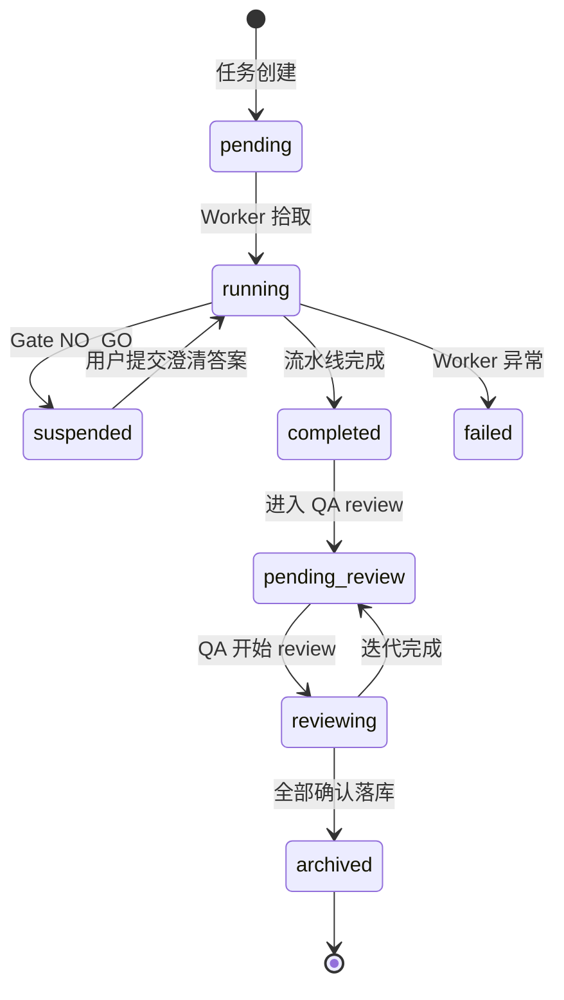

# platform-api Web 后端技术设计

## 0. 文档信息

| 属性 | 内容 |
| :--- | :--- |
| **所属变更** | CHG-20260605-001 |
| **模块名称** | platform-api |
| **模块类型** | web-backend |
| **创建时间** | 2026-06-05 |

---

## 1. 背景与目标

* **技术背景**：QA 智能平台需要统一的后端服务层作为数据和编排中枢，编排 AI 能力模块（knowledge-base、testcase-generator），管理项目/系统/文档/用例数据，为前端提供完整 REST API。当前采用 Python FastAPI + Celery + Redis 的事件驱动架构。
* **技术目标**：实现分层清晰、职责明确的单体后端服务，支持异步 AI 任务编排，提供稳定的 REST API（可用性 > 99.5%，P95 < 200ms）

---

## 2. 模块职责边界

**负责：**
- MVP 阶段不做用户认证
- 项目/系统/文档/用例数据的 CRUD 操作
- Celery 任务编排（发布、状态追踪、挂起/恢复）
- 文件上传处理（zip 解压、MinIO 存储、触发导入）
- 导出功能（异步导出任务、格式转换）
- 统一错误处理和响应格式

**不负责（显式排除）：**
- AI 推理逻辑（由 knowledge-base 和 testcase-generator Worker 处理）
- 前端渲染和交互逻辑（由 platform-web 处理）
- 数据库 Schema 定义和迁移脚本（→ data-model.md）
- API 接口契约定义（→ contracts.md）

**调用关系：**

| 方向 | 模块 | 方式 |
| :--- | :--- | :--- |
| 被调用 | platform-web | REST API（HTTP JSON） |
| 调用 | knowledge-base Worker | Celery 任务发布 |
| 调用 | testcase-generator Worker | Celery 任务发布 |
| 调用 | PostgreSQL | SQLAlchemy ORM |
| 调用 | MinIO | S3 兼容 API |
| 调用 | Redis | 缓存 + Celery Broker |

---

## 3. 技术选型与研究

### 3.1 关键技术问题

| 问题 | 选择方案 | 备选方案 | 选择理由 |
| :--- | :--- | :--- | :--- |
| 异步任务编排 | Celery + Redis Broker | Dramatiq / Huey | Celery 生态成熟，支持任务链、回调、状态追踪，与 Redis 配合简化基础设施 |
| ORM 框架 | SQLAlchemy 2.0 + async | Tortoise ORM | SQLAlchemy 2.0 支持原生 async，成熟稳定，类型安全好 |
| 认证方案 | MVP 不做 | — | MVP 阶段无认证需求 |
| 文件存储 | MinIO (S3 兼容) | 本地文件系统 | S3 标准 API，易于后续迁移云存储；支持水平扩容 |
| 数据库迁移 | Alembic | 手动 SQL | 自动生成迁移脚本，版本追踪，与 SQLAlchemy 模型同步 |

### 3.2 技术研究总结

Celery 的 `AsyncResult` 支持查询任务状态和进度，配合 Redis 作为 Result Backend 可实现实时状态更新。Gate NO_GO 场景通过 LangGraph `interrupt()` 挂起图执行，将任务状态设为 `suspended`，用户回答后通过 `Command(resume=...)` 恢复。

---

## 4. 架构概述

### 4.1 分层架构图



### 4.2 目录结构

```
platform-api/
├── app/
│   ├── main.py              # FastAPI 应用入口
│   ├── config.py            # 配置管理（环境变量）
│   ├── middleware/
│   │   ├── request_id.py    # 请求 ID 注入
│   │   ├── logging.py       # 结构化日志
│   │   # MVP 阶段无认证模块
│   │   └── error_handler.py # 统一错误处理
│   ├── routers/
│   │   ├── auth.py          # 认证接口
│   │   ├── systems.py       # 系统管理
│   │   ├── documents.py     # 文档管理
│   │   ├── batches.py       # 用例批次
│   │   ├── testcases.py     # 用例操作
│   │   └── exports.py       # 导出功能
│   ├── services/
│   │   ├── auth_service.py
│   │   ├── system_service.py
│   │   ├── document_service.py
│   │   ├── batch_service.py
│   │   ├── testcase_service.py
│   │   └── export_service.py
│   ├── repositories/
│   │   ├── base.py          # 通用 Repository 基类
│   │   ├── user_repo.py
│   │   ├── system_repo.py
│   │   ├── document_repo.py
│   │   ├── batch_repo.py
│   │   ├── testcase_repo.py
│   │   └── export_repo.py
│   ├── tasks/
│   │   ├── producer.py      # Celery 任务发布
│   │   ├── callbacks.py     # 任务状态回调处理
│   │   └── celery_app.py    # Celery 应用配置
│   ├── models/
│   │   ├── base.py          # SQLAlchemy Base
│   │   ├── public.py        # public schema 模型
│   │   ├── knowledge.py     # knowledge schema 模型
│   │   └── testcase.py      # testcase schema 模型
│   ├── schemas/
│   │   ├── auth.py          # Pydantic 请求/响应模型
│   │   ├── system.py
│   │   ├── document.py
│   │   ├── batch.py
│   │   ├── testcase.py
│   │   └── export.py
│   ├── exceptions/
│   │   ├── base.py          # 自定义异常基类
│   │   └── handlers.py      # 异常到 HTTP 响应映射
│   └── utils/
│       # security.py 已移除（MVP 无认证）
│       ├── file_handler.py  # 文件处理工具
│       └── pagination.py    # 分页工具
├── migrations/              # Alembic 迁移脚本
├── tests/
└── requirements.txt
```

---

## 5. 关键流程设计

### 5.1 用例生成完整时序图（含 6 阶段进度回调）



### 5.2 文件上传处理流程



---

## 6. 数据流转

### 6.1 系统数据流



### 6.2 核心数据流转说明

| 数据 | 入口 | 处理环节 | 出口 | 持久化 |
| :--- | :--- | :--- | :--- | :--- |
| 文档文件 | POST /documents/batch | 解压 → 类型过滤 → 存储 | MinIO object_key | knowledge.documents |
| 用例批次 | POST /documents/:id/generate | 创建批次 → 发布任务 | 202 batch_id | testcase.test_batches |
| 阶段进度 | Worker 回调 | 写入 Redis Hash | GET /batches/:id | Redis hash + testcase.stage_artifacts |
| 导出文件 | POST /exports | 创建任务 → 格式转换 → 存储 | GET /exports/:id | MinIO + testcase.export_tasks |

---

## 7. 分层职责落实

### 7.1 Router 层

> Router 只做：路由定义、Pydantic 参数校验、调用 Service、序列化响应。不含业务逻辑。

**输入校验（Pydantic 模型自动校验，失败直接返回 422）：**

| 字段 / 参数 | 校验规则 | 失败时 |
| :--- | :--- | :--- |
| `system_id` (path) | UUID 格式 | 422 |
| `name` (body) | 非空，长度 1–100 | 422 |
| `file` (form) | 非空，MIME 为 application/zip，大小 ≤ 100MB | 400 |
| `page` (query) | 正整数，默认 1 | 422 |
| `per_page` (query) | 1–100，默认 20 | 422 |

### 7.2 Service 层

> 包含全部业务逻辑和事务编排，不处理 HTTP 细节。

**公开方法：**

| 方法签名 | 职责 | 事务 | 抛出异常 |
| :--- | :--- | :---: | :--- |

| `SystemService.create(input) → System` | 创建系统 | 是 | DuplicateNameError |
| `DocumentService.batch_upload(system_id, file) → UploadResult` | 批量上传处理 | 是 | StorageError |
| `BatchService.generate(doc_id) → TestBatch` | 触发用例生成 | 是 | ConcurrentGenerationError |
| `BatchService.submit_clarification(batch_id, answers) → void` | 提交 Gate 澄清 | 是 | InvalidStateError |
| `TestcaseService.review(case_id, action) → TestCase` | review 单条用例 | 是 | InvalidStateError |
| `BatchService.iterate(batch_id) → TestBatch` | 触发迭代优化 | 是 | NoModifiableCasesError |
| `BatchService.archive(batch_id) → TestBatch` | 落库确认 | 是 | UnconfirmedCasesError |
| `ExportService.create_export(params) → ExportTask` | 创建导出任务 | 是 | NoExportableDataError |

**业务规则：**
- 同一系统内系统名称唯一
- 同一文档不可同时有两个进行中的生成任务
- 落库前所有用例必须为 confirmed 状态
- 迭代优化仅重新生成 needs_modification 状态的用例
- 仅 archived 状态的用例可导出

**跨模块调用：**

| 依赖模块 | 调用时机 | 失败处理 |
| :--- | :--- | :--- |
| knowledge-base Worker | 文档上传后触发解析导入 | 文档记录已创建，导入失败标记文档状态为 import_failed |
| testcase-generator Worker | 触发用例生成 | 批次记录已创建，Worker 失败标记批次状态为 failed |

### 7.3 Repository 层

> 封装全部数据库操作，向 Service 屏蔽 ORM 细节。

| 方法签名 | 操作 | 说明 |
| :--- | :--- | :--- |
| `SystemRepo.create(entity) → System` | INSERT | 名称唯一约束冲突抛 DuplicateNameError |
| `SystemRepo.find_by_id(id) → System \| None` | SELECT | 不存在返回 None |
| `SystemRepo.find_all(pagination) → Page[System]` | SELECT | 支持分页 |
| `DocumentRepo.batch_create(entities) → List[Document]` | INSERT | 批量插入 |
| `DocumentRepo.find_by_system(system_id, filters, pagination) → Page[Document]` | SELECT | 支持类型/状态筛选 |
| `BatchRepo.create(entity) → TestBatch` | INSERT | 创建生成批次 |
| `BatchRepo.find_by_id_with_cases(id) → BatchWithCases` | SELECT + JOIN | 含关联用例和阶段产物 |
| `TestcaseRepo.bulk_upsert(cases) → List[TestCase]` | UPSERT | Worker 批量写入用例 |
| `ExportRepo.create(entity) → ExportTask` | INSERT | 创建导出任务 |

### 7.4 DTO 与领域对象映射

| 类型 | 用途 | 转换时机 |
| :--- | :--- | :--- |
| Pydantic Request Schema | 接收 POST/PATCH 请求体 | Router 入口自动解析 |
| SQLAlchemy Model | 数据库持久化对象 | Repository 层操作 |
| Pydantic Response Schema | 序列化响应体 | Router 出口 model_validate |

> **安全规则**：以下字段禁止序列化到 ResponseDTO：`internal_celery_task_id`

---

## 8. Celery 任务编排设计

### 8.1 任务类型

| 任务名 | 队列 | 职责 | 超时 |
| :--- | :--- | :--- | :--- |
| `kb.import` | knowledge | 文档解析、向量化 | 300s |
| `tc.generate` | testcase | 6 阶段流水线生成 | 无超时（质量优先） |
| `tc.iterate` | testcase | 迭代优化指定用例 | 无超时 |
| `export.process` | default | 格式转换 + 文件生成 | 120s |

### 8.2 状态追踪机制

使用 Redis Hash 存储任务实时进度（避免高频写数据库）：

```
Key: task_progress:{batch_id}
Fields:
  - current_stage: "write-cases"
  - stage_progress: 75
  - gate_result: "GO"
  - started_at: "2026-06-05T10:30:00Z"
  - updated_at: "2026-06-05T10:32:15Z"
```

阶段完成时写入 PostgreSQL `stage_artifacts` 表（持久化中间产物）。

### 8.3 挂起/恢复机制（Gate NO_GO）



挂起实现方式（基于 LangGraph `interrupt()`）：
1. LangGraph 流水线 Gate NO_GO 时调用 `interrupt()`，图执行挂起，checkpoint 自动保存到 Redis
2. Celery Worker 检测到图被 interrupt 挂起，更新 `test_batches.status = suspended`，将 `open_questions` 写入 `stage_artifacts`
3. Worker 任务正常退出（非阻塞）
4. 用户通过 API 提交答案后，Service 层派发新 Celery 任务 `resume_after_clarification`
5. 新 Worker 通过 `Command(resume=answers)` 恢复图执行，从 comprehend 阶段继续

---

## 9. 认证授权详细设计

MVP 阶段无认证，本节不适用。

---

## 10. 文件上传处理设计

### 10.1 上传流程

1. 前端将文件夹打包为 zip，通过 `multipart/form-data` 上传
2. Router 层校验：文件类型为 zip、大小不超过 100MB
3. Service 层解压到临时目录（`/tmp/uploads/{uuid}/`）
4. 遍历解压目录，按规则处理每个文件：
   - `.md` 文件：上传到 MinIO，创建 Document 记录
   - 图片文件（.png/.jpg/.gif/.svg）：检查是否被 .md 引用，是则上传
   - 其他格式：记入 skipped 列表
5. 清理临时目录
6. 发布 `kb.import` 任务触发知识库解析

### 10.2 MinIO 存储结构

```
bucket: qa-platform
├── systems/{system_id}/
│   ├── docs/{doc_id}/{filename}.md
│   └── images/{doc_id}/{image_name}.png
└── exports/{export_id}/{filename}.xlsx
```

---

## 11. 导出功能设计

### 11.1 导出流程

1. 用户选择导出范围（单批次 / 系统级用例库）和格式
2. Service 层创建 `ExportTask` 记录（status=processing）
3. 发布 `export.process` Celery 任务
4. Worker 查询目标用例数据，按格式规范转换
5. 生成导出文件上传到 MinIO
6. 更新 `ExportTask`（status=completed，file_url=MinIO 地址）
7. 前端通过 `GET /api/v1/exports/:id` 获取下载地址

### 11.2 支持的导出格式

| 格式 | 说明 | 实现方式 |
| :--- | :--- | :--- |
| Markdown | 评审版，带完整 provenance | Jinja2 模板渲染 |
| Excel | 正式版，表格化展示 | openpyxl 生成 |

---

## 12. 异常处理链

### 12.1 异常类型

| 异常类 | 抛出层 | 语义 |
| :--- | :--- | :--- |
| `ResourceNotFoundError` | Repository / Service | 资源不存在 |
| `ValidationError` | Service | 业务规则校验失败 |
| `ConflictError` | Service | 资源状态冲突或重复 |
| `AuthenticationError` | Middleware | 认证失败（Token 无效/过期） |
| `StorageError` | Service | MinIO 存储操作失败 |
| `TaskDispatchError` | TaskProducer | Celery 任务发布失败 |
| `InternalError` | 任意层 | 未预期的系统错误 |

### 12.2 HTTP 状态码映射

| 异常类 | HTTP 状态 | 错误码 | 备注 |
| :--- | :---: | :--- | :--- |
| `ValidationError` | 400 | E4001 | 业务校验失败 |
| `AuthenticationError` | 401 | E4011 | Token 无效或过期 |
| `ResourceNotFoundError` | 404 | E4041 | 资源不存在 |
| `ConflictError` | 409 | E4091 | 状态冲突 |
| `PayloadTooLargeError` | 413 | E4131 | 文件超出大小限制 |
| `RateLimitError` | 429 | E4291 | 请求频率超限 |
| `InternalError` | 500 | E5001 | 服务器内部错误（不暴露细节） |
| `ServiceUnavailableError` | 503 | E5031 | 依赖服务不可用 |

### 12.3 统一错误响应格式

```json
{
  "error_code": "E4041",
  "message": "指定的文档不存在",
  "request_id": "550e8400-e29b-41d4-a716-446655440000"
}
```

错误处理中间件捕获所有未处理异常，根据异常类映射为统一格式响应，同时记录堆栈到日志（绑定 request_id）。

---

## 13. 性能设计

* **QPS 目标**：50 并发用户，峰值 200 QPS
* **响应时间**：同步 API P95 ≤ 200ms；异步任务不设时间限制
* **缓存策略**：
  - 系统列表：Redis 缓存 5 分钟（Cache-Aside）
  - 文档元数据：Redis 缓存 10 分钟
  - 任务状态：不缓存，实时查询 Redis Hash
* **异步处理**：AI 生成、文档导入、文件导出全部通过 Celery 异步化
* **连接池**：SQLAlchemy async pool_size=20，overflow=10

---

## 14. 测试矩阵

| 测试目标 | 测试类型 | 通过条件 |
| :--- | :--- | :--- |
| Router 参数校验 | 单元测试 | 非法输入返回 422 + 对应字段错误信息 |
| Service 业务规则 | 单元测试（Mock Repository） | 每条规则有正向 + 反向用例 |
| Repository CRUD | 集成测试（测试库） | 数据正确持久化和查询 |
| 异常映射 | 单元测试 | 每种异常类正确映射到 HTTP 状态码和错误码 |
| Celery 任务编排 | 集成测试 | 任务正确发布、状态回调正确更新 |

| 文件上传 | 集成测试（Mock MinIO） | zip 解压、文件过滤、存储路径正确 |
| 响应安全字段 | 单元测试 | 敏感字段不出现在序列化结果中 |

---

## 15. 设计决策记录

### 决策 1：任务状态用 Redis Hash 而非数据库

* **问题**：6 阶段流水线执行过程中需要高频更新进度，前端每 5 秒轮询
* **候选方案**：
  * A — 直接写 PostgreSQL：数据持久化好 / 高频写入增加 DB 负载
  * B — Redis Hash 存实时进度 + 阶段完成时写 DB：实时性好、DB 压力小 / 需要两层存储
* **决策**：选择方案 B
* **理由**：进度信息是临时性的高频更新数据，适合 Redis；阶段产物是需要持久化的结构化数据，适合 PostgreSQL。两层分离各取所长。

### 决策 2：Gate NO_GO 挂起机制

* **问题**：Gate 判定为 NO_GO 时，需要等待用户回答后继续执行
* **候选方案**：
  * A — 任务终止，用户回答后重新创建任务：实现简单 / 需重跑前置阶段、浪费算力
  * B — Worker BLPOP 等待信号，收到后从当前阶段继续：节约算力 / Worker 占用时间长
* **决策**：选择方案 B
* **理由**：质量优先不设时间限制是项目核心原则，Worker 等待不会影响其他任务（Celery 支持并发 Worker）。LangGraph Checkpoint 天然支持断点续跑。

### 决策 3：文件上传采用 zip 打包而非逐文件上传

* **问题**：用户需要上传包含 md 和图片的文件夹，如何传输
* **候选方案**：
  * A — 逐文件上传：前端实现简单 / 请求数多、相对路径关系丢失
  * B — zip 打包整体上传：保留目录结构和相对路径 / 需要前端打包
* **决策**：选择方案 B
* **理由**：图片通过相对路径被 md 引用，必须保留目录结构才能正确关联。单次请求也减少网络开销。

---

## 9. 数据库设计要点

- 单库多 schema（public + knowledge + testcase），Alembic 迁移管理
- 关联图用邻接表 + WITH RECURSIVE CTE 查询
- pgvector HNSW 索引用于向量近似搜索
- 所有表含 created_at / updated_at 审计字段
- 软删除（deleted_at 字段）用于文档和系统

## 10. 接口设计要点

- RESTful 风格，URL 路径版本 /api/v1/
- 统一分页（page + page_size）、排序（sort_by + order）、筛选（filter query params）
- 异步操作返回 202 + 资源 ID，通过 GET 轮询状态
- 幂等性：POST 创建用请求 ID 去重，PUT/PATCH 天然幂等

## 11. 错误处理与容灾

- 统一错误响应格式：{code, message, details}
- 业务异常（4xx）：返回可读错误信息 + 错误码
- 系统异常（5xx）：记录日志 + 返回通用错误（不暴露内部信息）
- Celery 任务失败：自动重试 3 次（指数退避）；最终失败标记 status=failed
- 数据库连接池耗尽：返回 503 + Retry-After header
