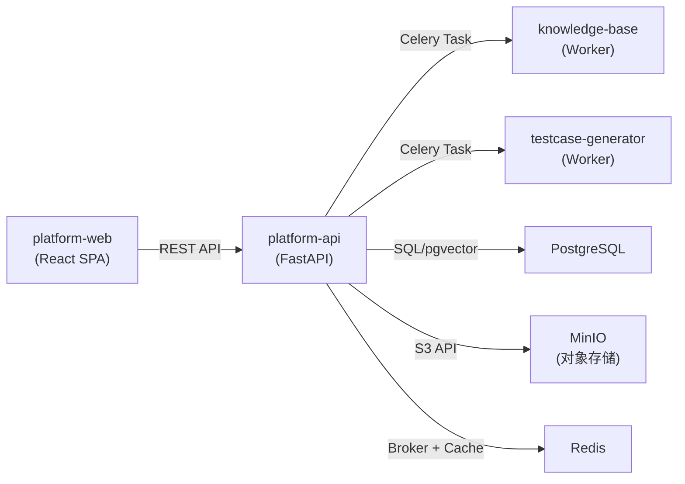
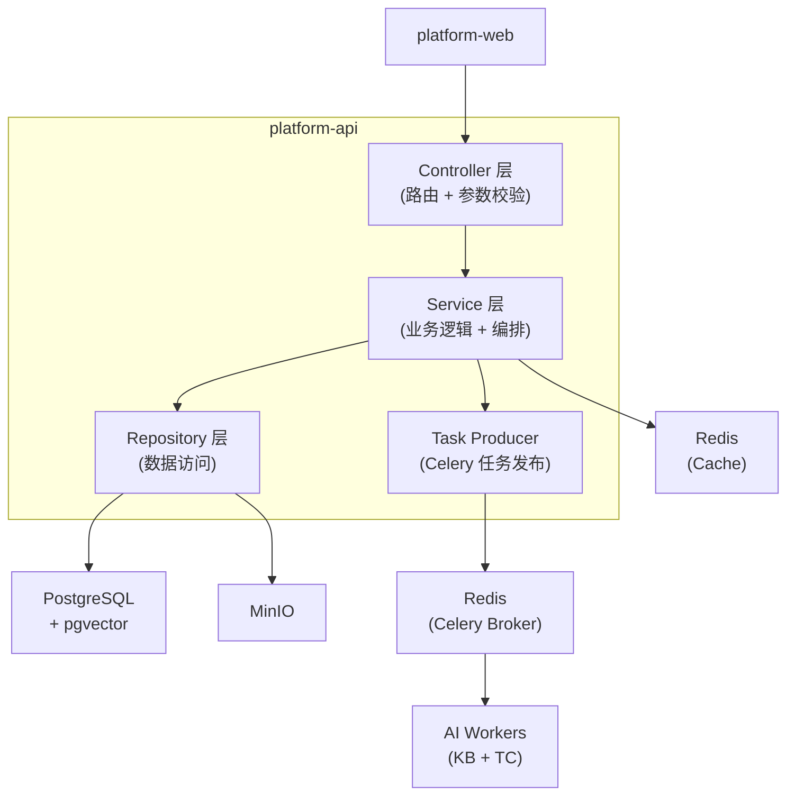
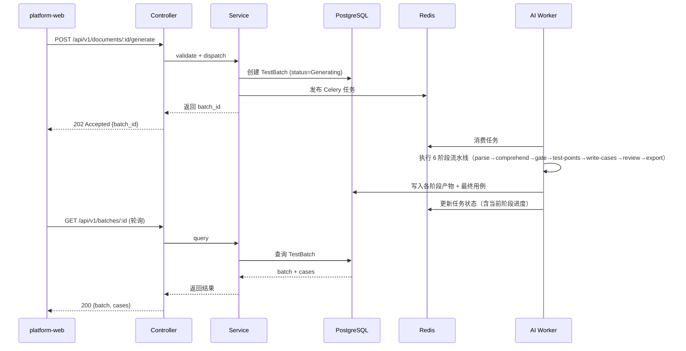

# platform-api Web 后端概要设计

## 0. 文档信息

| 属性 | 内容 |
| :--- | :--- |
| **所属变更** | CHG-20260605-001 |
| **模块名称** | platform-api |
| **模块类型** | web-backend |
| **创建时间** | 2026-06-05 |

### 修订记录

| 版本号 | 修改日期 | 修改内容摘要 | 修改人 |
| :--- | :--- | :--- | :--- |
| v1.0 | 2026-06-05 | 初稿创建 | echo_lacey |

---

## 1. 技术范围界定

### 1.1 起点与终点

| 维度 | 说明 |
| :--- | :--- |
| **起点** | 前端 SPA 发起的 REST API 请求；Celery Worker 回调的任务完成通知 |
| **终点** | HTTP JSON 响应返回给前端；Celery 任务消息发送到 Redis Broker；文件存储到 MinIO |
| **解决的问题** | 作为平台的数据与编排中枢，统一管理项目/系统/文档/用例数据，编排 AI 模块的异步任务，为前端提供完整 REST API |

### 1.2 技术边界

- **上游依赖**：platform-web 前端发送 HTTP 请求；AI Worker（knowledge-base、testcase-generator）通过 Celery 返回任务结果
- **下游依赖**：PostgreSQL（主数据 + 向量）、Redis（缓存 + Celery Broker）、MinIO（文件存储）、knowledge-base Worker、testcase-generator Worker
- **不涉及**：AI 推理逻辑（由 Worker 处理）、前端渲染（由 platform-web 处理）、用例自动化执行

---

## 2. 架构方向探索

| 方向 | 核心思路 | 适合场景 | 风险 |
| :--- | :--- | :--- | :--- |
| 单体分层 + 事件驱动 | FastAPI 单体服务作为 API 网关和任务生产者，AI 长耗时任务通过 Celery 异步化 | 团队规模小（4-5人），模块边界清晰但不需要独立部署 | 单体膨胀后需拆分 |
| 微服务拆分 | 每个模块独立服务，通过 API Gateway 路由 | 团队规模大，模块需独立扩缩容 | 运维复杂度高，团队小时过度设计 |

**选定方向**：单体分层 + 事件驱动
**选择理由**：团队规模小（4-5人），单体分层降低运维复杂度，同时通过 Celery 事件驱动模式将 AI 长耗时任务异步化，兼顾开发效率和性能需求。

---

## 3. 架构方案

### 3.1 整体架构

### 3.2 核心流程

---

## 4. 技术选型与约束

| 领域 | 选型 | 理由 |
| :--- | :--- | :--- |
| 运行时 | Python 3.11+ | 与 AI 模块统一技术栈，LangChain 生态支持 |
| 框架 | FastAPI | 异步原生支持、自动 OpenAPI 文档、类型安全（Pydantic） |
| 数据库 | PostgreSQL 15 + pgvector | 主数据存储 + 向量扩展，一套数据库满足全部需求 |
| 缓存 | Redis 7 | 同时作为 Celery Broker 和应用缓存，减少基础设施组件 |
| 消息队列 | Celery + Redis | AI 长耗时任务异步化，Redis 作为 Broker 简化架构 |
| 对象存储 | MinIO (S3 兼容) | 存储 md 文件和图片，S3 API 标准，便于后续迁移云存储 |
| ORM | SQLAlchemy 2.0 + Alembic | 成熟稳定的 Python ORM，Alembic 管理 migration |

### 宪章合规性

- [x] 符合 `constitution.md` 的技术栈约束（Python + PostgreSQL + Redis）
- [x] 符合安全性要求（MVP 阶段无认证鉴权，后续迭代补充）
- [x] 符合性能要求（P95 < 2s 通过异步架构实现）

---

## 5. 中间件链

> 按执行顺序排列，靠前的先执行。

| 顺序 | 中间件 | 职责 | 失败时 |
| :---: | :--- | :--- | :--- |
| 1 | 请求 ID 注入 | 为每个请求生成 UUID，写入 `X-Request-ID` 响应头和日志上下文 | — |
| 2 | 结构化日志 | 记录请求方法、路径、耗时、状态码，绑定 request_id | — |
| 3 | ~~认证~~ | MVP 不做 | — |
| 4 | ~~授权~~ | MVP 不做 | — |
| 5 | 限流 | 按用户 ID 限制请求速率（令牌桶算法），防止滥用 | 429 Too Many Requests |
| 6 | 错误处理 | 捕获未处理异常，统一 JSON 错误响应格式，记录堆栈 | 5xx Internal Server Error |

---

## 6. 认证与授权

### 6.1 认证方案

MVP 阶段无认证鉴权，所有接口无需登录即可访问。

### 6.2 授权模型

| 字段 | 内容 |
| :--- | :--- |
| 模型 | MVP 阶段不做权限控制，无角色区分。所有用户拥有全部操作权限。 |
| 角色定义 | — |
| 权限粒度 | — |
| 鉴权时机 | — |

---

## 7. 数据存储与外部依赖

### 7.1 主数据库

| 字段 | 内容 |
| :--- | :--- |
| 数据库 | PostgreSQL 15 + pgvector 扩展 |
| 连接池 | 最大连接数：20；超时：30000 ms |
| 读写分离 | 无（初期单实例，数据量可控） |
| 事务隔离级别 | Read Committed（默认，满足并发需求） |

### 7.2 缓存策略

| 字段 | 内容 |
| :--- | :--- |
| 缓存引擎 | Redis 7 |
| 缓存模式 | Cache-Aside（应用层显式管理） |
| TTL 策略 | 系统列表：5 分钟；文档元数据：10 分钟；任务状态：不缓存（实时查询） |
| 缓存击穿防护 | 互斥锁（Redis SETNX）防止热点 Key 失效时并发穿透 |

### 7.3 外部服务依赖

| 服务 | 用途 | 超时配置 | 降级策略 |
| :--- | :--- | :---: | :--- |
| MinIO | 文件上传和下载 | 30000 ms | 上传失败返回错误，已上传文件正常读取 |
| knowledge-base Worker | 知识检索 | 30000 ms（Celery 任务超时） | 返回空上下文，提示用户后续手动触发 |
| testcase-generator Worker | 用例生成 | 不设超时（质量优先） | 前端轮询持续获取阶段进度；仅 Worker 崩溃时标记失败 |

---

## 8. 安全设计

| 威胁 | 防御措施 |
| :--- | :--- |
| SQL 注入 | SQLAlchemy ORM 参数化查询；禁止拼接 SQL；Code Review 强制要求 |
| XSS | API 响应设置 Content-Type: application/json；不返回 HTML |
| CSRF | httpOnly Cookie + SameSite=Lax；变更操作验证 Origin/Referer 头 |
| 路径遍历 | 文件上传路径白名单校验（仅限 MinIO bucket）；拒绝含 `../` 的路径 |
| 密钥泄漏 | 密钥通过环境变量注入，不入代码库；.env 文件加入 .gitignore |
| 敏感数据 | 传输强制 HTTPS（TLS 1.2+）；日志脱敏（密码、Token 不记录）；PII 字段加密存储 |
| 文件上传滥用 | 限制单次上传 100MB；文件类型白名单（.md/.png/.jpg/.gif/.svg）；文件内容扫描 |

---

## 9. 观测与运维

### 9.1 质量目标

| 指标 | 目标值 | 测试条件 |
| :--- | :---: | :--- |
| P95 响应时间 | ≤ 200 ms | 同步 API（不含 AI 任务等待），50 并发用户 |
| 可用性 | ≥ 99.5% | 滚动 30 天 |
| 错误率（5xx） | ≤ 0.1% | 正常流量 |

### 9.2 日志与追踪

| 维度 | 方案 |
| :--- | :--- |
| 日志格式 | JSON 结构化日志，必含：`request_id`、`level`、`timestamp`、`path`、`method`、`status`、`duration_ms`、`user_id` |
| 日志聚合 | 标准输出 → Docker 日志驱动 → 日志平台（后续集成 ELK 或 Loki） |
| 分布式追踪 | 暂不引入（单体架构，request_id 串联即可满足需求） |
| 日志脱敏规则 | 密码、Token、Cookie 值写入前屏蔽；请求体中 PII 字段脱敏 |

### 9.3 健康检查端点

| 端点 | 用途 | 检查内容 |
| :--- | :--- | :--- |
| `GET /health` | 存活探针 | 进程在线，返回 200 |
| `GET /ready` | 就绪探针 | PostgreSQL 连接可用、Redis 连接可用、MinIO 连接可用 |

### 9.4 监控告警

| 指标 | 告警阈值 | 通知方式 |
| :--- | :--- | :--- |
| 响应时间 P99 | > 5000 ms | 飞书机器人通知 |
| 错误率（5xx） | > 1% 持续 5 分钟 | 飞书机器人通知 |
| DB 连接池利用率 | > 80% | 飞书机器人通知 |
| Redis 内存使用率 | > 70% | 飞书机器人通知 |
| Celery 任务队列深度 | > 100 | 飞书机器人通知 |

---

## 10. 失败模式与降级策略

| 失败场景 | 影响 | 降级策略 | 恢复方式 |
| :--- | :--- | :--- | :--- |
| PostgreSQL 不可用 | 全部数据操作失败 | 返回 503，前端展示"服务暂时不可用" | 自动重连；超过重试次数后告警 |
| Redis 不可用 | 缓存失效 + Celery 任务无法发布 | 缓存失效时直接读库（限流保护）；任务发布失败返回错误提示重试 | 自动重连 |
| MinIO 不可用 | 文件上传/下载失败 | 上传类接口返回错误；已存储文件的元数据查询正常（仅下载失败） | MinIO 恢复后自动正常 |
| AI Worker 无响应 | 生成/检索任务失败 | Worker 崩溃时标记失败，返回"AI 服务异常，请稍后重试"；不设超时（质量优先） | Worker 恢复后新任务正常处理 |
| 部署滚动更新 | 短暂连接中断 | 容器编排滚动更新，旧实例处理完当前请求后才停止 | 新实例就绪后自动接管 |

---

## 11. 待研究事项

无待研究事项。所有技术选型均为成熟方案。

---

## 12. 风险与对策

| 风险 | 概率 | 影响 | 对策 |
| :--- | :--- | :--- | :--- |
| AI 任务队列积压导致响应延迟 | 中 | 中 | 设置队列深度告警阈值；支持 Worker 水平扩容；前端展示阶段进度让用户感知进展 |
| 单体架构膨胀后维护困难 | 低 | 中 | 严格分层（Controller/Service/Repository）；模块化组织代码；预留拆分边界 |
| 文件存储容量增长过快 | 中 | 低 | MinIO 支持水平扩容；设置系统级存储配额告警 |

---

## 13. 概要设计确认

- [x] 技术范围已界定
- [x] 架构方向已探索并选定
- [x] 架构方案已确认
- [x] 技术选型符合宪章
- [x] 待研究事项已识别（无待研究事项）

确认后进入详细设计阶段（`/xf/detail`）
