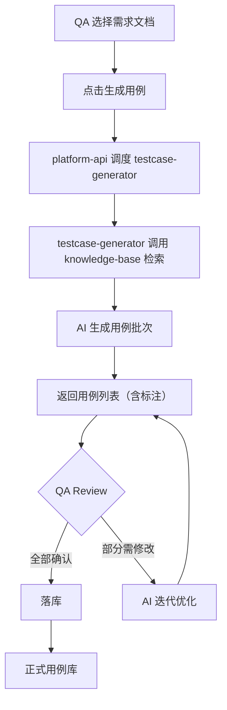
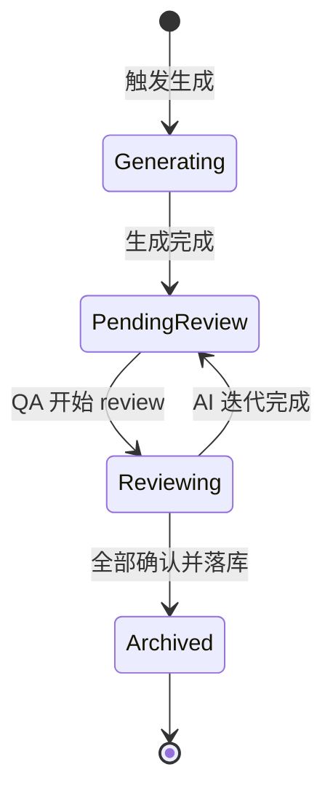

# platform-api Web 后端需求规范

## 0. 文档信息

| 属性 | 内容 |
| :--- | :--- |
| **所属变更** | CHG-20260605-001 |
| **模块名称** | platform-api |
| **模块类型** | web-backend |
| **创建时间** | 2026-06-05 |

### 修订记录

| 版本号 | 修改日期 | 修改内容摘要 | 修改人 |
| :--- | :--- | :--- | :--- |
| v1.0 | 2026-06-05 | 初稿创建 | echo_lacey |

---

## 1. 业务背景与系统目标

* **业务背景**：QA 智能平台需要统一的后端服务层，编排 AI 能力模块（knowledge-base、testcase-generator），管理项目/系统/文档数据，对接外部系统（GitLab、Playwright MCP），并为前端提供 REST API。
* **核心目标**：提供稳定、可扩展的后端 API 服务，作为平台的数据和编排中枢
* **关键衡量指标**：API 可用性 > 99.5%；核心接口响应时间 < 2 秒（P95）

---

## 2. 关键概念

- **项目（Project）**：平台中的顶层管理单元，一个 QA 团队对应一个项目
- **系统（System）**：项目下的业务系统划分，对应实际维护的 4-5 个业务系统
- **文档（Document）**：知识库中的单个文件单元，含元数据和内容
- **用例批次（TestBatch）**：一次 AI 生成的用例集合，含状态流转
- **导出任务（ExportTask）**：异步导出作业，按指定格式输出用例

---

## 3. 超出范围

- 不负责 AI 推理逻辑（由 knowledge-base 和 testcase-generator 模块处理）
- 不负责前端渲染和交互逻辑（由 platform-web 模块处理）
- 不负责测试左移和自动化执行（shift-left、automation 本期不做）
- 不负责需求/用例版本管理（后续迭代）

---

## 4. 角色与权限控制（RBAC）

| 角色名称 | 角色描述 | 菜单权限 | 操作权限 | 数据范围 |
| :--- | :--- | :--- | :--- | :--- |
| QA 工程师 | 日常使用者 | 知识库、用例生成、导出 | 上传/关联文档、触发生成、review、导出 | 所属系统 |
| QA 管理者 | 团队管理员 | 全部菜单 | 全部操作 + 系统配置 | 全项目 |

---

## 5. 业务流程与状态机

### 3.1 用例生成核心流程

### 3.2 用例批次状态机

| 当前状态 | 触发动作 | 目标状态 | 前置条件 |
| :--- | :--- | :--- | :--- |
| Generating | 生成完成 | PendingReview | AI 返回结果 |
| PendingReview | QA 开始 review | Reviewing | 用例列表非空 |
| Reviewing | 触发迭代 | PendingReview | 存在"需修改"用例 |
| Reviewing | 全部确认 + 落库 | Archived | 所有用例为"已确认" |

---

## 6. 详细功能需求

### 6.1 项目与系统管理

**A. 功能说明**

管理项目和系统的 CRUD 操作，系统间可配置关联关系（数据流动方向）。

**B. 数据实体与关系**

- Project 1:N System
- System M:N System（系统间关联关系，标注关联类型如"接口调用""数据共享"）

**C. 接口概要**

| 接口 | 方法 | 路径 | 说明 |
| :--- | :--- | :--- | :--- |
| 创建系统 | POST | /api/v1/systems | 在项目下创建新系统 |
| 系统列表 | GET | /api/v1/systems | 获取项目下所有系统 |
| 配置系统关联 | POST | /api/v1/systems/:id/associations | 建立系统间关联 |

**D. 业务规则与校验**

- 系统名称在项目内唯一
- 系统间关联关系必须标注类型

**E. 异常与边界**

* **并发处理**：同名系统并发创建时，后到请求返回"名称已存在"
* **幂等性**：重复创建同名系统返回已有记录
* **关联删除**：删除系统时提示关联影响，需二次确认

---

### 6.2 知识库文档管理

**A. 功能说明**

提供文档上传、存储、关联管理的 API，作为 knowledge-base 模块的持久化层。

**B. 数据实体与关系**

- System 1:N Document
- Document M:N Document（关联关系）
- Document 含：类型、内容路径、元数据、所属系统

**C. 接口概要**

| 接口 | 方法 | 路径 | 说明 |
| :--- | :--- | :--- | :--- |
| 文件夹上传 | POST | /api/v1/systems/:id/documents/batch | 批量上传 md+图片文件夹 |
| 文档列表 | GET | /api/v1/systems/:id/documents | 获取系统下文档列表 |
| 建立关联 | POST | /api/v1/documents/:id/associations | 文档间建立关联 |
| 删除文档 | DELETE | /api/v1/documents/:id | 删除单个文档 |

**D. 业务规则与校验**

- 上传仅接受 .md 文件和图片格式（.png/.jpg/.gif/.svg）
- 图片必须以相对路径方式被 .md 引用才存储
- 单次上传大小限制为 100MB

**E. 异常与边界**

* **并发处理**：并发上传到同一系统时独立处理，不互相阻塞
* **大文件**：超出限制返回 413 状态码和具体限制值
* **存储失败**：单文件存储失败时记录失败原因，继续处理其余文件

---

### 6.3 AI 调度编排

**A. 功能说明**

编排 testcase-generator 的用例生成流程，管理生成任务的生命周期。

**B. 数据实体与关系**

- Document 1:N TestBatch（一个需求文档可多次生成）
- TestBatch 1:N TestCase

**C. 接口概要**

| 接口 | 方法 | 路径 | 说明 |
| :--- | :--- | :--- | :--- |
| 触发生成 | POST | /api/v1/documents/:id/generate | 对需求文档触发用例生成 |
| 获取用例批次 | GET | /api/v1/batches/:id | 获取生成结果 |
| review 操作 | PATCH | /api/v1/testcases/:id/review | 对单条用例执行 review |
| 触发迭代 | POST | /api/v1/batches/:id/iterate | 基于 review 反馈迭代优化 |
| 落库 | POST | /api/v1/batches/:id/archive | 将确认的用例落入正式库 |

**D. 业务规则与校验**

- 触发生成前文档状态必须为"已导入"
- 落库前所有用例必须为"已确认"状态
- 迭代优化仅重新生成"需修改"状态的用例

**E. 异常与边界**

* **并发处理**：同一文档不可同时发起两个生成任务
* **超时降级**：AI 生成不设时间上限（质量优先），前端通过轮询持续获取进度状态
* **幂等性**：重复触发落库操作返回已落库结果

---

### 6.4 导出功能

**A. 功能说明**

支持将已落库的用例按用户指定的格式规范导出。

**B. 数据实体与关系**

- ExportTask：关联 TestBatch 或系统级用例库

**C. 接口概要**

| 接口 | 方法 | 路径 | 说明 |
| :--- | :--- | :--- | :--- |
| 触发导出 | POST | /api/v1/exports | 创建导出任务 |
| 获取导出结果 | GET | /api/v1/exports/:id | 下载导出文件 |

**D. 业务规则与校验**

- 仅已落库的用例可导出
- 导出格式由系统配置决定（格式规范由用户后续提供）

**E. 异常与边界**

* **大数据量**：用例数量超过 1000 条时异步处理，返回任务 ID
* **格式错误**：未配置导出格式时提示"请先配置导出格式规范"

---

## 7. 数据流与外部接口

* **文件上传**：接收前端上传的文件夹压缩包，解压后按结构存储
* **Playwright MCP 对接**：调度 Playwright MCP 探索可交互原型（代理转发给 testcase-generator）
* **知识检索**：platform-api 透传请求给 knowledge-base 的检索接口

---

## 8. 非功能需求

* **安全性**：用户上传内容做病毒扫描；API 鉴权使用 Token 认证
* **并发与性能**：支持 50 并发用户同时操作；核心 API P95 < 2s
* **可观测性**：全链路请求追踪；AI 生成任务状态可实时查询

---

## 9. 验收标准

| 编号 | 关联 | Given（前置状态） | When（触发动作） | Then（预期结果） | 优先级 |
| :--- | :--- | :--- | :--- | :--- | :--- |
| AC-01 | 6.1 | 项目已创建 | 创建名为"漫剧系统"的系统 | 返回 201，系统列表中可见 | P0 |
| AC-02 | 6.2 | 系统已创建 | 上传含 5 个 .md 和 3 张图片的文件夹 | 返回 200，所有文件正确存储 | P0 |
| AC-03 | 6.2 | 文档已上传 | 建立需求文档与技术文档的关联 | 返回 200，关联关系可查询 | P0 |
| AC-04 | 6.3 | 需求文档已上传且有关联 | 触发用例生成 | 返回 202（异步），最终获取到用例列表 | P0 |
| AC-05 | 6.3 | 用例已生成 | 对某条用例执行"需修改" review | 用例状态变更为"需修改" | P0 |
| AC-06 | 6.3 | 存在"需修改"用例 | 触发迭代优化 | 仅"需修改"用例被重新生成 | P0 |
| AC-07 | 6.3 | 所有用例已确认 | 点击落库 | 用例进入正式库，批次状态为 Archived | P0 |
| AC-08 | 6.4 | 用例已落库 | 触发导出 | 获取到指定格式的导出文件 | P1 |
| AC-09 | 6.2 | 上传文件含 .docx | 执行上传 | .docx 被跳过，.md 正常导入，返回跳过文件列表 | P1 |

---

## 10. 假设与依赖（适用时填）

- 依赖 knowledge-base 模块提供检索服务
- 依赖 testcase-generator 模块提供生成服务
- 假设前端通过 REST API 通信，无需 WebSocket（生成任务用轮询获取状态）
- 待确认：导出格式规范由用户后续提供
