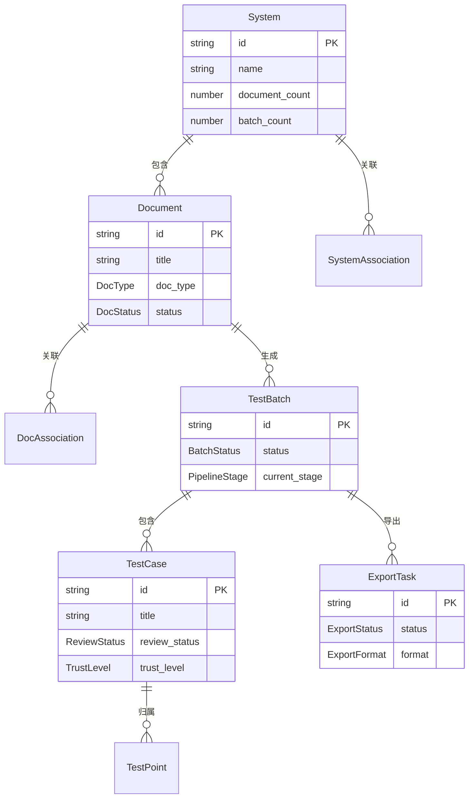

# platform-web Web 前端数据模型

## 1. 文档概述

本文档描述 platform-web 模块的前端数据结构设计，包括核心实体的 TypeScript 类型定义、API 响应类型、Store 状态类型、组件 Props 类型和枚举定义。

---

## 2. 枚举定义

```typescript
/** 用例批次状态 */
enum BatchStatus {
  Pending = "pending",
  Running = "running",
  Suspended = "suspended",
  Completed = "completed",
  PendingReview = "pending_review",
  Reviewing = "reviewing",
  Archived = "archived",
  Failed = "failed",
}

/** 用例 review 状态 */
enum ReviewStatus {
  Pending = "pending",
  Confirmed = "confirmed",
  NeedsModification = "needs_modification",
  Deleted = "deleted",
}

/** 文档类型 */
enum DocType {
  PRD = "prd",
  TechDoc = "tech_doc",
  TestRule = "test_rule",
  TestCase = "test_case",
  BugRecord = "bug_record",
  Prototype = "prototype",
  Other = "other",
}

/** 文档状态 */
enum DocStatus {
  Uploading = "uploading",
  Uploaded = "uploaded",
  Importing = "importing",
  Imported = "imported",
  ImportFailed = "import_failed",
}

/** 信任等级（对应 testcase-generator 的信源信任顺序） */
enum TrustLevel {
  PRD = 1,          // 最高：需求文档
  TechDoc = 2,     // 技术设计文档
  UserInput = 3,   // 用户口述/补充说明
  UIDesign = 4,    // UI 设计稿
  Prototype = 5,   // 可交互原型（最低）
}

/** Gate 判定结果 */
enum GateResult {
  GO = "GO",
  Conditional = "CONDITIONAL",
  NoGo = "NO_GO",
}

/** 流水线阶段名称 */
enum PipelineStage {
  Parse = "parse",
  Comprehend = "comprehend",
  Gate = "gate",
  TestPoints = "test-points",
  WriteCases = "write-cases",
  ReviewCases = "review-cases",
  Export = "export",
}

/** 阶段执行状态 */
enum StageStatus {
  Pending = "pending",
  Running = "running",
  Completed = "completed",
  Failed = "failed",
}

/** 系统间关联类型 */
enum SystemRelationType {
  APICall = "api_call",
  DataShare = "data_share",
  Event = "event",
}

/** 文档间关联类型 */
enum DocRelationType {
  ReqToTech = "req_to_tech",
  ReqToCase = "req_to_case",
  ReqToBug = "req_to_bug",
  ReqToProto = "req_to_proto",
  TechToCase = "tech_to_case",
  CaseToBug = "case_to_bug",
  General = "general",
}

/** 导出范围 */
enum ExportScope {
  Batch = "batch",
  System = "system",
}

/** 导出格式 */
enum ExportFormat {
  Markdown = "markdown",
  Excel = "excel",
}

/** 导出任务状态 */
enum ExportStatus {
  Processing = "processing",
  Completed = "completed",
  Failed = "failed",
}

/** 优先级 */
enum Priority {
  P0 = "P0",
  P1 = "P1",
  P2 = "P2",
  P3 = "P3",
}

/** review 操作类型 */
enum ReviewAction {
  Confirmed = "confirmed",
  NeedsModification = "needs_modification",
  Deleted = "deleted",
}
```

---

## 3. 核心实体类型

### 3.1 System

业务系统实体（顶层实体）

```typescript
interface System {
  id: string;
  name: string;
  description: string | null;
  document_count: number;
  batch_count: number;
  created_at: string;
  updated_at: string;
}

interface SystemDetail extends System {
  associations: SystemAssociation[];
}

interface SystemAssociation {
  id: string;
  target_system: { id: string; name: string };
  relation_type: SystemRelationType;
  description: string | null;
  created_at: string;
}
```

---

### 3.2 Document

知识库文档实体

```typescript
interface Document {
  id: string;
  title: string;
  doc_type: DocType;
  folder_path: string | null;
  status: DocStatus;
  association_count: number;
  created_at: string;
  updated_at: string;
}

interface DocumentDetail extends Document {
  storage_path: string;
  content_url: string;
  metadata: Record<string, unknown> | null;
  associations: DocAssociation[];
  prototype_links: PrototypeLink[];
}

interface DocAssociation {
  id: string;
  target_document: { id: string; title: string; doc_type: DocType };
  relation_type: DocRelationType;
  direction: "outgoing" | "incoming";
}

interface PrototypeLink {
  id: string;
  url: string;
  note: string | null;
}
```

---

### 3.3 TestBatch

用例批次实体

```typescript
interface TestBatch {
  id: string;
  document_id: string;
  document_title: string;
  status: BatchStatus;
  current_stage: PipelineStage | null;
  stage_progress: StageProgress;
  total_cases: number | null;
  started_at: string | null;
  completed_at: string | null;
  created_at: string;
}

interface StageProgress {
  current_stage: PipelineStage;
  stage_progress: number;        // 当前阶段进度 0-100
  total_stages: number;          // 固定 6
  completed_stages: number;      // 已完成阶段数
  stages: StageInfo[];
}

interface StageInfo {
  name: PipelineStage;
  status: StageStatus;
  progress?: number;             // 仅 running 时有
  duration_ms?: number;          // 仅 completed 时有
  gate_result?: GateResult;      // 仅 gate 阶段有
}

interface BatchDetail {
  batch: TestBatch;
  cases: PaginatedData<TestCase>;
  open_questions: OpenQuestion[] | null;
}
```

---

### 3.4 TestCase

测试用例实体

```typescript
interface TestCase {
  id: string;
  batch_id: string;
  test_point_id: string | null;
  title: string;
  preconditions: string[];
  steps: TestStep[];
  expected_results: string[];
  priority: Priority;
  dimensions: string[];
  provenance: Provenance;
  trust_level: TrustLevel;
  confidence_note: string | null;
  review_status: ReviewStatus;
  review_comment: string | null;
  iteration: number;
  created_at: string;
  updated_at: string;
}

interface TestStep {
  step_number: number;
  action: string;
  input_data: string;
  expected_result: string;
}

interface Provenance {
  derived_from: string[];
  source_section: string;
  verbatim_excerpt: string;
  trust_level: number;
}
```

---

### 3.5 TestPoint

测试点实体

```typescript
interface TestPoint {
  id: string;
  batch_id: string;
  feature_id: string;
  dimension: string;
  description: string;
  priority: Priority;
  derived_from: string[];
}
```

---

### 3.6 ExportTask

导出任务实体

```typescript
interface ExportTask {
  id: string;
  export_scope: ExportScope;
  format: ExportFormat;
  status: ExportStatus;
  file_url: string | null;
  total_cases: number | null;
  error_message: string | null;
  created_at: string;
  completed_at: string | null;
}
```

---

### 3.7 OpenQuestion

Gate NO_GO 澄清问题

```typescript
interface OpenQuestion {
  id: string;
  question: string;
  context: string;
  priority: "high" | "medium" | "low";
}

interface ClarifyAnswer {
  question_id: string;
  answer: string;
}
```

---

## 4. API 响应类型

### 4.1 通用响应

```typescript
/** 统一成功响应 */
interface ApiResponse<T> {
  code: number;
  message: string;
  data: T;
}

/** 统一错误响应 */
interface ApiError {
  error_code: string;
  message: string;
  request_id: string;
}

/** 分页数据 */
interface PaginatedData<T> {
  items: T[];
  total: number;
  page: number;
  per_page: number;
  total_pages: number;
}

/** 分页请求参数 */
interface PaginationParams {
  page?: number;
  per_page?: number;
  sort_by?: string;
  sort_order?: "asc" | "desc";
}
```

### 4.2 文档上传响应

```typescript
interface UploadResult {
  uploaded: UploadedFile[];
  skipped: SkippedFile[];
  failed: FailedFile[];
  summary: UploadSummary;
}

interface UploadedFile {
  id: string;
  title: string;
  doc_type: DocType;
  folder_path: string | null;
  status: DocStatus;
}

interface SkippedFile {
  filename: string;
  reason: string;
}

interface FailedFile {
  filename: string;
  error: string;
}

interface UploadSummary {
  total_files: number;
  uploaded_count: number;
  skipped_count: number;
  failed_count: number;
}
```

### 4.3 批次生成响应

```typescript
interface GenerateResponse {
  batch_id: string;
  status: BatchStatus;
  current_stage: PipelineStage;
  created_at: string;
}

interface ClarifyResponse {
  batch_id: string;
  status: BatchStatus;
  message: string;
}

interface IterateResponse {
  batch_id: string;
  status: BatchStatus;
  iteration: number;
  cases_to_regenerate: number;
}

interface ArchiveResponse {
  batch_id: string;
  status: BatchStatus;
  archived_count: number;
  archived_at: string;
}
```

### 4.4 review 响应

```typescript
interface ReviewResponse {
  id: string;
  title: string;
  review_status: ReviewStatus;
  review_comment: string | null;
  updated_at: string;
}
```

### 4.5 导出响应

```typescript
interface CreateExportResponse {
  id: string;
  export_scope: ExportScope;
  format: ExportFormat;
  status: ExportStatus;
  created_at: string;
}
```

### 4.6 系统关联响应

```typescript
interface SystemAssociationsResponse {
  outgoing: SystemAssociationItem[];
  incoming: SystemAssociationItem[];
}

interface SystemAssociationItem {
  id: string;
  target_system?: { id: string; name: string };
  source_system?: { id: string; name: string };
  relation_type: SystemRelationType;
  description: string | null;
}
```

### 4.7 文档关联响应

```typescript
interface DocAssociationsResponse {
  direct: DirectAssociation[];
  indirect: IndirectAssociation[];
}

interface DirectAssociation {
  id: string;
  document: { id: string; title: string; doc_type: DocType };
  relation_type: DocRelationType;
  direction: "outgoing" | "incoming";
}

interface IndirectAssociation {
  document: { id: string; title: string; doc_type: DocType };
  path: string[];
  depth: number;
}
```

---

## 5. 请求类型

```typescript
/** 创建系统请求 */
interface CreateSystemRequest {
  name: string;
  description?: string;
}

/** 更新系统请求 */
interface UpdateSystemRequest {
  name: string;
  description?: string;
}

/** 创建系统关联请求 */
interface CreateSystemAssociationRequest {
  target_system_id: string;
  relation_type: SystemRelationType;
  description?: string;
}

/** 创建文档关联请求 */
interface CreateDocAssociationRequest {
  target_document_id: string;
  relation_type: DocRelationType;
}

/** 文档列表筛选参数 */
interface DocumentFilterParams extends PaginationParams {
  doc_type?: DocType;
  status?: DocStatus;
}

/** 用例 review 请求 */
interface ReviewTestcaseRequest {
  action: ReviewAction;
  comment?: string;
}

/** 澄清提交请求 */
interface ClarifyRequest {
  answers: ClarifyAnswer[];
}

/** 创建导出请求 */
interface CreateExportRequest {
  scope: ExportScope;
  batch_id?: string;
  system_id?: string;
  format: ExportFormat;
}

/** 批次用例列表筛选参数 */
interface BatchCaseFilterParams extends PaginationParams {
  review_status?: ReviewStatus;
}
```

---

## 6. Store 状态类型

### 6.1 KnowledgeStore

```typescript
interface KnowledgeState {
  // 系统
  systems: System[];
  systemsTotal: number;
  currentSystem: SystemDetail | null;
  systemsLoading: boolean;

  // 文档
  documents: Document[];
  documentsTotal: number;
  currentDocument: DocumentDetail | null;
  documentsLoading: boolean;
  documentTree: TreeNode[];

  // 上传
  uploadProgress: number;
  uploadResult: UploadResult | null;
  isUploading: boolean;
}

interface KnowledgeActions {
  fetchSystems: (params?: PaginationParams) => Promise<void>;
  createSystem: (data: CreateSystemRequest) => Promise<System>;
  updateSystem: (id: string, data: UpdateSystemRequest) => Promise<void>;
  deleteSystem: (id: string) => Promise<void>;
  fetchSystemDetail: (id: string) => Promise<void>;
  createSystemAssociation: (systemId: string, data: CreateSystemAssociationRequest) => Promise<void>;
  deleteSystemAssociation: (systemId: string, assocId: string) => Promise<void>;

  fetchDocuments: (systemId: string, params?: DocumentFilterParams) => Promise<void>;
  fetchDocumentDetail: (docId: string) => Promise<void>;
  uploadDocuments: (systemId: string, file: File) => Promise<void>;
  deleteDocument: (docId: string) => Promise<void>;
  createDocAssociation: (docId: string, data: CreateDocAssociationRequest) => Promise<void>;
  fetchDocAssociations: (docId: string, depth?: number) => Promise<void>;

  buildDocumentTree: (documents: Document[]) => TreeNode[];
  clearUploadResult: () => void;
  reset: () => void;
}

type KnowledgeStore = KnowledgeState & KnowledgeActions;
```

### 6.2 TestcaseStore

```typescript
interface TestcaseState {
  // 批次
  currentBatch: BatchDetail | null;
  batchLoading: boolean;

  // 用例
  testcases: TestCase[];
  testcasesTotal: number;
  testcasesPage: number;

  // 轮询
  isPolling: boolean;
  pollIntervalId: number | null;

  // 导出
  exports: ExportTask[];
  exportsTotal: number;
  exportsLoading: boolean;
}

interface TestcaseActions {
  generateBatch: (docId: string) => Promise<string>;
  fetchBatch: (batchId: string, params?: BatchCaseFilterParams) => Promise<void>;
  submitClarification: (batchId: string, answers: ClarifyAnswer[]) => Promise<void>;

  reviewCase: (caseId: string, data: ReviewTestcaseRequest) => Promise<void>;
  iterateBatch: (batchId: string) => Promise<void>;
  archiveBatch: (batchId: string) => Promise<void>;

  startPolling: (batchId: string) => void;
  stopPolling: () => void;

  createExport: (data: CreateExportRequest) => Promise<void>;
  fetchExports: (params?: PaginationParams) => Promise<void>;
  fetchExportDetail: (exportId: string) => Promise<ExportTask>;

  reset: () => void;
}

type TestcaseStore = TestcaseState & TestcaseActions;
```

---

## 7. 组件 Props 类型

### 7.1 通用组件

```typescript
/** 可信度标签 */
interface ConfidenceTagProps {
  trustLevel: TrustLevel;
}

/** 原文出处链接 */
interface ProvenanceLinkProps {
  provenance: Provenance;
  documentId: string;
}

/** 空状态 */
interface EmptyStateProps {
  title: string;
  description?: string;
  action?: {
    text: string;
    onClick: () => void;
  };
}

/** 加载状态 */
interface LoadingStateProps {
  tip?: string;
}
```

### 7.2 业务组件

```typescript
/** 系统卡片 */
interface SystemCardProps {
  system: System;
  onClick: (system: System) => void;
}

/** 文档树 */
interface DocumentTreeProps {
  tree: TreeNode[];
  selectedKey: string | null;
  onSelect: (docId: string) => void;
}

interface TreeNode {
  key: string;
  title: string;
  type: "folder" | "file";
  docType?: DocType;
  children?: TreeNode[];
}

/** 文件上传器 */
interface FileUploaderProps {
  systemId: string;
  onUploadComplete: (result: UploadResult) => void;
}

/** 批次进度条 */
interface BatchProgressProps {
  stageProgress: StageProgress;
  status: BatchStatus;
}

/** 用例卡片 */
interface TestcaseCardProps {
  testcase: TestCase;
  onReview: (caseId: string, action: ReviewAction, comment?: string) => void;
  showDiff?: boolean;
}

/** review 操作按钮组 */
interface ReviewActionsProps {
  currentStatus: ReviewStatus;
  onConfirm: () => void;
  onNeedsModification: (comment: string) => void;
  onDelete: () => void;
}

/** 澄清问题弹窗 */
interface ClarifyModalProps {
  visible: boolean;
  questions: OpenQuestion[];
  onSubmit: (answers: ClarifyAnswer[]) => void;
  onClose: () => void;
}

/** 迭代对比 */
interface IterationDiffProps {
  previousVersion: TestCase;
  currentVersion: TestCase;
}

/** 落库确认弹窗 */
interface ArchiveConfirmProps {
  visible: boolean;
  stats: {
    total: number;
    confirmed: number;
    needsModification: number;
    deleted: number;
  };
  onConfirm: () => void;
  onCancel: () => void;
}

/** 导出表单 */
interface ExportFormProps {
  batchId?: string;
  systemId?: string;
  onSubmit: (data: CreateExportRequest) => void;
}
```

---

## 8. 数据关系图



---

## 9. 验证规则

### 9.1 表单验证

| 表单 | 字段 | 规则 |
| :--- | :--- | :--- |
| 登录 | username | 必填，1-50 字符 |
| 登录 | password | 必填，6-100 字符 |
| 创建系统 | name | 必填，1-100 字符 |
| review（需修改） | comment | 必填，1-1000 字符 |
| 澄清回答 | answer | 必填，每条 1-2000 字符 |
| 创建导出 | scope | 必填，batch 或 system |
| 创建导出 | format | 必填，markdown 或 excel |
| 创建导出(batch) | batch_id | scope=batch 时必填 |
| 创建导出(system) | system_id | scope=system 时必填 |

---

## 4. 请求/响应类型

API 请求/响应类型定义详见 contracts.md。data-model 定义前端内部实体类型，contracts 定义 API 通信层类型，两者通过 API 层转换函数对接。

## 5. 本地状态类型

Zustand Store 状态类型详见本文档各 Store 定义：
- knowledgeStore：系统列表、文档树、当前系统/文档
- testcaseStore：当前批次、用例列表、review 进度、轮询状态、Gate 澄清问题
