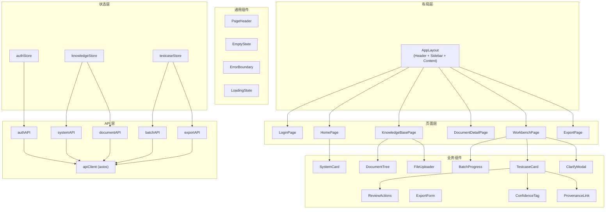
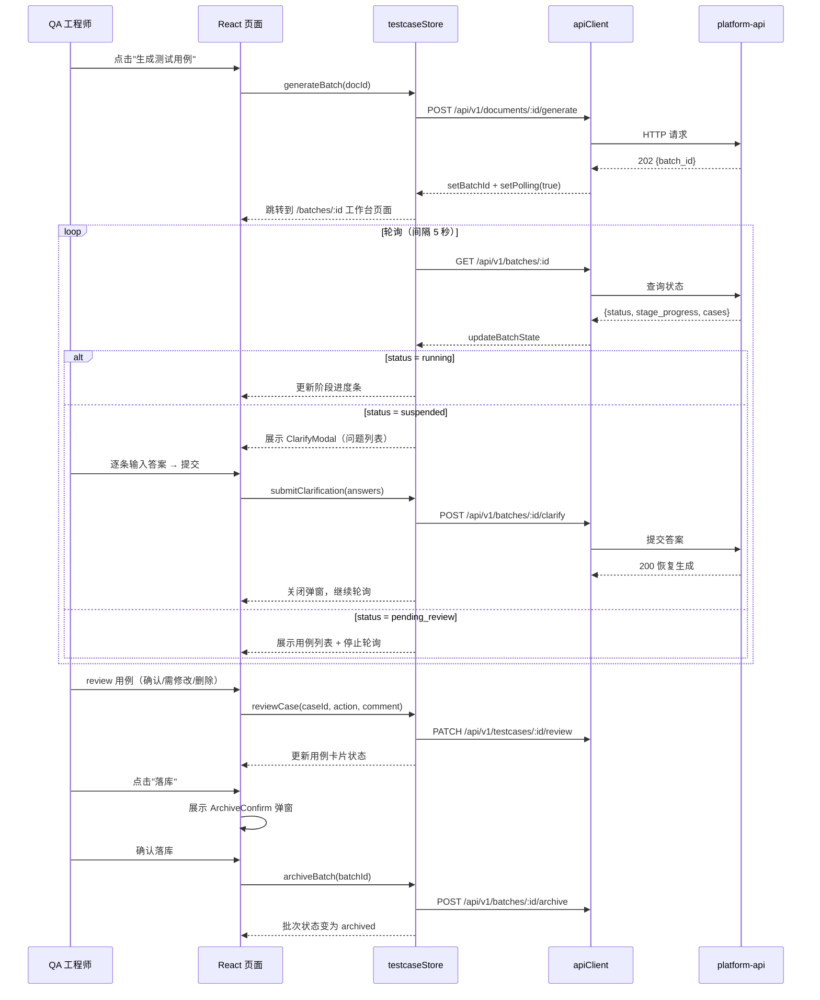
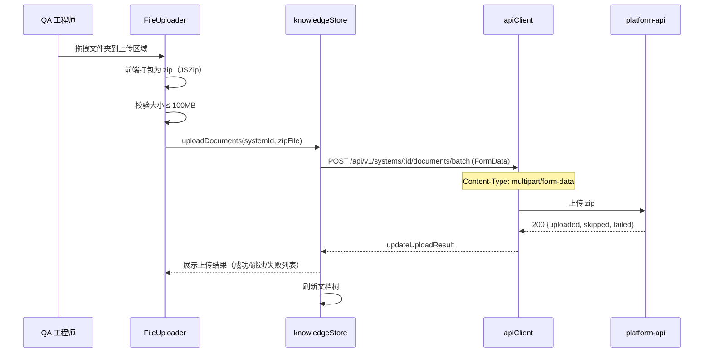
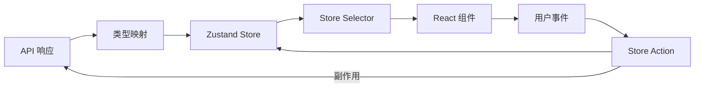
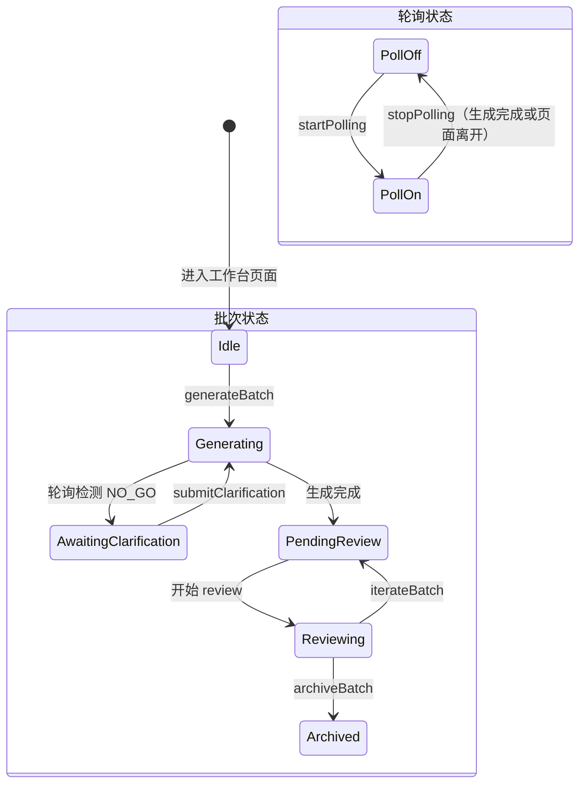

# platform-web Web 前端技术设计

## 0. 文档信息

| 属性 | 内容 |
| :--- | :--- |
| **所属变更** | CHG-20260605-001 |
| **模块名称** | platform-web |
| **模块类型** | web-frontend |
| **创建时间** | 2026-06-05 |

---

## 1. 背景与目标

* **技术背景**：QA 智能平台前端需要为 QA 工程师提供直观的 Web 界面，覆盖"上传文档 → 生成用例 → review → 落库 → 导出"的完整工作流。采用 React + TypeScript + Zustand + Ant Design + Vite 技术栈。
* **技术目标**：实现交互流畅、状态管理清晰的 SPA 应用，支持 AI 生成任务的实时进度展示和 Gate NO_GO 交互

---

## 2. 模块职责边界

**负责：**
- 所有页面的 UI 渲染和交互逻辑
- 前端状态管理（Zustand Store）
- API 请求封装和错误处理
- 文件上传交互（拖拽上传、进度展示）
- 用例生成进度轮询和展示
- 用例 review 工作台交互

**不负责（显式排除）：**
- 后端 API 逻辑和数据库操作（→ platform-api）
- AI 推理逻辑（→ testcase-generator / knowledge-base）
- 移动端适配（仅桌面端，最小 1280px）
- 实时协作编辑

**调用关系：**

| 方向 | 模块 | 方式 |
| :--- | :--- | :--- |
| 调用 | platform-api | REST API（axios） |
| 被调用 | 用户浏览器 | 用户交互事件 |

---

## 3. 技术选型

| 技术领域 | 选择方案 | 备选方案 | 选择理由 |
| :--- | :--- | :--- | :--- |
| 框架 | React 18 + TypeScript | Vue 3 | 组件生态丰富、团队经验匹配、类型安全 |
| 状态管理 | Zustand | Redux Toolkit / Jotai | 轻量无 boilerplate、API 直观、适合项目规模 |
| UI 组件库 | Ant Design 5 | Material UI | 企业级组件、中文文档、开箱即用 |
| 样式方案 | Ant Design CSS-in-JS + 少量自定义 CSS | Tailwind CSS | 避免 Tailwind 与 Ant Design 的样式冲突 |
| 构建工具 | Vite | webpack | HMR 快、配置简洁、生产构建性能好 |
| HTTP 客户端 | axios | fetch | 拦截器机制成熟、Cookie 自动携带 |
| 路由 | React Router v6 | TanStack Router | 官方方案、文档丰富、嵌套路由好 |
| Markdown 渲染 | react-markdown + rehype-highlight | marked | 安全（默认 sanitize）、插件扩展好 |

---

## 4. 界面设计

### 4.1 整体布局结构

```
┌─────────────────────────────────────────────────────────┐
│  顶部导航栏（Logo + 项目名 + 用户头像/登出）              │
├────────────┬────────────────────────────────────────────┤
│            │                                             │
│  侧边导航   │         主内容区                            │
│            │                                             │
│  · 系统列表 │   ┌─────────────────────────────────┐     │
│  · 知识库   │   │  面包屑导航                       │     │
│  · 用例生成 │   ├─────────────────────────────────┤     │
│  · 导出中心 │   │                                  │     │
│            │   │  页面内容                         │     │
│            │   │                                  │     │
│            │   └─────────────────────────────────┘     │
│            │                                             │
└────────────┴────────────────────────────────────────────┘
```

**布局说明**：
- 左侧固定侧边栏导航，宽度 220px，可折叠到 64px
- 顶部导航栏固定，高度 56px
- 主内容区自适应宽度，内含面包屑和页面组件
- 仅桌面端，最小支持 1280px 宽度

### 4.2 核心页面与功能区

#### 页面：登录页

```
┌─────────────────────────────────────┐
│           QA 智能平台                │
│                                      │
│      ┌──────────────────────┐       │
│      │  用户名              │       │
│      │  [________________]  │       │
│      │  密码                │       │
│      │  [________________]  │       │
│      │  [    登  录    ]    │       │
│      └──────────────────────┘       │
│                                      │
└─────────────────────────────────────┘
```

#### 页面：项目首页（系统列表）

```
┌─────────────────────────────────────┐
│  我的系统                [+ 新建系统] │
├─────────────────────────────────────┤
│  ┌─────────┐ ┌─────────┐ ┌────────┐│
│  │ 漫剧系统 │ │ 支付系统 │ │ 订单... ││
│  │ 12 文档  │ │ 8 文档   │ │ 5 文档 ││
│  │ 3 批次   │ │ 2 批次   │ │ 1 批次 ││
│  └─────────┘ └─────────┘ └────────┘│
│                                      │
└─────────────────────────────────────┘
```

#### 页面：系统知识库

```
┌─────────────────────────────────────────────┐
│  漫剧系统 / 知识库          [拖拽上传区域]    │
├──────────────┬──────────────────────────────┤
│  文档树       │  文档列表                     │
│  📁 需求     │  ┌──────────────────────┐    │
│    📄 首页PRD │  │ 首页PRD   prd  imported│   │
│    📄 详情PRD │  │ 关联: 3   2026-06-05  │    │
│  📁 技术     │  └──────────────────────┘    │
│    📄 接口文档│  ┌──────────────────────┐    │
│  📁 测试规则 │  │ 首页技术方案 tech  ...│     │
│              │  └──────────────────────┘    │
└──────────────┴──────────────────────────────┘
```

#### 页面：用例工作台

```
┌─────────────────────────────────────────────────┐
│  批次: 首页PRD #3     状态: 生成中                │
├─────────────────────────────────────────────────┤
│  阶段进度:                                       │
│  [✓解析] [✓理解] [✓Gate] [✓测试点] [●用例75%] [○审计] [○导出] │
├─────────────────────────────────────────────────┤
│  用例列表 (42条)        筛选: [全部▼]  [迭代▼]    │
│  ┌─────────────────────────────────────────┐    │
│  │ TC-001 漫剧首页-推荐列表正常加载         │    │
│  │ 🟢高可信 | 来源: PRD §2.3 | P0           │    │
│  │ [确认] [需修改] [删除]                    │    │
│  └─────────────────────────────────────────┘    │
│  ┌─────────────────────────────────────────┐    │
│  │ TC-002 漫剧首页-推荐列表空状态           │    │
│  │ 🟡中可信 | 来源: PRD §2.3 | P1           │    │
│  │ [确认] [需修改] [删除]                    │    │
│  └─────────────────────────────────────────┘    │
├─────────────────────────────────────────────────┤
│  [全部确认] [触发迭代] [落库]                     │
└─────────────────────────────────────────────────┘
```

### 4.3 关键交互设计

| 交互场景 | 触发方式 | 反馈/效果 | 说明 |
| :--- | :--- | :--- | :--- |
| 文件夹上传 | 拖拽到上传区域或点击上传按钮 | 进度条展示 → 完成后刷新文档树 | 支持 zip 文件 |
| 触发用例生成 | 文档详情页点击"生成测试用例" | 跳转到工作台 → 展示阶段进度条 | 异步任务，轮询进度 |
| Gate NO_GO | 自动展示（轮询检测到状态） | 弹出问题列表卡片，用户逐条回答 | 回答完提交后恢复生成 |
| review 操作 | 点击用例卡片的操作按钮 | 状态即时更新，"需修改"弹出意见框 | PATCH 请求 |
| 触发迭代 | 点击"触发迭代"按钮 | 确认弹窗 → 进入生成中状态 | 仅重新生成 needs_modification 的 |
| 落库 | 点击"落库"按钮 | 统计弹窗(总数/确认数) → 二次确认 | 所有用例必须 confirmed |
| 导出 | 点击"导出"→ 选范围和格式 | 创建任务 → 完成后展示下载链接 | 异步导出 |
| 原文跳转 | 点击用例的"来源"链接 | 新标签打开文档详情 → 高亮对应段落 | 锚点定位 |

### 4.4 响应式与适配

仅桌面端，最小支持 1280px 宽度。不做移动端适配。

---

## 5. 架构概述

### 5.1 组件结构



### 5.2 目录结构

```
platform-web/
├── src/
│   ├── main.tsx              # 应用入口
│   ├── App.tsx               # 根组件（路由配置）
│   ├── pages/
│   │   ├── Login/
│   │   │   └── index.tsx
│   │   ├── Home/
│   │   │   └── index.tsx
│   │   ├── KnowledgeBase/
│   │   │   ├── index.tsx
│   │   │   └── components/
│   │   │       ├── DocumentTree.tsx
│   │   │       └── FileUploader.tsx
│   │   ├── DocumentDetail/
│   │   │   ├── index.tsx
│   │   │   └── components/
│   │   │       ├── AssociationPanel.tsx
│   │   │       └── MarkdownPreview.tsx
│   │   ├── Workbench/
│   │   │   ├── index.tsx
│   │   │   └── components/
│   │   │       ├── BatchProgress.tsx
│   │   │       ├── TestcaseCard.tsx
│   │   │       ├── ReviewActions.tsx
│   │   │       ├── ClarifyModal.tsx
│   │   │       ├── IterationDiff.tsx
│   │   │       └── ArchiveConfirm.tsx
│   │   └── Export/
│   │       ├── index.tsx
│   │       └── components/
│   │           └── ExportForm.tsx
│   ├── components/           # 通用组件
│   │   ├── Layout/
│   │   │   ├── AppLayout.tsx
│   │   │   ├── Header.tsx
│   │   │   └── Sidebar.tsx
│   │   ├── ConfidenceTag.tsx
│   │   ├── ProvenanceLink.tsx
│   │   ├── EmptyState.tsx
│   │   ├── ErrorBoundary.tsx
│   │   └── LoadingState.tsx
│   ├── stores/
│   │   ├── authStore.ts
│   │   ├── knowledgeStore.ts
│   │   └── testcaseStore.ts
│   ├── services/             # API 调用层
│   │   ├── apiClient.ts      # axios 实例 + 拦截器
│   │   ├── authAPI.ts
│   │   ├── systemAPI.ts
│   │   ├── documentAPI.ts
│   │   ├── batchAPI.ts
│   │   └── exportAPI.ts
│   ├── types/                # TypeScript 类型定义
│   │   ├── api.ts            # API 响应类型
│   │   ├── models.ts         # 业务实体类型
│   │   ├── enums.ts          # 枚举类型
│   │   └── store.ts          # Store 状态类型
│   ├── hooks/
│   │   ├── usePolling.ts     # 轮询 Hook
│   │   ├── useAuth.ts        # 认证 Hook
│   │   └── useFileUpload.ts  # 文件上传 Hook
│   ├── utils/
│   │   ├── format.ts         # 格式化工具
│   │   └── constants.ts      # 常量定义
│   └── styles/
│       └── global.css        # 全局样式覆盖
├── public/
├── index.html
├── vite.config.ts
├── tsconfig.json
└── package.json
```

---

## 6. 关键流程设计

### 6.1 用例生成完整交互流程



### 6.2 文件上传流程



---

## 7. 数据流转

### 7.1 页面数据流



### 7.2 核心数据流转说明

| 数据 | 来源 | 流向 | 转换逻辑 |
| :--- | :--- | :--- | :--- |
| 用户信息 | GET /auth/me | authStore → Header | 直接映射 |
| 系统列表 | GET /systems | knowledgeStore → HomePage | 分页数据提取 items |
| 文档树 | GET /systems/:id/documents | knowledgeStore → DocumentTree | 按 folder_path 构建树结构 |
| 批次进度 | GET /batches/:id | testcaseStore → BatchProgress | 提取 stage_progress 渲染进度条 |
| 用例列表 | GET /batches/:id | testcaseStore → TestcaseCard[] | 分页 items 逐条渲染 |
| 澄清问题 | GET /batches/:id (open_questions) | testcaseStore → ClarifyModal | 直接映射为问题卡片 |

---

## 8. 状态管理设计

### 8.1 authStore

```typescript
interface AuthState {
  user: User | null;
  isAuthenticated: boolean;
  isLoading: boolean;
}

interface AuthActions {
  login: (username: string, password: string) => Promise<void>;
  logout: () => Promise<void>;
  fetchCurrentUser: () => Promise<void>;
  refreshToken: () => Promise<void>;
}
```

### 8.2 knowledgeStore

```typescript
interface KnowledgeState {
  // 系统数据
  systems: System[];
  systemsTotal: number;
  currentSystem: System | null;
  systemsLoading: boolean;

  // 文档数据
  documents: Document[];
  documentsTotal: number;
  currentDocument: Document | null;
  documentsLoading: boolean;
  documentTree: TreeNode[];

  // 上传状态
  uploadProgress: number;
  uploadResult: UploadResult | null;
  isUploading: boolean;
}

interface KnowledgeActions {
  // 系统操作
  fetchSystems: (params?: PaginationParams) => Promise<void>;
  createSystem: (data: CreateSystemRequest) => Promise<System>;
  updateSystem: (id: string, data: UpdateSystemRequest) => Promise<void>;
  deleteSystem: (id: string) => Promise<void>;

  // 文档操作
  fetchDocuments: (systemId: string, params?: DocumentFilterParams) => Promise<void>;
  fetchDocumentDetail: (docId: string) => Promise<void>;
  uploadDocuments: (systemId: string, file: File) => Promise<void>;
  deleteDocument: (docId: string) => Promise<void>;
  createDocAssociation: (docId: string, data: CreateDocAssociationRequest) => Promise<void>;

  // 工具
  buildDocumentTree: (documents: Document[]) => TreeNode[];
  clearUploadResult: () => void;
}
```

### 8.3 testcaseStore

```typescript
interface TestcaseState {
  // 批次数据
  currentBatch: BatchDetail | null;
  batchLoading: boolean;

  // 用例数据
  testcases: TestCase[];
  testcasesTotal: number;
  testcasesPage: number;

  // 轮询状态
  isPolling: boolean;
  pollIntervalId: number | null;

  // 导出数据
  exports: ExportTask[];
  exportsTotal: number;
}

interface TestcaseActions {
  // 生成操作
  generateBatch: (docId: string) => Promise<void>;
  fetchBatch: (batchId: string, params?: PaginationParams) => Promise<void>;
  submitClarification: (batchId: string, answers: ClarifyAnswer[]) => Promise<void>;

  // review 操作
  reviewCase: (caseId: string, action: ReviewAction, comment?: string) => Promise<void>;
  iterateBatch: (batchId: string) => Promise<void>;
  archiveBatch: (batchId: string) => Promise<void>;

  // 轮询控制
  startPolling: (batchId: string) => void;
  stopPolling: () => void;

  // 导出操作
  createExport: (data: CreateExportRequest) => Promise<void>;
  fetchExports: (params?: PaginationParams) => Promise<void>;
  fetchExportDetail: (exportId: string) => Promise<ExportTask>;
}
```

### 8.4 状态流转



---

## 9. API 层封装设计

### 9.1 axios 实例配置

```typescript
// services/apiClient.ts
const apiClient = axios.create({
  baseURL: '/api/v1',
  timeout: 30000,
  withCredentials: true,  // 自动携带 Cookie
  headers: {
    'Content-Type': 'application/json',
  },
});
```

### 9.2 请求拦截器

- 无需手动设置 Authorization Header（Cookie 自动携带）
- 在请求中注入 `X-Request-ID`（前端生成 UUID，便于日志追踪）

### 9.3 响应拦截器

```typescript
apiClient.interceptors.response.use(
  (response) => response.data,  // 直接返回 data 层
  async (error) => {
    const status = error.response?.status;
    const errorData = error.response?.data;

    if (status === 401) {
      // Token 过期，尝试静默刷新
      try {
        await authAPI.refresh();
        return apiClient.request(error.config);  // 重试原请求
      } catch {
        // 刷新也失败，跳转登录页
        useAuthStore.getState().logout();
        window.location.href = '/login';
      }
    }

    if (status === 429) {
      message.warning('请求过于频繁，请稍后重试');
    }

    if (status >= 500) {
      message.error('服务暂时不可用，请稍后重试');
    }

    return Promise.reject(errorData);
  }
);
```

### 9.4 错误处理策略

| HTTP 状态 | 前端处理 |
| :--- | :--- |
| 400 | 表单级字段提示（message.error 或字段红框） |
| 401 | 静默刷新 Token → 失败则跳转登录页 |
| 404 | 跳转 404 页面或提示"资源不存在" |
| 409 | 提示具体冲突信息（如"同名系统已存在"） |
| 413 | 提示"文件超出大小限制" |
| 422 | 表单字段级错误提示 |
| 429 | 提示"请稍后重试" + 按 Retry-After 延迟 |
| 500 | 全局提示"服务器错误，请稍后重试" |
| 503 | 全局提示"服务暂时不可用" |

---

## 10. 轮询机制设计

### 10.1 usePolling Hook

```typescript
interface UsePollingOptions {
  interval: number;          // 轮询间隔（毫秒）
  enabled: boolean;          // 是否启用
  onSuccess?: (data: any) => boolean;  // 返回 true 继续轮询，false 停止
}
```

### 10.2 用例生成轮询策略

| 配置项 | 值 | 说明 |
| :--- | :--- | :--- |
| 轮询间隔 | 5000ms | 质量优先不设时间限制，5 秒足够 |
| 终止条件 | status 非 running 且非 suspended | 生成完成/失败时停止 |
| 超时策略 | 无超时 | 质量优先不设时间限制 |
| 页面离开 | 停止轮询（useEffect cleanup） | 用户可随时回来继续查看 |
| 页面重进 | 自动恢复轮询（如批次仍在 running） | 基于 batch status 判断 |

### 10.3 Gate NO_GO 交互

当轮询检测到 `status = suspended`：
1. 停止进度动画，阶段条停在 Gate 阶段
2. 自动弹出 `ClarifyModal`，展示 `open_questions` 列表
3. 用户逐条回答后点击"提交澄清"
4. POST 提交答案 → 批次恢复 running → 重新开始轮询
5. 用户也可选择暂时关闭弹窗，稍后再回答

---

## 11. 文件上传组件设计

### 11.1 FileUploader 组件

**功能：**
- 支持拖拽文件夹到上传区域
- 支持点击选择文件夹（使用 `webkitdirectory` 属性）
- 前端使用 JSZip 将文件夹打包为 zip
- 上传前校验：总大小 ≤ 100MB
- 展示打包进度 → 上传进度
- 上传完成后展示结果：成功/跳过/失败文件列表

**状态流转：**
```
空闲 → 拖拽悬停（高亮） → 打包中（进度） → 上传中（进度） → 完成（结果列表）
```

**错误处理：**
- 文件夹为空：提示"文件夹中没有文件"
- 超出大小限制：打包前提示"文件夹总大小超过 100MB"
- 上传中断：展示已完成文件列表 + 重试按钮
- 网络错误：提示"上传失败，请检查网络后重试"

---

## 12. 用例工作台设计

### 12.1 BatchProgress 组件

展示 6 阶段流水线进度：

| 阶段名 | 显示名称 | 图标状态 |
| :--- | :--- | :--- |
| parse | 解析 | 完成(✓) / 进行中(●) / 待执行(○) |
| comprehend | 理解 | 同上 |
| gate | 质量门 | 同上 + NO_GO 时红色警告 |
| test-points | 测试点 | 同上 |
| write-cases | 用例生成 | 同上 + 进度百分比 |
| review-cases | 覆盖审计 | 同上 |
| export | 导出 | 同上 |

### 12.2 TestcaseCard 组件

**展示信息：**
- 用例标题
- 可信度标签（ConfidenceTag）：高(绿,trust_level=1-2) / 中(黄,trust_level=3) / 低(红,trust_level=4-5)
- 原文出处链接（ProvenanceLink）
- 优先级标签（P0/P1/P2/P3）
- review 状态标记
- 迭代轮次标记（非第 1 轮时展示）

**交互操作：**
- 确认：直接标记 confirmed
- 需修改：弹出意见输入 Modal → 提交后标记 needs_modification
- 删除：二次确认后标记 deleted

### 12.3 迭代对比（IterationDiff）

迭代后重新生成的用例，展示修改前/后对比：
- 左侧：上一轮版本（灰色背景）
- 右侧：新版本（白色背景）
- 变更内容高亮标记

### 12.4 原文跳转

点击 ProvenanceLink 时：
- 新标签页打开文档详情页 `/documents/:id`
- URL hash 携带段落锚点 `#section-2-3`
- 文档详情页根据 hash 滚动到对应段落并高亮

---

## 13. 错误处理与降级策略

| 错误场景 | 处理方式 | 降级方案 |
| :--- | :--- | :--- |
| API 请求失败（网络错误） | 全局 message.error 提示 | 已加载数据保持展示 |
| API 返回 401 | 静默刷新 Token；失败跳登录页 | 保存当前路由，登录后回跳 |
| 批次轮询失败 | 单次失败不停止轮询，3 次连续失败提示 | 展示"获取进度失败，点击重试" |
| 文件上传中断 | 展示已上传/未上传列表 | 提供"重试未完成"按钮 |
| JS 运行时错误 | ErrorBoundary 兜底 | 显示"页面异常"+ 刷新按钮，不白屏 |
| 渲染数据异常 | 组件级 try-catch | 显示 EmptyState 占位 |

---

## 14. 性能设计

* **首屏加载**：路由懒加载（React.lazy）；Ant Design 按需引入；Vite 构建自动 code splitting
* **渲染优化**：Zustand selector 精确订阅，避免无关 state 变更触发重渲染；用例列表超过 50 条分页展示
* **缓存策略**：系统列表 Store 缓存（5 分钟内不重复请求）；文档树本地 sessionStorage 缓存
* **上传优化**：大文件 zip 打包使用 Web Worker 避免主线程阻塞

---

## 15. 测试矩阵

| 测试目标 | 测试类型 | 通过条件 |
| :--- | :--- | :--- |
| 页面路由 | 集成测试 | 路由跳转正确，未登录重定向 |
| Store actions | 单元测试 | 状态变更符合预期 |
| API 拦截器 | 单元测试 | 401 自动刷新、错误提示正确 |
| 轮询机制 | 单元测试 | 启动/停止/终止条件正确 |
| 文件上传 | 集成测试（Mock） | 拖拽/选择/打包/上传流程完整 |
| 用例 review | 集成测试 | 操作后状态正确更新 |
| 错误边界 | 单元测试 | 组件异常不白屏 |

---

## 16. 设计决策记录

### 决策 1：不使用 Tailwind CSS

* **问题**：样式方案选择 Tailwind CSS 还是 Ant Design 原生样式
* **候选方案**：
  * A — Tailwind CSS + Ant Design：原子化 CSS 开发快 / 与 Ant Design 存在样式冲突风险
  * B — Ant Design CSS-in-JS + 少量自定义 CSS：样式一致性好 / 灵活度稍低
* **决策**：选择方案 B
* **理由**：HLD 风险评估中已识别 Tailwind 与 Ant Design 冲突风险。作为内部工具，严格遵循 Ant Design 设计规范即可满足需求，无需额外样式框架增加复杂度。

### 决策 2：轮询而非 WebSocket

* **问题**：用例生成进度更新使用轮询还是 WebSocket
* **候选方案**：
  * A — WebSocket：实时性好 / 增加基础设施复杂度、需要连接管理
  * B — HTTP 轮询（5 秒间隔）：实现简单、无状态 / 有 5 秒延迟
* **决策**：选择方案 B
* **理由**：质量优先不设时间限制的设计原则下，5 秒延迟对用户感知无影响。轮询实现简单、无额外基础设施依赖，符合"禁止无用抽象层"原则。

### 决策 3：前端 zip 打包而非原生文件夹上传

* **问题**：文件夹上传方式选择
* **候选方案**：
  * A — 使用 `webkitdirectory` 逐文件上传：浏览器原生支持 / 请求数多、目录结构需额外传递
  * B — 前端 JSZip 打包后整体上传：保留目录结构、单请求 / 需要打包时间
* **决策**：选择方案 B
* **理由**：与后端 contracts.md 对齐（接口接收 zip）。保留目录结构确保 md 和图片的相对路径引用关系完整。

---

## 11. i18n 与 a11y（适用时填）

当前阶段不做：
- i18n：平台仅面向内部中文团队，暂不做国际化
- a11y：关键操作按钮支持键盘导航（Ant Design 内置），不做额外无障碍适配
