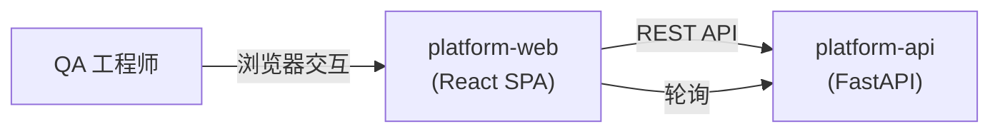
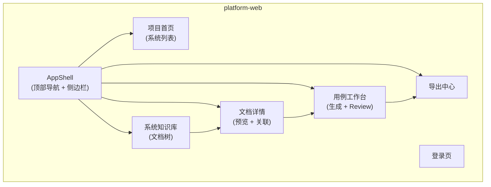
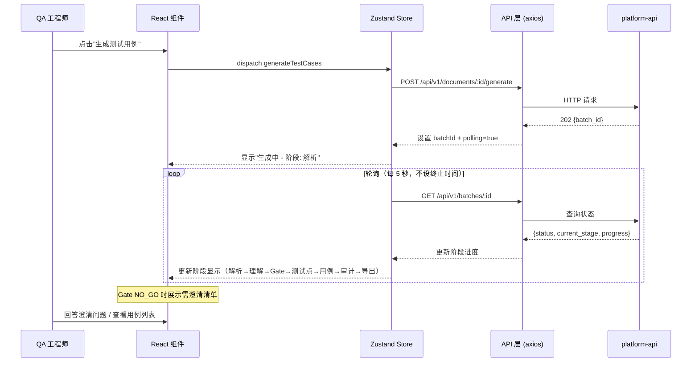

# platform-web Web 前端概要设计

## 0. 文档信息

| 属性 | 内容 |
| :--- | :--- |
| **所属变更** | CHG-20260605-001 |
| **模块名称** | platform-web |
| **模块类型** | web-frontend |
| **创建时间** | 2026-06-05 |

### 修订记录

| 版本号 | 修改日期 | 修改内容摘要 | 修改人 |
| :--- | :--- | :--- | :--- |
| v1.0 | 2026-06-05 | 初稿创建 | echo_lacey |

---

## 1. 技术范围界定

### 1.1 起点与终点

| 维度 | 说明 |
| :--- | :--- |
| **起点** | 用户访问平台 URL，通过登录页进入系统；或从系统列表导航到具体功能页面 |
| **终点** | 用户完成"上传文档 → 生成用例 → review → 落库 → 导出"的完整工作流，获取可用的测试用例文件 |
| **解决的问题** | 为 QA 团队提供直观的 Web 界面，将 AI 驱动的用例生成能力可视化，使非技术用户也能高效完成完整工作流 |

### 1.2 技术边界

- **上游**：用户通过浏览器（Chrome 90+）访问，从登录页或书签进入
- **下游**：所有数据操作通过 platform-api 的 REST API 完成；不直接访问数据库或 AI 模块
- **不涉及**：移动端适配、实时协作编辑、数据分析报表、管理后台

---

## 2. 架构方向探索

| 方向 | 核心思路 | 适合场景 | 风险 |
| :--- | :--- | :--- | :--- |
| SPA（单页应用） | React SPA + 客户端路由，前后端完全分离 | 交互密集、页面切换频繁、团队已有 React 经验 | SEO 不友好（本项目不需要 SEO） |
| SSR + Hydration | Next.js 服务端渲染 + 客户端水合 | 需要 SEO、首屏性能极致要求 | 架构复杂度高，内部工具不需要 SEO |

**选定方向**：SPA（单页应用）
**选择理由**：内部工具不需要 SEO，SPA 架构最简洁；团队有 React 经验；交互密集的用例工作台适合客户端渲染。

---

## 3. 架构方案

### 3.1 页面结构

### 3.2 核心交互流程

### 3.3 路由规划

| 路由 | 页面 | 说明 |
| :--- | :--- | :--- |
| `/login` | 登录页 | 用户认证入口，登录成功后跳转首页 |
| `/` | 项目首页 | 展示所有系统的卡片列表，支持创建新系统 |
| `/systems/:id` | 系统知识库 | 左侧文档树 + 右侧文档列表，支持文件夹上传 |
| `/documents/:id` | 文档详情 | Markdown 预览 + 关联管理 + "生成用例"入口按钮 |
| `/batches/:id` | 用例工作台 | 用例卡片列表 + review 操作 + 迭代/落库按钮 |
| `/exports` | 导出中心 | 导出任务列表 + 下载链接 |

---

## 4. 技术选型与约束

| 领域 | 选型 | 理由 |
| :--- | :--- | :--- |
| 框架 | React 18 + TypeScript | 组件生态丰富、类型安全、团队经验匹配 |
| 状态管理 | Zustand | 轻量简洁、无 boilerplate、API 直观，符合项目规模 |
| 样式方案 | Tailwind CSS | 原子化 CSS 开发效率高、与组件库配合良好、包体积可控 |
| 构建工具 | Vite | 开发环境 HMR 极快、生产构建性能优秀、配置简洁 |
| UI 组件库 | Ant Design 5 | 企业级组件库、开箱即用、文档完善、中文生态友好 |
| HTTP 客户端 | axios | 拦截器机制成熟、Cookie 自动携带配置简单 |
| 路由 | React Router v6 | 官方路由方案、嵌套路由支持好、与 React 18 兼容 |

### 宪章合规性

- [x] 符合 `constitution.md` 的技术栈约束（React + TypeScript）
- [x] 符合浏览器兼容性要求（Chrome 90+、Firefox 90+、Edge 90+）
- [x] 符合可访问性要求（关键操作按钮支持键盘导航）

---

## 5. 认证与会话

| 项 | 方案 |
| :--- | :--- |
| 认证方式 | JWT（由 platform-api 签发） |
| 登录页 | `/login`，提交用户名密码后由后端设置 httpOnly Cookie |
| 会话管理 | httpOnly Cookie 存储 JWT（前端不可读 Token 内容，安全性更高） |
| 登出 | 调用后端登出接口清除 Cookie，前端清空 Store 并重定向到 `/login` |
| Token 刷新 | 后端在响应头中返回新 Token（静默刷新）；401 响应时重定向登录页 |

---

## 6. 安全设计

| 威胁 | 防御措施 |
| :--- | :--- |
| XSS | React 自动转义输出；Markdown 渲染使用 sanitize 处理；禁止 dangerouslySetInnerHTML 渲染用户输入 |
| CSRF | httpOnly Cookie + SameSite=Lax 属性；后端校验 Origin 头 |
| 敏感数据存储 | Token 存储于 httpOnly Cookie（前端 JS 不可读）；不使用 localStorage 存储任何认证信息 |
| 依赖漏洞 | 定期运行 npm audit；锁定依赖版本（package-lock.json） |

---

## 7. 观测与运维

### 7.1 质量目标

| 指标 | 目标值 | 测试条件 |
| :--- | :---: | :--- |
| FCP（首次内容绘制） | ≤ 1500 ms | 有线网络，生产构建 |
| LCP（最大内容绘制） | ≤ 2500 ms | 有线网络，生产构建 |
| CLS（累积布局偏移） | ≤ 0.1 | 正常页面加载 |
| 页面切换时间 | ≤ 300 ms | SPA 路由切换 |

### 7.2 监控指标

| 指标 | 说明 |
| :--- | :--- |
| JS 错误率 | 运行时异常上报（window.onerror + unhandledrejection） |
| API 请求成功率 | 前端发起的请求成功数 / 总请求数 |
| 页面加载时间分位 | P50 / P90 / P99（Performance API 采集） |
| 用例生成等待时长 | 用户从点击"生成"到看到结果的等待时间 |

### 7.3 错误追踪

| 维度 | 方案 |
| :--- | :--- |
| 错误上报 | Sentry（错误聚合 + 用户行为重放） |
| 日志脱敏 | 不在错误日志中输出用户输入内容和 Cookie 值 |
| Source Map | 仅上传到 Sentry 平台，不暴露到生产环境 CDN |

---

## 8. 失败模式与降级策略

| 失败场景 | 影响 | 降级策略 | 恢复方式 |
| :--- | :--- | :--- | :--- |
| 后端 API 不可用 | 数据无法加载 | 展示友好错误提示"服务暂时不可用，请稍后重试"；已加载数据保持展示 | API 恢复后手动刷新或自动重试 |
| JS 运行时错误 | 页面功能异常 | Error Boundary 兜底，显示"页面加载异常"+ 刷新按钮，不白屏 | 刷新页面 |
| 静态资源加载失败 | 样式/脚本缺失 | 入口 HTML 内联关键 CSS；JS 加载失败显示基础错误页 | 资源恢复后刷新正常 |
| 会话过期（401） | 操作被拒 | axios 拦截器捕获 401，重定向到登录页并保存当前路由（登录后回跳） | 重新登录后自动跳回原页面 |
| 网络断开 | 请求失败 | 顶部全局提示"网络连接中断"；表单数据本地暂存（防丢失）；恢复后自动重试挂起请求 | 网络恢复后自动重试 |
| 用例生成超时 | 长时间无结果 | 120 秒后显示"生成时间较长，可关闭页面稍后回来查看"；支持后台继续处理 | 重新进入页面查看结果 |
| 文件上传中断 | 部分文件未上传 | 展示已上传/未上传文件列表；支持"重试未完成"按钮 | 点击重试续传 |

---

## 9. 待研究事项

无待研究事项。所有技术选型均为成熟方案。

---

## 10. 风险与对策

| 风险 | 概率 | 影响 | 对策 |
| :--- | :--- | :--- | :--- |
| Ant Design 组件样式与 Tailwind 冲突 | 中 | 低 | 使用 Tailwind 的 prefix 配置或 Ant Design 的 CSS-in-JS 模式避免冲突；组件级别样式隔离 |
| 用例列表数据量大导致渲染性能问题 | 低 | 中 | 单批次超过 50 条分页展示；使用虚拟列表（react-window）优化长列表 |
| 无专职 UI 设计师导致体验不统一 | 中 | 低 | 严格遵循 Ant Design 设计规范；建立项目级设计 Token（颜色、间距、字体） |

---

## 11. 概要设计确认

- [x] 技术范围已界定
- [x] 架构方向已探索并选定
- [x] 架构方案已确认
- [x] 技术选型符合宪章
- [x] 待研究事项已识别（无待研究事项）

确认后进入详细设计阶段（`/xf/detail`）
