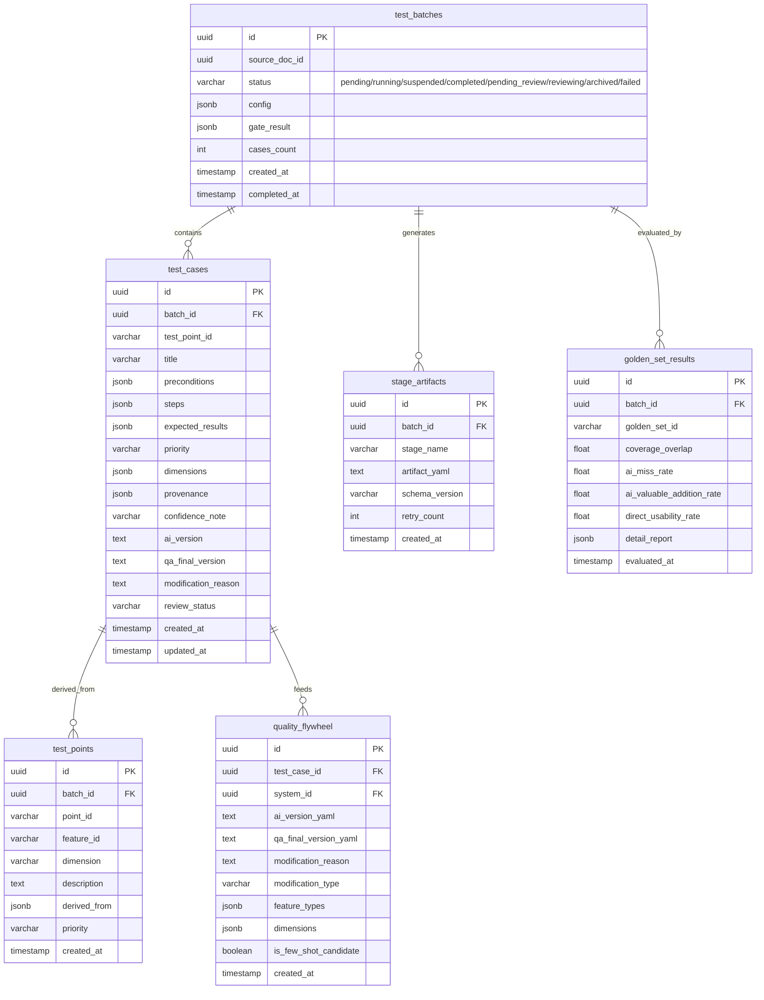

# testcase-generator 数据模型

> **⚠️ 物理 DDL 单一来源为 `platform-api/data-model.md`（拥有 Alembic + 三 schema 迁移权）。**
> **本文档为逻辑字段规格，描述 testcase-generator 模块的字段需求和业务规则。物理表结构、索引、迁移以 platform-api/data-model.md 为准。**

> **Schema：** `testcase`（PostgreSQL 单库多 schema 方案中的用例生成 schema）
> **状态管理：** LangGraph 运行时状态存储在 Redis（RedisSaver，来自 `langgraph-checkpoint-redis` 包），持久化产物存储在 PostgreSQL。
> 上游文档：[hld.md](./hld.md) | [design.md](./design.md)

---

## 1. 概览

**本数据模型覆盖：** testcase-generator 模块的全部持久化需求——任务批次管理、用例存储、阶段产物、质量飞轮、评估结果。

**持久化后端：**

| 后端 | 适用场景 |
|:--- | :--- |
| PostgreSQL 16+ | 结构化产物持久化（schema: testcase） |
| Redis 7+ | LangGraph 状态检查点（运行时，非持久化） |

**Schema 隔离：** 使用 `testcase` schema，与 `public`（平台基础）和 `knowledge`（知识库）隔离。

---

## 2. 实体关系总览



**数据流向：**
- `test_batches` 是一次生成任务的顶层实体，关联所有产物
- `test_cases` 存储最终生成的用例（含 AI 版本和 QA 终版）
- `test_points` 存储中间产物——测试点（与用例 N:1 关系）
- `stage_artifacts` 按阶段存储完整的 YAML 产物（用于审计和回放）；comprehension_report 作为 `type='comprehension_report'` 的 stage_artifact 存储
- `quality_flywheel` 存储学习三元组，反哺后续生成
- `golden_set_results` 存储评估运行结果

---

## 3. test_batches — 生成批次

**用途：** 一次"生成用例"操作对应一个 batch，是任务管理和状态跟踪的核心实体。

| 字段 | 类型 | 约束 | 说明 |
|:--- | :--- | :--- | :--- |
| `id` | `UUID` | PK, DEFAULT gen_random_uuid() | 批次唯一标识（同时作为 LangGraph thread_id） |
| `source_doc_id` | `UUID` | NOT NULL | 触发生成的需求文档 ID（关联 knowledge.documents） |
| `system_id` | `UUID` | NOT NULL | 所属系统 ID |
| `status` | `VARCHAR(20)` | NOT NULL, DEFAULT 'pending' | 任务状态 |
| `config` | `JSONB` | NOT NULL, DEFAULT '{}' | 生成配置（Provider、模型、维度偏好等） |
| `gate_result` | `VARCHAR(15)` | 可空 | Gate 判定结果：GO / CONDITIONAL / NO_GO |
| `current_stage` | `VARCHAR(30)` | 可空 | 当前执行阶段 |
| `cases_count` | `INTEGER` | NOT NULL, DEFAULT 0 | 生成用例总数 |
| `test_points_count` | `INTEGER` | NOT NULL, DEFAULT 0 | 测试点总数 |
| `dimension_coverage` | `REAL` | 可空 | 维度覆盖率（来自 audit） |
| `tokens_consumed` | `INTEGER` | NOT NULL, DEFAULT 0 | 累计 Token 消耗 |
| `error_message` | `TEXT` | 可空 | 失败时的错误信息 |
| `created_at` | `TIMESTAMPTZ` | NOT NULL, DEFAULT NOW() | 创建时间 |
| `started_at` | `TIMESTAMPTZ` | 可空 | 开始执行时间 |
| `completed_at` | `TIMESTAMPTZ` | 可空 | 完成时间 |
| `updated_at` | `TIMESTAMPTZ` | NOT NULL, DEFAULT NOW() | 最后更新时间 |

**status 枚举值：**

| 值 | 说明 |
|:--- | :--- |
| `pending` | 已创建，等待 Worker 拾取 |
| `running` | 流水线执行中 |
| `suspended` | Gate NO_GO，等待用户回答 |
| `completed` | 流水线完成 |
| `pending_review` | 等待 QA review |
| `reviewing` | QA review 进行中 |
| `archived` | 已落库归档 |
| `failed` | 执行失败 |

**状态机流转：**
```
pending → running → suspended(Gate NO_GO) → running(恢复后)
running → completed → pending_review → reviewing → archived
running → failed
suspended → failed(用户取消)
```

---

## 4. test_cases — 测试用例

**用途：** 存储生成的测试用例，包含 AI 原始版本和 QA 审核后的最终版本，支持版本对比和质量飞轮。

| 字段 | 类型 | 约束 | 说明 |
|:--- | :--- | :--- | :--- |
| `id` | `UUID` | PK, DEFAULT gen_random_uuid() | 用例唯一标识 |
| `batch_id` | `UUID` | FK → test_batches.id, NOT NULL | 所属批次 |
| `case_seq` | `VARCHAR(10)` | NOT NULL | 用例序号（TC001, TC002...） |
| `test_point_id` | `VARCHAR(10)` | NOT NULL | 关联测试点（TP001） |
| `title` | `VARCHAR(500)` | NOT NULL | 用例标题 |
| `preconditions` | `JSONB` | NOT NULL, DEFAULT '[]' | 前置条件列表 |
| `steps` | `JSONB` | NOT NULL | 步骤列表 [{step_number, action, input_data, expected_result}] |
| `expected_results` | `JSONB` | NOT NULL, DEFAULT '[]' | 预期结果列表 |
| `priority` | `VARCHAR(5)` | NOT NULL | P0/P1/P2/P3 |
| `dimensions` | `JSONB` | NOT NULL, DEFAULT '[]' | 覆盖的维度列表 |
| `provenance` | `JSONB` | NOT NULL | 溯源信息 {derived_from, source_section, verbatim_excerpt, trust_level} |
| `confidence_note` | `TEXT` | NOT NULL, DEFAULT '' | 可信度风险说明（trust_level≥4 时填写） |
| `ai_version` | `TEXT` | NOT NULL | AI 生成的原始 YAML 版本 |
| `qa_final_version` | `TEXT` | 可空 | QA 审核后的最终 YAML 版本 |
| `modification_reason` | `TEXT` | 可空 | QA 修改理由 |
| `review_status` | `VARCHAR(20)` | NOT NULL, DEFAULT 'pending' | 审核状态 |
| `created_at` | `TIMESTAMPTZ` | NOT NULL, DEFAULT NOW() | 生成时间 |
| `updated_at` | `TIMESTAMPTZ` | NOT NULL, DEFAULT NOW() | 最后更新时间 |

**review_status 枚举值：**

| 值 | 说明 |
|:--- | :--- |
| `pending` | 待 review |
| `confirmed` | QA 确认（无修改或微调后确认） |
| `needs_revision` | 需要修改 |
| `deleted` | QA 删除（不需要） |
| `settled` | 已落库到正式用例库 |

**设计决策：**
- `ai_version` 和 `qa_final_version` 分别存储完整 YAML，支持 diff 对比
- `provenance` 存储为 JSONB 而非拆分为多列，因为字段结构可能随迭代扩展
- `steps` 使用 JSONB 数组存储，每步包含完整的结构化信息
- `confidence_note` 单独列出（非嵌入 provenance）便于前端直接展示

---

## 5. test_points — 测试点

**用途：** 存储维度矩阵驱动生成的测试点，是用例生成的中间产物。

| 字段 | 类型 | 约束 | 说明 |
|:--- | :--- | :--- | :--- |
| `id` | `UUID` | PK, DEFAULT gen_random_uuid() | 测试点标识 |
| `batch_id` | `UUID` | FK → test_batches.id, NOT NULL | 所属批次 |
| `point_seq` | `VARCHAR(10)` | NOT NULL | 测试点序号（TP001） |
| `feature_id` | `VARCHAR(10)` | NOT NULL | 关联功能点（F001） |
| `dimension` | `VARCHAR(50)` | NOT NULL | 维度名称 |
| `description` | `TEXT` | NOT NULL | 测试点描述 |
| `derived_from` | `JSONB` | NOT NULL, DEFAULT '[]' | 来源引用列表 |
| `priority` | `VARCHAR(5)` | NOT NULL | P0/P1/P2/P3 |
| `confidence_note` | `TEXT` | NOT NULL, DEFAULT '' | CONDITIONAL 时的置信度说明 |
| `created_at` | `TIMESTAMPTZ` | NOT NULL, DEFAULT NOW() | 创建时间 |

---

## 6. comprehension_reports — 理解报告（已废弃，使用 stage_artifacts）

> **统一方案：** 理解报告统一存储在 `stage_artifacts` 表中，`stage_name = 'comprehend'`，`type = 'comprehension_report'`。
> Gate 判定结果、open_questions、user_answers 等字段存储在 stage_artifacts.artifact (JSONB) 中。
> 不再独立定义 comprehension_reports 表。

**原始字段映射到 stage_artifacts.artifact JSONB：**

| 原字段 | 映射位置 | 说明 |
|:--- | :--- | :--- |
| `gate_result` | `artifact.gate_result` | GO / CONDITIONAL / NO_GO |
| `understanding_coverage` | `artifact.understanding_coverage` | 理解覆盖度 0.0-1.0 |
| `feature_matrix` | `artifact.feature_matrix` | 功能点理解矩阵 |
| `conflicts` | `artifact.conflicts` | 信源冲突列表 |
| `blind_spots` | `artifact.blind_spots` | 理解盲区列表 |
| `open_questions` | stage_artifacts.open_questions (JSONB) | Gate NO_GO 时的问题列表 |
| `user_answers` | stage_artifacts.clarification_answers (JSONB) | 用户对问题的回答 |
| `iteration` | `artifact.iteration` | 迭代次数 |

---

## 7. stage_artifacts — 阶段产物

**用途：** 按阶段存储完整的 YAML 产物，用于调试、审计和版本回溯。

| 字段 | 类型 | 约束 | 说明 |
|:--- | :--- | :--- | :--- |
| `id` | `UUID` | PK, DEFAULT gen_random_uuid() | 产物标识 |
| `batch_id` | `UUID` | FK → test_batches.id, NOT NULL | 所属批次 |
| `stage_name` | `VARCHAR(30)` | NOT NULL | 阶段名称 |
| `artifact_yaml` | `TEXT` | NOT NULL | 产物完整 YAML 内容 |
| `schema_version` | `VARCHAR(10)` | NOT NULL | schema 版本号 |
| `tokens_input` | `INTEGER` | NOT NULL, DEFAULT 0 | 本阶段输入 token 数 |
| `tokens_output` | `INTEGER` | NOT NULL, DEFAULT 0 | 本阶段输出 token 数 |
| `duration_ms` | `INTEGER` | NOT NULL, DEFAULT 0 | 本阶段执行耗时(ms) |
| `retry_count` | `SMALLINT` | NOT NULL, DEFAULT 0 | 重试次数 |
| `provider_used` | `VARCHAR(30)` | NOT NULL | 实际使用的 Provider |
| `model_used` | `VARCHAR(50)` | NOT NULL | 实际使用的模型 |
| `created_at` | `TIMESTAMPTZ` | NOT NULL, DEFAULT NOW() | 创建时间 |

**stage_name 枚举值：** `parse` / `comprehend` / `gate` / `test_points` / `write_cases` / `review` / `export`

---

## 8. quality_flywheel — 质量飞轮

**用途：** 存储 (AI 生成版, QA 终版, 修改理由) 三元组，驱动持续学习。

| 字段 | 类型 | 约束 | 说明 |
|:--- | :--- | :--- | :--- |
| `id` | `UUID` | PK, DEFAULT gen_random_uuid() | 三元组标识 |
| `test_case_id` | `UUID` | FK → test_cases.id, NOT NULL | 关联用例 |
| `system_id` | `UUID` | FK → public.systems.id, NOT NULL | 所属系统 |
| `ai_version_yaml` | `TEXT` | NOT NULL | AI 原始版本完整 YAML |
| `qa_final_version_yaml` | `TEXT` | 可空 | QA 最终版本完整 YAML（deleted 时为空） |
| `modification_reason` | `TEXT` | NOT NULL, DEFAULT '' | 修改理由 |
| `modification_type` | `VARCHAR(30)` | NOT NULL | 修改类型 |
| `feature_types` | `JSONB` | NOT NULL, DEFAULT '[]' | 功能类型标签数组，用于 few-shot 匹配 |
| `dimensions` | `JSONB` | NOT NULL, DEFAULT '[]' | 涉及维度列表 |
| `is_few_shot_candidate` | `BOOLEAN` | NOT NULL, DEFAULT false | 是否为 few-shot 候选 |
| `created_at` | `TIMESTAMPTZ` | NOT NULL, DEFAULT NOW() | 创建时间 |

**modification_type 枚举值：**

| 值 | 说明 | few-shot 候选 |
|:--- | :--- | :---: |
| `no_change` | QA 直接确认 | 是 |
| `minor_edit` | 微调（措辞/格式） | 是 |
| `major_rewrite` | 大幅重写 | 否 |
| `deleted` | 用例被删除 | 否 |

---

## 9. golden_set_results — 评估结果

**用途：** 存储每次 Golden-set 评估运行的结果，跟踪内核迭代的质量变化。

| 字段 | 类型 | 约束 | 说明 |
|:--- | :--- | :--- | :--- |
| `id` | `UUID` | PK, DEFAULT gen_random_uuid() | 评估记录标识 |
| `batch_id` | `UUID` | FK → test_batches.id, NOT NULL | 评估使用的生成批次 |
| `golden_set_id` | `VARCHAR(50)` | NOT NULL | Golden-set 数据集编号 |
| `kernel_version` | `VARCHAR(20)` | NOT NULL | 被评估的内核版本 |
| `coverage_overlap` | `REAL` | NOT NULL | 覆盖重合度（AI ∩ QA / QA） |
| `ai_miss_rate` | `REAL` | NOT NULL | AI 漏点率（QA有AI无 / QA总数） |
| `ai_valuable_addition_rate` | `REAL` | NOT NULL | AI 新增有价值率（AI有QA无且有价值 / AI总新增） |
| `direct_usability_rate` | `REAL` | NOT NULL | 直接可用率（无需修改的比例） |
| `gate_accuracy` | `REAL` | 可空 | Gate 判定准确率 |
| `detail_report` | `JSONB` | NOT NULL | 详细对比报告 |
| `evaluated_at` | `TIMESTAMPTZ` | NOT NULL, DEFAULT NOW() | 评估执行时间 |

---

## 10. 索引设计

| 索引名 | 表 | 字段 | 用途 |
|:--- | :--- | :--- | :--- |
| `idx_batches_status` | test_batches | `(status)` | 按状态查询任务列表 |
| `idx_batches_source_doc` | test_batches | `(source_doc_id)` | 查询某文档的生成历史 |
| `idx_batches_system` | test_batches | `(system_id, created_at DESC)` | 按系统查询最近批次 |
| `idx_cases_batch` | test_cases | `(batch_id)` | 获取批次下所有用例 |
| `idx_cases_review_status` | test_cases | `(batch_id, review_status)` | 按 review 状态过滤 |
| `idx_cases_priority` | test_cases | `(batch_id, priority)` | 按优先级排序 |
| `idx_points_batch` | test_points | `(batch_id)` | 获取批次下所有测试点 |
| `idx_artifacts_batch_stage` | stage_artifacts | `(batch_id, stage_name)` | 获取某批次某阶段产物 |
| `idx_flywheel_system_pattern` | quality_flywheel | `(system_id, modification_type)` | few-shot 查询 |
| `idx_flywheel_candidate` | quality_flywheel | `(is_few_shot_candidate, system_id)` | few-shot 候选加载 |
| `idx_golden_version` | golden_set_results | `(kernel_version, golden_set_id)` | 版本评估对比 |

---

## 11. LangGraph 状态序列化格式（Redis 结构）

### 11.1 Redis Key 设计

```
# 检查点存储
langgraph:checkpoint:{thread_id}:{checkpoint_id}  → JSON

# 最新检查点索引
langgraph:latest:{thread_id}  → checkpoint_id

# 任务进度
batch:progress:{batch_id}  → JSON (pub/sub channel)
```

### 11.2 Checkpoint JSON 结构

```json
{
  "id": "cp_20260605_001",
  "thread_id": "batch-uuid-xxx",
  "created_at": "2026-06-05T10:30:00Z",
  "channel_values": {
    "batch_id": "batch-uuid-xxx",
    "source_doc_id": "doc-uuid-xxx",
    "current_stage": "comprehend",
    "retry_count": 0,
    "suspended": false,
    "parsed_context": "... (序列化的 YAML 字符串) ...",
    "comprehension_report": null,
    "test_points": [],
    "test_cases": [],
    "few_shot_samples": ["..."],
    "open_questions": [],
    "user_answers": []
  },
  "channel_versions": {
    "parsed_context": 1,
    "comprehension_report": 0
  },
  "metadata": {
    "source": "loop",
    "step": 2,
    "writes": {"comprehend": {"comprehension_report": "..."}}
  }
}
```

### 11.3 Redis 配置

| 参数 | 值 | 说明 |
|:--- | :--- | :--- |
| Key TTL | 7 天 | 已完成任务的 checkpoint 7 天后过期清理 |
| Max memory | 2GB | 超出时按 LRU 淘汰已完成任务的 checkpoint |
| Persistence | RDB（每 5 分钟） | checkpoint 丢失可重跑，无需 AOF 级持久化 |
| Serialization | JSON | 可读性优先，调试方便 |

**设计决策：** Redis 仅存储运行时 checkpoint，最终产物写入 PostgreSQL。Redis 数据丢失时影响范围仅为"进行中的任务需重跑"，不影响已完成的产物。

---

## 12. DDL 参考

> **注意：物理 DDL 以 platform-api/data-model.md 为唯一来源。以下 DDL 仅供本模块开发参考，实际迁移由 platform-api 的 Alembic 统一管理。**

```sql
-- 创建 schema
CREATE SCHEMA IF NOT EXISTS testcase;

-- test_batches 表
CREATE TABLE testcase.test_batches (
    id UUID PRIMARY KEY DEFAULT gen_random_uuid(),
    source_doc_id UUID NOT NULL,
    system_id UUID NOT NULL,
    status VARCHAR(20) NOT NULL DEFAULT 'pending',
    config JSONB NOT NULL DEFAULT '{}',
    gate_result VARCHAR(15),
    current_stage VARCHAR(30),
    cases_count INTEGER NOT NULL DEFAULT 0,
    test_points_count INTEGER NOT NULL DEFAULT 0,
    dimension_coverage REAL,
    tokens_consumed INTEGER NOT NULL DEFAULT 0,
    error_message TEXT,
    created_at TIMESTAMPTZ NOT NULL DEFAULT NOW(),
    started_at TIMESTAMPTZ,
    completed_at TIMESTAMPTZ,
    updated_at TIMESTAMPTZ NOT NULL DEFAULT NOW()
);

-- test_cases 表
CREATE TABLE testcase.test_cases (
    id UUID PRIMARY KEY DEFAULT gen_random_uuid(),
    batch_id UUID NOT NULL REFERENCES testcase.test_batches(id),
    case_seq VARCHAR(10) NOT NULL,
    test_point_id VARCHAR(10) NOT NULL,
    title VARCHAR(500) NOT NULL,
    preconditions JSONB NOT NULL DEFAULT '[]',
    steps JSONB NOT NULL,
    expected_results JSONB NOT NULL DEFAULT '[]',
    priority VARCHAR(5) NOT NULL,
    dimensions JSONB NOT NULL DEFAULT '[]',
    provenance JSONB NOT NULL,
    confidence_note TEXT NOT NULL DEFAULT '',
    ai_version TEXT NOT NULL,
    qa_final_version TEXT,
    modification_reason TEXT,
    review_status VARCHAR(20) NOT NULL DEFAULT 'pending',
    created_at TIMESTAMPTZ NOT NULL DEFAULT NOW(),
    updated_at TIMESTAMPTZ NOT NULL DEFAULT NOW()
);

-- test_points 表
CREATE TABLE testcase.test_points (
    id UUID PRIMARY KEY DEFAULT gen_random_uuid(),
    batch_id UUID NOT NULL REFERENCES testcase.test_batches(id),
    point_seq VARCHAR(10) NOT NULL,
    feature_id VARCHAR(10) NOT NULL,
    dimension VARCHAR(50) NOT NULL,
    description TEXT NOT NULL,
    derived_from JSONB NOT NULL DEFAULT '[]',
    priority VARCHAR(5) NOT NULL,
    confidence_note TEXT NOT NULL DEFAULT '',
    created_at TIMESTAMPTZ NOT NULL DEFAULT NOW()
);

-- comprehension_reports 已废弃，使用 stage_artifacts (stage_name='comprehend') 存储

-- stage_artifacts 表
CREATE TABLE testcase.stage_artifacts (
    id UUID PRIMARY KEY DEFAULT gen_random_uuid(),
    batch_id UUID NOT NULL REFERENCES testcase.test_batches(id),
    stage_name VARCHAR(30) NOT NULL,
    artifact_yaml TEXT NOT NULL,
    schema_version VARCHAR(10) NOT NULL,
    tokens_input INTEGER NOT NULL DEFAULT 0,
    tokens_output INTEGER NOT NULL DEFAULT 0,
    duration_ms INTEGER NOT NULL DEFAULT 0,
    retry_count SMALLINT NOT NULL DEFAULT 0,
    provider_used VARCHAR(30) NOT NULL,
    model_used VARCHAR(50) NOT NULL,
    created_at TIMESTAMPTZ NOT NULL DEFAULT NOW()
);

-- quality_flywheel 表
CREATE TABLE testcase.quality_flywheel (
    id UUID PRIMARY KEY DEFAULT gen_random_uuid(),
    test_case_id UUID NOT NULL REFERENCES testcase.test_cases(id),
    system_id UUID NOT NULL REFERENCES public.systems(id),
    ai_version_yaml TEXT NOT NULL,
    qa_final_version_yaml TEXT,
    modification_reason TEXT NOT NULL DEFAULT '',
    modification_type VARCHAR(30) NOT NULL,
    feature_types JSONB NOT NULL DEFAULT '[]',
    dimensions JSONB NOT NULL DEFAULT '[]',
    is_few_shot_candidate BOOLEAN NOT NULL DEFAULT false,
    created_at TIMESTAMPTZ NOT NULL DEFAULT NOW()
);

-- golden_set_results 表
CREATE TABLE testcase.golden_set_results (
    id UUID PRIMARY KEY DEFAULT gen_random_uuid(),
    batch_id UUID NOT NULL REFERENCES testcase.test_batches(id),
    golden_set_id VARCHAR(50) NOT NULL,
    kernel_version VARCHAR(20) NOT NULL,
    coverage_overlap REAL NOT NULL,
    ai_miss_rate REAL NOT NULL,
    ai_valuable_addition_rate REAL NOT NULL,
    direct_usability_rate REAL NOT NULL,
    gate_accuracy REAL,
    detail_report JSONB NOT NULL,
    evaluated_at TIMESTAMPTZ NOT NULL DEFAULT NOW()
);

-- 索引
CREATE INDEX idx_batches_status ON testcase.test_batches(status);
CREATE INDEX idx_batches_source_doc ON testcase.test_batches(source_doc_id);
CREATE INDEX idx_batches_system ON testcase.test_batches(system_id, created_at DESC);
CREATE INDEX idx_cases_batch ON testcase.test_cases(batch_id);
CREATE INDEX idx_cases_review_status ON testcase.test_cases(batch_id, review_status);
CREATE INDEX idx_cases_priority ON testcase.test_cases(batch_id, priority);
CREATE INDEX idx_points_batch ON testcase.test_points(batch_id);
CREATE INDEX idx_artifacts_batch_stage ON testcase.stage_artifacts(batch_id, stage_name);
CREATE INDEX idx_flywheel_system ON testcase.quality_flywheel(system_id, modification_type);
CREATE INDEX idx_flywheel_candidate ON testcase.quality_flywheel(is_few_shot_candidate, system_id) WHERE is_few_shot_candidate = true;
CREATE INDEX idx_golden_version ON testcase.golden_set_results(kernel_version, golden_set_id);
```

---

## 13. 迁移方案

| 迁移编号 | 触发原因 | 操作 | 幂等保证 |
|:--- | :--- | :--- | :--- |
| `001_init_testcase_schema` | 初始化 | CREATE SCHEMA + 所有表 + 索引 | `IF NOT EXISTS` |
| `002_add_gate_accuracy` | Golden-set 评估扩展 | `ALTER TABLE ADD COLUMN gate_accuracy` | 检查列存在性 |
| `003_add_tokens_tracking` | Token 用量细化 | 在 stage_artifacts 添加 tokens 列 | 检查列存在性 |

**迁移工具：** Alembic（与 knowledge schema 共用迁移配置，但迁移文件按 schema 分目录）

---

## 14. 测试要求

| 测试目标 | 测试类型 | 通过条件 |
|:--- | :--- | :--- |
| Batch 状态机 | 集成测试 | 状态流转：pending→running→completed 正确 |
| Batch 挂起恢复 | 集成测试 | suspended 状态可通过 resume 回到 running |
| 用例 CRUD | 集成测试 | 创建/读取/更新 review_status 正确 |
| 质量飞轮写入 | 集成测试 | QA review 后三元组正确写入 |
| few-shot 查询 | 集成测试 | 按 system_id + is_few_shot_candidate 正确召回 |
| 阶段产物存储 | 集成测试 | 每阶段产物正确写入，YAML 可反序列化 |
| Golden-set 记录 | 集成测试 | 评估结果正确写入，支持版本对比查询 |
| 批次查询性能 | 性能测试 | 1000 批次下按 system+时间查询 < 100ms |

---

## 3. sessions — 会话元数据 (必填)

本模块不涉及传统 Agent Session。流水线上下文通过 test_batches + LangGraph Checkpoint(Redis) 管理。

## 4. messages — 对话消息 (必填)

本模块不涉及。各阶段 LLM 交互不保存为对话消息，仅保存结构化产物（stage_artifacts 表）。

## 5. memories — 持久化记忆 (必填)

本模块的"记忆"等价于质量飞轮（quality_flywheel 表）：(AI版, QA终版, 修改理由) 三元组。

## 6. memory_embeddings — 向量记忆（适用时填）

不适用。向量检索由 knowledge-base 模块提供。

## 7. session_usage / kv — 用量与状态（适用时填）

不适用。Token 用量在 stage_artifacts.metadata 中记录。

## 9. 迁移策略 (必填)

使用 Alembic 管理。物理 DDL 单一来源为 platform-api/data-model.md。

---

## 附录：物理 Schema 参考（可选）

物理 DDL 统一由 platform-api/data-model.md 管理。Redis 状态结构详见 LangGraph 状态序列化章节。
