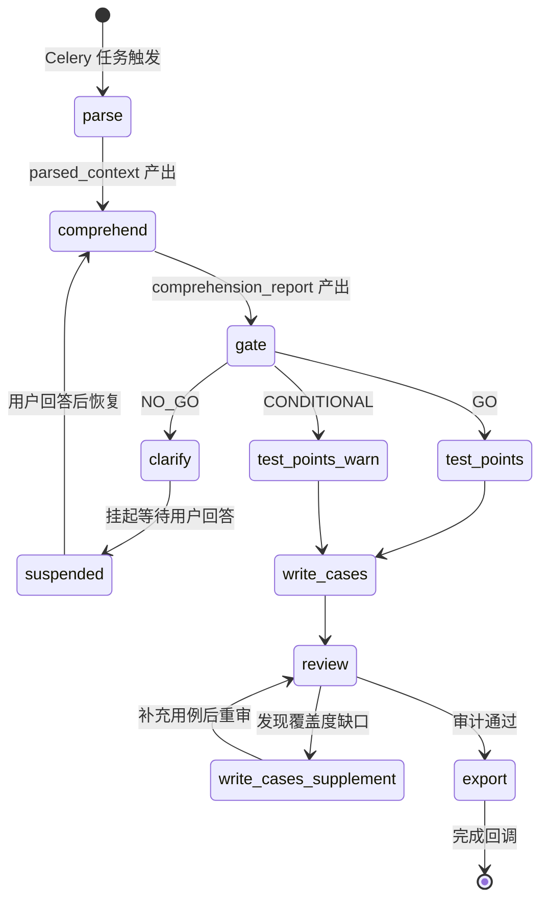
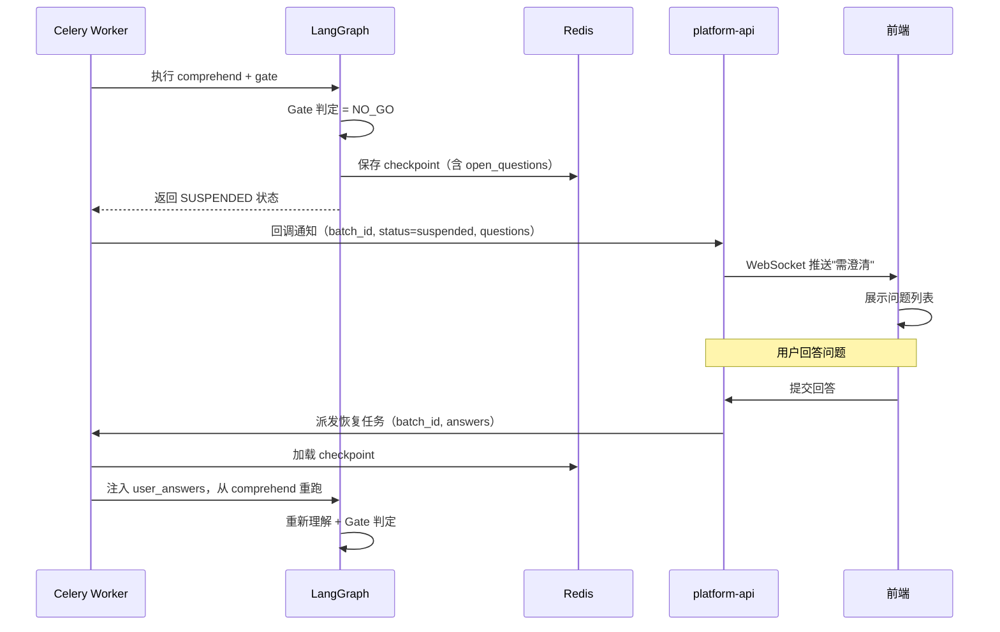
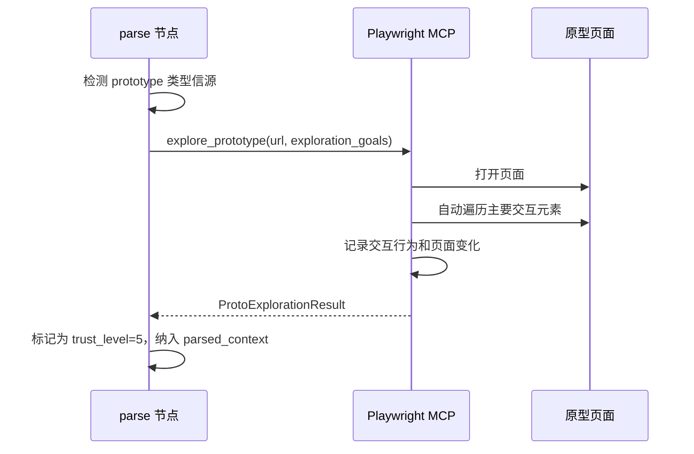
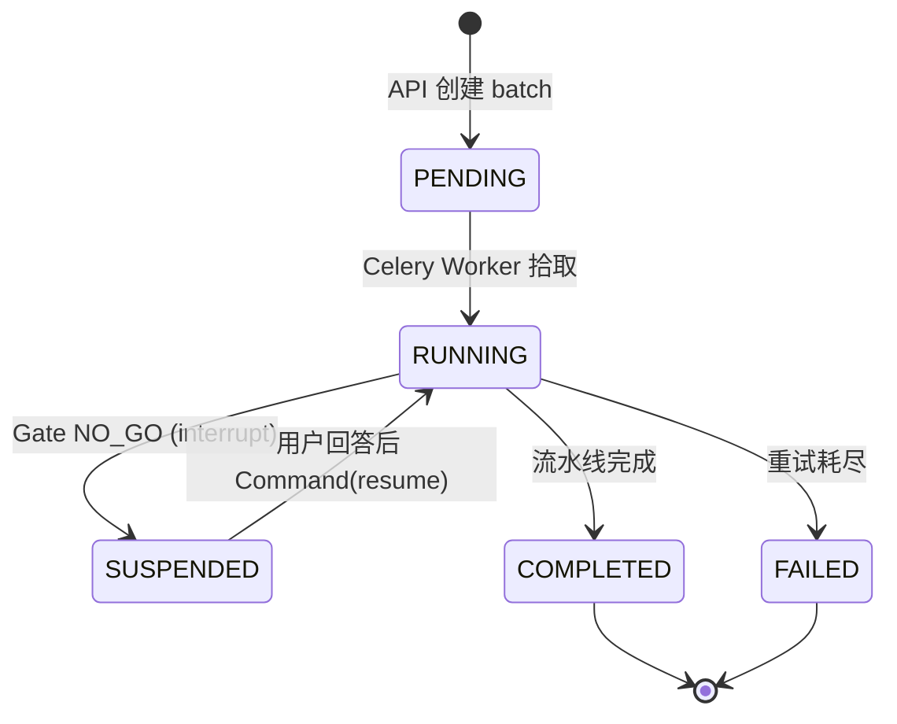
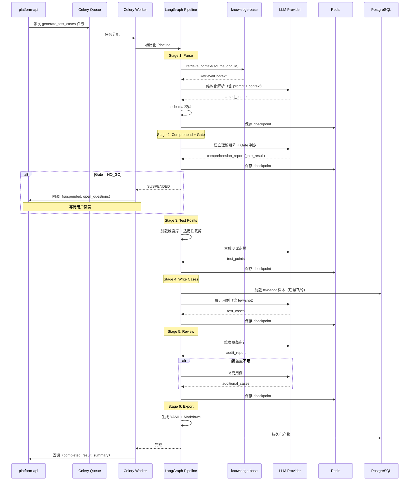

# testcase-generator 详细设计

> **定位：** testcase-generator 是 LangGraph 6 阶段流水线，实现 AI 资深测试工程师能力。
> 上游文档：[hld.md](./hld.md) | [spec.md](./spec.md) | [data-model.md](./data-model.md)

---

## 1. 概览

**模块职责：** 接收需求文档，通过 6 阶段 LangGraph 流水线（parse→comprehend→gate→test-points→write-cases→review→export）生成达到资深 QA 水准的测试用例集。

**源文件：** `src/testcase_generator/`

**上游依赖：**

| 文档类型 | 链接 |
|:--- | :--- |
| HLD | `xspec/changes/testcase-generator/hld.md` |
| Spec | `xspec/changes/testcase-generator/spec.md` |
| Data Model | `xspec/changes/testcase-generator/data-model.md` |

---

## 2. 模块职责边界

**负责：**
- 接收 Celery 任务，启动 LangGraph 流水线执行用例生成
- 各阶段 LLM 调用、schema 校验、条件分支控制
- Gate 机制实现（GO/CONDITIONAL/NO_GO 判定 + 挂起/恢复）
- 维度方法论驱动的测试点生成
- 信任顺序冲突仲裁
- 质量飞轮数据收集与 few-shot 注入
- Playwright MCP 原型探索子流程

**不负责（显式排除）：**
- 不负责知识库管理（调用 knowledge-base 检索接口获取上下文）
- 不负责用户认证和权限（由 platform-api 处理）
- 不负责任务调度（由 platform-api 通过 Celery 派发）
- 不负责产物持久化的 API 暴露（由 platform-api 提供 REST 接口）

**调用关系：**

| 方向 | 模块 | 方式 |
|:--- | :--- | :--- |
| 被调用 | `platform-api (Celery)` | Celery task 消息触发 |
| 调用 | `knowledge-base` | Python 内部方法调用（RetrievalService） |
| 调用 | `OpenAI / Anthropic API` | LangGraph ChatModel 接口 |
| 调用 | `Playwright MCP` | MCP 协议调用（原型探索） |
| 调用 | `PostgreSQL` | SQLAlchemy（产物持久化） |
| 调用 | `Redis` | LangGraph RedisSaver（状态检查点） |

---

## 3. LangGraph StateGraph 定义

### 3.1 流转图



### 3.2 StateGraph 代码结构

```python
from langgraph.graph import StateGraph, END
from langgraph_checkpoint_redis import RedisSaver

class PipelineState(TypedDict):
    """LangGraph 全局状态"""
    # 任务元数据
    batch_id: str
    source_doc_id: str
    config: GenerationConfig
    
    # 各阶段产物
    parsed_context: ParsedContext | None
    comprehension_report: ComprehensionReport | None
    gate_result: GateResult | None
    test_points: list[TestPoint]
    test_cases: list[TestCase]
    audit_report: AuditReport | None
    export_result: ExportResult | None
    
    # 控制流状态
    current_stage: str
    retry_count: int
    suspended: bool
    open_questions: list[OpenQuestion]
    user_answers: list[UserAnswer]
    
    # 质量飞轮
    few_shot_samples: list[FewShotSample]

# 构建 StateGraph
workflow = StateGraph(PipelineState)

# 添加节点
workflow.add_node("parse", parse_node)
workflow.add_node("comprehend", comprehend_node)
workflow.add_node("gate", gate_node)
workflow.add_node("test_points", test_points_node)
workflow.add_node("write_cases", write_cases_node)
workflow.add_node("review", review_node)
workflow.add_node("export", export_node)

# 添加边
workflow.set_entry_point("parse")
workflow.add_edge("parse", "comprehend")
workflow.add_edge("comprehend", "gate")
workflow.add_conditional_edges("gate", gate_router, {
    "go": "test_points",
    "conditional": "test_points",
    "no_go": "suspend_for_clarification",  # 使用 interrupt() 挂起
})
workflow.add_node("suspend_for_clarification", suspend_node)
workflow.add_edge("suspend_for_clarification", "comprehend")  # 恢复后从 comprehend 重跑
workflow.add_edge("test_points", "write_cases")
workflow.add_conditional_edges("review", review_router, {
    "pass": "export",
    "supplement": "write_cases",
})
workflow.add_edge("export", END)

# 编译（带 Redis checkpoint）
checkpointer = RedisSaver(url=REDIS_URL)
app = workflow.compile(checkpointer=checkpointer)
```

### 3.3 状态检查点与断点续跑

| 检查点位置 | 存储内容 | 恢复场景 |
|:--- | :--- | :--- |
| 每个节点执行前 | 当前 PipelineState 全量 | 节点执行失败后重试 |
| Gate NO_GO 时 | state + open_questions | 用户回答后从 comprehend 恢复 |
| Schema 校验失败时 | state + 失败原因 | 修复 prompt 后重跑当前节点 |
| Worker 崩溃 | 最近一次检查点 | 新 Worker 拾取未完成任务 |

---

## 4. 各阶段 Pydantic Schema 定义

### 4.1 Stage 1: Parse

```python
class ParsedContext(BaseModel):
    """parse 阶段输出"""
    sources: list[SourceDocument]
    features: list[Feature]
    constraints: list[Constraint]
    cross_system_refs: list[CrossSystemRef]

class SourceDocument(BaseModel):
    doc_id: str
    doc_type: Literal["prd", "tech_doc", "test_rule", "bug_record", "prototype"]
    trust_level: int  # 1-5
    title: str
    extracted_items: list[ExtractedItem]

class Feature(BaseModel):
    id: str  # F001, F002...
    name: str
    description: str
    source_section: str  # "PRD §2.3"
    verbatim_excerpt: str  # 原文摘录
    priority: Literal["core", "secondary", "enhancement"]
    modules: list[str]  # 涉及的业务模块

class ExtractedItem(BaseModel):
    item_type: Literal["requirement", "constraint", "interface", "data_structure", "business_rule"]
    content: str
    source_location: str  # 文档内定位（段落/标题）
    trust_level: int

class Constraint(BaseModel):
    id: str
    description: str
    source: str
    constraint_type: Literal["data", "business", "technical", "performance"]
```

### 4.2 Stage 2: Comprehend

```python
class ComprehensionReport(BaseModel):
    """comprehend 阶段输出"""
    gate_result: Literal["GO", "CONDITIONAL", "NO_GO"]
    understanding_coverage: float  # 0.0 - 1.0
    feature_matrix: list[FeatureUnderstanding]
    conflicts: list[SourceConflict]
    blind_spots: list[BlindSpot]
    open_questions: list[OpenQuestion]

class FeatureUnderstanding(BaseModel):
    feature_id: str
    coverage_sources: list[str]  # 覆盖该功能点的信源 doc_id 列表
    coverage_ratio: float  # 信源覆盖度
    confidence: Literal["high", "medium", "low"]
    gaps: list[str]  # 理解缺口描述

class SourceConflict(BaseModel):
    conflict_id: str
    feature_id: str
    conflicting_sources: list[ConflictingSource]
    resolution: str  # 按信任顺序的仲裁结论
    resolved_by_trust: bool  # 是否可通过信任顺序自动解决

class ConflictingSource(BaseModel):
    doc_id: str
    trust_level: int
    claim: str  # 该信源的主张

class BlindSpot(BaseModel):
    feature_id: str
    description: str
    severity: Literal["critical", "moderate", "minor"]
    suggested_source: str  # 建议补充的信源类型

class OpenQuestion(BaseModel):
    question_id: str
    question: str
    context: str  # 为什么需要问这个问题
    related_feature_ids: list[str]
    priority: Literal["blocking", "important", "nice_to_have"]
```

### 4.3 Stage 3: Test Points

```python
class TestPoint(BaseModel):
    """test-points 阶段输出"""
    id: str  # TP001, TP002...
    feature_id: str
    dimension: str  # 维度名称
    description: str
    derived_from: list[str]  # 来源引用列表
    priority: Literal["P0", "P1", "P2", "P3"]
    applicable_dimensions: list[str]  # 该功能点适用的所有维度
    confidence_note: str  # 仅 CONDITIONAL 通过时有值
```

### 4.4 Stage 4: Write Cases

```python
class TestCase(BaseModel):
    """write-cases 阶段输出"""
    id: str  # TC001, TC002...
    test_point_id: str
    title: str
    preconditions: list[str]
    steps: list[TestStep]
    expected_results: list[str]
    priority: Literal["P0", "P1", "P2", "P3"]
    dimensions: list[str]
    provenance: Provenance
    confidence_note: str  # trust_level >= 4 时的风险说明

class TestStep(BaseModel):
    step_number: int
    action: str  # 精确到可执行级别
    input_data: str  # 具体数据值
    expected_result: str

class Provenance(BaseModel):
    derived_from: list[str]  # 信源引用
    source_section: str  # 具体段落
    verbatim_excerpt: str  # 原文摘录
    trust_level: int  # 最低信源等级
```

### 4.5 Stage 5: Review (Audit)

```python
class AuditReport(BaseModel):
    """review 阶段输出"""
    total_test_points: int
    covered_test_points: int
    dimension_coverage: float  # 0.0 - 1.0
    gaps: list[CoverageGap]
    additions: list[TestCase]  # 补充的用例
    trust_consistency_violations: list[str]  # 信任顺序违反项

class CoverageGap(BaseModel):
    feature_id: str
    missing_dimension: str
    severity: Literal["critical", "moderate", "minor"]
    suggested_test_point: str
```

### 4.6 Stage 6: Export

```python
class ExportResult(BaseModel):
    """export 阶段输出"""
    internal_yaml_path: str  # 全字段 YAML 存储路径
    review_markdown: str  # markdown 评审版内容
    case_count: int
    dimension_summary: dict[str, int]  # 各维度用例数
    provenance_summary: dict[int, int]  # 各 trust_level 用例数
```

---

## 5. Gate 机制详细设计

### 5.1 判定逻辑

```python
def gate_router(state: PipelineState) -> str:
    """Gate 条件分支路由"""
    report = state["comprehension_report"]
    
    if report.gate_result == "GO":
        return "go"
    elif report.gate_result == "CONDITIONAL":
        return "conditional"
    else:  # NO_GO
        # 标记挂起状态，Celery 任务进入等待
        return "no_go"
```

### 5.2 GO/CONDITIONAL/NO_GO 判定规则

| 判定 | 条件（全部满足） | 后续行为 |
|:--- | :--- | :--- |
| **GO** | 核心功能点覆盖度 ≥ 80%；无 critical 级盲点；无高优先级信源冲突（初始值，由 golden-set 评估反推校准，非硬编码常量） | 直接进入 test-points |
| **CONDITIONAL** | 覆盖度 60%-80%；仅有 moderate 级盲点；存在低优先级冲突但已按信任顺序仲裁（初始值，由 golden-set 评估反推校准，非硬编码常量） | 进入 test-points，受影响测试点标注 `confidence_note` |
| **NO_GO** | 核心功能点覆盖度 < 60%；存在 critical 盲点；或存在同等级信源冲突（无法自动仲裁）（初始值，由 golden-set 评估反推校准，非硬编码常量） | 生成 open_questions，interrupt() 挂起任务 |

### 5.3 Gate 判定实现（LLM Prompt 约束）

Gate 判定由 LLM 执行，但通过结构化 prompt 约束输出：

```
你是 Gate 质量门判定专家。基于以下理解报告，判定是否达到进入测试点设计的标准。

判定规则（不可违反）：
1. 统计核心功能点（priority=core）的信源覆盖度
2. 检查是否存在 critical 级盲点
3. 检查信源冲突：同 trust_level 的冲突为"无法自动仲裁"
4. 按以下矩阵输出判定结果：[矩阵规则]

输出必须严格遵守以下 JSON Schema：[schema]
```

### 5.4 NO_GO 挂起/恢复机制（LangGraph interrupt）

Gate NO_GO 时使用 LangGraph 原生 `interrupt()` 实现人在环挂起，无需终止图执行后重新 invoke：

```python
from langgraph.types import interrupt

def suspend_node(state: PipelineState) -> PipelineState:
    """Gate NO_GO 时挂起，等待用户澄清回答"""
    questions = state["comprehension_report"].open_questions
    # interrupt() 将挂起图执行，返回 open_questions 给调用方
    # 调用方通过 Command(resume=answers) 恢复执行
    answers = interrupt({"open_questions": [q.model_dump() for q in questions]})
    # 恢复后 answers 即为用户提交的回答
    state["user_answers"] = [UserAnswer(**a) for a in answers]
    state["suspended"] = False
    return state
```



### 5.5 Celery 任务定义

```python
from langgraph.types import Command

@celery_app.task(bind=True, max_retries=3)
def generate_test_cases(self, batch_id: str, source_doc_id: str, config: dict):
    """主生成任务"""
    try:
        thread_config = {"configurable": {"thread_id": batch_id}}
        result = pipeline_app.invoke(
            initial_state(batch_id, source_doc_id, config),
            config=thread_config
        )
        # 检查是否被 interrupt() 挂起
        state = pipeline_app.get_state(thread_config)
        if state.next:  # 图未结束，说明被 interrupt 挂起
            update_batch_status(batch_id, "suspended", state.tasks[0].interrupts[0].value["open_questions"])
            return  # 任务正常退出，等待 resume
        # 完成回调
        notify_completion(batch_id, result)
    except Exception as e:
        # 其他异常走重试
        self.retry(countdown=60)

@celery_app.task
def resume_after_clarification(batch_id: str, answers: list[dict]):
    """用户回答后恢复任务——通过 Command(resume=...) 恢复 interrupt"""
    thread_config = {"configurable": {"thread_id": batch_id}}
    # 使用 Command(resume=answers) 恢复被 interrupt() 挂起的图
    result = pipeline_app.invoke(
        Command(resume=answers),
        config=thread_config
    )
    # 检查是否再次挂起（多轮澄清场景）
    state = pipeline_app.get_state(thread_config)
    if state.next:
        update_batch_status(batch_id, "suspended", state.tasks[0].interrupts[0].value["open_questions"])
        return
    notify_completion(batch_id, result)
```

---

## 6. 维度方法论实现

### 6.1 维度库定义

```python
class TestDimension(BaseModel):
    """测试维度定义"""
    id: str
    name: str
    description: str
    check_points: list[str]  # 该维度下的检查要点
    applicable_to: list[str]  # 适用的功能类型
    not_applicable_to: list[str]  # 不适用的功能类型

DIMENSION_LIBRARY: list[TestDimension] = [
    TestDimension(
        id="functional_correctness",
        name="功能正确性",
        description="验证功能是否按需求规格正确执行",
        check_points=["正常路径执行", "输出结果正确", "状态变更正确"],
        applicable_to=["*"],  # 所有类型
        not_applicable_to=[],
    ),
    TestDimension(
        id="boundary_value",
        name="边界值",
        description="验证输入/输出在边界条件下的行为",
        check_points=["最小值", "最大值", "边界±1", "空值", "类型边界"],
        applicable_to=["data_input", "api_interface", "form_validation"],
        not_applicable_to=["ui_display_only"],
    ),
    TestDimension(
        id="exception_path",
        name="异常路径",
        description="验证异常输入和异常场景下的错误处理",
        check_points=["非法输入", "网络中断", "超时", "并发冲突", "资源不足"],
        applicable_to=["*"],
        not_applicable_to=[],
    ),
    TestDimension(
        id="data_integrity",
        name="数据完整性",
        description="验证数据在全流程中的完整性和一致性",
        check_points=["数据不丢失", "事务一致性", "级联更新正确", "数据格式保持"],
        applicable_to=["data_crud", "data_flow", "api_interface"],
        not_applicable_to=["ui_display_only", "static_page"],
    ),
    TestDimension(
        id="concurrency",
        name="并发/竞态",
        description="验证多用户或多线程同时操作时的行为",
        check_points=["同时写入", "读写冲突", "资源竞争", "死锁"],
        applicable_to=["data_crud", "shared_resource", "queue_processing"],
        not_applicable_to=["ui_interaction", "static_page", "read_only_display"],
    ),
    TestDimension(
        id="permission",
        name="权限控制",
        description="验证不同角色的访问控制是否正确",
        check_points=["越权访问", "角色切换", "数据隔离", "权限继承"],
        applicable_to=["multi_role", "data_access", "api_interface"],
        not_applicable_to=["public_page", "anonymous_access"],
    ),
    TestDimension(
        id="cross_system",
        name="跨系统影响",
        description="验证系统间交互的正确性和容错性",
        check_points=["接口调用正确", "数据同步一致", "对端故障降级", "超时处理"],
        applicable_to=["system_integration", "api_call", "data_sync"],
        not_applicable_to=["isolated_module"],
    ),
    TestDimension(
        id="state_machine",
        name="状态机转换",
        description="验证业务实体的状态流转是否符合规则",
        check_points=["合法转换", "非法转换拒绝", "终态不可逆", "并发状态冲突"],
        applicable_to=["order_flow", "workflow", "approval_process"],
        not_applicable_to=["stateless_query", "static_page"],
    ),
    TestDimension(
        id="performance_boundary",
        name="性能边界",
        description="验证在大数据量或高并发下的性能表现",
        check_points=["大列表加载", "批量操作", "高并发响应", "内存占用"],
        applicable_to=["list_query", "batch_operation", "high_traffic"],
        not_applicable_to=["low_frequency_admin"],
    ),
    TestDimension(
        id="compatibility",
        name="兼容性",
        description="验证在不同环境下的兼容表现",
        check_points=["多浏览器", "多设备", "多分辨率", "新旧版本并存"],
        applicable_to=["web_frontend", "mobile_app", "responsive_design"],
        not_applicable_to=["backend_api", "data_processing"],
    ),
]
```

### 6.2 适用性矩阵裁剪

```python
def select_applicable_dimensions(
    feature: Feature, 
    parsed_context: ParsedContext
) -> list[TestDimension]:
    """根据功能点特征裁剪适用维度"""
    feature_types = infer_feature_types(feature, parsed_context)
    
    applicable = []
    for dim in DIMENSION_LIBRARY:
        # 检查是否在不适用列表中
        if any(ft in dim.not_applicable_to for ft in feature_types):
            continue
        # 检查是否适用（"*" 表示所有类型都适用）
        if "*" in dim.applicable_to or any(ft in dim.applicable_to for ft in feature_types):
            applicable.append(dim)
    
    # 注入漏测 Bug 对应的"必覆盖维度"
    bug_dimensions = get_bug_forced_dimensions(feature, parsed_context)
    for dim in bug_dimensions:
        if dim not in applicable:
            applicable.append(dim)
    
    return applicable
```

### 6.3 漏测 Bug 强制维度注入

当 knowledge-base 返回的漏测 Bug 记录与当前功能点相关时，该 Bug 涉及的维度成为"必覆盖维度"（即使适用性矩阵判定为不适用）：

```python
def get_bug_forced_dimensions(feature: Feature, context: ParsedContext) -> list[TestDimension]:
    """从漏测 Bug 提取必覆盖维度"""
    forced = []
    for source in context.sources:
        if source.doc_type == "bug_record":
            for item in source.extracted_items:
                if is_related_to_feature(item, feature):
                    dim = infer_dimension_from_bug(item)
                    forced.append(dim)
    return forced
```

---

## 7. 信任顺序实现

### 7.1 冲突仲裁规则

```python
TRUST_ORDER = {
    1: "PRD 需求文档",
    2: "技术设计文档",
    3: "用户口述/补充说明",
    4: "UI 设计稿",
    5: "可交互原型 (mock)",
}

def resolve_conflict(conflicts: list[ConflictingSource]) -> SourceConflict:
    """按信任顺序仲裁信源冲突"""
    sorted_sources = sorted(conflicts, key=lambda s: s.trust_level)
    highest_trust = sorted_sources[0].trust_level
    
    # 同等级冲突：无法自动仲裁
    same_level = [s for s in sorted_sources if s.trust_level == highest_trust]
    if len(same_level) > 1:
        return SourceConflict(
            resolved_by_trust=False,
            resolution="同等级信源冲突，需人工澄清",
            # 这将导致 Gate NO_GO
        )
    
    # 不同等级：高等级为准
    winner = sorted_sources[0]
    return SourceConflict(
        resolved_by_trust=True,
        resolution=f"按信任顺序，以{TRUST_ORDER[winner.trust_level]}为准",
    )
```

### 7.2 信任等级在用例中的体现

| trust_level | 用例中的表现 |
|:--- | :--- |
| 1-2 | 正常用例，confidence_note 为空 |
| 3 | 正常用例，confidence_note 标注"来源为口述补充" |
| 4 | 用例标注 confidence_note："来源为 UI 设计稿，以 PRD 文字为准" |
| 5 | 用例标注 confidence_note："含原型探索，原型可能有 bug，仅辅助参考" |

---

## 8. 质量飞轮实现

### 8.1 三元组存储

当 QA review 并修改 AI 生成的用例后，系统自动存储三元组：

```python
class QualityTriple(BaseModel):
    """质量飞轮三元组"""
    ai_version: TestCase          # AI 生成版本
    qa_final_version: TestCase    # QA 最终确认版本
    modification_reason: str       # 修改理由
    modification_type: Literal[
        "no_change",              # 直接确认（高质量）
        "minor_edit",             # 微调（措辞/格式）
        "major_rewrite",          # 大幅重写（逻辑修改）
        "deleted",                # 删除（不需要）
    ]
    feature_types: list[str]      # 功能类型标签数组
    system_id: str                # 所属系统
    dimensions: list[str]         # 涉及维度
```

### 8.2 few-shot 注入机制

```python
def load_few_shot_samples(system_id: str, feature_types: list[str]) -> list[FewShotSample]:
    """加载质量飞轮中的高质量样本作为 few-shot"""
    # 选择标准：modification_type = "no_change" 且同系统
    samples = quality_flywheel_repo.query(
        system_id=system_id,
        modification_type="no_change",
        feature_types=feature_types,
        limit=3,  # 每次注入 3 个 few-shot 样本
        order_by="created_at DESC"  # 最新的优先
    )
    return [FewShotSample(
        input_context=s.ai_version.provenance.verbatim_excerpt,
        output_case=s.qa_final_version,
    ) for s in samples]
```

### 8.3 反哺路径

| 数据模式 | 反哺目标 | 机制 |
|:--- | :--- | :--- |
| QA 无修改直接确认 | Stage 4 few-shot 样本库 | 自动标记为高质量，注入同类功能的后续生成 |
| QA 反复在某维度添加用例 | Stage 3 维度库 | 分析修改模式，提取为该系统的"必覆盖维度" |
| 漏测 Bug 确认 | Stage 3 必覆盖维度 | Bug 关联的维度固化为强制检查项 |
| QA 大幅重写 | 分析修改原因 | 人工 review 后决定是否更新 prompt 规则 |

---

## 9. Playwright MCP 集成

### 9.1 原型探索子流程



### 9.2 探索策略

| 策略 | 实现 | 理由 |
|:--- | :--- | :--- |
| 域名白名单 | 仅允许访问预配置的原型平台域名 | 安全隔离 |
| 不设时间上限 | 探索完整后才返回 | 质量优先原则 |
| 截图+行为记录 | 每次交互截图 + 记录 DOM 变化 | 可追溯 |
| 结果降级标注 | 所有探索结果 trust_level=5 | 原型可能有 bug |

### 9.3 探索结果结构

```python
class ProtoExplorationResult(BaseModel):
    url: str
    pages_visited: int
    interactions: list[ProtoInteraction]
    observations: list[str]  # 人类可读的观察记录
    screenshots: list[str]  # MinIO keys

class ProtoInteraction(BaseModel):
    element: str  # 元素描述
    action: str   # click / input / navigate
    before_state: str  # 交互前页面状态描述
    after_state: str   # 交互后页面状态描述
    observation: str   # 观察到的行为
```

---

## 10. Celery 集成详细设计

### 10.1 任务生命周期



### 10.2 任务配置

```python
CELERY_TASK_CONFIG = {
    "generate_test_cases": {
        "queue": "testcase_generation",
        "max_retries": 3,
        "retry_backoff": True,
        "retry_backoff_max": 300,  # 最大退避 5 分钟
        "soft_time_limit": None,   # 不设时间限制（质量优先）
        "hard_time_limit": None,
        "acks_late": True,         # 处理完成后才 ACK
        "reject_on_worker_lost": True,  # Worker 崩溃时拒绝（重新分配）
    },
    "resume_after_clarification": {
        "queue": "testcase_generation",
        "max_retries": 3,
        "soft_time_limit": None,
        "acks_late": True,
    },
}
```

### 10.3 进度上报

```python
def update_progress(batch_id: str, stage: str, progress: float):
    """通过 Redis pub/sub 上报进度，前端实时展示"""
    redis_client.publish(
        f"batch:{batch_id}:progress",
        json.dumps({
            "stage": stage,
            "progress": progress,
            "timestamp": datetime.utcnow().isoformat(),
        })
    )
```

---

## 11. 各阶段时序图



---

## 12. 错误处理与重试

| 错误类型 | 处理策略 | 重试次数 |
|:--- | :--- | :--- |
| LLM Provider 超时 | 切换 Fallback Provider（OpenAI↔Claude） | 每 Provider 各 2 次 |
| LLM 输出 schema 校验失败 | 重新 prompt（附上次失败原因） | 3 次 |
| knowledge-base 检索失败 | 降级为仅基于需求文档 | 不重试 |
| Playwright 探索失败 | 跳过原型探索，标注"原型不可达" | 不重试 |
| PostgreSQL 写入失败 | 缓存到 Redis（TTL 1h），等 DB 恢复补偿 | 3 次 |
| Redis 不可达 | checkpoint 降级为内存，完成后尝试写 DB | 不重试 |
| Worker 进程崩溃 | 任务重新分配到其他 Worker | 1 次 |

---

## 13. 安全设计

| 威胁 | 防御措施 |
|:--- | :--- |
| 需求文档中的 Prompt Injection | 文档内容始终放在 User Message 中，System Prompt 不可覆盖 |
| Playwright 跨域访问 | 域名白名单限制，仅允许预配置的原型平台 |
| LLM API Key 泄漏 | Key 由 Worker 主进程环境变量持有，不传入 LLM context |
| Token 预算耗尽 | 各阶段单次调用上限 8000 token output；schema 校验失败重试上限 3 次 |
| 恶意输入触发无限循环 | review→write_cases 补充循环上限 2 轮 |

---

## 14. 测试要求

| 测试目标 | 测试类型 | 通过条件 |
|:--- | :--- | :--- |
| 完整流水线执行 | 集成测试 | 真实需求文档输入 → 6 阶段全部通过 → 输出用例 |
| Gate GO 路径 | 单元测试 | 覆盖度 ≥ 80% 时判定 GO |
| Gate NO_GO 路径 | 单元测试 | 覆盖度 < 60% 时判定 NO_GO + 生成 questions |
| 挂起/恢复 | 集成测试 | NO_GO 挂起后注入回答 → 从 comprehend 恢复 |
| schema 校验失败重试 | 单元测试 | 格式错误 → 重试 3 次 → 仍失败则标异常 |
| Provider Fallback | 集成测试 | 主 Provider 超时 → 自动切换备用 |
| 维度裁剪 | 单元测试 | UI 交互类功能不生成并发维度测试点 |
| 信任顺序仲裁 | 单元测试 | PRD 与原型冲突 → 以 PRD 为准 |
| few-shot 注入 | 集成测试 | 质量飞轮有样本时 → write-cases prompt 中包含 |
| Checkpoint 恢复 | 集成测试 | 模拟 Worker 崩溃 → 新 Worker 从 checkpoint 继续 |

---

## 3. Agent Turn 管线 (必填)

本模块采用 LangGraph 6 阶段确定性流水线替代传统 Agent Turn 管线。每个图节点对应一个阶段，节点间通过条件边连接，状态通过 TypedDict 传递。详见本文档 LangGraph StateGraph 定义章节。

---

## 4. Prompt 构建管线 (必填)

每阶段独立构建 Prompt：角色定义 → 方法论约束 → 上阶段产物(YAML) → 输出 schema → Few-shot 样本（仅 write-cases）。固定结构+变量填充，不使用动态模板引擎。

---

## 5. 工具调度机制 (必填)

LangGraph 节点内通过 LLM function_calling / tool_use 调用：knowledge_base_retrieve（检索）、playwright_explore（原型探索）、schema_validate（校验）。工具调用结果写入 StateGraph 状态。无沙箱需求。

---

## 6. 记忆操作实现 (适用时填)

不适用。各阶段状态通过 LangGraph StateGraph 传递，持久化通过 RedisSaver checkpoint。

---

## 7. 安全执行 (必填)

- Prompt Injection：需求文档标记 untrusted，置于 User Message
- Playwright：白名单域名限制
- LLM API Key：Worker 主进程持有，不传入 context
- 资源保护：schema 重试 3 次上限；LLM 单次 Token 上限 8000
