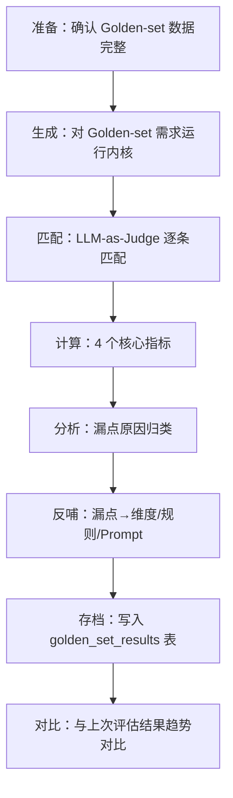
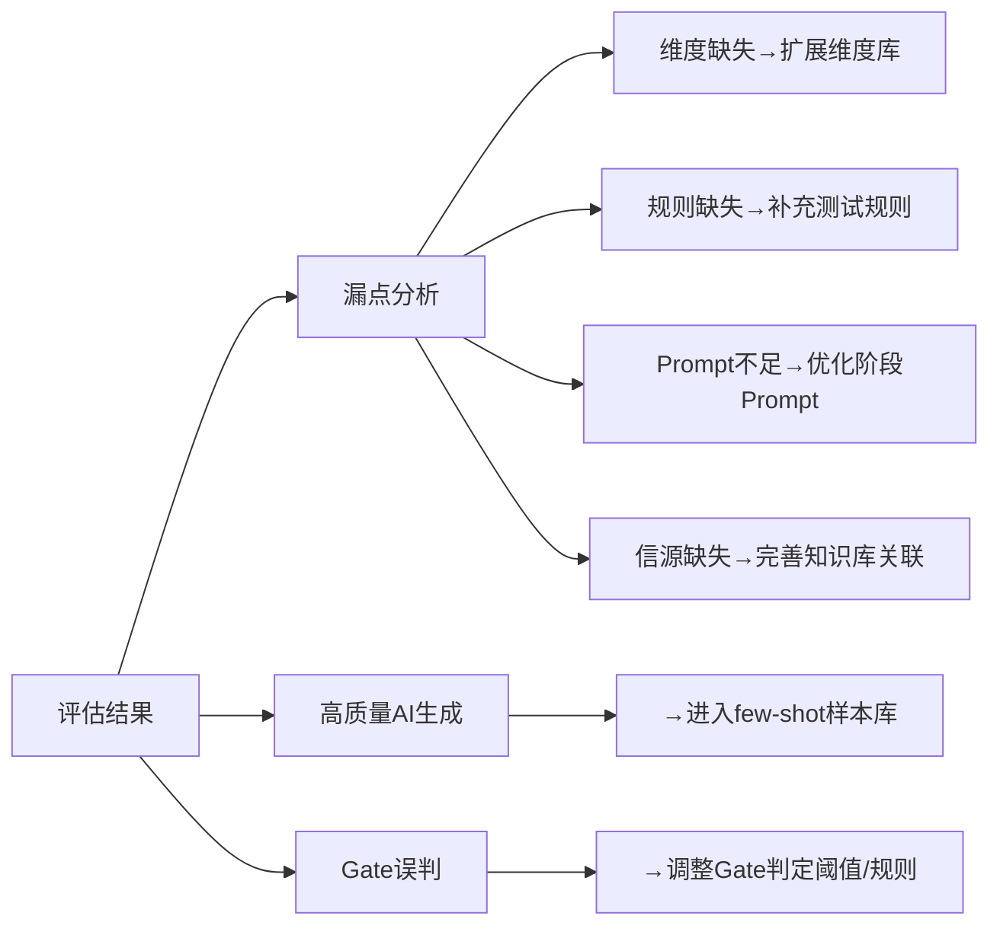

# testcase-generator 效果评估

> **评估定位：** 用 Golden-set 方法验证"AI 生成是否接近资深 QA 水准"，以最诚实的方式量化内核质量。
> 评估结果直接驱动质量飞轮的改进方向。
> 上游文档：[hld.md](./hld.md) | [design.md](./design.md)

---

## 1. 概览

| 字段 | 内容 |
|:--- | :--- |
| 评估对象 | testcase-generator 内核（LangGraph 6 阶段流水线） |
| 评估范围 | 用例生成质量（覆盖度、准确性、可用率）+ Gate 判定准确率 |
| 评估触发时机 | 每次内核迭代后（Prompt 变更、模型切换、维度库更新、流水线逻辑修改） |
| 主要关注维度 | 覆盖重合度 > AI 漏点率 > 直接可用率 > AI 新增有价值率 > Gate 准确率 |

---

## 2. Golden-set 评估方案

### 2.1 方案核心思路

不预设"正确率必须达到 X%"的数字——先建立对照组，观察 AI 与资深 QA 的差距，再从差距反推验收线。

**方法论：**
1. 挑选 3-5 个已被资深 QA 完整编写用例的真实需求
2. 用当前内核对同一需求重新生成用例
3. 对照 diff：量化覆盖度、漏点、新增价值
4. 分析漏点原因 → 反哺维度库/规则/Prompt
5. 每次迭代重跑，跟踪质量趋势

### 2.2 评估指标定义

| 指标 | 定义 | 计算公式 | 意义 |
|:--- | :--- | :--- | :--- |
| **覆盖重合度** | AI 生成的测试点中，与 QA 用例匹配的比例 | AI∩QA / QA总数 | 衡量 AI 是否覆盖了 QA 关注的点 |
| **AI 漏点率** | QA 有但 AI 没有的测试点占比 | (QA总数 - AI∩QA) / QA总数 | 衡量 AI 的遗漏程度 |
| **AI 新增有价值率** | AI 有但 QA 没有的测试点中，确实有价值的比例 | AI新增有价值 / AI新增总数 | 衡量 AI 是否能发现 QA 遗漏的点 |
| **直接可用率** | AI 生成的用例中无需修改可直接使用的比例 | 直接可用数 / AI总数 | 衡量 AI 输出的实际工程价值 |
| **Gate 准确率** | Gate 判定 NO_GO 时确实存在理解缺失的比例 | 正确NO_GO / NO_GO总数 | 衡量质量门的有效性 |

### 2.3 匹配规则

AI 生成的测试点/用例与 QA 已有用例的"匹配"判定：

| 匹配级别 | 判定规则 | 记分 |
|:--- | :--- | :--- |
| 完全匹配 | 同一功能点 + 同一维度 + 等效验证逻辑 | 1.0 |
| 部分匹配 | 同一功能点 + 同一维度 + 验证逻辑有差异 | 0.5 |
| 不匹配 | 功能点或维度不一致 | 0.0 |

**匹配判定方式：** LLM-as-Judge（GPT-4o），以结构化 prompt 输出匹配级别和理由。辅以人工抽样校验（≥20% 样本）。

---

## 3. 评估数据集构建

### 3.1 数据集选取原则

| 原则 | 说明 |
|:--- | :--- |
| 真实需求 | 必须来自团队实际业务，不造假数据 |
| 资深 QA 已写用例 | 该需求必须已由资深 QA 编写完整测试用例（作为 Ground Truth） |
| 覆盖多种类型 | 包含简单/复杂/跨系统/状态机等不同类型 |
| 知识库完整 | 该需求的相关技术文档、规则、Bug 已导入 knowledge-base |
| 数量 3-5 个 | 初期不贪多，每个做深做透 |

### 3.2 数据集结构

| 数据集编号 | 需求类型 | 复杂度 | QA 用例数 | 涉及系统 |
|:--- | :--- | :--- | :---: | :--- |
| GS-001 | 单系统 CRUD 需求 | 低 | 15-20 条 | 1 个 |
| GS-002 | 含状态机的流程需求 | 中 | 25-35 条 | 1 个 |
| GS-003 | 跨系统接口调用需求 | 高 | 30-40 条 | 2 个 |
| GS-004 | 含权限控制的需求 | 中 | 20-30 条 | 1 个 |
| GS-005 | 含性能要求的批量操作 | 高 | 25-35 条 | 1 个 |

### 3.3 数据集存储格式

```yaml
# tests/golden_sets/GS-001/golden_set.yaml
golden_set:
  id: "GS-001"
  requirement:
    doc_id: "doc-uuid-xxx"
    title: "漫剧系统-章节管理CRUD"
    type: "prd"
    system: "漫剧系统"
  ground_truth_cases:
    - id: "GT-001"
      title: "正常创建章节"
      test_point: "章节创建-功能正确性"
      dimension: "functional_correctness"
      priority: "P0"
      steps: [...]
      expected_results: [...]
      written_by: "资深QA-张三"
    - id: "GT-002"
      title: "章节名称边界值-最大长度"
      test_point: "章节创建-边界值"
      dimension: "boundary_value"
      priority: "P1"
      steps: [...]
      expected_results: [...]
      written_by: "资深QA-张三"
  metadata:
    created_date: "2026-06-05"
    qa_author: "张三"
    qa_experience_years: 5
    total_cases: 18
```

---

## 4. 评估执行流程

### 4.1 完整流程



### 4.2 详细执行步骤

**Step 1: 生成**
```python
async def run_golden_set_evaluation(golden_set_id: str) -> EvaluationRun:
    """对 Golden-set 需求运行内核生成用例"""
    golden_set = load_golden_set(golden_set_id)
    
    # 用当前内核生成（与正常生成流程完全一致）
    batch = await generate_test_cases(
        source_doc_id=golden_set.requirement.doc_id,
        config=DEFAULT_EVAL_CONFIG,
    )
    
    return EvaluationRun(
        golden_set=golden_set,
        generated_batch=batch,
    )
```

**Step 2: 匹配（LLM-as-Judge）**
```python
async def match_cases(
    ai_cases: list[TestCase], 
    gt_cases: list[GroundTruthCase]
) -> MatchResult:
    """使用 LLM 判断 AI 生成用例与 Ground Truth 的匹配度"""
    matches = []
    for gt_case in gt_cases:
        best_match = None
        best_score = 0.0
        for ai_case in ai_cases:
            score = await judge_match(ai_case, gt_case)
            if score > best_score:
                best_score = score
                best_match = ai_case
        matches.append(MatchPair(
            gt_case=gt_case,
            ai_case=best_match,
            match_score=best_score,
        ))
    return MatchResult(matches=matches)
```

**Step 3: 指标计算**
```python
def calculate_metrics(match_result: MatchResult, ai_cases: list) -> EvalMetrics:
    matched_count = sum(1 for m in match_result.matches if m.match_score >= 0.5)
    gt_total = len(match_result.matches)
    ai_total = len(ai_cases)
    ai_unmatched = [c for c in ai_cases if not is_matched(c, match_result)]
    
    return EvalMetrics(
        coverage_overlap=matched_count / gt_total,
        ai_miss_rate=(gt_total - matched_count) / gt_total,
        ai_valuable_addition_rate=count_valuable(ai_unmatched) / len(ai_unmatched) if ai_unmatched else 0,
        direct_usability_rate=count_usable(ai_cases) / ai_total,
    )
```

**Step 4: 漏点分析**
```python
def analyze_misses(match_result: MatchResult) -> list[MissAnalysis]:
    """对 AI 漏掉的测试点进行原因分析"""
    misses = [m for m in match_result.matches if m.match_score < 0.5]
    analyses = []
    for miss in misses:
        analysis = MissAnalysis(
            gt_case=miss.gt_case,
            miss_category=classify_miss(miss),  # 维度缺失/规则缺失/理解不足/...
            suggested_fix=suggest_fix(miss),     # 反哺建议
        )
        analyses.append(analysis)
    return analyses
```

### 4.3 漏点原因分类

| 原因类别 | 说明 | 反哺目标 |
|:--- | :--- | :--- |
| 维度缺失 | 该维度不在当前维度库中 | 扩展 DIMENSION_LIBRARY |
| 适用性裁剪错误 | 维度被错误裁剪（不适用判定有误） | 修正适用性矩阵 |
| 理解不足 | parse/comprehend 阶段未提取到关键信息 | 优化 parse prompt |
| 信源缺失 | knowledge-base 未提供足够上下文 | 完善关联关系 |
| Prompt 规则不足 | 现有 prompt 规则不覆盖该场景 | 补充 write-cases prompt |
| 领域知识缺乏 | 需要特定领域的隐含知识 | 补充测试规则到知识库 |

---

## 5. Gate 准确率评估

### 5.1 评估方法

对 Gate 的每次判定（GO/CONDITIONAL/NO_GO）进行回顾性评审：

| Gate 判定 | 评审方法 | 正确标准 |
|:--- | :--- | :--- |
| GO | 最终用例覆盖度 ≥ 80% | 理解确实充分，未因盲区漏测 |
| CONDITIONAL | 对应测试点确实标注了 confidence_note | 盲区确实存在但不影响核心 |
| NO_GO | 人工确认问题列表确实阻塞理解 | 不回答这些问题确实无法正确生成 |

### 5.2 Gate 误判分类

| 误判类型 | 定义 | 影响 |
|:--- | :--- | :--- |
| 漏放（False GO） | 理解不充分但 Gate 放行 | 最终用例有重大遗漏 |
| 误停（False NO_GO） | 理解已充分但 Gate 阻止 | 不必要地打断用户 |
| 阈值不当 | CONDITIONAL 应为 GO 或 NO_GO | 置信度标注意义不大 |

### 5.3 评估触发

Gate 准确率不单独触发评估，而是在每次 Golden-set 评估中作为附加维度记录：
- 记录该次生成的 Gate 判定
- 结合最终用例质量回判 Gate 是否正确
- 积累数据后统计 Gate 准确率趋势

---

## 6. 评估结果反哺机制

### 6.1 反哺流程



### 6.2 具体反哺路径

| 评估发现 | 反哺动作 | 目标文件/配置 |
|:--- | :--- | :--- |
| AI 漏掉某维度的测试点 | 将该维度添加到 DIMENSION_LIBRARY 或修正适用性 | `src/testcase_generator/dimensions.py` |
| AI 生成用例缺少某类检查 | 提取为测试规则文档导入 knowledge-base | `knowledge.documents (type=test_rule)` |
| AI 用例描述不够精确 | 优化 write-cases prompt 中的"精确到可执行"规则 | `src/testcase_generator/prompts/write_cases.md` |
| AI 未覆盖漏测 Bug 场景 | 确认 Bug→需求关联是否完整 | `knowledge.document_associations` |
| AI 用例直接可用（无修改） | 标记为 few-shot 候选 | `testcase.quality_flywheel` |
| Gate 误停 | 降低覆盖度阈值或调整 critical 判定规则 | `src/testcase_generator/nodes/gate.py` |
| Gate 漏放 | 提高覆盖度阈值或增加检查维度 | 同上 |

### 6.3 反哺效果验证

每次反哺后需重跑 Golden-set 评估验证改进效果：

```python
def verify_improvement(before_metrics: EvalMetrics, after_metrics: EvalMetrics) -> bool:
    """验证反哺后指标是否改善"""
    # 核心指标不能退化
    assert after_metrics.coverage_overlap >= before_metrics.coverage_overlap - 0.02
    assert after_metrics.ai_miss_rate <= before_metrics.ai_miss_rate + 0.02
    
    # 至少一个指标有改善
    improved = (
        after_metrics.coverage_overlap > before_metrics.coverage_overlap or
        after_metrics.ai_miss_rate < before_metrics.ai_miss_rate or
        after_metrics.direct_usability_rate > before_metrics.direct_usability_rate
    )
    return improved
```

---

## 7. 评估触发时机

| 触发事件 | 评估范围 | 阻断发布 |
|:--- | :--- | :---: |
| System Prompt 变更 | 全量 Golden-set | 是（核心指标不能退化超过 2%） |
| 维度库更新 | 全量 Golden-set | 是 |
| LLM 模型切换 | 全量 Golden-set | 是 |
| 流水线逻辑修改 | 全量 Golden-set | 是 |
| 质量飞轮数据更新 | 相关系统的 Golden-set | 否（仅记录） |
| 知识库重大变更 | 相关系统的 Golden-set | 否（仅记录） |

---

## 8. 评估报告格式

```yaml
evaluation_report:
  id: "eval-tg-20260605-001"
  kernel_version: "1.0.3"
  trigger: "prompt_change"
  date: "2026-06-05"
  
  overall_metrics:
    coverage_overlap: 0.78
    ai_miss_rate: 0.22
    ai_valuable_addition_rate: 0.45
    direct_usability_rate: 0.72
    gate_accuracy: 0.90
  
  per_golden_set:
    - golden_set_id: "GS-001"
      coverage_overlap: 0.85
      ai_miss_rate: 0.15
      ai_valuable_addition_rate: 0.50
      direct_usability_rate: 0.80
      notes: "简单CRUD场景表现良好"
    - golden_set_id: "GS-003"
      coverage_overlap: 0.65
      ai_miss_rate: 0.35
      ai_valuable_addition_rate: 0.40
      direct_usability_rate: 0.60
      notes: "跨系统场景有较多遗漏，主要因为系统间关联文档不完整"
  
  miss_analysis_summary:
    dimension_missing: 3
    applicability_error: 1
    understanding_gap: 2
    source_missing: 4
    prompt_insufficient: 2
    domain_knowledge_lacking: 1
  
  improvement_actions:
    - action: "添加'接口超时重试'到 cross_system 维度的 check_points"
      priority: "high"
      target: "dimensions.py"
    - action: "补充系统B的接口文档关联"
      priority: "high"
      target: "knowledge-base"
    - action: "优化 write-cases prompt 中对跨系统场景的描述规则"
      priority: "medium"
      target: "prompts/write_cases.md"
  
  trend:
    vs_previous:
      coverage_overlap_delta: +0.05
      ai_miss_rate_delta: -0.03
      direct_usability_rate_delta: +0.08
    direction: "improving"
```

---

## 9. LLM-as-Judge 配置

### 9.1 Judge 用于匹配判定

| 配置项 | 值 |
|:--- | :--- |
| Judge 模型 | GPT-4o（成本可控时）/ Claude 3.5 Sonnet（备选） |
| Judge Prompt | 存放于 `tests/evaluation/prompts/match_judge_v1.md` |
| 评分输出 | JSON `{match_level: "full"|"partial"|"none", score: 0.0-1.0, reason: "..."}` |
| 人工校验比例 | ≥ 20% 随机抽样 |

### 9.2 Judge Prompt 结构

```
你是测试用例匹配评审专家。判断 AI 生成的测试用例是否覆盖了 Ground Truth 测试用例的验证意图。

判定规则：
1. "完全匹配"(1.0)：同一功能点 + 同一维度 + 等效验证逻辑（步骤细节可不同）
2. "部分匹配"(0.5)：同一功能点 + 同一维度 + 验证逻辑有实质差异
3. "不匹配"(0.0)：功能点或维度不一致

注意：
- 步骤措辞不同但验证同一事物 = 完全匹配
- AI 用例更细（拆成 2 条覆盖 GT 的 1 条）= 完全匹配
- AI 用例验证了相同功能但从不同维度出发 = 不匹配

输入：
- Ground Truth 用例：[GT]
- AI 生成用例：[AI]

输出 JSON：
{
  "match_level": "full" | "partial" | "none",
  "score": 0.0 - 1.0,
  "reason": "判定理由"
}
```

### 9.3 Judge 可靠性校验

首次使用前需验证 Judge 与人工标注的一致性：
- 从 Golden-set 中随机抽取 30 对 (AI, GT) 样本
- 人工标注匹配级别
- LLM Judge 对同一样本打分
- 要求一致率 ≥ 85%（match_level 完全一致或仅差一级）

---

## 10. 当前基线与迭代计划

### 10.1 初始基线（MVP 阶段建立）

| 指标 | 目标基线 | 长期目标 | 说明 |
|:--- | :---: | :---: | :--- |
| 覆盖重合度 | 观察值（不预设） | ≥ 80% | MVP 先测量，再设目标 |
| AI 漏点率 | 观察值 | ≤ 20% | 同上 |
| AI 新增有价值率 | 观察值 | ≥ 40% | AI 能发现 QA 遗漏的点 |
| 直接可用率 | 观察值 | ≥ 70% | HLD 中的质量目标 |
| Gate 准确率 | 观察值 | ≥ 90% | Gate 误判率 < 10% |

### 10.2 迭代策略

每次内核迭代的评估-改进循环：

1. 修改内核代码/Prompt/维度库
2. 运行全量 Golden-set 评估
3. 对比上次结果，确认核心指标未退化
4. 分析新出现的漏点
5. 针对性反哺（维度/规则/Prompt）
6. 重跑评估验证改善
7. 合并代码，记录评估结果

---

## 2. 任务成功率指标（必填）

| 任务 | 成功定义 | 目标值 |
|:--- | :--- | :--- |
| 流水线完整执行 | 6 阶段全部通过，输出用例集 | > 95% |
| Gate 正确率 | NO_GO 时确实存在理解缺失 | > 90%（人工抽检） |
| 用例直接可用率 | 资深 QA review 无需修改 | > 70%（由 Golden-set 验证） |

## 3. LLM-as-Judge 评估（适用时填）

用于辅助评估生成用例质量（非主要评估手段，Golden-set 人工 diff 为主）：
- 评估维度：用例步骤可执行性、预期结果具体性、边界场景覆盖完整度
- Judge Prompt：提供评分标准 + 参考用例，让 LLM 对比评分
- 仅作为大批量筛选的辅助工具，最终质量判定以人工为准

## 4. Prompt 回归测试（Golden Set）（必填）

即 Golden-set 评估方案（本文档核心）：
- 数据集：3-5 个真实需求 + 资深 QA 已写用例
- 触发时机：每次内核 Prompt/流水线变更后
- 回归判定：覆盖重合度不低于上一版本；AI 漏点率不升高
- 详见本文档"Golden-set 评估方案"章节

## 5. 安全红队测试（必填）

| 测试场景 | 预期行为 |
|:--- | :--- |
| 需求文档含 Prompt Injection | System Prompt 不被覆盖，文档内容仅作 untrusted 输入 |
| 原型链接指向内网地址 | Playwright 白名单拦截，不访问 |
| 恶意需求文档试图提取 API Key | 输出净化，响应中无 Key 格式字符串 |

## 6. Cost / Latency 基准（必填）

| 指标 | 基准值 | 测试条件 |
|:--- | :--- | :--- |
| 单次生成 Token 消耗 | 观测记录，不设上限 | 质量优先 |
| 单次生成 LLM 费用 | 观测记录，不设上限 | 质量优先 |
| 各阶段延迟 | 观测记录，不设上限 | 质量优先 |

说明：本项目明确"生成质量 > 效率 > 成本"，不设 cost/latency 硬约束。基准仅用于观测趋势，不作为通过/失败判定。

## 7. 评估结论与改进计划（必填）

评估将在 MVP 阶段即建立（与首批真实需求同步）。改进闭环：
- AI 漏点 → 沉淀为维度/规则，补入维度矩阵
- 人写优于 AI 的用例 → 进入 few-shot 样本库
- 反复修改模式 → 提取为测试规则

## 附录

- 评估脚本：Python，自动匹配 AI 用例与人写用例的测试点对应关系
- 评估报告模板：覆盖重合度、漏点列表、新增有价值项列表
