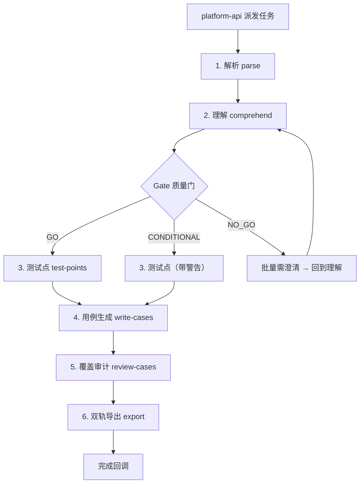

# AGENT-HLD: testcase-generator — AI 测试用例生成引擎

> **设计哲学：** 生成质量 > 效率 > 成本。内核采用分阶段流水线架构，每阶段一个专注的 LLM 调用 + schema 校验产物，通过 Gate 机制确保"理解不达标绝不生成"。
>
> **架构选型：** LangGraph（有向图编排）承载流水线，各阶段对应图节点，Gate 对应条件边，支持断点续跑。

---

## 1. 摘要

**交付物：** AI 资深测试工程师能力——输入需求文档，输出达到资深 QA 工程师水准的测试用例集。

**范围边界：**

- **包含：** 需求解析、多源理解（含 Gate 质量门）、测试点设计（维度矩阵驱动）、用例生成（含 provenance 追溯）、覆盖审计、双轨导出
- **不包含：** 知识库管理与存储（由 knowledge-base 提供）、用户认证/权限（由 platform-api 处理）、用例执行与自动化（后续迭代）

**核心约束：** 质量优先不设时间限制；支持 OpenAI GPT-4o 和 Claude 3.5 Sonnet；Gate NO_GO 时硬停不继续生成。

---

## 2. 技术上下文

| 项 | 值 |
|:--- | :--- |
| **实现语言 / 框架** | Python + LangGraph（有向图编排） |
| **技术栈模板** | 参见 `web-backend/hld`（platform-api 模块） |
| **支持的 LLM Provider** | OpenAI GPT-4o / Anthropic Claude 3.5 Sonnet |
| **Channel 接入层** | Celery 任务队列（由 platform-api 调度） |
| **记忆后端** | LangGraph Checkpoint（断点续跑）+ PostgreSQL（产物持久化） |
| **部署形态** | Celery Worker（异步任务消费者） |
| **所属 Phase** | Phase 1 |

---

## 3. 架构总览

testcase-generator 的核心是一条 **6 阶段流水线**，由 LangGraph 有向图编排。每阶段执行一个专注的 LLM 调用，产出结构化中间产物（schema 校验通过后才进入下一阶段）。质量引擎不是向量检索，而是**理解流水线 + 维度矩阵 + 信任顺序**。

选择流水线而非单 Agent Loop 的原因：
1. 方法论可承载——每阶段有明确的"怎么做好"的规则
2. 质量可控——Gate 机制在理解不达标时硬停
3. 中间产物可审查——每阶段输出可独立验证
4. 断点续跑——任何阶段失败可从该点重试，不必从头来



**组件说明：**

| 组件 | 职责 | 对应阶段 |
|:--- | :--- | :--- |
| parse | 结构化解析需求文档、技术文档、原型信息 | Stage 1 |
| comprehend | 建立理解报告（功能点×模块×信源映射） | Stage 2 |
| gate | 评估理解完整度，决定 GO/CONDITIONAL/NO_GO | Stage 2→3 |
| test-points | 基于维度矩阵生成测试点树 | Stage 3 |
| write-cases | 将测试点展开为完整用例（含 provenance） | Stage 4 |
| review-cases | 维度覆盖审计 + 异常维度补全 | Stage 5 |
| export | 内部全字段 YAML + 用户视图（markdown/Excel） | Stage 6 |

---

## 4. 流水线阶段详细设计

### Stage 1: 解析 (parse)

**输入：** 需求文档 + 关联的技术文档 + 测试规则 + 漏测 Bug + 可交互原型链接（由 knowledge-base 提供）

**处理：**
- 提取需求文档的功能点列表（每个功能点带 section 出处）
- 提取技术文档的接口/数据结构/约束条件
- 如有原型链接：通过 Playwright MCP 探索并记录交互行为（标记为辅助参考级）
- 构建信源清单（每条信息标注来源文档 + 具体段落）

**输出产物：** `parsed_context.yaml`（schema 校验）
```yaml
sources:
  - doc_id: "xxx"
    doc_type: "prd"  # prd | tech_doc | test_rule | bug_record | prototype
    trust_level: 1   # 1=最高(PRD) 2=技术稿 3=用户口述 4=UI 5=原型(mock)
    extracted_items: [...]
features:
  - id: "F001"
    name: "xxx"
    source_section: "PRD §2.3"
    verbatim_excerpt: "原文摘录"
```

**退出标准：** schema 校验通过；至少一个信源成功解析

---

### Stage 2: 理解 + Gate (comprehend)

**输入：** `parsed_context.yaml`

**处理：**
- 建立功能点×模块×信源的理解矩阵
- 识别信源冲突（按信任顺序仲裁：PRD > 技术稿 > 用户口述 > UI > 原型）
- 识别理解盲区（有功能点但无信源覆盖的区域）
- 评估理解完整度

**Gate 判定：**
| 判定 | 条件 | 行为 |
|:--- | :--- | :--- |
| GO | 所有核心功能点有信源覆盖，无高优先级冲突 | 直接进入 Stage 3 |
| CONDITIONAL | 存在非核心盲区或低优先级冲突 | 进入 Stage 3，但标注受影响的测试点为"置信度受限" |
| NO_GO | 核心功能点理解缺失 > 30%，或存在高优先级信源冲突 | 生成"需澄清"清单，批量返回给用户裁决后重跑本阶段 |

**输出产物：** `comprehension_report.yaml`
```yaml
gate_result: "GO"  # GO | CONDITIONAL | NO_GO
understanding_coverage: 0.85
conflicts: [...]
blind_spots: [...]
open_questions: [...]  # NO_GO 时批量提出
```

**退出标准：** Gate ≠ NO_GO（或用户已回答需澄清项后重跑）

---

### Stage 3: 测试点 (test-points)

**输入：** `parsed_context.yaml` + `comprehension_report.yaml`

**处理：**
- 基于维度方法论生成测试点树
- 维度矩阵驱动：每个功能点×适用维度（按 TP 类型和模块特征裁剪）
- 维度包括（不限于）：正常路径、边界值、异常路径、数据完整性、并发、权限、跨系统影响、性能、兼容性、状态机转换
- 适用性裁剪：UI 交互类功能不标并发维度；纯数据接口不标 UI 兼容性
- 引入历史漏测 Bug 对应的"必覆盖维度"

**输出产物：** `test_points.yaml`
```yaml
test_points:
  - id: "TP001"
    feature_id: "F001"
    dimension: "boundary"
    description: "xxx"
    derived_from: ["PRD §2.3", "漏测BUG-123"]
    priority: "P0"
```

**退出标准：** 每个核心功能点至少覆盖 3 个维度；schema 校验通过

---

### Stage 4: 用例生成 (write-cases)

**输入：** `test_points.yaml` + `parsed_context.yaml`

**处理：**
- 将每个测试点展开为完整测试用例（前置条件、步骤、预期结果）
- 每条用例标注 provenance（derived_from + source_section + verbatim_excerpt）
- 可交互原型来源的用例额外标注"含原型探索，信源等级=5"
- 步骤描述精确到可执行级别（无歧义动词 + 具体数值）
- 不设数量上限（R-10 详尽优先，只设下界不设上界）

**输出产物：** `test_cases.yaml`
```yaml
test_cases:
  - id: "TC001"
    test_point_id: "TP001"
    title: "xxx"
    preconditions: [...]
    steps: [...]
    expected_results: [...]
    priority: "P0"
    dimensions: ["boundary", "data_integrity"]
    provenance:
      derived_from: ["PRD §2.3"]
      source_section: "2.3 订单创建"
      verbatim_excerpt: "原文摘录"
      trust_level: 1
    confidence_note: ""  # 仅当 trust_level >= 4 时填写风险说明
```

**退出标准：** 每个测试点至少一条用例；schema 校验通过；无 trust_level=5 的用例缺少 confidence_note

---

### Stage 5: 覆盖审计 (review-cases)

**输入：** `test_cases.yaml` + `test_points.yaml`

**处理：**
- 维度覆盖度审计：对比测试点与用例的维度覆盖情况
- 发现遗漏维度时补生用例（回到 Stage 4 的子循环）
- 校验信任顺序一致性（用例结论不与高优先级信源矛盾）
- 标注维度覆盖度报告

**输出产物：** `audit_report.yaml`
```yaml
coverage:
  total_test_points: 42
  covered_test_points: 42
  dimension_coverage: 0.93
gaps: []  # 为空说明审计通过
additions: [...]  # 审计过程中补充的用例
```

**退出标准：** 覆盖度 ≥ 90%；无核心功能点的维度缺失

---

### Stage 6: 双轨导出 (export)

**输入：** `test_cases.yaml` + `audit_report.yaml`

**处理：**
- 内部全字段：YAML 格式，保留所有 provenance/dimensions/信源信息
- 用户视图：按用户提供的导出格式规范转换（markdown 先评审 → 批准后出 Excel）
- 视图是数据的投影，不丢失内部信息

**输出产物：**
- 内部：`test_cases.yaml`（已在 Stage 4 产出，本阶段不改）
- 视图：`test_cases_review.md`（markdown 评审版）+ 用户确认后导出 Excel

---

## 4. Agent Loop 设计 (必填)

**循环模式：** 非传统 Agent Loop。采用 LangGraph StateGraph 6 阶段确定性流水线（parse → comprehend → gate → test-points → write-cases → review-cases → export）。每阶段是独立的 LLM 调用节点，不是"推理→行动→观察"的循环。

**Turn 生命周期：** 不适用（非对话式 Agent）。本模块的"一次执行"等于完整流水线的一次遍历。

**关键限制：**

| 参数 | 值 | 说明 |
|:--- | :--- | :--- |
| 阶段数 | 6 | 固定流水线阶段数 |
| Schema 重试 | 3 次 | 单阶段 LLM 输出 schema 校验失败最多重试 3 次 |
| Gate 澄清轮次 | 不限 | 用户可多次回答澄清后重试理解阶段 |

**多 Agent 协调：** 不适用。单一 LangGraph 执行图，无子 Agent 派发。

---

## 5. LLM Provider 与 Prompt 管理

**Provider 接口：** LangGraph 原生的 ChatModel 接口（支持 OpenAI / Anthropic）

**切换策略：** 运行时配置热切换 + 失败自动 Fallback（OpenAI ↔ Claude 互备）

**System Prompt 结构（按阶段定制）：**

每阶段 Skill 的 system prompt 由以下部分组成：
1. **角色定义**：你是资深测试工程师，在 [当前阶段] 负责 [阶段职责]
2. **方法论约束**：维度矩阵 / 信任顺序 / 详尽优先规则
3. **输出 schema**：严格遵守的 YAML 结构定义
4. **退出标准**：完成判定条件

**Context 管理：**
- 每阶段输入为上一阶段的结构化产物（YAML），不是原始文档全文
- 原始文档仅在 Stage 1 (parse) 阶段读取一次，后续阶段通过结构化引用
- 避免 context 膨胀：结构化产物远小于原始文档

---

## 6. Skills 体系

> 本模块不对外暴露 Skills。各阶段本身是流水线中的"内部 skill"，由 LangGraph 编排调度。

不适用。

---

## 7. 工具体系

**工具分级：**

| 风险级别 | 工具 | 执行策略 |
|:--- | :--- | :--- |
| 低（只读） | knowledge_base_retrieve（检索知识库）| 直接执行 |
| 低（只读） | get_test_rules（获取测试规则）| 直接执行 |
| 低（只读） | get_bug_records（获取漏测记录）| 直接执行 |
| 中（外部交互）| playwright_explore（原型探索）| 域名白名单限制，不设时间上限 |
| 低（内部）| schema_validate（schema 校验）| 直接执行 |

**执行管道：** LangGraph 节点内通过 tool_use/function_calling 调用 → 参数 schema 校验 → 执行 → 结果注入状态

**Human-in-the-Loop：**
- Gate NO_GO 时：批量需澄清清单返回给用户，等待回答后继续
- review 阶段：用例生成完毕后等待 QA review 确认

---

## 8. 记忆架构

| 层级 | 名称 | 生命周期 | 存储位置 | 典型内容 |
|:--- | :--- | :--- | :--- | :--- |
| L1 | 流水线状态 | 单次生成任务 | LangGraph Checkpoint | 当前阶段、各阶段产物 |
| L2 | 任务记录 | 持久化 | PostgreSQL | 任务状态、生成结果、review 历史 |
| L3 | 质量飞轮 | 持久化 | PostgreSQL | (AI生成版, QA终版, 修改理由) 三元组、few-shot 样本 |

**Scope 隔离：** 每次生成任务独立的 LangGraph 执行图，不共享状态。质量飞轮数据全局共享（跨任务学习）。

**注入时机：**
- Stage 1 (parse)：从 knowledge-base 检索相关文档和历史用例
- Stage 4 (write-cases)：注入 few-shot 样本（来自质量飞轮的高质量用例）

---

## 9. 安全设计

| 威胁 | 防御措施 |
|:--- | :--- |
| Prompt Injection | 需求文档内容标记为 untrusted data，置于 User Message；System Prompt 不可被覆盖 |
| 路径遍历 | Playwright 仅允许访问预配置的原型域名白名单 |
| 密钥泄漏 | LLM API Key 由 Worker 主进程持有，不传递给 LLM context |
| 资源耗尽 | LLM 单次调用 Token 上限 8000；各阶段 schema 校验失败最多重试 3 次 |
| 数据泄漏 | 用例产物中不包含 API Key、内部路径等敏感信息 |

---

## 10. 观测与运维

**质量目标：**

| 指标 | 目标值 | 测试条件 |
|:--- | :--- | :--- |
| 用例直接可用率 | > 70% | 资深 QA review（由 golden-set 评估验证） |
| Gate 准确率 | NO_GO 时确实存在理解缺失 | 人工抽检 |
| 生成成功率 | > 95% | 非 Gate NO_GO 情况 |
| Provider 可用性 | ≥ 99.5% | 含 Fallback 切换后 |

**关键监控指标：**

| 指标 | 说明 |
|:--- | :--- |
| `stage_duration_ms` | 各阶段执行耗时（仅观测，不作限制） |
| `gate_result` | Gate 判定分布（GO/CONDITIONAL/NO_GO 比例） |
| `cases_generated` | 单次生成用例数量 |
| `tokens_consumed` | 各阶段 Token 消耗 |
| `flywheel_hit_rate` | few-shot 样本命中率 |

**日志范围：** pipeline / parse / comprehend / gate / testpoints / write / review / export / tools

---

## 11. 失败模式与降级

| 失败场景 | 影响 | 降级策略 | 恢复方式 |
|:--- | :--- | :--- | :--- |
| LLM Provider 不可达 | 当前阶段无法执行 | Fallback 切换另一 Provider；两个都不可用则挂起等待 | Provider 恢复后从 checkpoint 继续 |
| knowledge-base 检索失败 | Stage 1 缺少上下文 | 仅基于需求文档本身解析，标注"上下文不完整" | knowledge-base 恢复后可重跑 Stage 1 |
| Playwright 探索失败 | 无法获取原型信息 | 跳过原型探索，基于文字描述生成，不影响主流程 | 原型可达后可补跑 |
| Schema 校验失败 | 阶段产物格式不合规 | 重试当前阶段（最多 3 次）；仍失败则标记异常人工介入 | 修复后从当前阶段重跑 |
| PostgreSQL 不可达 | 结果无法持久化 | 将产物缓存到 Redis（TTL 1小时），等待 DB 恢复 | DB 恢复后补偿写入 |

---

## 12. 质量飞轮设计 (S5)

**核心机制：** 存储 `(AI 生成版, QA 终版, 修改理由)` 三元组

**数据流：**
1. AI 生成用例 → QA review 修改 → 落库时同时存储三元组
2. 分析修改模式：
   - 高质量用例（无修改直接确认）→ 进入 few-shot 样本库
   - 反复修改的模式 → 提取为规则补充到测试规则库
   - 漏测 Bug → 固化为"必覆盖维度"

**反哺生成：**
- Stage 4 (write-cases) 注入同系统的高质量 few-shot 样本
- Stage 3 (test-points) 注入从漏测 Bug 固化的必覆盖维度

---

## 13. Golden-set 评估方案 (C1)

**目的：** 用最诚实的方式验证"AI 生成是否接近资深水准"

**方法：**
1. 挑 3-5 个真实需求（资深 QA 已写过用例）
2. 用新内核对同一需求生成用例
3. 对照 diff：覆盖重合度 / AI 漏点 / AI 新增有价值项
4. 反推验收线（不预先拍数字）
5. diff 出的"AI 漏点"沉淀为维度/规则（反哺飞轮）

**执行时机：** MVP 阶段即建立，每次内核迭代后重跑

---

## 14. 维度方法论 + 信任顺序

### 14.1 信任顺序（不可配置）

| 等级 | 信源类型 | 说明 |
|:--- | :--- | :--- |
| 1（最高） | PRD 需求文档 | 文字描述为最高标准 |
| 2 | 技术设计文档 | 实现约束和接口定义 |
| 3 | 用户口述/补充说明 | review 时的口头澄清 |
| 4 | UI 设计稿 | 视觉和交互规范 |
| 5（最低） | 可交互原型 (mock) | AI 生成的原型可能有 bug，仅辅助理解 |

**冲突仲裁：** 按等级高的为准；同等级冲突标注为"需澄清"。

### 14.2 维度方法论

维度库（不限于）：
- 功能正确性、边界值、异常路径、数据完整性
- 并发/竞态、权限控制、跨系统影响、状态机转换
- 性能边界、兼容性、可用性、安全性

**适用性矩阵：** 按测试点类型×模块特征裁剪适用维度（如 UI 交互类不标并发；纯数据接口不标 UI 兼容性）。

---

## 15. 概要设计确认

- [x] 技术范围已界定
- [x] 架构方向已探索并选定（LangGraph 流水线）
- [x] 架构方案已确认（6 阶段 + Gate + 质量飞轮 + golden-set）
- [x] 技术选型符合宪章（简洁优先、模块化、质量优先）
- [x] 无待研究事项

👉 确认后进入详细设计阶段（`/xf/detail`）
