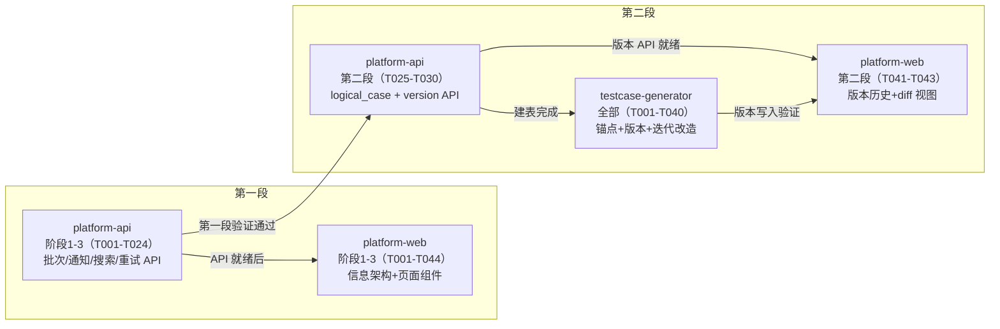

# 跨模块协调视图 — CHG-20260609-001

> 用例可视化与平台信息架构重构

---

## 1. 模块任务索引

| 模块 | 类型 | 任务数 | 路径 |
|:---|:---|:---|:---|
| platform-api | web-backend | 40 | [task.delta.md](./platform-api/task.delta.md) |
| platform-web | web-frontend | 54 | [task.delta.md](./platform-web/task.delta.md) |
| testcase-generator | ai-agent | 40 | [task.delta.md](./testcase-generator/task.delta.md) |

---

## 2. 跨模块执行顺序

**推荐启动顺序**：
1. **platform-api 第一段**先行（其他模块依赖其 API）
2. **platform-web 第一段**可在 API 阶段 2 完成后并行启动（前端可先 Mock）
3. **platform-api 第二段**在第一段验证通过后启动
4. **testcase-generator** 和 **platform-web 第二段**在 API 第二段建表/API 就绪后启动

---

## 3. 跨模块集成任务

| 编号 | 任务 | 相关模块 | 依赖 | 优先级 |
|:---|:---|:---|:---|:---|
| I001 | 前后端 API 联调（第一段）：验证 11 个新端点请求/响应格式一致 | platform-api, platform-web | T024@platform-api, T044@platform-web | P0 |
| I002 | trust_level 语义对齐验证：确认前端按 1-2=高/3-4=中/5=低 正确映射 | platform-api, platform-web | T022@platform-api, T045@platform-web | P0 |
| I003 | 通知端到端验证：触发生成完成 → 回调创建通知 → 前端轮询展示 Badge → 点击跳转 | platform-api, platform-web | T015@platform-api, T029@platform-web | P0 |
| I004 | 搜索端到端验证：前端输入关键词 → API pg_trgm 搜索 → 结果列表渲染 | platform-api, platform-web | T019@platform-api, T039@platform-web | P1 |
| I005 | 失败重试端到端验证：前端点击重试 → API checkpoint resume → 状态恢复 | platform-api, platform-web | T021@platform-api, T034@platform-web | P1 |
| I006 | 前后端 API 联调（第二段）：验证版本历史/diff 3 个端点 | platform-api, platform-web, testcase-generator | T030@platform-api, T043@platform-web, T032@testcase-generator | P1 |
| I007 | 锚点匹配端到端验证：触发重新生成 → 锚点匹配 → version 写入 → 前端版本历史可查 | platform-api, testcase-generator, platform-web | T030@platform-api, T032@testcase-generator, T043@platform-web | P1 |
| I008 | needs_human_confirm 交互验证：embedding 匹配 → 前端展示确认入口 → 确认/拒绝操作 | platform-api, platform-web, testcase-generator | T030@platform-api, T044@platform-web, T027@testcase-generator | P1 |

---

## 4. 质量门禁

| 门禁项 | 通过标准 | 检验方式 |
|:---|:---|:---|
| 任务完成度 | 所有 P0 任务已完成 | task.md checkbox 全勾选 |
| 前后端联调 | I001-I005 全部通过 | 联调测试报告 |
| 验收覆盖 | 所有 AC-xx 编号均有对应任务覆盖 | AC 追溯矩阵检查 |
| 单元测试 | 覆盖率 ≥ 80%（新增代码） | pytest --cov / jest --coverage |
| E2E 测试 | 核心流程（生成→通知→查看→搜索）自动化验证 | Playwright E2E |
| 性能基线 | 用例树 500 条 < 2s；搜索 < 3s；轮询不影响主线程 | 压测报告 |
| 代码审查 | 所有 PR 通过 Code Review | GitHub PR 记录 |
| 部署前检查 | DB 迁移脚本可回滚；无破坏性 schema 变更 | Alembic downgrade 测试 |

---

## 5. 风险与注意事项

| 风险 | 影响 | 缓解措施 |
|:---|:---|:---|
| pg_trgm 中文搜索效果不佳 | 搜索准确率低 | 预留 pg_jieba 升级路径；先验证 500 条内表现 |
| Embedding 语义匹配误配 | 用例版本错误关联 | 阈值配置化 + golden-set 校准 + needs_human_confirm 兜底 |
| 第一段/第二段边界不清 | 开发时误改第一段已稳定代码 | 代码层面：第一段 case-tree SQL 不引用 case_versions |
| 通知轮询性能 | 前端主线程阻塞 | 仅请求 unread-count（极轻量）；静默失败不中断 |
