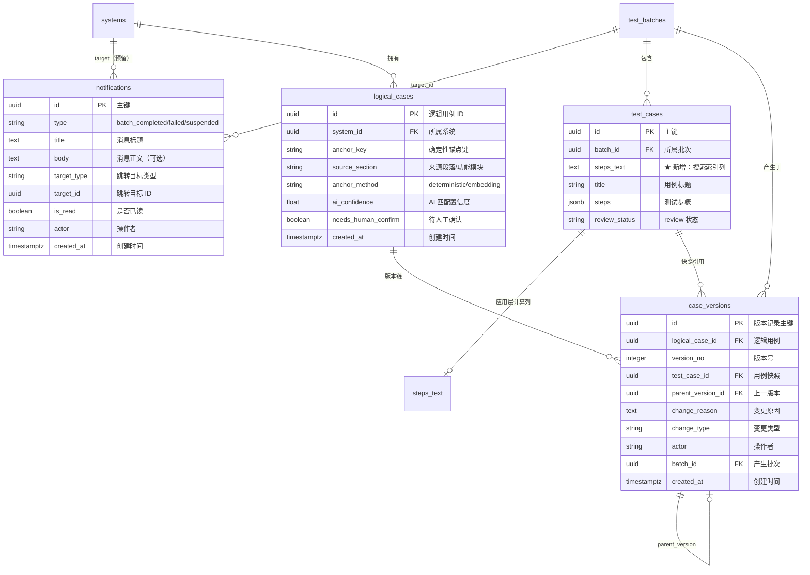

# platform-api 数据模型变更 — CHG-20260609-001

> 基线：xspec/modules/platform-api/data-model.md v1.0

## 0. 文档信息

| 属性 | 内容 |
| :--- | :--- |
| **所属变更** | CHG-20260609-001 |
| **基线版本** | platform-api/data-model.md v1.0 |
| **变更类型** | modified |
| **创建时间** | 2026-06-09 |

---

## 1. 变更概述

| 变更项 | 类型 | 段落 |
| :--- | :--- | :--- |
| 新增 `notifications` 表 | CREATE TABLE | 第一段 |
| `test_cases` 表新增 `steps_text` 列 | ALTER TABLE ADD COLUMN | 第一段 |
| 新增 `steps_text` GIN 索引 | CREATE INDEX | 第一段 |
| 启用 `pg_trgm` 扩展 | CREATE EXTENSION | 第一段 |
| 新增 `logical_cases` 表 | CREATE TABLE | 第二段 |
| 新增 `case_versions` 表 | CREATE TABLE | 第二段 |

---

## 2. 数据库表结构变更

### 2.1 新增 notifications 表（public schema，第一段）

```sql
-- 站内通知消息表
CREATE TABLE public.notifications (
    id              UUID            PRIMARY KEY DEFAULT gen_random_uuid(),
    type            VARCHAR(50)     NOT NULL,
    title           TEXT            NOT NULL,
    body            TEXT,
    target_type     VARCHAR(50),
    target_id       UUID,
    is_read         BOOLEAN         NOT NULL DEFAULT FALSE,
    actor           VARCHAR(100)    NOT NULL DEFAULT 'system',
    created_at      TIMESTAMPTZ     NOT NULL DEFAULT NOW()
);

-- 约束说明
-- type 枚举：batch_completed / batch_failed / batch_suspended
-- target_type 枚举：batch（预留扩展 document / case）
-- actor 预留多人协作场景，MVP 阶段固定为 'system'

COMMENT ON TABLE public.notifications IS '站内通知消息';
COMMENT ON COLUMN public.notifications.type IS '消息类型：batch_completed/batch_failed/batch_suspended';
COMMENT ON COLUMN public.notifications.target_type IS '跳转目标类型：batch';
COMMENT ON COLUMN public.notifications.target_id IS '跳转目标实体 ID';
COMMENT ON COLUMN public.notifications.actor IS '操作者，默认 system';
```

**索引**：

```sql
-- 未读消息快速查询（部分索引，仅索引未读记录）
CREATE INDEX idx_notifications_unread 
    ON public.notifications(is_read, created_at DESC) 
    WHERE is_read = FALSE;

-- 按 target 查关联通知（如批次关联通知列表）
CREATE INDEX idx_notifications_target 
    ON public.notifications(target_type, target_id);
```

---

### 2.2 test_cases 表变更（testcase schema，第一段）

```sql
-- 启用 pg_trgm 扩展（支持中文模糊搜索）
CREATE EXTENSION IF NOT EXISTS pg_trgm;

-- 新增 steps_text 列用于全文搜索
ALTER TABLE testcase.test_cases 
    ADD COLUMN steps_text TEXT;

-- 计算填充说明：
-- 由 DB 触发器在 INSERT/UPDATE 时自动计算（非应用层）
-- steps_text = title + ' ' + concat(steps[*].action, ' ')
-- 示例值："登录验证-正确密码 输入用户名admin 输入密码123456 点击登录按钮"
-- 选择触发器而非应用层的原因：写入路径在 testcase_generator（第一段冻结），无法修改

COMMENT ON COLUMN testcase.test_cases.steps_text IS '搜索索引列：title + steps 所有 action 文本拼接，DB 触发器维护';

-- GIN trigram 索引加速模糊搜索
CREATE INDEX idx_test_cases_trgm 
    ON testcase.test_cases 
    USING GIN (steps_text gin_trgm_ops);
```

---

### 2.3 新增 logical_cases 表（testcase schema，第二段）

```sql
-- 逻辑用例表：跨批次的用例身份锚点
CREATE TABLE testcase.logical_cases (
    id                  UUID            PRIMARY KEY DEFAULT gen_random_uuid(),
    system_id           UUID            NOT NULL REFERENCES public.systems(id) ON DELETE RESTRICT,
    anchor_key          VARCHAR(512)    NOT NULL,
    source_section      VARCHAR(200)    NOT NULL,
    anchor_method       VARCHAR(20)     NOT NULL DEFAULT 'deterministic',
    ai_confidence       FLOAT,
    needs_human_confirm BOOLEAN         NOT NULL DEFAULT FALSE,
    created_at          TIMESTAMPTZ     NOT NULL DEFAULT NOW()
);

-- 约束说明
-- anchor_key 格式：md5(system_id|source_section|primary_dimension|tp_desc_fingerprint)
-- anchor_method 枚举：deterministic / embedding（未匹配到已有 logical_case 时设为 deterministic）
-- ai_confidence：仅 anchor_method='embedding' 时有值，范围 0.0-1.0
-- needs_human_confirm：anchor_method='embedding' 时为 true，需人工确认

COMMENT ON TABLE testcase.logical_cases IS '逻辑用例身份锚点，跨批次追踪用例演化';
COMMENT ON COLUMN testcase.logical_cases.anchor_key IS '确定性锚点键：md5 hex string';
COMMENT ON COLUMN testcase.logical_cases.anchor_method IS '锚定方式：deterministic（确定性匹配）/ embedding（向量语义匹配）';
```

**索引**：

```sql
-- 锚点唯一索引：同一系统内 anchor_key 唯一
CREATE UNIQUE INDEX idx_logical_cases_anchor 
    ON testcase.logical_cases(system_id, anchor_key);

-- 按系统查逻辑用例列表
CREATE INDEX idx_logical_cases_system 
    ON testcase.logical_cases(system_id);

-- 待人工确认的逻辑用例筛选
CREATE INDEX idx_logical_cases_confirm 
    ON testcase.logical_cases(needs_human_confirm) 
    WHERE needs_human_confirm = TRUE;

-- 同 section 候选查询（embedding 兜底时使用）
CREATE INDEX idx_logical_cases_section 
    ON testcase.logical_cases(system_id, source_section);
```

---

### 2.4 新增 case_versions 表（testcase schema，第二段）

```sql
-- 用例版本记录表：记录逻辑用例每次变更的快照
CREATE TABLE testcase.case_versions (
    id                  UUID            PRIMARY KEY DEFAULT gen_random_uuid(),
    logical_case_id     UUID            NOT NULL REFERENCES testcase.logical_cases(id) ON DELETE CASCADE,
    version_no          INTEGER         NOT NULL,
    test_case_id        UUID            NOT NULL REFERENCES testcase.test_cases(id) ON DELETE CASCADE,
    parent_version_id   UUID            REFERENCES testcase.case_versions(id) ON DELETE SET NULL,
    change_reason       TEXT,
    change_type         VARCHAR(30)     NOT NULL,
    actor               VARCHAR(100)    NOT NULL DEFAULT 'ai',
    batch_id            UUID            NOT NULL REFERENCES testcase.test_batches(id) ON DELETE RESTRICT,
    created_at          TIMESTAMPTZ     NOT NULL DEFAULT NOW()
);

-- 约束说明
-- version_no：从 1 递增，同一 logical_case 内唯一
-- change_type 枚举：ai_gen / iteration / ai_regen / requirement_change / human_edit
-- actor：'ai' 或具体用户名
-- parent_version_id：指向上一版本，第一版为 NULL

COMMENT ON TABLE testcase.case_versions IS '用例版本记录，追踪逻辑用例的演化历史';
COMMENT ON COLUMN testcase.case_versions.version_no IS '版本号，同一逻辑用例内递增';
COMMENT ON COLUMN testcase.case_versions.change_type IS '变更类型：ai_gen/iteration/ai_regen/requirement_change/human_edit';
COMMENT ON COLUMN testcase.case_versions.parent_version_id IS '上一版本 ID，构成版本链';
```

**索引**：

```sql
-- 版本号唯一约束：同一逻辑用例内版本号不重复
CREATE UNIQUE INDEX idx_case_versions_unique 
    ON testcase.case_versions(logical_case_id, version_no);

-- 按逻辑用例查版本历史（排序用）
CREATE INDEX idx_case_versions_logical_case 
    ON testcase.case_versions(logical_case_id, version_no DESC);

-- 按批次查版本记录
CREATE INDEX idx_case_versions_batch 
    ON testcase.case_versions(batch_id);

-- 按 test_case_id 反查版本
CREATE INDEX idx_case_versions_test_case 
    ON testcase.case_versions(test_case_id);
```

---

## 3. 实体关系图



---

## 4. 索引设计说明

| 索引名 | 表 | 类型 | 用途/查询场景 | 说明 |
| :--- | :--- | :--- | :--- | :--- |
| `idx_notifications_unread` | notifications | B-tree 部分索引 | `GET /notifications/unread-count`：快速统计未读数；`GET /notifications`：按时间倒序取未读消息 | WHERE is_read = FALSE 减少索引体积 |
| `idx_notifications_target` | notifications | B-tree | 按 target_type + target_id 查某实体关联的所有通知 | 预留场景：批次详情页展示关联消息 |
| `idx_test_cases_trgm` | test_cases | GIN (gin_trgm_ops) | `GET /cases/search`：pg_trgm 模糊搜索，支持 `%` 操作符和 `similarity()` 排序 | 需先启用 pg_trgm 扩展 |
| `idx_logical_cases_anchor` | logical_cases | B-tree 唯一 | 锚点匹配时精确查找：`SELECT FROM logical_cases WHERE system_id=:s AND anchor_key=:k` | 保证同系统内锚点唯一性 |
| `idx_logical_cases_system` | logical_cases | B-tree | 按系统查逻辑用例列表 | 系统详情页展示 |
| `idx_logical_cases_confirm` | logical_cases | B-tree 部分索引 | 筛选待人工确认的 AI 匹配项 | WHERE needs_human_confirm = TRUE |
| `idx_case_versions_unique` | case_versions | B-tree 唯一 | 版本号唯一约束，防止并发写入导致版本号冲突 | (logical_case_id, version_no) |
| `idx_case_versions_logical_case` | case_versions | B-tree | `GET /cases/:id/versions`：查版本历史列表 | 按 version_no DESC 排序 |
| `idx_case_versions_batch` | case_versions | B-tree | 按批次查该批次产生的所有版本记录 | 批次统计用 |
| `idx_case_versions_test_case` | case_versions | B-tree | 从 test_case_id 反查其版本归属 | 用例详情面板展示版本信息 |

---

## 5. 迁移方案

### 5.1 Alembic 迁移文件列表

| 顺序 | 文件名 | 内容 | 段落 | 依赖 |
| :---: | :--- | :--- | :--- | :--- |
| 1 | `20260609_001_create_notifications.py` | 创建 notifications 表 + 索引 | 第一段 | 无 |
| 2 | `20260609_002_enable_pg_trgm.py` | CREATE EXTENSION IF NOT EXISTS pg_trgm | 第一段 | 无 |
| 3 | `20260609_003_add_steps_text_column.py` | ALTER TABLE test_cases ADD COLUMN steps_text + GIN 索引 | 第一段 | #2 |
| 4 | `20260609_004_backfill_steps_text.py` | 数据回填：为现有 test_cases 计算 steps_text | 第一段 | #3 |
| 5 | `20260609_005_add_steps_text_trigger.py` | BEFORE INSERT/UPDATE 触发器自动维护 steps_text | 第一段 | #3 |
| 6 | `20260610_001_create_logical_cases.py` | 创建 logical_cases 表（含 source_section 列）+ 索引 | 第二段 | 无 |
| 7 | `20260610_002_create_case_versions.py` | 创建 case_versions 表 + 索引 + 外键 | 第二段 | #6 |

### 5.2 迁移注意事项

- **#3 steps_text 列**：添加为可空列（允许 NULL），不设 NOT NULL 约束，避免锁表。现有数据通过 #4 回填。
- **#4 回填脚本**：使用批次更新（每次 1000 条），避免长事务锁表：
  ```python
  # 回填逻辑
  def upgrade():
      op.execute("""
          UPDATE testcase.test_cases 
          SET steps_text = title || ' ' || (
              SELECT string_agg(elem->>'action', ' ')
              FROM jsonb_array_elements(steps) AS elem
          )
          WHERE steps_text IS NULL
          AND id IN (SELECT id FROM testcase.test_cases WHERE steps_text IS NULL LIMIT 1000)
      """)
  ```
- **#5 触发器**：`BEFORE INSERT OR UPDATE OF title, steps` 自动计算 steps_text，覆盖所有写入路径（含冻结的 testcase_generator 模块）。选择触发器而非应用层的原因：写入路径全在 testcase_generator（第一段冻结不可修改），只有 DB 触发器能透明拦截。
- **#2 pg_trgm**：需要 PostgreSQL superuser 权限或已预装扩展，部署前确认环境可用。
- **回滚策略**：每个迁移提供 `downgrade()`，其中 #4 回填的回滚为 `SET steps_text = NULL`。

### 5.3 外键约束新增

| 外键字段 | 引用表.字段 | ON DELETE | ON UPDATE | 说明 |
| :--- | :--- | :---: | :---: | :--- |
| `logical_cases.system_id` | `systems.id` | RESTRICT | CASCADE | 有逻辑用例的系统不可删除 |
| `case_versions.logical_case_id` | `logical_cases.id` | CASCADE | CASCADE | 删除逻辑用例级联删除版本 |
| `case_versions.test_case_id` | `test_cases.id` | CASCADE | CASCADE | 删除用例级联删除版本引用 |
| `case_versions.parent_version_id` | `case_versions.id` | SET NULL | CASCADE | 删除父版本不影响子版本 |
| `case_versions.batch_id` | `test_batches.id` | RESTRICT | CASCADE | 有版本记录的批次不可删除 |

---

## 6. SQLAlchemy Model 定义

### 6.1 Notification 模型

```python
# app/models/public.py

from sqlalchemy import Column, String, Text, Boolean, DateTime
from sqlalchemy.dialects.postgresql import UUID
from app.models.base import Base
import uuid
from datetime import datetime, timezone


class Notification(Base):
    __tablename__ = "notifications"
    __table_args__ = {"schema": "public"}

    id = Column(UUID(as_uuid=True), primary_key=True, default=uuid.uuid4)
    type = Column(String(50), nullable=False)  # batch_completed / batch_failed / batch_suspended
    title = Column(Text, nullable=False)
    body = Column(Text, nullable=True)
    target_type = Column(String(50), nullable=True)  # batch
    target_id = Column(UUID(as_uuid=True), nullable=True)
    is_read = Column(Boolean, nullable=False, default=False)
    actor = Column(String(100), nullable=False, default="system")
    created_at = Column(
        DateTime(timezone=True), 
        nullable=False, 
        default=lambda: datetime.now(timezone.utc)
    )
```

### 6.2 test_cases 模型增强

```python
# app/models/testcase.py（增量变更）

class TestCase(Base):
    # ... 现有字段 ...
    
    # ★ 新增字段
    steps_text = Column(Text, nullable=True)  # 搜索索引列，应用层维护
```

### 6.3 LogicalCase 模型（第二段）

```python
# app/models/testcase.py

class LogicalCase(Base):
    __tablename__ = "logical_cases"
    __table_args__ = (
        UniqueConstraint("system_id", "anchor_key", name="idx_logical_cases_anchor"),
        {"schema": "testcase"},
    )

    id = Column(UUID(as_uuid=True), primary_key=True, default=uuid.uuid4)
    system_id = Column(
        UUID(as_uuid=True), 
        ForeignKey("public.systems.id", ondelete="RESTRICT"),
        nullable=False
    )
    anchor_key = Column(String(512), nullable=False)
    source_section = Column(String(200), nullable=False, comment="来源段落/功能模块名")
    anchor_method = Column(String(20), nullable=False, default="deterministic")
    ai_confidence = Column(Float, nullable=True)
    needs_human_confirm = Column(Boolean, nullable=False, default=False)
    created_at = Column(
        DateTime(timezone=True),
        nullable=False,
        default=lambda: datetime.now(timezone.utc)
    )

    # 关系
    versions = relationship("CaseVersion", back_populates="logical_case", order_by="CaseVersion.version_no.desc()")
    system = relationship("System")
```

### 6.4 CaseVersion 模型（第二段）

```python
# app/models/testcase.py

class CaseVersion(Base):
    __tablename__ = "case_versions"
    __table_args__ = (
        UniqueConstraint("logical_case_id", "version_no", name="idx_case_versions_unique"),
        {"schema": "testcase"},
    )

    id = Column(UUID(as_uuid=True), primary_key=True, default=uuid.uuid4)
    logical_case_id = Column(
        UUID(as_uuid=True),
        ForeignKey("testcase.logical_cases.id", ondelete="CASCADE"),
        nullable=False
    )
    version_no = Column(Integer, nullable=False)
    test_case_id = Column(
        UUID(as_uuid=True),
        ForeignKey("testcase.test_cases.id", ondelete="CASCADE"),
        nullable=False
    )
    parent_version_id = Column(
        UUID(as_uuid=True),
        ForeignKey("testcase.case_versions.id", ondelete="SET NULL"),
        nullable=True
    )
    change_reason = Column(Text, nullable=True)
    change_type = Column(String(30), nullable=False)  # ai_gen / iteration / ai_regen / requirement_change / human_edit
    actor = Column(String(100), nullable=False, default="ai")
    batch_id = Column(
        UUID(as_uuid=True),
        ForeignKey("testcase.test_batches.id", ondelete="RESTRICT"),
        nullable=False
    )
    created_at = Column(
        DateTime(timezone=True),
        nullable=False,
        default=lambda: datetime.now(timezone.utc)
    )

    # 关系
    logical_case = relationship("LogicalCase", back_populates="versions")
    test_case = relationship("TestCase")
    parent_version = relationship("CaseVersion", remote_side=[id])
    batch = relationship("TestBatch")
```

---

## 7. Pydantic Schema 定义

### 7.1 Notification Schema

```python
# app/schemas/notification.py

from pydantic import BaseModel, Field
from uuid import UUID
from datetime import datetime
from typing import Optional


class NotificationResponse(BaseModel):
    """通知消息响应"""
    id: UUID
    type: str = Field(..., description="消息类型：batch_completed/batch_failed/batch_suspended")
    title: str
    body: Optional[str] = None
    target_type: Optional[str] = None
    target_id: Optional[UUID] = None
    is_read: bool
    actor: str
    created_at: datetime

    model_config = {"from_attributes": True}


class UnreadCountResponse(BaseModel):
    """未读数响应"""
    count: int


class MarkReadResponse(BaseModel):
    """标记已读响应"""
    id: UUID
    is_read: bool = True


class MarkAllReadResponse(BaseModel):
    """全部已读响应"""
    affected_count: int
```

### 7.2 Search Schema

```python
# app/schemas/search.py

from pydantic import BaseModel, Field
from uuid import UUID
from datetime import datetime
from typing import Optional


class CaseSearchResult(BaseModel):
    """搜索结果项"""
    id: UUID
    title: str
    priority: str
    trust_level: int
    review_status: str
    system_id: UUID
    system_name: str
    document_id: UUID
    document_title: str
    batch_id: UUID
    score: float = Field(..., description="pg_trgm 相关度分数")
    created_at: datetime

    model_config = {"from_attributes": True}


class CaseSearchRequest(BaseModel):
    """搜索请求参数"""
    q: str = Field(..., min_length=1, max_length=200, description="搜索关键词")
    system_id: Optional[UUID] = None
    priority: Optional[str] = None
    review_status: Optional[str] = None
    page: int = Field(default=1, ge=1)
    per_page: int = Field(default=20, ge=1, le=100)
```

### 7.3 BatchList Schema

```python
# app/schemas/batch.py（增量）

class BatchListItem(BaseModel):
    """批次列表项"""
    id: UUID
    document_id: UUID
    document_title: str
    status: str
    total_cases: Optional[int] = None
    started_at: Optional[datetime] = None
    completed_at: Optional[datetime] = None
    created_at: datetime

    model_config = {"from_attributes": True}


class BatchOptionItem(BaseModel):
    """批次选项（下拉列表用）"""
    id: UUID
    document_title: str
    status: str
    created_at: datetime
    system_name: str

    model_config = {"from_attributes": True}
```

### 7.4 CaseTree Schema

```python
# app/schemas/testcase.py（增量）

class CaseTreeItem(BaseModel):
    """树形用例节点"""
    id: UUID
    title: str
    priority: str
    trust_level: int
    review_status: str


class CaseTreeModule(BaseModel):
    """树形模块节点"""
    module_name: str
    case_count: int
    cases: list[CaseTreeItem]


class CaseTreeDocument(BaseModel):
    """树形文档节点"""
    document_id: UUID
    document_title: str
    modules: list[CaseTreeModule]


class CaseTreeResponse(BaseModel):
    """用例树响应"""
    tree: list[CaseTreeDocument]
```

### 7.5 CaseVersion Schema（第二段）

```python
# app/schemas/case_version.py

from pydantic import BaseModel, Field
from uuid import UUID
from datetime import datetime
from typing import Optional


class CaseVersionResponse(BaseModel):
    """版本记录响应"""
    id: UUID
    logical_case_id: UUID
    version_no: int
    test_case_id: UUID
    parent_version_id: Optional[UUID] = None
    change_reason: Optional[str] = None
    change_type: str
    actor: str
    batch_id: UUID
    created_at: datetime

    model_config = {"from_attributes": True}


class CaseVersionDetailResponse(BaseModel):
    """版本详情响应（含用例快照）"""
    version: CaseVersionResponse
    test_case: dict  # 完整用例快照


class VersionDiffResponse(BaseModel):
    """版本对比响应"""
    logical_case_id: UUID
    v1: int
    v2: int
    old: dict = Field(..., description="基准版本完整快照")
    new: dict = Field(..., description="对比版本完整快照")


class LogicalCaseResponse(BaseModel):
    """逻辑用例响应"""
    id: UUID
    system_id: UUID
    anchor_key: str
    anchor_method: str
    ai_confidence: Optional[float] = None
    needs_human_confirm: bool
    latest_version_no: int
    created_at: datetime

    model_config = {"from_attributes": True}
```

### 7.6 Retry Schema

```python
# app/schemas/batch.py（增量）

class RetryResponse(BaseModel):
    """重试响应"""
    batch_id: UUID
    status: str = "running"
    fallback: bool = Field(..., description="是否降级为整批重跑")
    resumed_from_stage: Optional[str] = Field(None, description="恢复起点阶段（仅 fallback=false 时）")
```

---

## 8. 数据约束与规则补充

| 规则 | 说明 |
| :--- | :--- |
| notifications 无软删除 | 消息仅标记已读，不做物理/逻辑删除 |
| steps_text 同步保证 | 所有 test_cases 写入必须经过 TestcaseRepo.bulk_upsert，该方法确保计算 steps_text |
| logical_cases 不可变 | 创建后 anchor_key 不可修改（需修正时删除旧记录创建新记录） |
| case_versions 追加写 | 版本记录只增不改不删（审计需要） |
| quality_flywheel 双写 | 创建 case_version 时必须同步写入 quality_flywheel 记录 |
