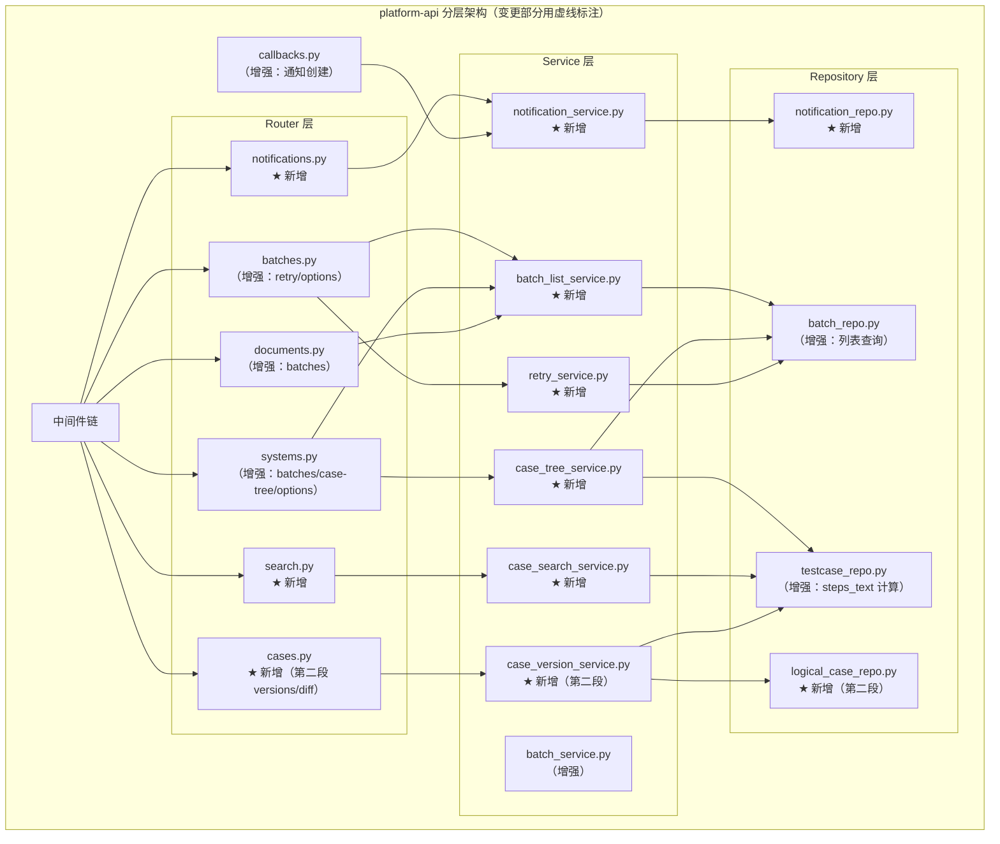
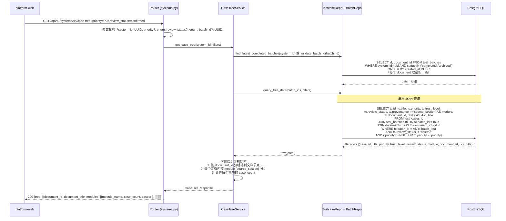
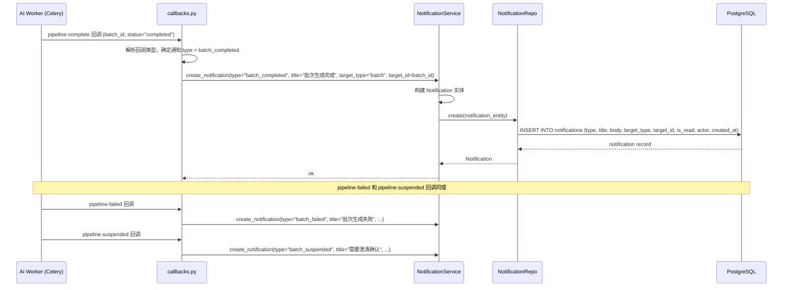
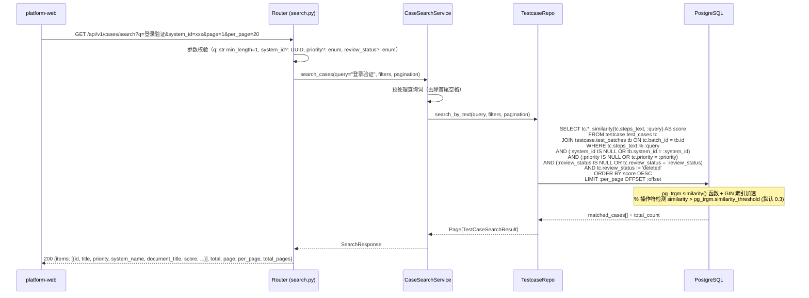
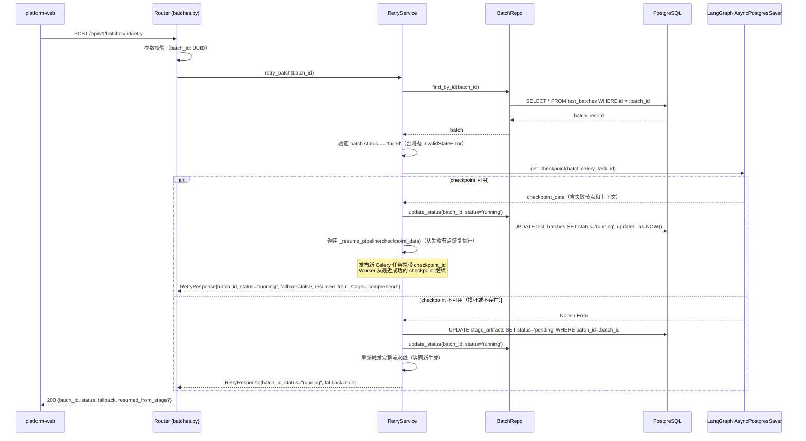
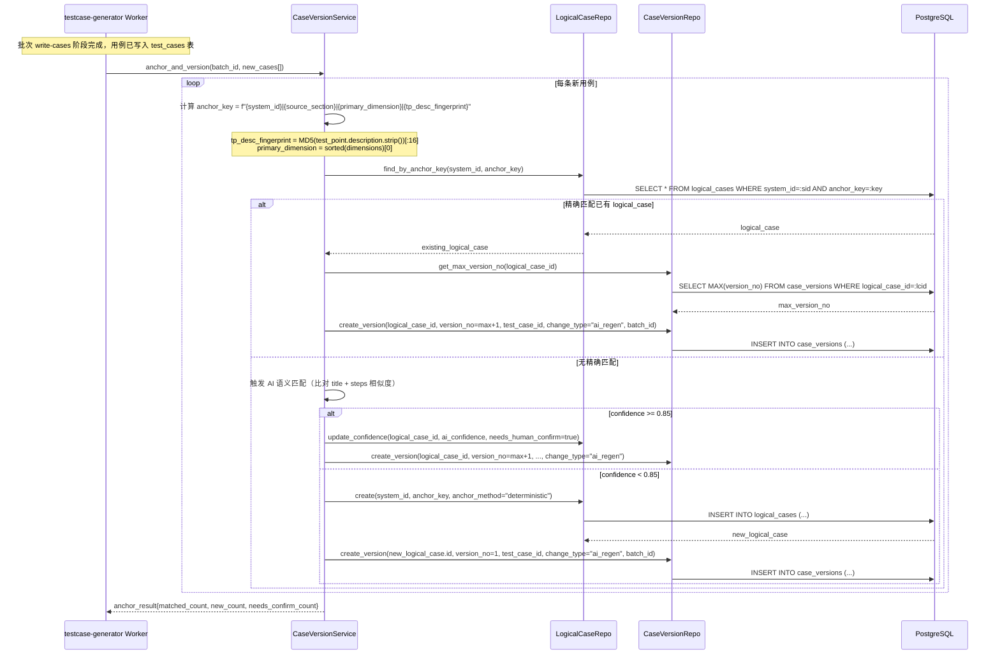

# platform-api 技术设计变更 — CHG-20260609-001

> 基线：xspec/modules/platform-api/design.md v1.0

## 0. 文档信息

| 属性 | 内容 |
| :--- | :--- |
| **所属变更** | CHG-20260609-001 |
| **基线版本** | platform-api/design.md v1.0 |
| **变更类型** | modified |
| **创建时间** | 2026-06-09 |

---

## 1. 变更摘要

在现有 FastAPI 单体分层架构上新增 11 个 API 端点（批次列表、用例树聚合、通知 CRUD、搜索、失败重试、导出选项），新建 notification 表，增强回调钩子（通知创建），引入 pg_trgm 搜索基础设施。第二段新增 logical_case + case_version 表支撑用例版本化和锚点匹配。

---

## 2. 设计决策变更

### 决策 4：steps_text 维护方式

* **问题**：全局搜索需要对用例 title + steps[].action 进行 pg_trgm 模糊匹配，steps 为 JSONB 列无法直接建 GIN trigram 索引
* **候选方案**：
  * A — 应用层写入时计算：Service 层在 INSERT/UPDATE 时计算 `steps_text = title + steps[].action 拼接`，写入普通 TEXT 列
  * B — BEFORE INSERT/UPDATE 触发器自动填充
  * C — 包装 IMMUTABLE 函数用于 PostgreSQL 生成列
* **决策**：选择方案 A（应用层写入时计算）
* **理由**：PostgreSQL 生成列不允许子查询/集合函数处理 JSONB 数组；触发器增加隐式逻辑、调试困难；应用层计算逻辑简单透明，与现有 bulk_upsert 流程自然融合，且所有写入路径集中在 TestcaseRepository.bulk_upsert 一处。

### 决策 5：树形聚合查询策略

* **问题**：用例树聚合需要展示 Document → Module → Case 三级树结构，如何高效查询
* **候选方案**：
  * A — 单次 JOIN 查询 + 应用层组装：一次性查询 batch + case + document，Service 层按 `provenance.source_section` 分组组装树结构
  * B — 多次查询分层聚合：先查文档列表，再逐文档查批次，再逐批次查用例
  * C — 数据库视图/物化视图预聚合
* **决策**：选择方案 A（单次 JOIN + 应用层组装）
* **理由**：避免 N+1 查询问题；MVP 数据量可控（单系统百级用例），应用层组装复杂度低；无需维护物化视图刷新逻辑。单 SQL + 内存分组在 500 条用例以内 P95 < 100ms。

---

## 3. 架构变更

### 3.1 分层架构增量图



### 3.2 新增目录结构

```
platform-api/app/
├── routers/
│   ├── notifications.py       # ★ 新增：通知 CRUD 路由
│   ├── search.py              # ★ 新增：全局搜索路由
│   ├── cases.py               # ★ 新增（第二段）：版本历史路由
│   ├── batches.py             # 增强：retry、options 端点
│   ├── systems.py             # 增强：batches、case-tree、options 端点
│   └── documents.py           # 增强：batches 端点
├── services/
│   ├── batch_list_service.py  # ★ 新增
│   ├── case_tree_service.py   # ★ 新增
│   ├── notification_service.py# ★ 新增
│   ├── case_search_service.py # ★ 新增
│   ├── retry_service.py       # ★ 新增
│   └── case_version_service.py# ★ 新增（第二段）
├── repositories/
│   ├── notification_repo.py   # ★ 新增
│   ├── logical_case_repo.py   # ★ 新增（第二段）
│   ├── testcase_repo.py       # 增强：steps_text 计算、搜索查询
│   └── batch_repo.py          # 增强：列表查询、选项查询
├── models/
│   ├── public.py              # 增强：Notification 模型
│   └── testcase.py            # 增强：LogicalCase、CaseVersion 模型（第二段）
├── schemas/
│   ├── notification.py        # ★ 新增
│   ├── search.py              # ★ 新增
│   └── case_version.py        # ★ 新增（第二段）
└── tasks/
    └── callbacks.py           # 增强：通知创建逻辑
```

---

## 4. 关键流程设计

### 4.1 用例树聚合查询完整时序



### 4.2 通知创建流程



### 4.3 全局搜索流程



### 4.4 失败重试流程



### 4.5 第二段：锚点匹配 + 版本写入时序



---

## 5. Service 层详细设计

### 5.1 BatchListService

```python
class BatchListService:
    """系统/文档级批次列表查询"""
    
    def __init__(self, batch_repo: BatchRepo):
        self.batch_repo = batch_repo
    
    async def list_by_system(
        self, system_id: UUID, status: Optional[str], page: int, per_page: int
    ) -> Page[BatchListItem]:
        """
        获取系统下所有批次列表。
        业务规则：按 created_at DESC 排序，可按 status 筛选。
        事务：否（只读查询）
        """
        ...
    
    async def list_by_document(
        self, document_id: UUID, status: Optional[str], page: int, per_page: int
    ) -> Page[BatchListItem]:
        """
        获取文档的所有生成批次列表。
        业务规则：同上。
        事务：否
        """
        ...
    
    async def list_options(self) -> List[BatchOptionItem]:
        """
        获取可导出的批次选项列表（status IN completed, archived）。
        事务：否
        """
        ...
```

### 5.2 CaseTreeService

```python
class CaseTreeService:
    """用例树形聚合"""
    
    def __init__(self, batch_repo: BatchRepo, testcase_repo: TestcaseRepo):
        self.batch_repo = batch_repo
        self.testcase_repo = testcase_repo
    
    async def get_case_tree(
        self,
        system_id: UUID,
        batch_id: Optional[UUID] = None,
        priority: Optional[str] = None,
        review_status: Optional[str] = None,
    ) -> CaseTreeResponse:
        """
        构建系统级用例树（Document → Module → Case）。
        
        业务规则：
        - 若未指定 batch_id，自动选取每个文档的最新已完成批次
        - 功能模块名称从 provenance.source_section 派生
        - 排除 review_status=deleted 的用例（除非 filter 明确指定）
        - 树根 = 种子文档（batch.document_id 指向的文档）
        - **每个 logical_case 仅取最新版本**：当一个 logical_case 在同一批次内
          有多个版本（迭代产生），仅展示最新 version_no 对应的 test_case
        
        事务：否（只读查询）
        性能：单次 JOIN 查询 + 内存分组，500 条用例以内 P95 < 100ms
        """
        # 1. 确定目标 batch_ids
        if batch_id:
            batch_ids = [batch_id]
        else:
            batch_ids = await self.batch_repo.find_latest_completed_per_document(system_id)
        
        # 2. 单次 JOIN 查询获取扁平数据（仅取每个 logical_case 的最新版本）
        raw_data = await self.testcase_repo.query_tree_data(batch_ids, priority, review_status)
        
        # 3. 应用层组装树结构
        return self._assemble_tree(raw_data)
    
    def _assemble_tree(self, raw_data: List[TreeRawRow]) -> CaseTreeResponse:
        """按 document_id 分组 → 按 source_section 分组 → 构建嵌套结构"""
        ...
```

### 5.3 NotificationService

```python
class NotificationService:
    """通知消息 CRUD"""
    
    def __init__(self, notification_repo: NotificationRepo):
        self.notification_repo = notification_repo
    
    async def create_notification(
        self,
        type: str,
        title: str,
        body: Optional[str] = None,
        target_type: Optional[str] = None,
        target_id: Optional[UUID] = None,
        actor: str = "system",
    ) -> Notification:
        """
        创建通知记录。
        业务规则：type 必须为 batch_completed / batch_failed / batch_suspended 之一。
        事务：是（单次 INSERT）
        """
        ...
    
    async def get_unread_count(self) -> int:
        """获取未读消息数量。事务：否"""
        ...
    
    async def list_notifications(
        self, page: int, per_page: int, is_read: Optional[bool] = None
    ) -> Page[Notification]:
        """
        分页获取消息列表，按 created_at DESC 排序。
        事务：否
        """
        ...
    
    async def mark_read(self, notification_id: UUID) -> Notification:
        """
        标记单条已读。
        业务规则：仅未读通知可操作，已读通知调用为幂等操作。
        事务：是
        抛出：ResourceNotFoundError
        """
        ...
    
    async def mark_all_read(self) -> int:
        """
        全部标记已读，返回受影响行数。
        事务：是
        """
        ...
```

### 5.4 CaseSearchService

```python
class CaseSearchService:
    """全局用例搜索"""
    
    def __init__(self, testcase_repo: TestcaseRepo):
        self.testcase_repo = testcase_repo
    
    async def search_cases(
        self,
        query: str,
        system_id: Optional[UUID] = None,
        priority: Optional[str] = None,
        review_status: Optional[str] = None,
        page: int = 1,
        per_page: int = 20,
    ) -> Page[CaseSearchResult]:
        """
        跨系统搜索用例。
        
        业务规则：
        - 搜索范围：steps_text 列（title + steps[].action 拼接文本）
        - 排序：pg_trgm similarity 分数降序
        - 排除 review_status=deleted 的用例
        - query 最小长度 1 字符
        
        事务：否（只读查询）
        性能：依赖 GIN(steps_text gin_trgm_ops) 索引
        """
        ...
```

### 5.5 RetryService

```python
class RetryService:
    """失败批次重试"""
    
    def __init__(self, batch_repo: BatchRepo, langgraph_saver: AsyncPostgresSaver):
        self.batch_repo = batch_repo
        self.langgraph_saver = langgraph_saver
    
    async def retry_batch(self, batch_id: UUID) -> RetryResponse:
        """
        从失败阶段重试批次。
        
        业务规则：
        - 前置条件：batch.status == 'failed'，否则抛 InvalidStateError
        - 主路径：从 LangGraph checkpoint 恢复（_resume_pipeline）
        - 降级路径：checkpoint 不可用时重跑全流程
        - 重试后 batch.status = 'running'
        
        事务：是（状态更新）
        抛出：ResourceNotFoundError, InvalidStateError
        """
        batch = await self.batch_repo.find_by_id(batch_id)
        if not batch:
            raise ResourceNotFoundError("批次不存在")
        if batch.status != "failed":
            raise InvalidStateError("仅 failed 状态的批次可重试")
        
        # 尝试从 checkpoint 恢复
        checkpoint = await self._get_checkpoint(batch.celery_task_id)
        
        if checkpoint:
            await self.batch_repo.update_status(batch_id, "running")
            await self._resume_pipeline(checkpoint)
            return RetryResponse(batch_id=batch_id, status="running", fallback=False, resumed_from_stage=checkpoint.failed_node)
        else:
            # 降级：整批重跑
            await self._reset_artifacts(batch_id)
            await self.batch_repo.update_status(batch_id, "running")
            await self._dispatch_full_pipeline(batch_id)
            return RetryResponse(batch_id=batch_id, status="running", fallback=True)
    
    async def _get_checkpoint(self, task_id: str) -> Optional[Checkpoint]:
        """查询 LangGraph checkpoint 是否可用"""
        ...
    
    async def _resume_pipeline(self, checkpoint: Checkpoint) -> None:
        """通过 Command(resume=...) 从 checkpoint 恢复执行"""
        ...
    
    async def _reset_artifacts(self, batch_id: UUID) -> None:
        """重置 stage_artifacts 状态为 pending"""
        ...
    
    async def _dispatch_full_pipeline(self, batch_id: UUID) -> None:
        """重新派发完整流水线 Celery 任务"""
        ...
```

### 5.6 CaseVersionService（第二段）

```python
class CaseVersionService:
    """逻辑用例版本管理"""
    
    def __init__(self, logical_case_repo: LogicalCaseRepo, case_version_repo: CaseVersionRepo):
        self.logical_case_repo = logical_case_repo
        self.case_version_repo = case_version_repo
    
    async def anchor_and_version(
        self, batch_id: UUID, system_id: UUID, new_cases: List[TestCase]
    ) -> AnchorResult:
        """
        批次完成后，为每条新用例计算锚点并写入版本记录。
        
        业务规则：
        - anchor_key = system_id | source_section | primary_dimension | tp_desc_fingerprint
        - 精确匹配 → 创建新版本
        - 无精确匹配 → AI 语义匹配（confidence >= 0.85 → 新版本 + needs_human_confirm）
        - AI 匹配不达标 → 创建新 logical_case
        - 同时写入 quality_flywheel 表（双写一致性）
        
        事务：是（整批原子写入）
        """
        ...
    
    async def get_versions(self, logical_case_id: UUID) -> List[CaseVersionDetail]:
        """获取逻辑用例全部版本历史。事务：否"""
        ...
    
    async def get_version_detail(self, logical_case_id: UUID, version_no: int) -> CaseVersionDetail:
        """获取某版本快照详情。事务：否"""
        ...
    
    async def diff_versions(self, logical_case_id: UUID, v1: int, v2: int) -> VersionDiff:
        """两版本差异对比。事务：否"""
        ...
    
    @staticmethod
    def compute_anchor_key(system_id: UUID, source_section: str, primary_dimension: str, tp_description: str) -> str:
        """
        计算确定性锚点键。
        primary_dimension = sorted(dimensions)[0]
        tp_desc_fingerprint = MD5(tp_description.strip())[:16]
        """
        fingerprint = hashlib.md5(tp_description.strip().encode()).hexdigest()[:16]
        return f"{system_id}|{source_section}|{primary_dimension}|{fingerprint}"
```

---

## 6. Repository 层详细设计

### 6.1 关键 SQL 查询

#### 6.1.1 树形聚合 JOIN 查询（分段实现）

**第一段查询**（`case_versions` 表尚未建立，直接查 `test_cases`）：

```sql
-- 第一段：直接查 test_cases，排除 deleted
-- 第一段不存在迭代产生的多版本问题（iteration_service 尚未改造）
SELECT 
    tc.id AS case_id,
    tc.title,
    tc.priority,
    tc.trust_level,
    tc.review_status,
    tc.provenance->>'source_section' AS module_name,
    tb.document_id,
    d.title AS document_title
FROM testcase.test_cases tc
JOIN testcase.test_batches tb ON tc.batch_id = tb.id
JOIN knowledge.documents d ON tb.document_id = d.id
WHERE tc.batch_id = ANY(:batch_ids)
  AND tc.review_status != 'deleted'
  AND (:priority IS NULL OR tc.priority = :priority)
  AND (:review_status IS NULL OR tc.review_status = :review_status)
ORDER BY d.title, module_name, tc.priority, tc.created_at;
```

**第二段查询**（`case_versions` 表就绪后，叠加去重逻辑）：

```sql
-- 第二段：每个 logical_case 仅取最新版本
-- 迭代改造后同一逻辑用例可能有多个版本，需去重
WITH latest_versions AS (
    SELECT DISTINCT ON (logical_case_id) 
        test_case_id
    FROM testcase.case_versions
    WHERE batch_id IN (:batch_ids)
    ORDER BY logical_case_id, version_no DESC
)
SELECT 
    tc.id AS case_id,
    tc.title,
    tc.priority,
    tc.trust_level,
    tc.review_status,
    tc.provenance->>'source_section' AS module_name,
    tb.document_id,
    d.title AS document_title
FROM testcase.test_cases tc
JOIN latest_versions lv ON tc.id = lv.test_case_id
JOIN testcase.test_batches tb ON tc.batch_id = tb.id
JOIN knowledge.documents d ON tb.document_id = d.id
WHERE tc.review_status != 'deleted'
  AND (:priority IS NULL OR tc.priority = :priority)
  AND (:review_status IS NULL OR tc.review_status = :review_status)
ORDER BY d.title, module_name, tc.priority, tc.created_at;
```

> **分段切换说明**：Service 层通过检测 `case_versions` 表是否存在（或通过配置开关）决定使用哪段查询。第一段上线时不依赖任何第二段的表结构；第二段上线后切换到带 CTE 去重的版本。"迭代产生多版本→列表重复"只在第二段 iteration_service 改造后才会发生，因此去重逻辑放在第二段是正确的时序。

#### 6.1.2 每个文档取最新完成批次

```sql
-- 使用 DISTINCT ON 取每个文档的最新已完成批次
SELECT DISTINCT ON (document_id) id, document_id
FROM testcase.test_batches
WHERE system_id = :system_id
  AND status IN ('completed', 'archived')
ORDER BY document_id, created_at DESC;
```

#### 6.1.3 pg_trgm 搜索查询

```sql
-- CaseSearchService 使用的模糊搜索
SELECT tc.*, 
       similarity(tc.steps_text, :query) AS score,
       tb.system_id,
       s.name AS system_name,
       d.title AS document_title
FROM testcase.test_cases tc
JOIN testcase.test_batches tb ON tc.batch_id = tb.id
JOIN public.systems s ON tb.system_id = s.id
JOIN knowledge.documents d ON tb.document_id = d.id
WHERE tc.steps_text % :query
  AND tc.review_status != 'deleted'
  AND (:system_id IS NULL OR tb.system_id = :system_id)
  AND (:priority IS NULL OR tc.priority = :priority)
  AND (:review_status IS NULL OR tc.review_status = :review_status)
ORDER BY score DESC
LIMIT :per_page OFFSET :offset;
```

#### 6.1.4 通知未读数查询

```sql
-- 利用部分索引 idx_notifications_unread
SELECT COUNT(*) FROM public.notifications WHERE is_read = FALSE;
```

### 6.2 NotificationRepo 方法

```python
class NotificationRepo:
    """notification 表数据访问"""
    
    async def create(self, entity: Notification) -> Notification:
        """INSERT INTO notifications (...)"""
        ...
    
    async def count_unread(self) -> int:
        """SELECT COUNT(*) WHERE is_read = FALSE"""
        ...
    
    async def find_all(self, page: int, per_page: int, is_read: Optional[bool]) -> Page[Notification]:
        """SELECT ... ORDER BY created_at DESC LIMIT/OFFSET"""
        ...
    
    async def mark_read(self, notification_id: UUID) -> Optional[Notification]:
        """UPDATE ... SET is_read = TRUE WHERE id = :id RETURNING *"""
        ...
    
    async def mark_all_read(self) -> int:
        """UPDATE ... SET is_read = TRUE WHERE is_read = FALSE; 返回 affected rows"""
        ...
```

### 6.3 BatchRepo 增强方法

```python
class BatchRepo:
    # ... 基线已有方法 ...
    
    async def find_by_system(
        self, system_id: UUID, status: Optional[str], page: int, per_page: int
    ) -> Page[BatchListItem]:
        """按系统查批次列表，JOIN documents 获取 document_title"""
        ...
    
    async def find_by_document(
        self, document_id: UUID, status: Optional[str], page: int, per_page: int
    ) -> Page[BatchListItem]:
        """按文档查批次列表"""
        ...
    
    async def find_latest_completed_per_document(self, system_id: UUID) -> List[UUID]:
        """DISTINCT ON (document_id) 取最新完成批次 ID 列表"""
        ...
    
    async def find_options(self) -> List[BatchOptionItem]:
        """返回可导出批次摘要（status IN completed, archived）"""
        ...
    
    async def update_status(self, batch_id: UUID, status: str) -> None:
        """UPDATE test_batches SET status=:status, updated_at=NOW()"""
        ...
```

---

## 7. steps_text 维护实现

在 `TestcaseRepo.bulk_upsert` 中计算并填充 `steps_text` 字段：

```python
class TestcaseRepo:
    
    async def bulk_upsert(self, cases: List[TestCaseCreate]) -> List[TestCase]:
        """
        批量写入/更新用例，同时计算 steps_text。
        
        steps_text 计算逻辑：
        steps_text = title + " " + " ".join([step["action"] for step in steps])
        """
        for case in cases:
            # 计算 steps_text
            actions = [step.get("action", "") for step in (case.steps or [])]
            case.steps_text = f"{case.title} {' '.join(actions)}"
        
        # 执行 UPSERT (INSERT ... ON CONFLICT DO UPDATE)
        stmt = insert(TestCase).values([c.dict() for c in cases])
        stmt = stmt.on_conflict_do_update(
            index_elements=["id"],
            set_={
                "title": stmt.excluded.title,
                "steps": stmt.excluded.steps,
                "steps_text": stmt.excluded.steps_text,
                "expected_results": stmt.excluded.expected_results,
                "priority": stmt.excluded.priority,
                "review_status": stmt.excluded.review_status,
                "iteration": stmt.excluded.iteration,
                "updated_at": func.now(),
            }
        )
        await self.session.execute(stmt)
        ...
```

**维护保证**：所有写入 test_cases 的路径均通过 `TestcaseRepo.bulk_upsert`，确保 steps_text 与 title + steps 保持同步。禁止绕过此方法直接写入 test_cases 表。

---

## 8. 通知触发点

在 `callbacks.py` 的三个回调处理中创建通知：

```python
# app/tasks/callbacks.py

from app.services.notification_service import NotificationService

async def handle_pipeline_complete(batch_id: UUID, result: dict):
    """pipeline-complete 回调"""
    # ... 现有逻辑：更新 batch.status = 'pending_review' ...
    
    # ★ 新增：创建通知
    batch = await batch_repo.find_by_id(batch_id)
    await notification_service.create_notification(
        type="batch_completed",
        title=f"用例生成完成：{batch.document_title}",
        body=f"共生成 {batch.total_cases} 条用例，请前往 Review",
        target_type="batch",
        target_id=batch_id,
    )

async def handle_pipeline_failed(batch_id: UUID, error: dict):
    """pipeline-failed 回调"""
    # ... 现有逻辑：更新 batch.status = 'failed' ...
    
    # ★ 新增：创建通知
    batch = await batch_repo.find_by_id(batch_id)
    failed_stage = error.get("stage", "unknown")
    await notification_service.create_notification(
        type="batch_failed",
        title=f"用例生成失败：{batch.document_title}",
        body=f"在 {failed_stage} 阶段发生错误，可尝试重试",
        target_type="batch",
        target_id=batch_id,
    )

async def handle_pipeline_suspended(batch_id: UUID, questions: list):
    """pipeline-suspended 回调"""
    # ... 现有逻辑：更新 batch.status = 'suspended' ...
    
    # ★ 新增：创建通知
    batch = await batch_repo.find_by_id(batch_id)
    await notification_service.create_notification(
        type="batch_suspended",
        title=f"需要澄清：{batch.document_title}",
        body=f"Gate 判定需要人工确认，共 {len(questions)} 个问题",
        target_type="batch",
        target_id=batch_id,
    )
```

---

## 9. 性能设计

### 9.1 索引策略

| 索引名 | 表 | 列/表达式 | 类型 | 用途 |
| :--- | :--- | :--- | :--- | :--- |
| `idx_notifications_unread` | notifications | `(is_read, created_at DESC) WHERE is_read = FALSE` | B-tree 部分索引 | 未读数查询 + 消息列表排序 |
| `idx_test_cases_trgm` | test_cases | `steps_text gin_trgm_ops` | GIN | pg_trgm 模糊搜索 |
| `idx_logical_cases_anchor` | logical_cases | `(system_id, anchor_key)` | B-tree 唯一 | 锚点精确匹配 |
| `idx_case_versions_unique` | case_versions | `(logical_case_id, version_no)` | B-tree 唯一 | 版本号唯一约束 |
| `idx_batches_system_status` | test_batches | `(system_id, status)` | B-tree（已有） | 批次列表查询、树形聚合取最新批次 |

### 9.2 查询优化

| 场景 | 优化措施 | 预期效果 |
| :--- | :--- | :--- |
| 用例树聚合 | 单次 JOIN 查询避免 N+1；DISTINCT ON 取最新批次 | 500 条用例 P95 < 100ms |
| 全局搜索 | pg_trgm GIN 索引 + similarity 排序 | 1000 条数据 P95 < 200ms |
| 通知未读数 | 部分索引 WHERE is_read = FALSE | 极轻量查询 < 5ms |
| 失败重试 | 复用 LangGraph checkpoint 避免重跑已完成阶段 | 节省 50-80% 执行时间 |
| 批次列表 | 利用已有 idx_batches_system_status 索引 | 分页查询 < 50ms |

### 9.3 容量预估

| 数据 | MVP 阶段预估量 | 增长趋势 |
| :--- | :--- | :--- |
| 通知记录 | ~100 条/周（每次生成 1 条） | 线性增长，可后续加清理策略 |
| steps_text 列 | 平均 500 字/条，5000 条 ≈ 2.5MB | 随用例增长 |
| logical_cases | ~2000 条（第二段） | 随系统数增长 |
| case_versions | ~5000 条（第二段） | 随迭代次数增长 |

---

## 10. 测试矩阵增量

| 测试目标 | 测试类型 | 通过条件 |
| :--- | :--- | :--- |
| 批次列表 API | 集成测试 | 系统/文档级列表正确返回，分页准确 |
| 用例树聚合 | 集成测试 | 树结构正确按 document → module → case 组装 |
| 通知 CRUD | 单元 + 集成 | 创建/查询/标记已读/全部已读行为正确 |
| 回调通知创建 | 集成测试 | 三种回调各创建对应 type 的通知 |
| steps_text 计算 | 单元测试 | bulk_upsert 后 steps_text = title + actions 拼接 |
| pg_trgm 搜索 | 集成测试 | 中文关键词可匹配到相关用例，结果按相关度排序 |
| 失败重试 | 集成测试 | checkpoint 可用时从失败节点恢复；不可用时降级重跑 |
| 锚点匹配 | 单元测试 | anchor_key 计算确定性；精确/AI 匹配逻辑正确 |
| 版本记录 | 集成测试 | 版本号递增、history 查询正确、diff 输出准确 |
