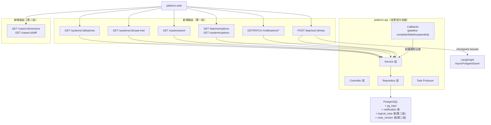
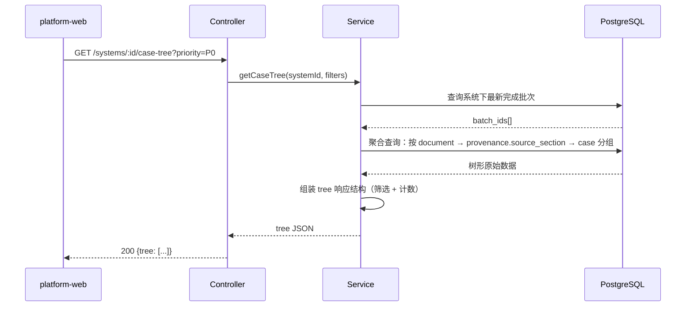
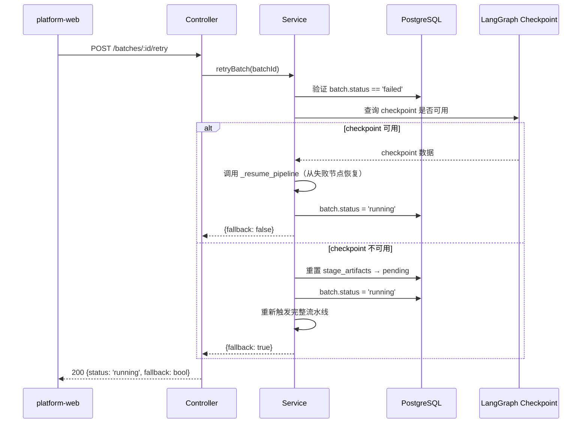

# platform-api 概要设计变更 — CHG-20260609-001

> 基线：xspec/modules/platform-api/hld.md (v1.0)

## 变更摘要

在现有 FastAPI 单体分层架构上新增 11 个 API 端点（批次列表、用例树聚合、通知 CRUD、搜索、失败重试、导出选项），新建 notification 表，增强回调钩子（通知创建），引入 pg_trgm 搜索基础设施。第二段新增 logical_case + case_version 表支撑版本化。

## 架构变更

### 整体架构增量



### 用例树聚合核心流程



### 失败重试核心流程



## 技术选型变更

| 领域 | 原选型 | 新增/变更 | 理由 |
| :--- | :--- | :--- | :--- |
| 搜索 | 无 | pg_trgm 扩展 + 生成列 + GIN 索引 | 中文模糊搜索，无需引入外部搜索引擎 |
| 流水线恢复 | 无（仅有 _resume_pipeline 内部方法） | 对外暴露为 /retry API | 复用已有 LangGraph checkpoint 机制 |

其余选型无变更：FastAPI + SQLAlchemy 2.0 + PostgreSQL 15 + Redis 7 + Celery。

## 新增组件

| 组件 | 层级 | 职责 |
| :--- | :--- | :--- |
| `notification_service.py` | Service | 通知 CRUD + 未读计数 + 全部已读 |
| `notification_repo.py` | Repository | notification 表数据访问 |
| `batch_list_service.py` | Service | 系统/文档级批次列表查询 |
| `case_tree_service.py` | Service | 用例树形聚合逻辑（按文档→模块→用例分组） |
| `case_search_service.py` | Service | 全局搜索（pg_trgm + ILIKE） |
| `retry_service.py` | Service | 失败重试（checkpoint resume + 降级） |
| `notification` 表 | DB | 站内消息存储 |
| `steps_text` 生成列 | DB | test_case 表新增生成列用于搜索索引 |

## 数据库 Migration

### 第一段

```sql
-- 1. 新增 notification 表（归属 public schema）
CREATE TABLE public.notifications (
    id UUID PRIMARY KEY DEFAULT gen_random_uuid(),
    type VARCHAR(50) NOT NULL,
    title TEXT NOT NULL,
    body TEXT,
    target_type VARCHAR(50),
    target_id UUID,
    is_read BOOLEAN NOT NULL DEFAULT FALSE,
    actor VARCHAR(100) NOT NULL DEFAULT 'system',
    created_at TIMESTAMP WITH TIME ZONE NOT NULL DEFAULT NOW()
);
CREATE INDEX idx_notifications_unread ON public.notifications(is_read, created_at DESC) WHERE is_read = FALSE;

-- 2. 启用 pg_trgm
CREATE EXTENSION IF NOT EXISTS pg_trgm;

-- 3. testcase.test_cases 表新增搜索列
-- 注：PostgreSQL 生成列不允许子查询/集合函数，因此 steps_text 改为普通列，
-- 由应用层写入时计算填充（或用触发器维护）。具体方案在 detail 阶段定稿。
ALTER TABLE testcase.test_cases ADD COLUMN steps_text TEXT;
CREATE INDEX idx_test_cases_trgm ON testcase.test_cases USING GIN (steps_text gin_trgm_ops);

-- steps_text 维护方案（HLD 层选型，detail 定实现）：
-- 方案 A（推荐）：应用层写入时一并计算 steps_text = title + 所有 step.action 拼接
-- 方案 B：BEFORE INSERT/UPDATE 触发器自动填充
-- 方案 C：包装 IMMUTABLE 函数用于生成列（需验证 PG 版本支持）
```

### 第二段

```sql
-- 4. logical_case 表（归属 testcase schema）
CREATE TABLE testcase.logical_cases (
    id UUID PRIMARY KEY DEFAULT gen_random_uuid(),
    system_id UUID NOT NULL REFERENCES public.systems(id),
    anchor_key VARCHAR(512) NOT NULL,
    anchor_method VARCHAR(20) NOT NULL DEFAULT 'deterministic',
    ai_confidence FLOAT,
    needs_human_confirm BOOLEAN NOT NULL DEFAULT FALSE,
    created_at TIMESTAMP WITH TIME ZONE NOT NULL DEFAULT NOW()
);
CREATE UNIQUE INDEX idx_logical_cases_anchor ON testcase.logical_cases(system_id, anchor_key);

-- 5. case_version 表（归属 testcase schema）
CREATE TABLE testcase.case_versions (
    id UUID PRIMARY KEY DEFAULT gen_random_uuid(),
    logical_case_id UUID NOT NULL REFERENCES testcase.logical_cases(id),
    version_no INTEGER NOT NULL,
    test_case_id UUID NOT NULL REFERENCES testcase.test_cases(id),
    parent_version_id UUID REFERENCES testcase.case_versions(id),
    change_reason TEXT,
    change_type VARCHAR(30) NOT NULL,
    actor VARCHAR(100) NOT NULL DEFAULT 'ai',
    batch_id UUID NOT NULL REFERENCES testcase.test_batches(id),
    created_at TIMESTAMP WITH TIME ZONE NOT NULL DEFAULT NOW()
);
CREATE UNIQUE INDEX idx_case_versions_unique ON testcase.case_versions(logical_case_id, version_no);
```

## 性能考量

- 用例树聚合：单 SQL 查询（JOIN batch + case + 按 source_section GROUP），避免 N+1
- 搜索：pg_trgm GIN 索引保证 500 条以内 3 秒响应
- 通知未读数：索引命中 is_read=FALSE，极轻量查询
- 失败重试：checkpoint resume 比整批重跑节省 已完成阶段的时间

## 宪章合规

- [x] 单体分层架构不变（简洁可维护）
- [x] 新增接口均可追溯到 spec 需求
- [x] pg_trgm 为 PostgreSQL 内置扩展，不引入外部依赖
- [x] 模块间通过已定义接口通信（callbacks 回调 + REST API）
