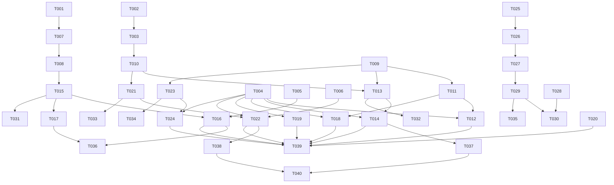

# platform-api 任务拆解 — CHG-20260609-001

> 基线：无（新增任务文件）
> 交付分段：第一段（批次列表/用例树/通知/搜索/重试/导出选项/可观测性/trust_level修正）+ 第二段（逻辑用例ID+版本记录）

## 0. 文档信息

| 属性 | 内容 |
| :--- | :--- |
| **所属变更** | CHG-20260609-001 |
| **模块** | platform-api (web-backend, modified) |
| **创建时间** | 2026-06-10 |

---

## 阶段 1：环境与基础

- [x] T001 P0 创建 notification 表 Alembic 迁移脚本（`migrations/versions/xxxx_add_notification_table.py`）
  - 包含：id(UUID PK), type(VARCHAR50), title(TEXT), body(TEXT), target_type(VARCHAR50), target_id(UUID), is_read(BOOLEAN), actor(VARCHAR100), created_at(TIMESTAMPTZ)
  - 包含部分索引 idx_notifications_unread: (is_read, created_at DESC) WHERE is_read = FALSE
  - AC: AC-API-03, AC-API-08

- [x] T002 P0 启用 pg_trgm 扩展的迁移脚本（`migrations/versions/xxxx_enable_pg_trgm.py`）
  - CREATE EXTENSION IF NOT EXISTS pg_trgm
  - AC: AC-API-05

- [x] T003 P0 test_cases 表新增 steps_text 列 + GIN 索引迁移脚本（`migrations/versions/xxxx_add_steps_text_column.py`）
  - ALTER TABLE testcase.test_cases ADD COLUMN steps_text TEXT
  - CREATE INDEX idx_test_cases_trgm ON testcase.test_cases USING GIN (steps_text gin_trgm_ops)
  - AC: AC-API-05
  depends: T002

- [x] T004 [P] P0 定义公共 Pydantic Schema（`app/schemas/common.py`）
  - PageParams（page, per_page 验证）
  - PageResponse[T] 泛型分页响应
  - 标准响应包装 ApiResponse

- [x] T005 [P] P0 定义通知 Schema（`app/schemas/notification.py`）
  - NotificationCreate / NotificationResponse / UnreadCountResponse / MarkAllReadResponse

- [x] T006 [P] P0 定义搜索 Schema（`app/schemas/search.py`）
  - CaseSearchParams / CaseSearchResult / SearchResponse

---

## 检查点 CP-1：迁移脚本可执行，alembic upgrade head 无报错；Schema 定义完整可导入

---

## 阶段 2：数据层

- [ ] T007 P0 新增 Notification SQLAlchemy Model（`app/models/public.py`）
  - 对应 public.notifications 表结构
  depends: T001

- [ ] T008 P0 新增 NotificationRepo（`app/repositories/notification_repo.py`）
  - create() / count_unread() / find_all(page, per_page, is_read) / mark_read(id) / mark_all_read()
  - AC: AC-API-03, AC-API-04
  depends: T007

- [ ] T009 P0 增强 BatchRepo 列表查询方法（`app/repositories/batch_repo.py`）
  - find_by_system(system_id, status, page, per_page)
  - find_by_document(document_id, status, page, per_page)
  - find_latest_completed_per_document(system_id) — DISTINCT ON 取最新完成批次
  - find_options() — status IN (completed, archived)
  - update_status(batch_id, status)
  - AC: AC-API-01, AC-API-07

- [ ] T010 P0 增强 TestcaseRepo steps_text 计算逻辑（`app/repositories/testcase_repo.py`）
  - 在 bulk_upsert 中计算 steps_text = title + " " + steps[].action 拼接
  - 新增 query_tree_data(batch_ids, priority, review_status) 方法
  - 新增 search_by_text(query, filters, pagination) 方法
  - AC: AC-API-02, AC-API-05
  depends: T003

---

## 检查点 CP-2：Repository 单元测试通过；bulk_upsert 写入后 steps_text 列有值；notification CRUD 可正常读写

---

## 阶段 3：功能实现

### 3.1 US-API-01：批次列表（AC-API-01）

- [ ] T011 P0 实现 BatchListService（`app/services/batch_list_service.py`）
  - list_by_system() / list_by_document() / list_options()
  depends: T009

- [ ] T012 P0 实现批次列表 Router 端点（`app/routers/systems.py` 增强 + `app/routers/documents.py` 增强）
  - GET /api/v1/systems/:id/batches
  - GET /api/v1/documents/:id/batches
  - AC: AC-API-01
  depends: T011, T004

### 3.2 US-API-02：用例树聚合（AC-API-02）

- [ ] T013 P0 实现 CaseTreeService（`app/services/case_tree_service.py`）
  - get_case_tree(system_id, batch_id?, priority?, review_status?)
  - _assemble_tree() 内存分组逻辑：Document → Module(source_section) → Case
  - 第一段直接查 test_cases（不依赖 case_versions 表）
  depends: T009, T010

- [ ] T014 P0 实现用例树 Router 端点（`app/routers/systems.py` 增强）
  - GET /api/v1/systems/:id/case-tree
  - AC: AC-API-02
  depends: T013, T004

### 3.3 US-API-03：通知 CRUD + 回调触发（AC-API-03, AC-API-04, AC-API-08）

- [ ] T015 P0 实现 NotificationService（`app/services/notification_service.py`）
  - create_notification(type, title, body?, target_type?, target_id?, actor?)
  - get_unread_count() / list_notifications(page, per_page, is_read?) / mark_read(id) / mark_all_read()
  depends: T008

- [ ] T016 P0 实现通知 Router 端点（`app/routers/notifications.py` 新增）
  - GET /api/v1/notifications/unread-count
  - GET /api/v1/notifications
  - PATCH /api/v1/notifications/:id/read
  - POST /api/v1/notifications/mark-all-read
  - AC: AC-API-03, AC-API-04
  depends: T015, T005

- [ ] T017 P0 在 callbacks.py 三个回调中创建通知（`app/tasks/callbacks.py` 增强）
  - handle_pipeline_complete → type=batch_completed
  - handle_pipeline_failed → type=batch_failed
  - handle_pipeline_suspended → type=batch_suspended
  - AC: AC-API-08
  depends: T015

### 3.4 US-API-06：导出选项（AC-API-07）

- [ ] T018 [P] P0 实现导出选项 Router 端点（`app/routers/batches.py` 增强 + `app/routers/systems.py` 增强）
  - GET /api/v1/batches/options
  - GET /api/v1/systems/options
  - AC: AC-API-07
  depends: T011

### 3.5 可观测性透传：stage_progress 增强（AC-API-09）

- [ ] T019 P0 增强批次详情响应中 stage_progress 透传（`app/services/batch_service.py` 增强 + `app/routers/batches.py` 增强）
  - stages[].duration_ms / started_at / completed_at / error_message
  - 从 stage_artifacts 表读取并透传
  - AC: AC-API-09
  depends: T004

### 3.6 trust_level 语义修正

- [ ] T020 [P] P0 修正 trust_level 响应逻辑（`app/schemas/` 相关文件 + Router 响应）
  - 确保 API 返回整数 1-5，不做百分比转换
  - confidence_note 字段在 trust_level >= 4 时透传
  - 更新相关 Schema 定义确保 trust_level: int 类型约束

### 3.7 US-API-04：搜索（AC-API-05）

- [ ] T021 P1 实现 CaseSearchService（`app/services/case_search_service.py`）
  - search_cases(query, system_id?, priority?, review_status?, page, per_page)
  - 预处理查询词（strip），调用 repo search_by_text
  depends: T010

- [ ] T022 P1 实现搜索 Router 端点（`app/routers/search.py` 新增）
  - GET /api/v1/cases/search
  - 参数校验：q min_length=1 max_length=200
  - AC: AC-API-05
  depends: T021, T006

### 3.8 US-API-05：失败重试（AC-API-06）

- [ ] T023 P1 实现 RetryService（`app/services/retry_service.py`）
  - retry_batch(batch_id) → 验证 status==failed → 尝试 checkpoint resume → 降级重跑
  - _get_checkpoint() / _resume_pipeline() / _reset_artifacts() / _dispatch_full_pipeline()
  depends: T009

- [ ] T024 P1 实现失败重试 Router 端点（`app/routers/batches.py` 增强）
  - POST /api/v1/batches/:id/retry
  - 错误码：E4041（不存在）、E4092（状态不允许）
  - AC: AC-API-06
  depends: T023, T004

---

## 检查点 CP-3：第一段所有 11 个端点可正常调用返回预期结构；通知在回调触发后自动创建；搜索可命中中文关键词

---

### 3.9 第二段：逻辑用例 ID + 版本记录（AC-API-10）

- [ ] T025 P1 创建 logical_cases + case_versions 表迁移脚本（`migrations/versions/xxxx_add_logical_case_and_version.py`）【第二段】
  - testcase.logical_cases 表 + idx_logical_cases_anchor 唯一索引
  - testcase.case_versions 表 + idx_case_versions_unique 唯一索引

- [ ] T026 P1 新增 LogicalCase / CaseVersion SQLAlchemy Model（`app/models/testcase.py` 增强）【第二段】
  depends: T025

- [ ] T027 P1 新增 LogicalCaseRepo + CaseVersionRepo（`app/repositories/logical_case_repo.py` 新增）【第二段】
  - find_by_anchor_key() / create() / update_confidence()
  - get_versions() / get_max_version_no() / create_version()
  depends: T026

- [ ] T028 P1 定义版本 Schema（`app/schemas/case_version.py` 新增）【第二段】
  - CaseVersionDetail / VersionListResponse / VersionDiff

- [ ] T029 P1 实现 CaseVersionService（`app/services/case_version_service.py`）【第二段】
  - anchor_and_version(batch_id, system_id, new_cases[]) — 锚点计算 + 版本写入
  - get_versions(logical_case_id) / get_version_detail(logical_case_id, version_no) / diff_versions(logical_case_id, v1, v2)
  - compute_anchor_key() 静态方法
  depends: T027

- [ ] T030 P1 实现版本 API Router 端点（`app/routers/cases.py` 新增）【第二段】
  - GET /api/v1/cases/:id/versions
  - GET /api/v1/cases/:id/versions/:version_no
  - GET /api/v1/cases/:id/diff?v1=N&v2=M
  - AC: AC-API-10
  depends: T029, T028

---

## 检查点 CP-4：第二段版本 API 可正常调用；锚点匹配逻辑正确；版本号递增；diff 输出准确

---

## 阶段 4：集成与收尾

- [ ] T031 [P] P1 NotificationService 单元测试（`tests/unit/test_notification_service.py`）
  - Mock NotificationRepo，验证 create/unread_count/mark_read/mark_all_read
  depends: T015

- [ ] T032 [P] P1 CaseTreeService 单元测试（`tests/unit/test_case_tree_service.py`）
  - Mock Repo，验证树组装逻辑正确性（多文档/多模块/筛选）
  depends: T013

- [ ] T033 [P] P1 CaseSearchService 单元测试（`tests/unit/test_case_search_service.py`）
  - Mock Repo，验证搜索参数传递和预处理
  depends: T021

- [ ] T034 [P] P1 RetryService 单元测试（`tests/unit/test_retry_service.py`）
  - Mock BatchRepo + LangGraph saver，验证 checkpoint 可用/不可用两条路径
  depends: T023

- [ ] T035 [P] P1 CaseVersionService 单元测试（`tests/unit/test_case_version_service.py`）【第二段】
  - anchor_key 计算确定性验证
  - 精确匹配/AI 匹配/新建三条分支
  depends: T029

- [ ] T036 P1 通知集成测试（`tests/integration/test_notification_api.py`）
  - 真实 DB：创建通知 → 查未读数 → 标记已读 → 验证数据一致
  depends: T016, T017

- [ ] T037 P1 用例树聚合集成测试（`tests/integration/test_case_tree_api.py`）
  - 真实 DB：写入测试数据 → 调用 API → 验证树结构正确
  - 验证性能：500 条用例响应 P95 < 100ms
  depends: T014

- [ ] T038 P1 搜索集成测试（`tests/integration/test_search_api.py`）
  - 真实 DB + pg_trgm：写入含中文的 steps_text → 搜索 → 验证匹配和排序
  depends: T022

- [ ] T039 P2 与前端联调验证
  - 批次列表/用例树/通知/搜索/重试/导出选项全端点联调
  - trust_level 展示验证（不再显示 100%）
  depends: T012, T014, T016, T018, T019, T020, T022, T024

- [ ] T040 P2 性能验证
  - 树聚合：500 条用例 P95 < 100ms
  - 搜索：1000 条数据 P95 < 200ms
  - 通知未读数：< 5ms
  depends: T037, T038

---

## 检查点 CP-5：所有单元测试和集成测试通过；前端联调无阻断问题；性能指标达标

---

## 任务依赖总览

---

## AC 覆盖矩阵

| AC 编号 | 覆盖任务 | 验证方式 |
| :--- | :--- | :--- |
| AC-API-01 | T009, T011, T012 | 集成测试 + 联调 |
| AC-API-02 | T010, T013, T014, T037 | 集成测试（树结构验证） |
| AC-API-03 | T008, T015, T016, T036 | 集成测试（未读数 + 列表） |
| AC-API-04 | T008, T015, T016, T036 | 集成测试（标记已读） |
| AC-API-05 | T002, T003, T010, T021, T022, T038 | 集成测试（中文搜索） |
| AC-API-06 | T023, T024 | 单元测试（两路径） + 集成 |
| AC-API-07 | T009, T011, T018 | 联调验证 |
| AC-API-08 | T015, T017, T036 | 集成测试（回调触发通知） |
| AC-API-09 | T019 | 联调验证（stages 字段透传） |
| AC-API-10 | T025-T030, T035 | 单元 + 集成测试【第二段】 |
