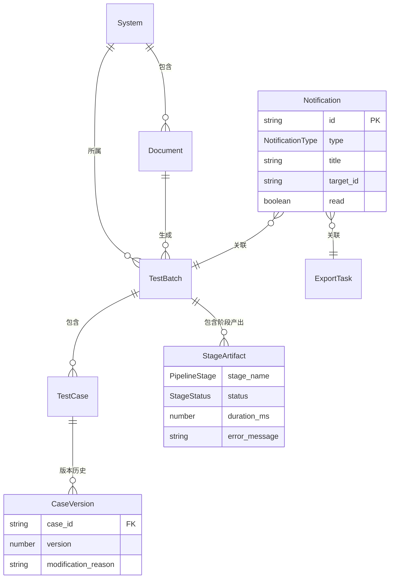

# platform-web 数据模型变更 — CHG-20260609-001

> 基线：xspec/modules/platform-web/data-model.md (v1.0)

## 变更摘要

新增通知、用例树、搜索、阶段产出物等 TypeScript 接口定义，新增对应 Store 状态类型，扩展现有 BatchDetail 和 TestCase 接口。

---

## 新增枚举

```typescript
/** 通知类型 */
enum NotificationType {
  BatchCompleted = "batch_completed",       // 用例生成完成
  BatchFailed = "batch_failed",             // 用例生成失败
  BatchSuspended = "batch_suspended",       // 需要澄清
  ExportCompleted = "export_completed",     // 导出完成
  ExportFailed = "export_failed",           // 导出失败
  SystemMessage = "system_message",         // 系统公告
}

/** 信任等级前端展示映射 */
enum TrustLevelDisplay {
  Highest = "最高可信",    // trust_level = 1（PRD）
  High = "高可信",         // trust_level = 2（技术文档）
  Medium = "中可信",       // trust_level = 3（用户口述）
  Low = "低可信",          // trust_level = 4（UI 设计稿）
  Lowest = "最低可信",     // trust_level = 5（可交互原型）
}

/**
 * trust_level 展示规则（更新基线中 ConfidenceTag 逻辑）：
 * - 数字越小越可信（1 > 2 > 3 > 4 > 5）
 * - 禁止使用百分比展示
 * - 颜色映射：1-2 绿色、3 黄色、4-5 红色
 */
```

---

## 新增核心接口

### Notification（通知）

```typescript
interface Notification {
  id: string;
  type: NotificationType;
  title: string;
  content: string;
  /** 关联目标 ID（batch_id / export_id），用于跳转 */
  target_id: string;
  /** 关联目标类型，决定跳转路由 */
  target_type: "batch" | "export" | "system";
  read: boolean;
  created_at: string;
}

interface UnreadCountResponse {
  count: number;
}

interface MarkAllReadResponse {
  updated_count: number;
}
```

### CaseTreeNode（用例树节点）

```typescript
/**
 * 用例树采用三级结构：
 * - 第一级：种子文档（document）
 * - 第二级：功能模块（module，来自 provenance.source_section）
 * - 第三级：用例（case）
 */
interface CaseTreeNode {
  key: string;                       // 唯一标识：`doc-${docId}` / `mod-${docId}-${moduleIdx}` / `case-${caseId}`
  title: string;                     // 显示名称
  type: "document" | "module" | "case";
  icon?: string;                     // 节点图标类型
  children?: CaseTreeNode[];         // 子节点
  
  // 仅 document 类型
  documentId?: string;
  caseCount?: number;                // 该文档下用例总数
  
  // 仅 module 类型
  moduleName?: string;
  
  // 仅 case 类型
  caseId?: string;
  priority?: Priority;
  trustLevel?: TrustLevel;
  reviewStatus?: ReviewStatus;
}

/** 后端返回的扁平数据结构（前端聚合为 CaseTreeNode 树） */
interface FlatCaseNode {
  case_id: string;
  case_title: string;
  document_id: string;
  document_title: string;
  source_section: string;            // 功能模块名（来自 provenance）
  priority: Priority;
  trust_level: TrustLevel;
  review_status: ReviewStatus;
  iteration: number;
  batch_id: string;
}
```

### CaseDetail（用例详情 — Drawer 展示）

```typescript
interface CaseDetail {
  id: string;
  batch_id: string;
  document_id: string;
  document_title: string;
  system_id: string;
  system_name: string;
  
  // 基本信息
  title: string;
  preconditions: string[];
  steps: TestStep[];
  expected_results: string[];
  priority: Priority;
  dimensions: string[];
  
  // 溯源信息
  provenance: Provenance;
  trust_level: TrustLevel;
  confidence_note: string | null;
  
  // review 信息
  review_status: ReviewStatus;
  review_comment: string | null;
  iteration: number;
  
  // 版本信息（第二段）
  version: number;
  version_count: number;              // 总版本数
  modification_reason: string | null; // 本次修改原因
  
  // 时间信息
  created_at: string;
  updated_at: string;
}
```

### StageArtifact（阶段产出物）

```typescript
/** 增强的阶段信息（含产出物和错误详情） */
interface StageArtifact {
  stage_name: PipelineStage;
  status: StageStatus;
  progress?: number;                  // 仅 running 时有
  duration_ms?: number;               // 仅 completed 时有
  started_at: string | null;
  completed_at: string | null;
  
  // 产出物摘要
  artifacts: {
    item_count?: number;              // 该阶段产出项数量
    summary?: string;                 // 产出摘要描述
  } | null;
  
  // 错误详情（仅 failed 时有）
  error?: {
    message: string;                  // 错误描述
    code: string;                     // 错误码
    retryable: boolean;               // 是否可重试
  } | null;
  
  // Gate 特有字段
  gate_result?: GateResult;
  gate_score?: number;                // Gate 评估分数（0-100）
  gate_reasons?: string[];            // NO_GO 原因列表
}
```

### SearchResult（搜索结果）

```typescript
interface SearchResult {
  case_id: string;
  case_title: string;
  system_id: string;
  system_name: string;
  document_id: string;
  document_title: string;
  priority: Priority;
  trust_level: TrustLevel;
  review_status: ReviewStatus;
  /** 搜索匹配高亮片段 */
  highlight: string;
  updated_at: string;
}

interface SearchParams {
  keyword: string;
  system_id?: string;
  priority?: Priority;
  review_status?: ReviewStatus;
  trust_level?: TrustLevel;
  page?: number;
  per_page?: number;
}
```

### BatchOption / SystemOption（下拉选项）

```typescript
/** 批次下拉选项（导出页面选择批次） */
interface BatchOption {
  id: string;
  document_title: string;
  status: BatchStatus;
  total_cases: number | null;
  created_at: string;
}

/** 系统下拉选项（搜索/导出页面选择系统） */
interface SystemOption {
  id: string;
  name: string;
  document_count: number;
  batch_count: number;
}
```

---

## 新增 Store 状态接口

### NotificationState

```typescript
interface NotificationState {
  /** 未读通知数 */
  unreadCount: number;
  
  /** 通知消息列表 */
  notifications: Notification[];
  notificationsTotal: number;
  notificationsPage: number;
  notificationsLoading: boolean;
  
  /** 下拉面板可见性 */
  dropdownVisible: boolean;
  
  /** 轮询状态 */
  isPolling: boolean;
  pollIntervalId: number | null;
}

interface NotificationActions {
  /** 获取未读数（轮询调用） */
  fetchUnreadCount: () => Promise<void>;
  
  /** 获取通知列表（分页） */
  fetchNotifications: (params?: PaginationParams) => Promise<void>;
  
  /** 标记单条已读 */
  markAsRead: (notificationId: string) => Promise<void>;
  
  /** 全部标记已读 */
  markAllAsRead: () => Promise<void>;
  
  /** 控制下拉面板 */
  setDropdownVisible: (visible: boolean) => void;
  
  /** 启动轮询（10 秒间隔） */
  startPolling: () => void;
  
  /** 停止轮询 */
  stopPolling: () => void;
  
  /** 重置状态 */
  reset: () => void;
}

type NotificationStore = NotificationState & NotificationActions;
```

### CaseTreeState

```typescript
interface CaseTreeState {
  /** 三级树结构数据 */
  tree: CaseTreeNode[];
  
  /** 展开的节点 key 列表 */
  expandedKeys: string[];
  
  /** 当前选中的节点 key */
  selectedKey: string | null;
  
  /** 用例详情缓存（避免重复请求） */
  caseMap: Record<string, CaseDetail>;
  
  /** 当前选中的用例详情 */
  selectedCase: CaseDetail | null;
  
  /** 搜索相关 */
  searchKeyword: string;
  searchResults: SearchResult[];
  searchTotal: number;
  searchPage: number;
  
  /** 筛选条件 */
  filters: CaseTreeFilters;
  
  /** 加载状态 */
  treeLoading: boolean;
  searchLoading: boolean;
  detailLoading: boolean;
}

interface CaseTreeFilters {
  systemId?: string;
  priority?: Priority;
  reviewStatus?: ReviewStatus;
  trustLevel?: TrustLevel;
}

interface CaseTreeActions {
  /** 获取系统下的用例树（前端聚合） */
  fetchCaseTree: (systemId: string) => Promise<void>;
  
  /** 树操作 */
  setExpandedKeys: (keys: string[]) => void;
  setSelectedKey: (key: string | null) => void;
  
  /** 用例详情 */
  fetchCaseDetail: (caseId: string) => Promise<void>;
  clearSelectedCase: () => void;
  
  /** 搜索 */
  searchCases: (params: SearchParams) => Promise<void>;
  setSearchKeyword: (keyword: string) => void;
  setFilters: (filters: Partial<CaseTreeFilters>) => void;
  clearSearch: () => void;
  
  /** 工具方法：扁平数据 → 三级树 */
  buildTree: (nodes: FlatCaseNode[]) => CaseTreeNode[];
  
  /** 重置 */
  reset: () => void;
}

type CaseTreeStore = CaseTreeState & CaseTreeActions;
```

---

## 变更接口

### BatchDetail（扩展）

```typescript
interface BatchDetail {
  batch: TestBatch;
  cases: PaginatedData<TestCase>;
  open_questions: OpenQuestion[] | null;
  
  // ===== 新增字段 =====
  /** 增强的阶段产出物详情 */
  stage_artifacts: StageArtifact[];
  
  /** 所属系统信息（面包屑需要） */
  system_id: string;
  system_name: string;
}
```

### TestCase（扩展）

```typescript
interface TestCase {
  // ... 保留原有全部字段 ...
  
  // ===== 新增字段 =====
  /** 版本号（第二段支持） */
  version: number;
  
  /** 修改原因（第二段支持） */
  modification_reason: string | null;
  
  /** 信任等级展示映射（前端计算） */
  trust_level_display: TrustLevelDisplay;
}

/**
 * trust_level → trust_level_display 映射规则：
 * 
 * trust_level = 1 → TrustLevelDisplay.Highest  → 绿色
 * trust_level = 2 → TrustLevelDisplay.High     → 绿色
 * trust_level = 3 → TrustLevelDisplay.Medium   → 黄色
 * trust_level = 4 → TrustLevelDisplay.Low      → 红色
 * trust_level = 5 → TrustLevelDisplay.Lowest   → 红色
 *
 * 注：此字段为前端计算字段，不在 API 响应中。
 * 用于替代基线中 ConfidenceTag 的"高/中/低"三档展示，
 * 改为更准确的五档信源可信度展示。
 */
```

---

## 新增组件 Props 类型

```typescript
/** 通知铃铛 */
interface NotificationBellProps {
  // 无外部 props，所有状态通过 notificationStore 获取
}

/** 用例树视图 */
interface CaseTreeViewProps {
  systemId: string;
}

/** 用例详情 Drawer */
interface CaseDetailDrawerProps {
  visible: boolean;
  caseDetail: CaseDetail | null;
  loading: boolean;
  onClose: () => void;
}

/** 全局面包屑 */
interface GlobalBreadcrumbProps {
  // 无外部 props，基于路由自动生成
}

/** 系统 Tab 容器 */
interface SystemTabsProps {
  systemId: string;
  activeTab: "documents" | "cases" | "batches";
  onTabChange: (tab: string) => void;
}

/** 增强进度条 */
interface StageProgressProps {
  stages: StageArtifact[];
  batchStatus: BatchStatus;
  onRetry: (stageName: PipelineStage) => void;
}

/** 全局搜索 */
interface GlobalSearchProps {
  onResultClick: (result: SearchResult) => void;
}

/** 版本对比视图（第二段） */
interface VersionDiffViewProps {
  caseId: string;
  oldVersion: number;
  newVersion: number;
  onClose: () => void;
}

/** 信任等级标签（替代 ConfidenceTag） */
interface TrustLevelTagProps {
  trustLevel: TrustLevel;
  showLabel?: boolean;   // 是否显示文字标签，默认 true
}
```

---

## 数据关系图变更



---

## 验证规则变更

### 新增表单验证

| 表单 | 字段 | 规则 |
| :--- | :--- | :--- |
| 全局搜索 | keyword | 必填，1-200 字符 |
| 全局搜索 | system_id | 可选，合法 UUID |
| 全局搜索 | priority | 可选，P0/P1/P2/P3 之一 |
| 导出（增强） | batch_id | 下拉选择，展示文档名+日期 |
| 导出（增强） | system_id | 下拉选择，展示系统名+文档数 |
