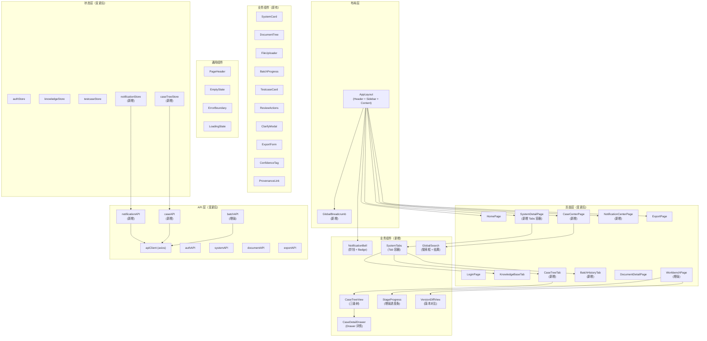
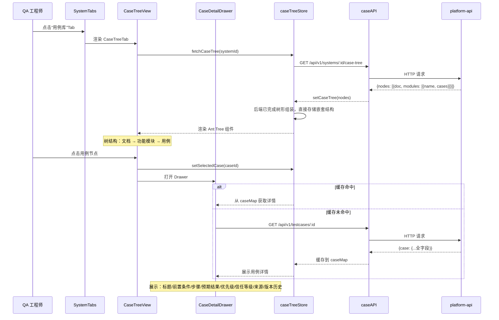
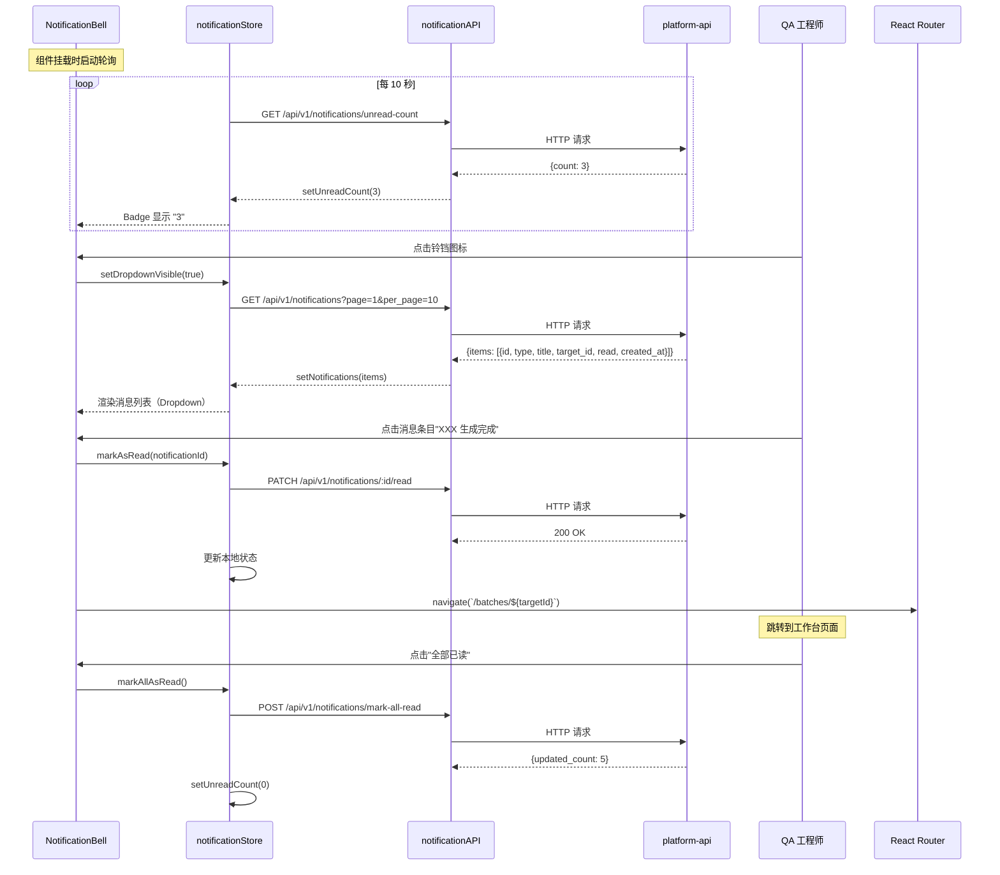
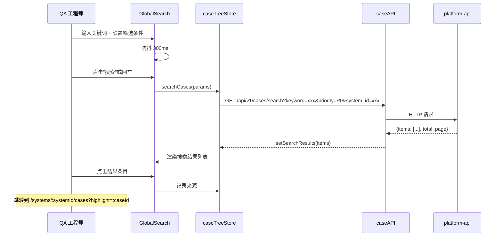
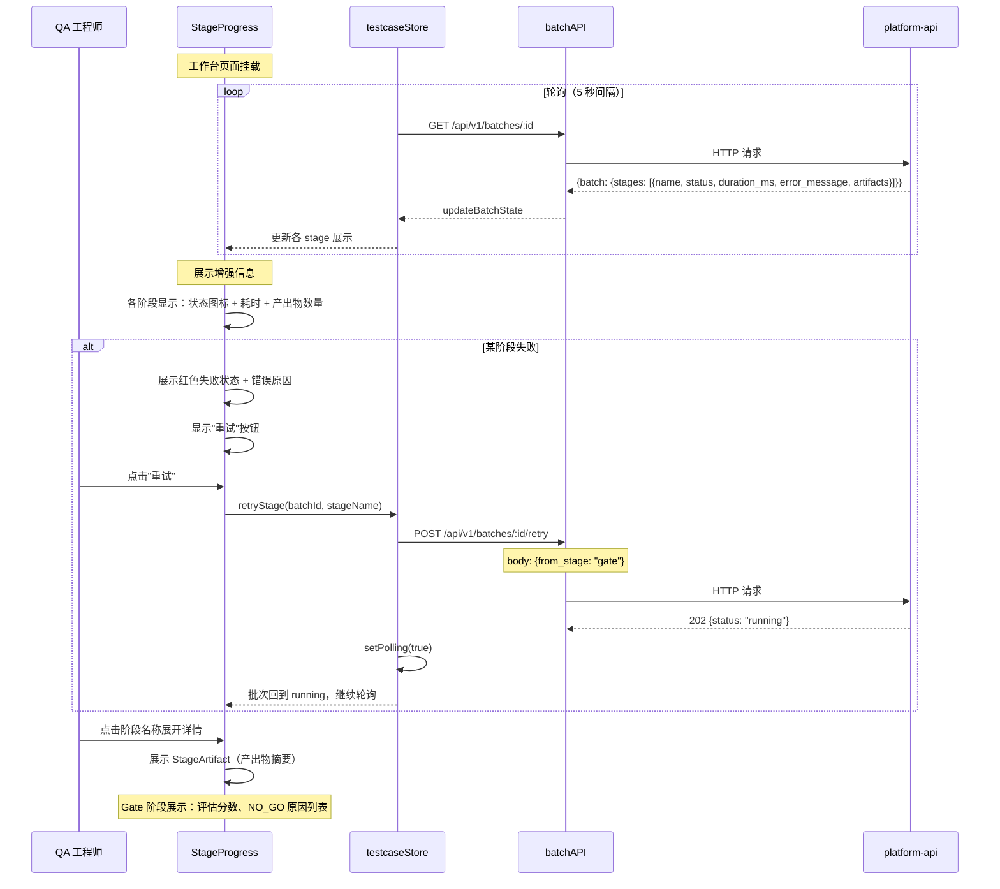

# platform-web 技术设计变更 — CHG-20260609-001

> 基线：xspec/modules/platform-web/design.md (v1.0)

## 变更摘要

重构平台信息架构，新增 5 个页面/组件（用例中心、系统用例库、通知中心、面包屑、搜索），侧边栏从 2 项扩展到 4 项，系统详情页改为多 Tab 结构。本次变更聚焦于第一段交付：信息架构重构 + 树形用例库 + 通知机制 + 导航优化 + 流水线可观测性，第二段交付（用例版本对比、血缘追溯）预留接口但暂不实现前端展示。

---

## 设计决策变更

### 决策 4：通知实时性采用 HTTP 轮询

* **问题**：通知推送使用 WebSocket 还是 HTTP 轮询
* **候选方案**：
  * A — WebSocket 长连接：实时性高 / 需要额外基础设施、连接管理复杂
  * B — HTTP 轮询（10 秒间隔）：实现简单、无状态 / 有 10 秒延迟
* **决策**：选择方案 B（10 秒轮询）
* **理由**：用例生成任务本身耗时数分钟，10 秒延迟对用户感知无影响。轮询仅请求未读数（单字段响应），极轻量。符合"禁止无用抽象层"原则，避免引入 WebSocket 基础设施复杂度。

### 决策 5：版本差异对比采用前端 jsdiff

* **问题**：用例版本差异对比在前端还是后端计算
* **候选方案**：
  * A — 后端计算 diff 返回结构化差异：减少前端计算 / 增加 API 复杂度
  * B — 前端 jsdiff 库 + 自定义 DiffView 组件：前端自主、复用成熟库 / 大数据量时性能需关注
* **决策**：选择方案 B（前端 jsdiff + 结构化对比）
* **理由**：用例单条数据量小（< 10KB），前端计算无性能问题。jsdiff 库成熟稳定（npm 周下载量 > 1000 万），自定义 DiffView 可复用 IterationDiff 组件逻辑。前端处理保持 API 简洁（仅返回两版本原始数据）。

### 决策 6：树形聚合采用后端返回嵌套结构

* **问题**：用例树三级结构（文档 → 模块 → 用例）在后端还是前端聚合
* **候选方案**：
  * A — 后端返回已聚合树结构：前端直接渲染 / 后端 API 复杂
  * B — 后端返回扁平数据，前端按 provenance.source_section 聚合：API 简洁 / 前端需聚合逻辑
* **决策**：选择方案 A（后端聚合、前端直接渲染）
* **理由**：后端 GET /systems/:id/case-tree 直接返回已聚合的三级树结构（Document → Module → Case），前端 caseTreeStore 直接存储并渲染，无需前端组装。树节点展开/折叠状态由前端控制。

---

## 架构变更

### 组件结构变更



---

## 新增目录结构

```
platform-web/src/
├── pages/
│   ├── SystemDetail/              # 新增：系统详情页（Tabs 容器）
│   │   ├── index.tsx
│   │   └── components/
│   │       ├── SystemTabs.tsx     # Tab 切换容器
│   │       ├── KnowledgeBaseTab.tsx
│   │       ├── CaseTreeTab.tsx    # 用例库 Tab
│   │       └── BatchHistoryTab.tsx # 批次历史 Tab
│   ├── CaseCenter/                # 新增：全局用例中心
│   │   ├── index.tsx
│   │   └── components/
│   │       ├── GlobalSearch.tsx   # 搜索框 + 筛选器
│   │       └── SearchResults.tsx  # 搜索结果列表
│   ├── NotificationCenter/        # 新增：通知中心
│   │   └── index.tsx
│   └── Workbench/
│       └── components/
│           ├── StageProgress.tsx  # 增强：耗时/失败原因/重试
│           └── VersionDiffView.tsx # 新增：版本对比组件
├── components/
│   ├── Layout/
│   │   ├── GlobalBreadcrumb.tsx   # 新增：全局面包屑
│   │   └── NotificationBell.tsx   # 新增：通知铃铛
│   ├── CaseTreeView/              # 新增：用例树组件
│   │   ├── index.tsx
│   │   └── CaseDetailDrawer.tsx
│   └── TrustLevelTag.tsx          # 新增：信任等级标签（替代 ConfidenceTag）
├── stores/
│   ├── notificationStore.ts       # 新增
│   └── caseTreeStore.ts           # 新增
├── services/
│   ├── notificationAPI.ts         # 新增
│   └── caseAPI.ts                 # 新增
└── types/
    └── models.ts                  # 变更：新增 Notification、CaseTreeNode 等类型
```

---

## 关键流程设计

### 用例树加载与详情展示流程



### AI 匹配待确认交互

当用例所关联的 `logical_case.needs_human_confirm = true` 时：

- **展示位置**：用例详情面板（CaseDetailDrawer）顶部，溯源区域下方
- **展示形式**：黄色警告条，文案："AI 自动匹配了历史用例关联，请确认是否正确"
- **操作按钮**：
  - [确认关联]：调用 PATCH /api/v1/logical-cases/:id/confirm → 设置 needs_human_confirm=false
  - [拒绝，拆分为新用例]：调用 POST /api/v1/logical-cases/:id/split → 创建新 logical_case，解除关联
- **触发时机**：用例详情面板加载时，从 case-tree 响应的用例数据中检查关联的 logical_case 的 needs_human_confirm 标记
- **视觉优先级**：高于 trust_level 提示，低于 review_status 操作栏

### 通知轮询与消息跳转流程



### 全局搜索流程



### 流水线可观测性（stage 状态展示 + 失败重试）流程



---

## 状态管理变更

### 新增 notificationStore

```typescript
interface NotificationState {
  // 未读数
  unreadCount: number;
  
  // 消息列表
  notifications: Notification[];
  notificationsTotal: number;
  notificationsPage: number;
  notificationsLoading: boolean;
  
  // UI 状态
  dropdownVisible: boolean;
  
  // 轮询状态
  isPolling: boolean;
  pollIntervalId: number | null;
}

interface NotificationActions {
  // 数据获取
  fetchUnreadCount: () => Promise<void>;
  fetchNotifications: (params?: PaginationParams) => Promise<void>;
  
  // 状态变更
  markAsRead: (notificationId: string) => Promise<void>;
  markAllAsRead: () => Promise<void>;
  
  // UI 控制
  setDropdownVisible: (visible: boolean) => void;
  
  // 轮询控制
  startPolling: () => void;
  stopPolling: () => void;
  
  // 清理
  reset: () => void;
}

type NotificationStore = NotificationState & NotificationActions;
```

**轮询配置：**

| 配置项 | 值 | 说明 |
| :--- | :--- | :--- |
| 轮询接口 | GET /api/v1/notifications/unread-count | 仅请求未读数，极轻量 |
| 轮询间隔 | 10000ms（10 秒） | 基于设计决策 4 |
| 启动时机 | AppLayout 挂载时 | 全局轮询 |
| 停止时机 | 用户登出或页面卸载 | useEffect cleanup |

### 新增 caseTreeStore

```typescript
interface CaseTreeState {
  // 树形数据
  tree: CaseTreeNode[];
  expandedKeys: string[];
  selectedKey: string | null;
  
  // 用例详情缓存
  caseMap: Map<string, CaseDetail>;
  selectedCase: CaseDetail | null;
  
  // 搜索
  searchKeyword: string;
  searchResults: SearchResult[];
  searchTotal: number;
  searchPage: number;
  
  // 筛选
  filters: {
    systemId?: string;
    priority?: Priority;
    reviewStatus?: ReviewStatus;
    trustLevel?: TrustLevel;
  };
  
  // 加载状态
  treeLoading: boolean;
  searchLoading: boolean;
  detailLoading: boolean;
}

interface CaseTreeActions {
  // 树操作
  fetchCaseTree: (systemId: string) => Promise<void>;
  setExpandedKeys: (keys: string[]) => void;
  setSelectedKey: (key: string | null) => void;
  
  // 详情操作
  fetchCaseDetail: (caseId: string) => Promise<void>;
  clearSelectedCase: () => void;
  
  // 搜索操作
  searchCases: (params: SearchParams) => Promise<void>;
  setSearchKeyword: (keyword: string) => void;
  setFilters: (filters: Partial<CaseTreeState['filters']>) => void;
  clearSearch: () => void;
  
  // 工具方法（后端已完成树形组装，前端无需 buildTree 逻辑）
  
  // 清理
  reset: () => void;
}

type CaseTreeStore = CaseTreeState & CaseTreeActions;
```

**树渲染逻辑：**

```typescript
// 后端已完成树形组装，前端无需 buildTree 逻辑
// GET /systems/:id/case-tree 直接返回已聚合的三级树结构（Document → Module → Case）
// caseTreeStore 直接存储并渲染，支持虚拟滚动：节点超过 200 时启用 Ant Tree height 属性
```

---

## 面包屑导航实现

### 基于路由自动生成

```typescript
// GlobalBreadcrumb.tsx
interface BreadcrumbItem {
  title: string;
  path?: string;  // 无 path 表示当前页（不可点击）
}

// 路由 → 面包屑映射规则
const routeBreadcrumbMap: Record<string, (params: RouteParams) => BreadcrumbItem[]> = {
  '/systems': () => [
    { title: '系统管理' }
  ],
  
  '/systems/:id/documents': (params) => [
    { title: '系统管理', path: '/systems' },
    { title: params.systemName || '系统详情' },
    { title: '知识库' }
  ],
  
  '/systems/:id/cases': (params) => [
    { title: '系统管理', path: '/systems' },
    { title: params.systemName || '系统详情' },
    { title: '用例库' }
  ],
  
  '/systems/:id/batches': (params) => [
    { title: '系统管理', path: '/systems' },
    { title: params.systemName || '系统详情' },
    { title: '批次历史' }
  ],
  
  '/documents/:id': (params) => [
    { title: '系统管理', path: '/systems' },
    { title: params.systemName, path: `/systems/${params.systemId}/documents` },
    { title: params.documentTitle || '文档详情' }
  ],
  
  '/batches/:id': (params) => [
    { title: '系统管理', path: '/systems' },
    { title: params.systemName, path: `/systems/${params.systemId}/documents` },
    { title: params.documentTitle, path: `/documents/${params.documentId}` },
    { title: `批次 #${params.batchId}` }
  ],
  
  '/cases': () => [
    { title: '用例中心' }
  ],
  
  '/notifications': () => [
    { title: '通知中心' }
  ],
  
  '/exports': () => [
    { title: '导出中心' }
  ],
};
```

**实现要点：**

1. 使用 `useLocation` + `useParams` 获取当前路由信息
2. 从对应 Store 获取实体名称（systemName, documentTitle 等）
3. 渲染 `Ant Breadcrumb` 组件，最后一项不可点击
4. 支持动态加载：名称未获取时显示 Loading 占位

---

## 版本对比实现（第二段）

### jsdiff 库 + 自定义 DiffView 组件

```typescript
// VersionDiffView.tsx
import { diffWords, diffLines } from 'diff';

interface VersionDiffViewProps {
  oldVersion: CaseDetail;
  newVersion: CaseDetail;
  onClose: () => void;
}

// 对比字段
const DIFF_FIELDS = [
  'title',
  'preconditions',
  'steps',
  'expected_results',
  'priority',
  'dimensions',
] as const;

// 渲染逻辑
function VersionDiffView({ oldVersion, newVersion, onClose }: VersionDiffViewProps) {
  // 1. 结构化对比：遍历 DIFF_FIELDS，比较字段值
  // 2. 文本 diff：对 string 字段使用 diffWords，高亮变更
  // 3. 数组 diff：对 steps/preconditions 逐项对比
  // 4. 左右分栏展示：左侧旧版本（删除标红），右侧新版本（新增标绿）
}
```

**API 调用：**

```typescript
// 获取版本列表
GET /api/v1/cases/:id/versions
Response: { versions: [{ version, created_at, modification_reason }] }

// 获取两版本 diff 原始数据
GET /api/v1/cases/:id/diff?v1=1&v2=2
Response: { old: CaseDetail, new: CaseDetail, change_summary: string }
```

---

## 性能优化

### 虚拟滚动

| 场景 | 方案 |
| :--- | :--- |
| 用例树节点 > 200 | Ant Tree 设置 `height={500}` 启用虚拟滚动 |
| 搜索结果列表 | Ant List + `virtual` 属性 |
| 通知消息列表 | 分页加载（每页 20 条）+ 下拉加载更多 |

### 轮询优化

| 轮询类型 | 间隔 | 优化策略 |
| :--- | :--- | :--- |
| 通知未读数 | 10 秒 | 仅请求 count 字段，响应 < 100B |
| 批次进度 | 5 秒 | 页面离开自动停止；页面隐藏时暂停（visibilitychange） |

```typescript
// 页面可见性优化
useEffect(() => {
  const handleVisibility = () => {
    if (document.hidden) {
      stopPolling();
    } else if (shouldPoll) {
      startPolling();
    }
  };
  document.addEventListener('visibilitychange', handleVisibility);
  return () => document.removeEventListener('visibilitychange', handleVisibility);
}, []);
```

### 懒加载

| 资源 | 策略 |
| :--- | :--- |
| 用例详情 | 点击节点时按需请求，缓存到 caseMap |
| 版本历史 | 点击"查看历史"时请求 |
| 通知完整列表 | Dropdown 展开时请求第一页 |
| 页面组件 | React.lazy + Suspense（路由级代码分割） |

---

## 错误处理增强

| 错误场景 | 处理方式 | 降级方案 |
| :--- | :--- | :--- |
| 通知轮询失败 | 静默失败，下次轮询重试 | Badge 保持上次数值 |
| 用例树加载失败 | message.error + 展示重试按钮 | EmptyState 占位 |
| 搜索请求失败 | message.error 提示 | 保持上次搜索结果 |
| Stage 重试失败 | message.error + 展示具体错误 | 保持失败状态，允许再次重试 |

---

## 测试矩阵变更

| 测试目标 | 测试类型 | 通过条件 |
| :--- | :--- | :--- |
| 通知轮询 | 单元测试 | 10 秒间隔、可见性暂停、停止清理 |
| 用例树构建 | 单元测试 | 三级结构正确、空数据兼容 |
| 面包屑生成 | 单元测试 | 各路由映射正确、动态参数填充 |
| 全局搜索 | 集成测试 | 防抖生效、筛选条件正确传递 |
| Stage 重试 | 集成测试 | 重试后轮询恢复、状态正确更新 |
| 版本对比 | 单元测试 | diff 高亮正确、字段覆盖完整 |
