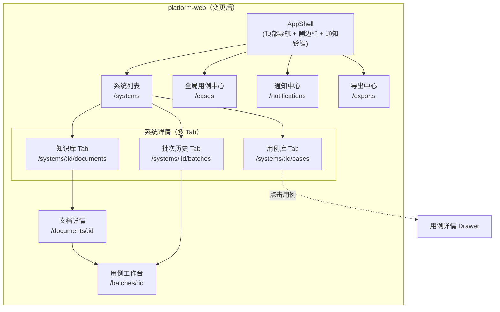
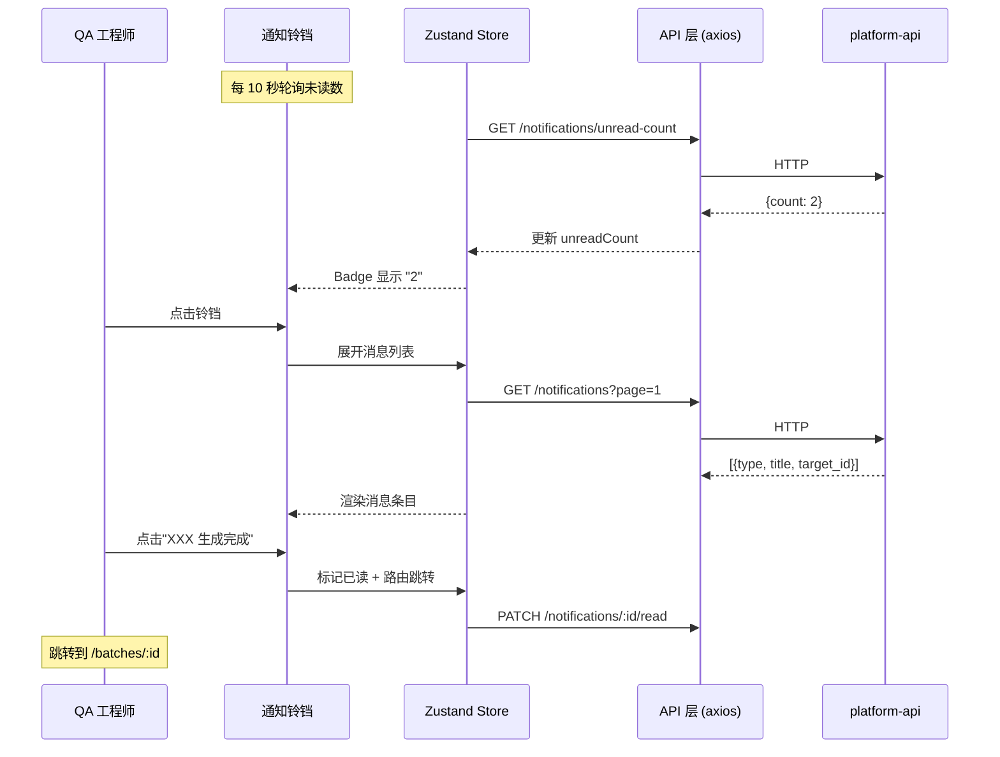
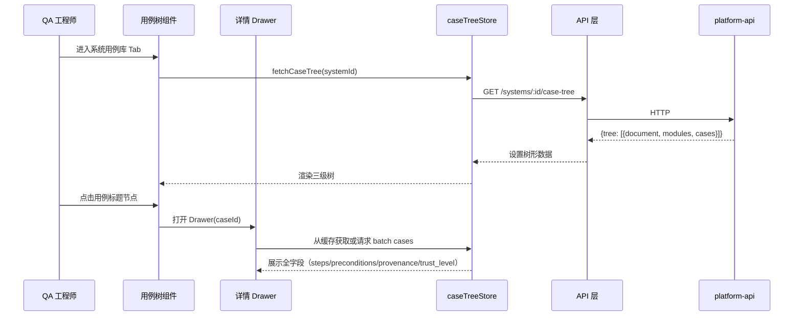

# platform-web 概要设计变更 — CHG-20260609-001

> 基线：xspec/modules/platform-web/hld.md (v1.0)

## 变更摘要

重构平台信息架构，在现有 SPA 上新增 5 个页面/组件（用例中心、系统用例库、通知中心、面包屑、搜索），将侧边栏从 2 项扩展到 4 项，系统详情页改为多 Tab 结构，解决"用例生成后无处可看"的核心缺陷。

## 架构变更

### 页面结构变更

### 核心新增交互流程

## 技术选型变更

无技术选型变更。继续使用：
- React 18 + TypeScript
- Zustand（新增 notificationStore、caseTreeStore）
- Ant Design 5（Tree、Drawer、Breadcrumb、Badge 组件）
- Vite + React Router v6
- axios（轮询 + 数据请求）

## 新增组件

| 组件 | 类型 | 职责 |
| :--- | :--- | :--- |
| `NotificationBell` | 全局 Header 组件 | 铃铛图标 + Badge 未读数 + 下拉消息面板 |
| `NotificationCenter` | 页面组件 | /notifications 路由，站内消息完整列表 |
| `SystemTabs` | 页面容器 | 系统详情多 Tab 容器（知识库/用例库/批次历史） |
| `CaseTreeView` | 页面组件 | /systems/:id/cases，左侧 Tree + 右侧列表 |
| `CaseDetailDrawer` | 面板组件 | 用例全字段详情展示（Ant Drawer） |
| `SystemBatchList` | 页面组件 | /systems/:id/batches，批次列表表格 |
| `CaseCenter` | 页面组件 | /cases，全局搜索 + 结果列表 |
| `GlobalBreadcrumb` | 全局组件 | 基于路由自动生成面包屑导航 |
| `StageProgress` | 增强组件 | 工作台阶段进度增强（耗时/失败原因/重试按钮） |

## 新增 Store

| Store | 状态 | 轮询 |
| :--- | :--- | :--- |
| `notificationStore` | unreadCount, notifications[], fetchUnread(), markRead() | 每 10 秒轮询未读数 |
| `caseTreeStore` | tree[], selectedCase, filters, fetchTree(), search() | 无轮询 |

## 路由表变更

| 变更类型 | 路由 | 组件 |
| :--- | :--- | :--- |
| 新增 | /systems/:id/cases | CaseTreeView |
| 新增 | /systems/:id/batches | SystemBatchList |
| 新增 | /cases | CaseCenter |
| 新增 | /notifications | NotificationCenter |
| 变更 | /systems/:id/documents | 从独立页面改为 SystemTabs 下的 Tab |
| 变更 | /batches/:id | 增加面包屑 + StageProgress 增强 |

## 侧边栏变更

| 原有 | 变更后 |
| :--- | :--- |
| 系统管理、导出中心 | 系统管理、**用例中心**、**通知中心**、导出中心 |

## 性能考量

- 用例树超过 200 节点：启用 Ant Tree 虚拟滚动（height 属性）
- 通知轮询：每 10 秒仅请求 unread-count（极轻量），不拉全量消息
- 用例详情：按需加载（点击时获取），不在树加载时预取全部详情

## 宪章合规

- [x] 无过度设计（复用 Ant Design 现成组件，无自建框架）
- [x] 所有新功能追溯到 spec 需求（US-07~US-13）
- [x] 模块间通过 REST API 通信（不直接访问后端内部）
