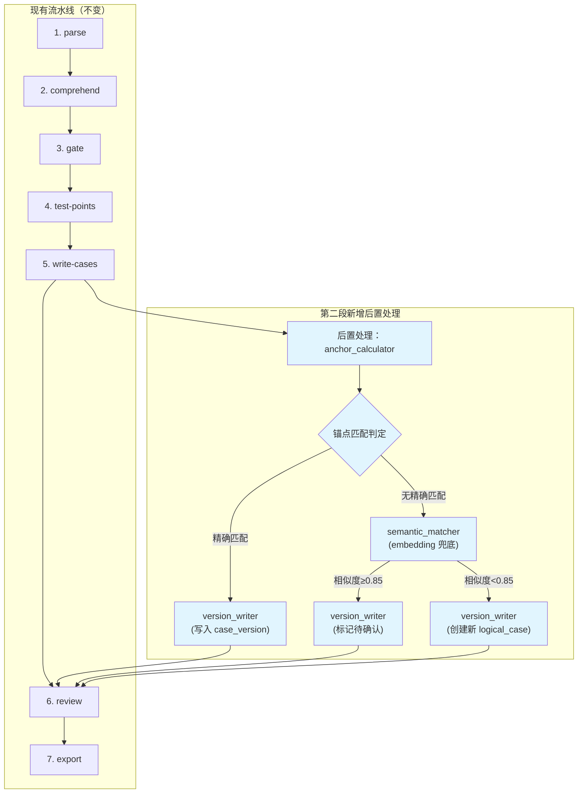
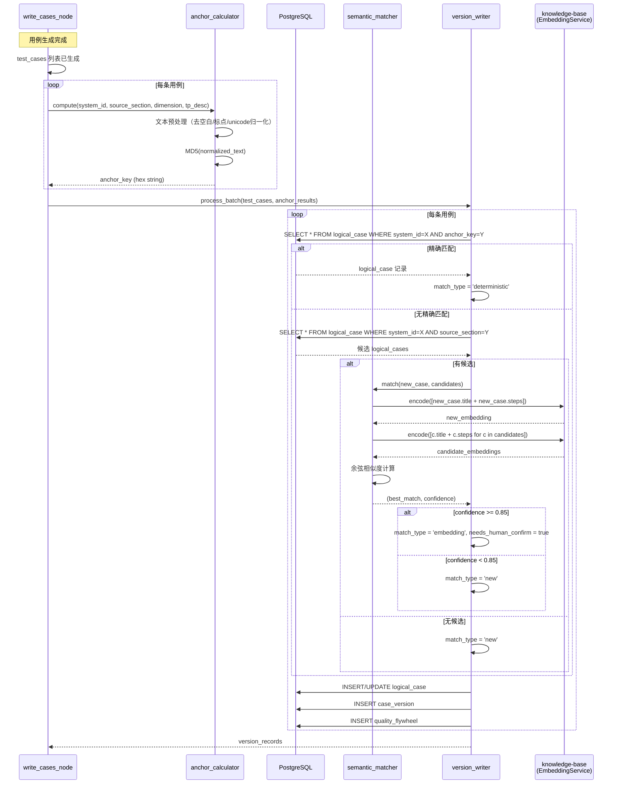
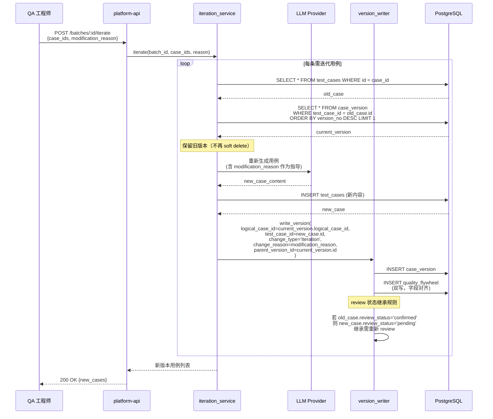
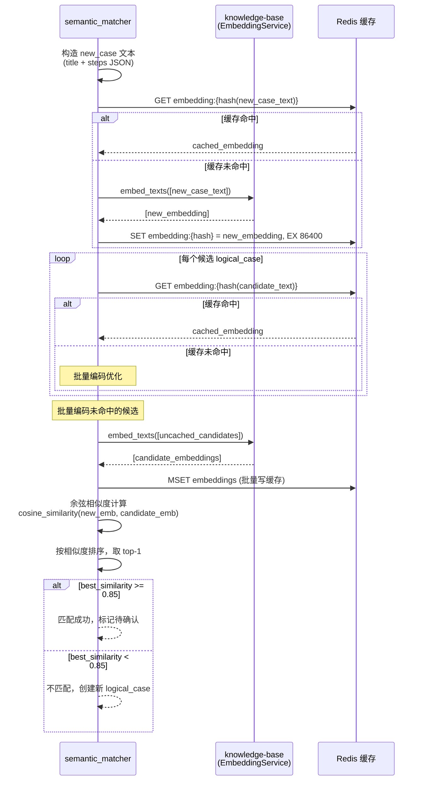

# testcase-generator 技术设计变更 — CHG-20260609-001

> 基线：xspec/modules/testcase-generator/design.md (v1.0)

---

## 1. 变更摘要

第一段不动本模块（禁止修改 `src/testcase_generator/` 目录）。第二段在 write-cases 输出端追加锚点计算+版本写入后置处理，改造 iteration_service 使迭代不再断裂血缘，新增 embedding 语义匹配组件用于跨批次用例关联的兜底识别。

---

## 2. 设计决策变更

| 决策编号 | 决策点 | 选定方案 | 理由 |
|:--- | :--- | :--- | :--- |
| DD-001 | 锚点 hash 算法 | **MD5 全量**：对 `system_id + source_section + dimension + tp_desc_fingerprint` 做 MD5 | 足够快（纯 Python hashlib），冲突率可忽略，hex string 便于调试和日志 |
| DD-002 | AI 语义匹配算法 | **Embedding 向量余弦相似度**：复用 knowledge-base 的 EmbeddingService | 复用已有基础设施，无需额外引入 LLM 调用开销；向量匹配比 LLM-as-Judge 更稳定、成本更低 |

---

## 3. 第一段约束重申

**硬规则：禁止修改 `src/testcase_generator/` 目录下任何文件。**

第一段仅涉及 platform-web 和 platform-api 的变更，testcase-generator 模块保持冻结状态。第二段启动前提：第一段前端+API 层已就绪且验证通过。

---

## 4. 架构变更

### 4.1 流水线增量（第二段后置处理位置）



---

## 5. LangGraph StateGraph 变更

### 5.1 PipelineState 新增字段

```python
class PipelineState(TypedDict):
    """LangGraph 全局状态（基线字段省略）"""
    # ... 基线字段保持不变 ...
    
    # ===== 第二段新增字段 =====
    anchor_results: list[AnchorResult]          # 锚点计算结果列表
    version_records: list[VersionRecord]        # 版本写入记录列表
```

### 5.2 后置处理节点注入

```python
# 在现有 write_cases 节点后追加后置处理
# 方式：包装现有 write_cases_node 为 write_cases_with_anchor

def write_cases_with_anchor_node(state: PipelineState) -> PipelineState:
    """write-cases 节点 + 锚点计算 + 版本写入后置处理"""
    # 1. 调用原有 write_cases 逻辑
    state = original_write_cases_node(state)
    
    # 2. 锚点计算
    anchor_results = []
    for case in state["test_cases"]:
        anchor_key = anchor_calculator.compute(
            system_id=state["config"].system_id,
            source_section=case.provenance.source_section,
            dimension=sorted(case.dimensions)[0],  # 确定性取第一个
            tp_desc_fingerprint=get_tp_desc(case, state["test_points"])
        )
        anchor_results.append(AnchorResult(case_id=case.id, anchor_key=anchor_key))
    
    # 3. 锚点匹配 + 版本写入
    version_records = version_writer.process_batch(
        test_cases=state["test_cases"],
        anchor_results=anchor_results,
        semantic_matcher=semantic_matcher,  # embedding 兜底
    )
    
    state["anchor_results"] = anchor_results
    state["version_records"] = version_records
    return state
```

---

## 6. 关键流程设计

### 6.1 write-cases 后置处理完整时序



### 6.2 iteration_service 改造后时序



### 6.3 embedding 语义匹配时序



---

## 7. anchor_calculator.py 详细设计

### 7.1 模块定位

```
src/testcase_generator/utils/anchor_calculator.py
```

纯函数模块，无状态，可独立单测。

### 7.2 输入参数

```python
class AnchorInput(BaseModel):
    """锚点计算输入"""
    system_id: str           # 系统 UUID
    source_section: str      # provenance.source_section（如 "PRD §2.3"）
    dimension: str           # 主维度名称（dimensions 排序后取第一个）
    tp_desc: str             # 关联 test_point.description
```

### 7.3 输出格式

```python
class AnchorResult(BaseModel):
    """锚点计算结果"""
    case_id: str                                    # 用例 ID
    anchor_key: str                                 # MD5 hex string (32 字符)
    match_type: Literal["deterministic", "embedding", "new"]  # 匹配类型
    logical_case_id: str | None                     # 匹配到的 logical_case ID
    confidence: float | None                        # embedding 匹配时的置信度
    needs_human_confirm: bool                       # 是否需要人工确认
```

### 7.4 MD5 计算逻辑

```python
import hashlib
import unicodedata
import re

def normalize_text(text: str) -> str:
    """文本预处理：去除空白、标点、unicode 归一化"""
    # 1. Unicode NFKC 归一化（全角→半角，兼容字符→规范形式）
    text = unicodedata.normalize("NFKC", text)
    
    # 2. 转小写
    text = text.lower()
    
    # 3. 去除所有空白字符（空格/制表符/换行）
    text = re.sub(r"\s+", "", text)
    
    # 4. 去除标点符号（保留字母、数字、中文）
    text = re.sub(r"[^\w\u4e00-\u9fff]", "", text)
    
    return text


def compute_anchor_key(input: AnchorInput) -> str:
    """计算 anchor_key"""
    # 拼接各字段
    raw_text = f"{input.system_id}|{input.source_section}|{input.dimension}|{input.tp_desc}"
    
    # 预处理
    normalized = normalize_text(raw_text)
    
    # MD5 计算
    anchor_key = hashlib.md5(normalized.encode("utf-8")).hexdigest()
    
    return anchor_key  # 32 字符 hex string
```

### 7.5 锚点键格式说明

- **格式**：MD5 hex string，32 字符小写十六进制
- **示例**：`a1b2c3d4e5f678901234567890abcdef`
- **唯一性保证**：MD5 冲突概率在业务数据量级（< 100 万用例）下可忽略
- **调试友好**：hex string 可直接在日志和数据库中查看

---

## 8. version_writer.py 详细设计

### 8.1 模块定位

```
src/testcase_generator/services/version_writer.py
```

服务层组件，负责 logical_case + case_version + quality_flywheel 的写入。

### 8.2 方法签名

```python
from typing import Literal

class VersionWriter:
    def __init__(self, db_session: AsyncSession):
        self.db = db_session

    async def process_batch(
        self,
        test_cases: list[TestCase],
        anchor_results: list[AnchorResult],
        semantic_matcher: SemanticMatcher,
    ) -> list[VersionRecord]:
        """批量处理用例版本写入"""
        ...

    async def write_version(
        self,
        test_case: TestCase,
        batch: TestBatch,  # B4: system_id 经 batch 取得
        logical_case_id: str | None,
        anchor_key: str,
        match_type: Literal["deterministic", "embedding", "new"],
        change_type: Literal["ai_gen", "iteration", "ai_regen", "requirement_change", "human_edit"],
        change_reason: str,
        parent_version_id: str | None = None,
        confidence: float | None = None,
        needs_human_confirm: bool = False,
    ) -> VersionRecord:
        """写入单条用例版本记录（system_id 从 batch 获取，不从 test_case 取）"""
        ...

    async def _inherit_review_status(
        self,
        new_case: TestCase,
        old_version: CaseVersion | None,
        change_type: str,
    ) -> str:
        """计算新版本的 review_status 继承值"""
        ...
```

### 8.3 事务边界

**单事务三写原则**：logical_case + case_version + quality_flywheel 三表写入在同一事务中完成。

```python
async def write_version(self, ...) -> VersionRecord:
    async with self.db.begin():  # 事务开始
        # 1. 查询/创建 logical_case
        if logical_case_id:
            logical_case = await self._get_logical_case(logical_case_id)
            # 更新匹配元数据（embedding 匹配时更新置信度和确认标记）
            if match_type == "embedding":
                logical_case.anchor_method = match_type
                logical_case.ai_confidence = confidence
                logical_case.needs_human_confirm = needs_human_confirm
        else:
            logical_case = await self._create_logical_case(
                system_id=batch.system_id,  # 注意 B4 修正：经 batch 取得
                anchor_key=anchor_key,
                source_section=test_case.provenance.source_section,
                anchor_method=match_type,
                ai_confidence=confidence,
                needs_human_confirm=needs_human_confirm,
            )
        
        # 2. 计算 version_no
        latest_version = await self._get_latest_version(logical_case.id)
        new_version_no = (latest_version.version_no + 1) if latest_version else 1
        
        # 3. 写入 case_version
        case_version = CaseVersion(
            id=str(uuid4()),
            logical_case_id=logical_case.id,
            version_no=new_version_no,
            test_case_id=test_case.id,
            change_type=change_type,
            change_reason=change_reason,
            parent_version_id=parent_version_id,
            created_at=datetime.utcnow(),
        )
        self.db.add(case_version)
        
        # 4. 双写 quality_flywheel（字段对齐）
        flywheel_record = QualityFlywheel(
            id=str(uuid4()),
            test_case_id=test_case.id,
            system_id=batch.system_id,  # B4: 经 batch 取得
            ai_version_yaml=serialize_case_to_yaml(test_case),  # B3: 序列化用例全字段
            qa_final_version_yaml=None,  # 新生成时无 QA 版本
            modification_reason=change_reason,
            modification_type=self._map_change_type_to_modification(change_type),
            feature_types=infer_feature_types_from_provenance(test_case.provenance),
            dimensions=test_case.dimensions,
            is_few_shot_candidate=False,
            created_at=datetime.utcnow(),
        )
        self.db.add(flywheel_record)
        
        # 事务提交（三写原子性）
    
    return VersionRecord(
        logical_case_id=logical_case.id,
        version_no=new_version_no,
        test_case_id=test_case.id,
        change_type=change_type,
        change_reason=change_reason,
        parent_version_id=parent_version_id,
    )
```

### 8.4 review 状态继承规则实现

```python
async def _inherit_review_status(
    self,
    new_case: TestCase,
    old_version: CaseVersion | None,
    change_type: str,
) -> str:
    """
    review 状态继承规则（枚举：pending/confirmed/needs_modification/deleted）：
    - 全新用例（无 old_version）→ pending
    - change_type=human_edit 或 ai_regen → 保持原状态
    - change_type=requirement_change 或 iteration → pending（需重新 review）
    - 旧版本 deleted → pending
    """
    if old_version is None:
        return "pending"
    
    old_case = await self._get_test_case(old_version.test_case_id)
    old_status = old_case.review_status
    
    # 人工微调和同需求纯表述优化：保持原状态
    if change_type in ("human_edit", "ai_regen"):
        return old_status
    
    # 被删除的用例重新出现：待审
    if old_status == "deleted":
        return "pending"
    
    # requirement_change 和 iteration：一律回到待审
    # （需求变更可能导致用例失效）
    return "pending"
```

---

## 9. semantic_matcher.py 详细设计

### 9.1 模块定位

```
src/testcase_generator/services/semantic_matcher.py
```

服务层组件，负责 embedding 向量余弦相似度匹配。

### 9.2 复用 knowledge-base EmbeddingClient

```python
from knowledge_base.services.embedding.embedding_client import EmbeddingClient

class SemanticMatcher:
    def __init__(
        self,
        embedding_client: EmbeddingClient,
        similarity_threshold: float = 0.85,
        redis_client: Redis | None = None,
    ):
        self.embedding_client = embedding_client
        self.threshold = similarity_threshold
        self.cache = redis_client
```

### 9.3 输入输出规格

**输入：**
```python
class MatchInput(BaseModel):
    """语义匹配输入"""
    new_case_title: str
    new_case_steps: list[dict]  # [{step_number, action, input_data, expected_result}]
    candidates: list[LogicalCaseCandidate]

class LogicalCaseCandidate(BaseModel):
    """候选 logical_case"""
    logical_case_id: str
    latest_title: str
    latest_steps: list[dict]
```

**输出：**
```python
class MatchResult(BaseModel):
    """语义匹配结果"""
    matched: bool
    logical_case_id: str | None
    confidence: float
    needs_human_confirm: bool
```

### 9.4 Embedding 模型

| 配置项 | 值 | 说明 |
|:--- | :--- | :--- |
| 模型 | 由 `OPENAI_EMBEDDING_MODEL` 环境变量配置 | 走自建网关，模型与维度以网关配置为准 |
| 维度 | 以网关配置为准 | 不硬编码，由 EmbeddingClient 初始化时获取 |
| 网关地址 | `OPENAI_API_BASE` 环境变量 | 自建代理网关 |

### 9.5 余弦相似度计算

```python
import numpy as np

def cosine_similarity(vec_a: np.ndarray, vec_b: np.ndarray) -> float:
    """计算两个向量的余弦相似度"""
    dot_product = np.dot(vec_a, vec_b)
    norm_a = np.linalg.norm(vec_a)
    norm_b = np.linalg.norm(vec_b)
    
    if norm_a == 0 or norm_b == 0:
        return 0.0
    
    return float(dot_product / (norm_a * norm_b))
```

### 9.6 阈值判定规则

| 相似度范围 | 判定结果 | 处理方式 |
|:--- | :--- | :--- |
| `≥ 0.85` | 匹配成功 | 关联已有 logical_case，`needs_human_confirm=true` |
| `< 0.85` | 不匹配 | 创建新 logical_case |

**阈值选择依据**：
- 0.85 为初始值，基于经验设定
- 将通过 golden-set 评估反推校准
- 配置化，支持在线调整

### 9.7 批量编码优化

```python
async def match(self, input: MatchInput) -> MatchResult:
    """执行语义匹配"""
    # 1. 构造文本
    new_text = self._build_case_text(input.new_case_title, input.new_case_steps)
    candidate_texts = [
        self._build_case_text(c.latest_title, c.latest_steps)
        for c in input.candidates
    ]
    
    # 2. 批量编码（一次 API 调用）
    all_texts = [new_text] + candidate_texts
    all_embeddings = await self._batch_encode(all_texts)
    
    new_embedding = all_embeddings[0]
    candidate_embeddings = all_embeddings[1:]
    
    # 3. 计算相似度
    similarities = [
        cosine_similarity(new_embedding, emb)
        for emb in candidate_embeddings
    ]
    
    # 4. 取最大相似度
    if not similarities:
        return MatchResult(matched=False, logical_case_id=None, confidence=0.0, needs_human_confirm=False)
    
    max_idx = np.argmax(similarities)
    max_similarity = similarities[max_idx]
    
    if max_similarity >= self.threshold:
        return MatchResult(
            matched=True,
            logical_case_id=input.candidates[max_idx].logical_case_id,
            confidence=max_similarity,
            needs_human_confirm=True,  # embedding 匹配需人工确认
        )
    else:
        return MatchResult(
            matched=False,
            logical_case_id=None,
            confidence=max_similarity,
            needs_human_confirm=False,
        )


async def _batch_encode(self, texts: list[str]) -> list[np.ndarray]:
    """批量编码（带缓存）"""
    # 检查缓存
    cached = {}
    uncached_texts = []
    uncached_indices = []
    
    for i, text in enumerate(texts):
        cache_key = f"embedding:{hashlib.md5(text.encode()).hexdigest()}"
        if self.cache:
            cached_value = await self.cache.get(cache_key)
            if cached_value:
                cached[i] = np.frombuffer(cached_value, dtype=np.float32)
                continue
        uncached_texts.append(text)
        uncached_indices.append(i)
    
    # 批量编码未命中的
    if uncached_texts:
        # 一次 API 调用编码所有未缓存文本（返回 list[list[float]]）
        embeddings = await self.embedding_client.embed_batch(uncached_texts)
        
        # 写入缓存
        for idx, text, emb in zip(uncached_indices, uncached_texts, embeddings):
            cached[idx] = np.asarray(emb, dtype=np.float32)
            if self.cache:
                cache_key = f"embedding:{hashlib.md5(text.encode()).hexdigest()}"
                await self.cache.set(cache_key, np.asarray(emb, dtype=np.float32).tobytes(), ex=86400)  # 24h TTL
    
    # 按原顺序返回
    return [cached[i] for i in range(len(texts))]


def _build_case_text(self, title: str, steps: list[dict]) -> str:
    """构造用例文本（用于 embedding）"""
    steps_text = "\n".join([
        f"{s.get('step_number', i+1)}. {s.get('action', '')} → {s.get('expected_result', '')}"
        for i, s in enumerate(steps)
    ])
    return f"{title}\n\n{steps_text}"
```

---

## 10. 错误处理与降级

### 10.1 Embedding 服务不可用时的处理

```python
async def match_with_fallback(self, input: MatchInput) -> MatchResult:
    """带降级的语义匹配"""
    try:
        return await self.match(input)
    except EmbeddingServiceUnavailable as e:
        # 降级策略：跳过 embedding 匹配，直接创建新 logical_case
        logger.warning(f"Embedding service unavailable, fallback to new logical_case: {e}")
        return MatchResult(
            matched=False,
            logical_case_id=None,
            confidence=0.0,
            needs_human_confirm=False,
        )
    except EmbeddingRateLimitExceeded as e:
        # 限流时等待重试
        logger.warning(f"Embedding rate limit exceeded, retrying after backoff: {e}")
        await asyncio.sleep(e.retry_after or 5)
        return await self.match(input)
```

### 10.2 错误处理矩阵

| 错误类型 | 处理策略 | 影响 |
|:--- | :--- | :--- |
| Embedding API 超时 | 重试 2 次后降级 | 新用例创建为新 logical_case |
| Embedding API 限流 | 等待 `retry_after` 后重试 | 延迟但不丢失匹配 |
| Embedding 缓存不可用 | 跳过缓存，直接调用 API | 性能下降但功能正常 |
| 数据库写入失败 | 事务回滚，任务标记失败 | 用例生成成功但版本记录失败，需人工处理 |

---

## 11. 性能设计

### 11.1 批量处理策略

| 处理阶段 | 批量策略 | 批大小 |
|:--- | :--- | :--- |
| anchor_key 计算 | 全量并行（CPU bound） | 无限制 |
| 锚点精确匹配 | 批量 WHERE IN 查询 | 100 条/批 |
| Embedding 编码 | 单次 API 调用 | 最多 100 条文本 |
| 版本写入 | 批量 INSERT | 50 条/事务 |

### 11.2 缓存策略

| 缓存项 | 缓存位置 | TTL | Key 格式 |
|:--- | :--- | :--- | :--- |
| Embedding 向量 | Redis | 24 小时 | `embedding:{md5(text)}` |
| logical_case 查询 | 内存（请求级） | 请求结束 | — |

### 11.3 预期性能指标

| 指标 | 目标值 | 测试条件 |
|:--- | :--- | :--- |
| 单条用例 anchor_key 计算 | < 1ms | 本地 CPU |
| 100 条用例批量锚点匹配 | < 100ms | PostgreSQL 本地 |
| 100 条用例 embedding 编码 | < 3s | OpenAI API |
| 单批次版本写入 | < 500ms | 50 条/事务 |

---

## 12. 测试要求变更

| 测试目标 | 测试类型 | 通过条件 | 新增/修改 |
|:--- | :--- | :--- | :--- |
| anchor_key 计算确定性 | 单元测试 | 同输入必须产出相同 anchor_key | 新增 |
| anchor_key 归一化 | 单元测试 | 空白/标点/大小写不影响结果 | 新增 |
| 精确匹配路径 | 集成测试 | anchor_key 匹配时正确关联 logical_case | 新增 |
| Embedding 兜底路径 | 集成测试 | 无精确匹配时触发 embedding 比对 | 新增 |
| 版本写入事务性 | 集成测试 | 三表写入全部成功或全部回滚 | 新增 |
| review 状态继承 | 单元测试 | 各状态正确继承 | 新增 |
| Embedding 降级 | 集成测试 | 服务不可用时创建新 logical_case | 新增 |
| 批量编码优化 | 性能测试 | 100 条用例 < 3s 完成编码 | 新增 |
| iteration_service 血缘 | 集成测试 | 迭代后 parent_version_id 正确指向 | 新增 |

---

## 附录 A：配置项

```yaml
# config/testcase_generator.yaml 新增配置
anchor:
  hash_algorithm: "md5"  # 支持 md5/sha256
  
semantic_matching:
  enabled: true
  model: "text-embedding-3-small"
  similarity_threshold: 0.85
  max_candidates: 10  # 同 section 最多比对 10 个候选
  cache_ttl: 86400  # embedding 缓存 24 小时
  
version_write:
  batch_size: 50  # 每事务写入条数
  flywheel_dual_write: true  # 双写 quality_flywheel
```

---

## 附录 B：与 platform-api 数据模型对照

本设计中的 `AnchorResult` 和 `VersionRecord` 对应 platform-api 定义的物理表：

| 本模块概念 | platform-api 物理表 | 对应关系 |
|:--- | :--- | :--- |
| `AnchorResult.anchor_key` | `logical_case.anchor_key` | 1:1 |
| `AnchorResult.logical_case_id` | `logical_case.id` | 1:1 |
| `VersionRecord.logical_case_id` | `case_version.logical_case_id` | FK |
| `VersionRecord.version_no` | `case_version.version_no` | 1:1 |
| `VersionRecord.change_type` | `case_version.change_type` | 1:1 |
| `VersionRecord.change_reason` | `case_version.change_reason` | 1:1 |
| `VersionRecord.parent_version_id` | `case_version.parent_version_id` | FK（自引用） |
