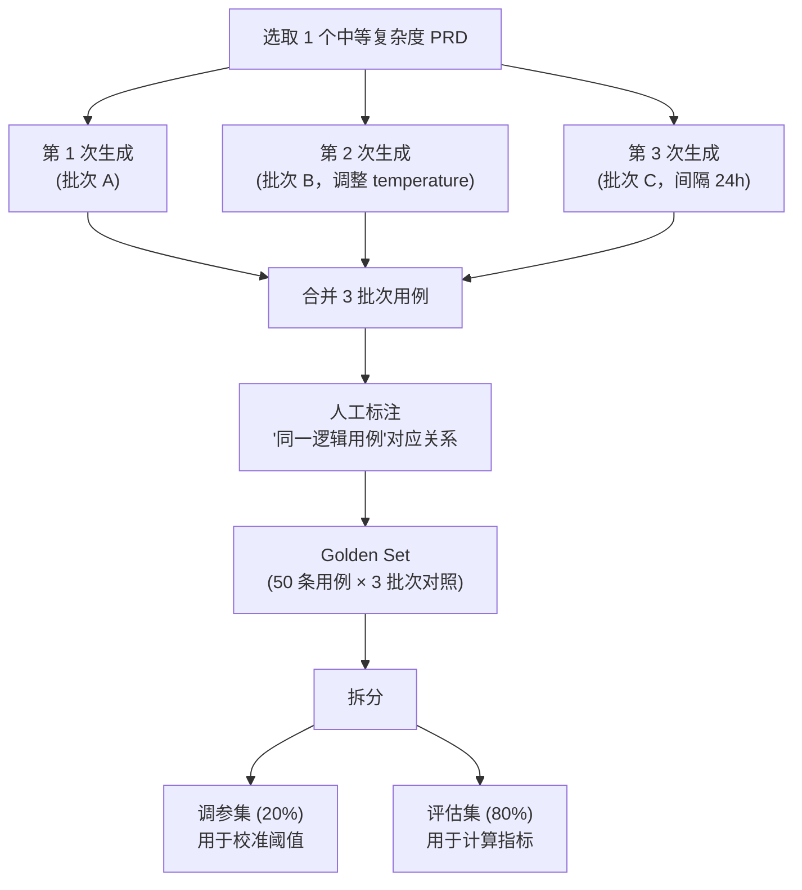
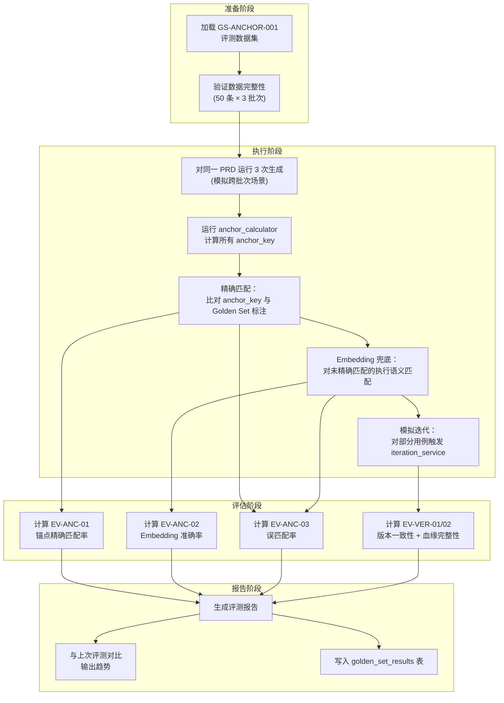

# testcase-generator 评测方案变更 — CHG-20260609-001

> 基线：xspec/modules/testcase-generator/evaluation.md (v1.0)

---

## 1. 变更摘要

在基线评测方案（Golden-set 覆盖度评估）基础上，新增锚点匹配和版本化相关的评测维度。评测目标：验证锚点计算的跨批次稳定性、embedding 语义匹配的准确率、版本写入的数据一致性、以及 iteration_service 改造后的血缘完整性。

---

## 2. 评测维度变更

### 2.1 新增评测维度

| 维度编号 | 维度名称 | 评测对象 | 基线引用 |
|:--- | :--- | :--- | :--- |
| EV-ANC-01 | 锚点精确匹配率 | anchor_calculator | 无（新增） |
| EV-ANC-02 | Embedding 语义匹配准确率 | semantic_matcher | 无（新增） |
| EV-ANC-03 | 误匹配率 | 锚点+语义匹配整体 | 无（新增） |
| EV-VER-01 | 版本写入一致性 | version_writer | 无（新增） |
| EV-VER-02 | iteration_service 血缘完整性 | iteration_service | 无（新增） |

### 2.2 与基线评测的关系

基线评测（Golden-set 覆盖度）保持不变，新增维度作为**独立评测流程**与基线评测并行运行：

| 评测流程 | 关注点 | 触发时机 |
|:--- | :--- | :--- |
| 基线 Golden-set 评测 | 用例生成质量 | 每次内核迭代 |
| 锚点+版本化评测（新增） | 跨批次关联准确性 + 数据一致性 | 每次锚点/版本逻辑变更 |

---

## 3. 评测指标定义

### 3.1 锚点精确匹配率

| 指标项 | 值 |
|:--- | :--- |
| **定义** | 同一逻辑用例在多次生成中通过 anchor_key 正确匹配到已有 logical_case 的比例 |
| **计算公式** | 正确精确匹配数 / 应匹配的用例总数 |
| **正确标准** | 人工标注"同一逻辑用例"的跨批次对中，anchor_key 完全相同 |
| **通过阈值** | **≥ 70%** |
| **阈值理由** | 锚点基于 source_section + dimension + tp_desc 三因子，仅当三者均稳定时才精确匹配；部分场景 tp_desc 会因 LLM 生成差异导致 hash 变化，70% 为合理预期 |

### 3.2 Embedding 语义匹配准确率

| 指标项 | 值 |
|:--- | :--- |
| **定义** | 在精确匹配失败的情况下，embedding 语义匹配的判定结果与人工标注一致的比例 |
| **计算公式** | (embedding 判定"匹配" ∩ 人工判定"同一用例") / embedding 判定"匹配" 总数 |
| **正确标准** | embedding 判定为匹配（≥0.85）的结果中，人工确认为"确实是同一逻辑用例"的比例 |
| **通过阈值** | **≥ 85%** |
| **阈值理由** | embedding 匹配作为兜底手段，需要高准确率以减少人工确认负担 |

### 3.3 误匹配率

| 指标项 | 值 |
|:--- | :--- |
| **定义** | 不同逻辑用例被错误关联到同一 logical_case 的比例 |
| **计算公式** | 错误关联数 / 关联总数 |
| **错误标准** | 人工判定为"不是同一逻辑用例"但系统判定为匹配（包括精确匹配和 embedding 匹配） |
| **通过阈值** | **≤ 5%** |
| **阈值理由** | 误匹配会导致用例版本历史混乱，代价高于漏匹配；严格控制在 5% 以内 |

### 3.4 版本写入一致性

| 指标项 | 值 |
|:--- | :--- |
| **定义** | case_version 与 quality_flywheel 双写数据完全一致的比例 |
| **计算公式** | 一致记录数 / 版本写入总数 |
| **一致标准** | case_version.change_reason = quality_flywheel.modification_reason；change_type 映射正确；同一事务提交 |
| **通过阈值** | **100%** |
| **阈值理由** | 事务性写入应保证绝对一致，不允许部分成功 |

### 3.5 iteration_service 血缘完整性

| 指标项 | 值 |
|:--- | :--- |
| **定义** | 用户触发迭代后，新版本到旧版本的 parent_version_id 链路完整率 |
| **计算公式** | 链路完整的迭代数 / 迭代总数 |
| **完整标准** | 新 case_version.parent_version_id 正确指向旧 case_version.id；logical_case_id 相同；version_no 递增 |
| **通过阈值** | **100%** |
| **阈值理由** | 血缘追踪是核心需求，不允许断裂 |

---

## 4. 评测数据集设计

### 4.1 Golden Set 构建

| 属性 | 说明 |
|:--- | :--- |
| 数据集名称 | `GS-ANCHOR-001` |
| 规模 | 50 条用例的跨批次对应关系 |
| 来源 | 对同一 PRD 触发 3 次独立生成 |
| 标注方式 | 人工标注"同一逻辑用例"的跨批次对应 |
| 标注人员 | 2 名资深 QA（交叉校验，一致率 > 90% 后取并集） |

### 4.2 数据集构造方法



### 4.3 数据集结构

```yaml
# tests/golden_sets/GS-ANCHOR-001/anchor_golden_set.yaml
anchor_golden_set:
  id: "GS-ANCHOR-001"
  prd_doc_id: "doc-uuid-xxx"
  prd_title: "漫剧系统-章节管理"
  
  batches:
    - batch_id: "batch-A-uuid"
      generation_config: { temperature: 0.7 }
      generated_at: "2026-06-10T10:00:00Z"
      
    - batch_id: "batch-B-uuid"
      generation_config: { temperature: 0.9 }
      generated_at: "2026-06-10T14:00:00Z"
      
    - batch_id: "batch-C-uuid"
      generation_config: { temperature: 0.7 }
      generated_at: "2026-06-11T10:00:00Z"

  annotations:
    - logical_case_group_id: "LG-001"
      description: "正常创建章节-功能正确性"
      instances:
        - batch_id: "batch-A-uuid"
          case_id: "TC003"
          title: "正常创建章节"
          anchor_key_expected: "a1b2c3..."
        - batch_id: "batch-B-uuid"
          case_id: "TC004"
          title: "创建章节基本流程"
          anchor_key_expected: "a1b2c3..."
        - batch_id: "batch-C-uuid"
          case_id: "TC002"
          title: "验证章节创建功能"
          anchor_key_expected: "a1b2c3..."
      annotator: "张三"
      cross_verified_by: "李四"
      
    - logical_case_group_id: "LG-002"
      description: "章节名称边界值-最大长度"
      instances:
        - batch_id: "batch-A-uuid"
          case_id: "TC007"
          title: "章节名称超过最大长度限制"
        - batch_id: "batch-B-uuid"
          case_id: "TC008"
          title: "章节名称达到长度上限"
        # 批次 C 中无对应用例 → 标注为 missing
      annotator: "张三"

  metadata:
    total_logical_cases: 50
    total_instances: 130  # 50 × 平均 2.6 批次
    annotation_agreement: 0.92  # 两名标注者一致率
```

---

## 5. 对照基线

### 5.1 对照组：改造前 iteration_service

| 对照维度 | 改造前行为 | 期望改造后 |
|:--- | :--- | :--- |
| 迭代后血缘 | 旧用例 deleted + 新 UUID，无显式关联 | 同一 logical_case，parent_version_id 指向 |
| 跨批次重生成 | 全新批次，全新用例，完全断裂 | 通过锚点匹配关联已有 logical_case |
| 版本追溯 | 无法追溯修改历史 | case_version 表完整记录 |
| 修改原因 | 不持久化 | change_reason 字段持久化 |

### 5.2 对照指标

| 指标 | 改造前（预期） | 改造后（目标） |
|:--- | :--- | :--- |
| 跨批次关联率 | 0%（无任何关联机制） | ≥ 70%（精确匹配）+ ≥ 85%（embedding 兜底准确率） |
| 迭代血缘完整率 | 0%（无 parent 链） | 100% |
| 版本记录覆盖率 | 0%（无 case_version 表） | 100% |

---

## 6. 通过阈值汇总

| 指标编号 | 指标名称 | 通过阈值 | 阻断发布 |
|:--- | :--- | :---: | :---: |
| EV-ANC-01 | 锚点精确匹配率 | ≥ 70% | 是 |
| EV-ANC-02 | Embedding 语义匹配准确率 | ≥ 85% | 是 |
| EV-ANC-03 | 误匹配率 | ≤ 5% | 是 |
| EV-VER-01 | 版本写入一致性 | 100% | 是 |
| EV-VER-02 | iteration_service 血缘完整性 | 100% | 是 |

**未达阈值处理**：任一指标未达标则阻断发布，需修复后重跑评测。

---

## 7. 离线评估流程



### 7.1 评估脚本入口

```python
async def run_anchor_evaluation(golden_set_id: str = "GS-ANCHOR-001") -> AnchorEvalReport:
    """运行锚点+版本化评测"""
    golden_set = load_anchor_golden_set(golden_set_id)
    
    # Step 1: 对同一 PRD 运行 3 次生成
    batches = []
    for config in golden_set.generation_configs:
        batch = await generate_test_cases(
            source_doc_id=golden_set.prd_doc_id,
            config=config,
        )
        batches.append(batch)
    
    # Step 2: 计算锚点精确匹配率
    exact_match_rate = evaluate_exact_matching(batches, golden_set.annotations)
    
    # Step 3: 计算 embedding 匹配准确率
    embedding_accuracy = evaluate_embedding_matching(batches, golden_set.annotations)
    
    # Step 4: 计算误匹配率
    false_match_rate = evaluate_false_matching(batches, golden_set.annotations)
    
    # Step 5: 模拟迭代，验证血缘完整性
    lineage_completeness = evaluate_iteration_lineage(batches)
    
    # Step 6: 验证版本写入一致性
    version_consistency = evaluate_version_consistency(batches)
    
    return AnchorEvalReport(
        exact_match_rate=exact_match_rate,
        embedding_accuracy=embedding_accuracy,
        false_match_rate=false_match_rate,
        lineage_completeness=lineage_completeness,
        version_consistency=version_consistency,
    )
```

### 7.2 各指标计算实现

```python
def evaluate_exact_matching(
    batches: list[Batch],
    annotations: list[LogicalCaseGroup],
) -> float:
    """计算锚点精确匹配率"""
    correct_matches = 0
    total_expected_matches = 0
    
    for group in annotations:
        instances = group.instances
        if len(instances) < 2:
            continue
        
        # 同一 logical_case_group 的实例应有相同 anchor_key
        anchor_keys = [
            get_anchor_key_for_case(batch_id=inst.batch_id, case_id=inst.case_id)
            for inst in instances
        ]
        
        # 计算两两匹配
        for i in range(len(anchor_keys)):
            for j in range(i + 1, len(anchor_keys)):
                total_expected_matches += 1
                if anchor_keys[i] == anchor_keys[j]:
                    correct_matches += 1
    
    return correct_matches / total_expected_matches if total_expected_matches > 0 else 0.0


def evaluate_embedding_matching(
    batches: list[Batch],
    annotations: list[LogicalCaseGroup],
) -> float:
    """计算 Embedding 语义匹配准确率"""
    correct_embedding_matches = 0
    total_embedding_matches = 0
    
    for group in annotations:
        instances = group.instances
        for i in range(len(instances)):
            for j in range(i + 1, len(instances)):
                # 仅计算精确匹配失败但 embedding 匹配成功的对
                if not exact_matched(instances[i], instances[j]):
                    embedding_result = get_embedding_match_result(instances[i], instances[j])
                    if embedding_result.matched:
                        total_embedding_matches += 1
                        # 人工标注为同一逻辑用例 → correct
                        correct_embedding_matches += 1
    
    # 还需要计算 embedding 匹配了但人工标注不同的（false positive）
    for cross_group_pair in get_cross_group_embedding_matches(batches, annotations):
        total_embedding_matches += 1
        # 不属于同一 group → 不加 correct
    
    return correct_embedding_matches / total_embedding_matches if total_embedding_matches > 0 else 0.0


def evaluate_false_matching(
    batches: list[Batch],
    annotations: list[LogicalCaseGroup],
) -> float:
    """计算误匹配率"""
    false_matches = 0
    total_matches = 0
    
    # 获取所有系统判定为"匹配"的用例对
    all_system_matches = get_all_system_matches(batches)
    
    for match in all_system_matches:
        total_matches += 1
        # 检查是否人工标注为不同逻辑用例
        if not in_same_annotation_group(match.case_a, match.case_b, annotations):
            false_matches += 1
    
    return false_matches / total_matches if total_matches > 0 else 0.0
```

---

## 8. 在线监控指标

### 8.1 实时监控面板

| 监控指标 | 数据源 | 告警阈值 | 告警方式 |
|:--- | :--- | :--- | :--- |
| 每批次精确匹配比例 | case_version.anchor_method 统计 | < 50%（连续 5 批次） | 企微通知 |
| 每批次 embedding 匹配比例 | case_version.anchor_method='embedding' | > 40%（说明精确匹配退化） | 企微通知 |
| 每批次新建 logical_case 比例 | match_type='new' 统计 | > 60%（连续 3 批次） | 企微通知 |
| 版本写入失败率 | 事务回滚计数 | > 0 | 立即告警 |
| Embedding 服务降级次数 | 降级日志计数 | > 10 次/小时 | 企微通知 |
| 人工确认待处理积压 | needs_human_confirm=true 未处理数 | > 50 条 | 每日提醒 |

### 8.2 趋势跟踪（周维度）

| 跟踪项 | 计算方式 | 期望趋势 |
|:--- | :--- | :--- |
| 精确匹配率周均值 | 每周所有批次的精确匹配率均值 | 稳定或上升 |
| 人工确认通过率 | 人工确认"正确"/人工确认总数 | > 90% |
| 人工确认拒绝率 | 人工确认"错误"/人工确认总数 | < 10%（否则需调阈值） |
| 版本链深度分布 | max(version_no) 的 P50/P90 | 观测记录 |

### 8.3 阈值自适应调整

```python
def suggest_threshold_adjustment(
    weekly_human_confirm_results: list[HumanConfirmResult],
) -> float | None:
    """基于人工确认结果建议阈值调整"""
    confirmed_correct = [r for r in weekly_human_confirm_results if r.human_verdict == "correct"]
    confirmed_wrong = [r for r in weekly_human_confirm_results if r.human_verdict == "wrong"]
    
    if not confirmed_wrong:
        return None  # 无需调整
    
    # 统计错误确认的置信度分布
    wrong_confidences = [r.confidence for r in confirmed_wrong]
    max_wrong_confidence = max(wrong_confidences)
    
    if max_wrong_confidence >= 0.90:
        # 高置信度仍有误匹配 → 建议提高阈值
        return min(max_wrong_confidence + 0.02, 0.95)
    
    # 统计正确确认中低置信度的数量
    low_correct = [r for r in confirmed_correct if r.confidence < 0.85]
    if len(low_correct) > len(confirmed_correct) * 0.1:
        # 大量正确匹配被 0.85 阈值拦截 → 建议降低阈值
        return 0.82
    
    return None  # 当前阈值合适
```

### 8.4 阈值校准机制

**embedding 相似度阈值 0.85 的注意事项**：
- 该阈值在同 source_section 短文本场景下偏低，存在误匹配风险
- **必须经 golden-set 校准**后投入生产使用
- 校准流程：基于评测数据集中人工标注的匹配/不匹配对，绘制 precision-recall 曲线，选取 F1 最优阈值
- **阈值配置化**：通过 `AnchorConfig.similarity_threshold` 支持在线调整，无需代码变更

| 阈值调整策略 | 触发条件 | 调整方向 |
|:--- | :--- | :--- |
| 误匹配率 > 5% | golden-set 评估发现 | 提高阈值（如 0.85 → 0.90） |
| 精确匹配率 < 70% | 大量用例未被关联 | 降低阈值（如 0.85 → 0.80） |
| 新系统首次使用 | 缺少历史数据 | 使用默认值 + 强制人工确认 |

---

## 9. 评测触发时机

| 触发事件 | 评测范围 | 阻断发布 |
|:--- | :--- | :---: |
| anchor_calculator 逻辑变更 | 全量 GS-ANCHOR-001 | 是 |
| semantic_matcher 模型/阈值变更 | 全量 GS-ANCHOR-001 | 是 |
| version_writer 事务逻辑变更 | 版本一致性+血缘完整性子集 | 是 |
| iteration_service 改造 | 全量 GS-ANCHOR-001 | 是 |
| Embedding 模型更换 | EV-ANC-02 子集 | 是 |
| 阈值在线调整 | EV-ANC-02 + EV-ANC-03 | 否（仅记录趋势） |

---

## 10. 评测报告格式

```yaml
anchor_evaluation_report:
  id: "eval-anchor-20260610-001"
  golden_set_id: "GS-ANCHOR-001"
  trigger: "initial_implementation"
  date: "2026-06-10"
  
  metrics:
    exact_match_rate: 0.74          # ≥ 0.70 ✓
    embedding_accuracy: 0.88        # ≥ 0.85 ✓
    false_match_rate: 0.03          # ≤ 0.05 ✓
    version_consistency: 1.00       # = 1.00 ✓
    lineage_completeness: 1.00      # = 1.00 ✓
  
  verdict: "PASS"  # 所有指标达标
  
  details:
    exact_matching:
      total_expected_pairs: 120
      correct_matches: 89
      failed_reasons:
        tp_desc_variation: 25       # test_point.description LLM 生成差异
        dimension_reorder: 6        # 维度排序不一致
    
    embedding_matching:
      total_triggered: 31           # 精确匹配失败后触发
      correct_matches: 27
      false_positives: 4
      avg_confidence_correct: 0.91
      avg_confidence_wrong: 0.86
    
    false_matching:
      total_system_matches: 120
      false_matches: 4
      false_match_details:
        - case_a: "TC007@batch-A"
          case_b: "TC012@batch-B"
          match_type: "embedding"
          confidence: 0.87
          reason: "步骤相似但验证不同边界值"
    
    iteration_simulation:
      total_iterations: 15
      lineage_complete: 15
      version_records_valid: 15
  
  trend:
    vs_previous: null  # 首次评测无对比
    
  improvement_suggestions:
    - "tp_desc_variation 导致 25 对失败，考虑对 tp_desc 做更强的归一化"
    - "embedding 阈值 0.85 在当前数据集表现合理，暂不调整"
```

---

## 11. 与基线评测的整合

锚点+版本化评测结果将合并到 `golden_set_results` 表中，与基线评测共享存储：

```sql
-- 在 golden_set_results 表中新增记录类型
INSERT INTO testcase.golden_set_results (
    batch_id,
    golden_set_id,         -- 'GS-ANCHOR-001'
    kernel_version,
    coverage_overlap,       -- 复用字段存锚点精确匹配率
    ai_miss_rate,          -- 复用字段存误匹配率
    ai_valuable_addition_rate,  -- 复用字段存 embedding 准确率
    direct_usability_rate, -- 复用字段存版本一致性
    detail_report          -- 完整评测报告 JSON
) VALUES (...);
```

**字段复用映射**（仅 golden_set_id='GS-ANCHOR-*' 时）：

| golden_set_results 字段 | 锚点评测含义 |
|:--- | :--- |
| `coverage_overlap` | 锚点精确匹配率 |
| `ai_miss_rate` | 误匹配率 |
| `ai_valuable_addition_rate` | Embedding 匹配准确率 |
| `direct_usability_rate` | 版本写入一致性 |
| `detail_report` | 完整评测报告 JSON |
