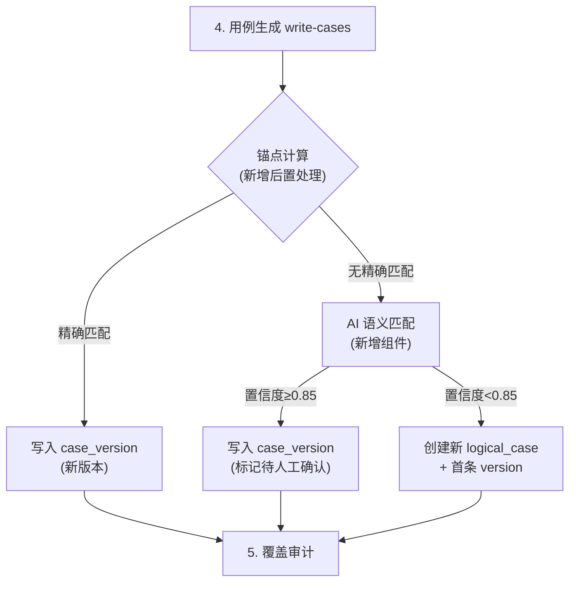
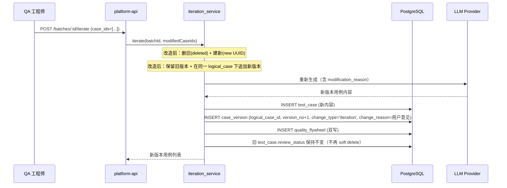
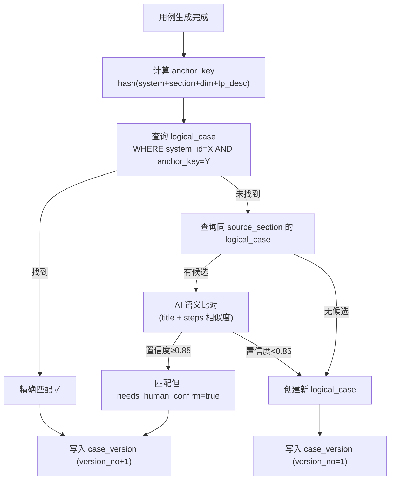

# testcase-generator 概要设计变更 — CHG-20260609-001

> 基线：xspec/modules/testcase-generator/hld.md (v0.2)

## 变更摘要

第一段不动本模块。第二段在 write-cases 输出端追加锚点计算+版本写入后置处理，改造 iteration_service 使迭代不再断裂血缘，新增 AI 语义匹配组件用于跨批次用例关联的兜底识别。

## 架构变更

### 流水线增量（第二段）

### iteration_service 改造

## 技术选型变更

无新技术引入。变更的组件均复用现有基础设施：

| 组件 | 复用来源 | 用途 |
| :--- | :--- | :--- |
| LLM 调用 | 现有 ChatModel（同 comprehend/review 阶段） | AI 语义匹配 |
| DB 写入 | 现有 SQLAlchemy Repository 层 | logical_case/case_version 写入 |
| 锚点计算 | 新增纯函数（hashlib） | anchor_key 生成 |

## 新增组件

| 组件 | 位置 | 职责 |
| :--- | :--- | :--- |
| `anchor_calculator.py` | src/testcase_generator/utils/ | 计算 anchor_key（纯函数：hash(system_id + source_section + primary_dimension + test_point_description_fingerprint)） |
| `version_writer.py` | src/testcase_generator/services/ | 写入 logical_case + case_version + quality_flywheel（双写） |
| `semantic_matcher.py` | src/testcase_generator/services/ | AI 语义匹配（LLM 调用，比对 title+steps 相似度，输出置信度） |
| `write-cases 后置处理` | src/testcase_generator/stages/write_cases/ | 在现有 write-cases 节点末尾追加锚点匹配+版本写入 |

## iteration_service 改造要点

| 维度 | 改造前 | 改造后 |
| :--- | :--- | :--- |
| 旧用例处理 | review_status='deleted' (soft delete) | 保持原 review_status 不变 |
| 新用例创建 | 全新 UUID，仅靠 test_point_id 隐式关联 | 新 test_case + 显式 case_version 记录 |
| 血缘追踪 | 无 | parent_version_id 指向上一版本 |
| 变更原因 | 不持久化 | change_reason=用户修改意见, change_type='iteration' |
| quality_flywheel | 已有写入 | 确保 change_reason/change_type 字段对齐 |

## 锚点匹配流程

## 第一段约束（硬规则）

- **禁止修改** `src/testcase_generator/` 目录下任何文件
- 第一段仅涉及 platform-web 和 platform-api 的变更
- 第二段启动前提：第一段前端+API 层已就绪且验证通过

## 宪章合规

- [x] 需求目标优先：解决"迭代断裂血缘"的实际痛点
- [x] 简洁可维护：复用现有 LLM/DB 基础设施，新增组件为纯函数或薄服务层
- [x] 模块化：锚点计算/版本写入/语义匹配各为独立组件，职责单一
- [x] 测试保障：anchor_calculator 为纯函数可单测；语义匹配可 mock LLM 测试
