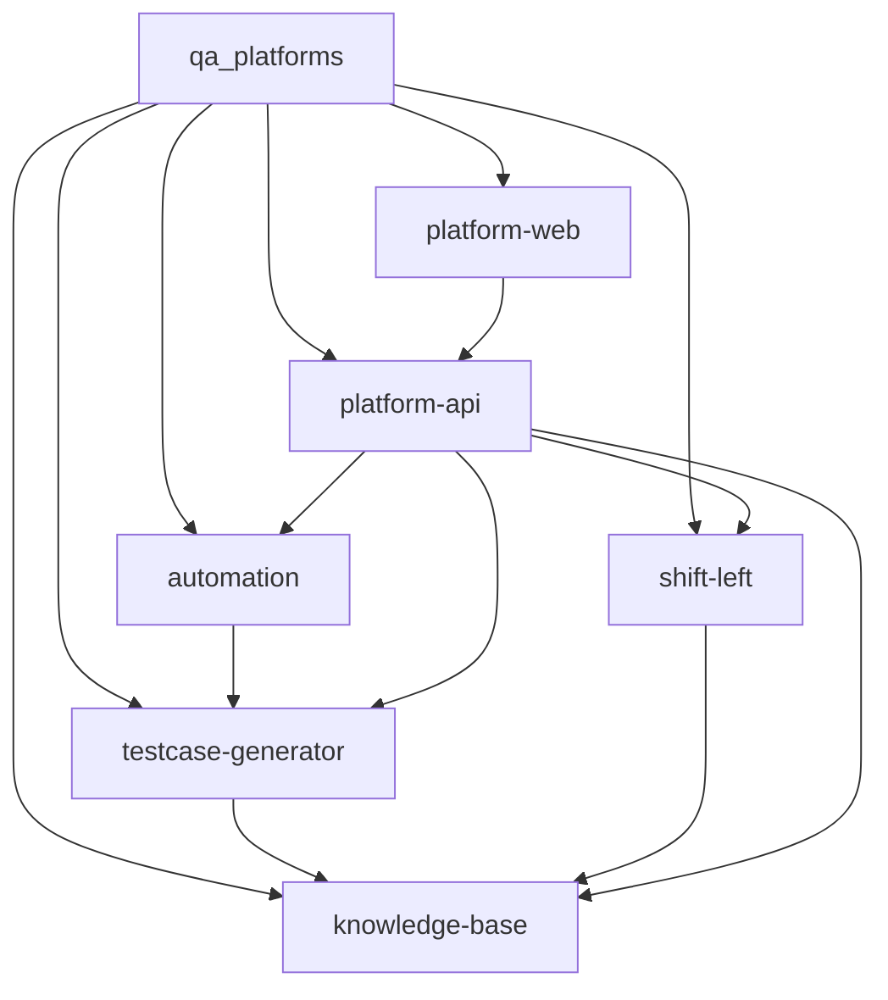

# qa_platforms 产品定位

## 产品概述

AI 驱动的 QA 智能平台，通过 Agent Skills（动态推理）/ RAG（静态检索）构建测试知识库，覆盖"用例生成 → 测试左移 → 自动化执行与沉淀"的测试全生命周期，提升 QA 团队效率与质量保障能力。

## 目标用户

| 用户角色 | 描述 | 核心诉求 |
| :--- | :--- | :--- |
| QA 工程师 | 日常执行测试的主要用户 | 减少重复编写用例的工作量，提高用例覆盖率和准确度 |
| QA 组长/管理者 | 负责测试策略和质量把控 | 知识沉淀、测试左移落地、团队效率可视化 |
| 开发工程师 | PR 提交者，被动触发测试左移 | 提 PR 时即获风险提示，减少返工 |

## 模块结构

### 模块列表

| 模块 | 类型 | 职责描述 | 状态 |
| :--- | :--- | :--- | :--- |
| knowledge-base | ai-agent | 知识库管理与智能检索（文档导入、向量化、Agent Skills/RAG 检索、知识沉淀） | 规划中 |
| testcase-generator | ai-agent | AI 测试用例生成引擎（基于知识库上下文生成、迭代优化测试用例） | 规划中 |
| shift-left | ai-agent | 测试左移分析（GitLab PR 监控、代码变更与需求一致性分析、风险提示） | 规划中 |
| automation | ai-agent | 自动化测试生成与执行（Playwright MCP UI 探索执行 + 脚本固化、接口自动化生成） | 规划中 |
| platform-api | web-backend | 平台后端服务（用户认证、项目管理、任务编排、数据存储、外部集成 GitLab/MCP） | 规划中 |
| platform-web | web-frontend | 平台前端界面（用户交互、知识库管理 UI、用例编辑器、报告展示、配置面板） | 规划中 |

### 模块依赖关系

| 模块 | 依赖 | 依赖类型 | 说明 |
| :--- | :--- | :--- | :--- |
| platform-web | platform-api | 接口调用 | 前端通过 REST API 与后端通信 |
| testcase-generator | knowledge-base | 接口调用 | 用例生成时调用知识库检索上下文 |
| shift-left | knowledge-base | 接口调用 | 左移分析时检索需求文档和历史用例 |
| automation | testcase-generator | 接口调用 | 自动化脚本基于已生成的测试用例 |
| platform-api | knowledge-base | 接口调用 | 后端编排层调度知识库能力 |
| platform-api | testcase-generator | 接口调用 | 后端编排层调度用例生成能力 |
| platform-api | shift-left | 接口调用 | 后端编排层调度左移分析能力 |
| platform-api | automation | 接口调用 | 后端编排层调度自动化能力 |

## 产品边界

### 做什么

- **知识库智能检索**：导入 PRD、技术文档、历史用例、测试经验、漏测 Bug，通过 Agent Skills（动态推理）或 RAG（静态检索）实现智能检索与理解，优先评估 Agent Skills 方案
- **AI 测试用例生成**（核心）：基于知识库上下文，由 AI 生成高质量测试用例并支持迭代优化
- **测试左移**：对接 GitLab，监控 PR，自动分析代码变更与需求的一致性，发现逻辑漏洞并给出风险提示
- **AI 驱动的 UI 自动化执行与脚本沉淀**：通过 Playwright MCP 触发探索式执行，验证通过后固化脚本
- **接口自动化脚本生成**：基于上游产物生成接口自动化测试脚本
- **测试知识沉淀**：漏测 Bug、测试经验、已验证的自动化脚本统一归档，反哺知识库

### 不做什么

- 不做测试用例执行管理（不替代 TestRail、禅道等传统测试管理工具）
- 不做缺陷跟踪系统（不替代 Jira、禅道等）
- 不做 CI/CD 流水线编排（仅对接 GitLab，不管理构建流程）
- 不做通用自动化测试执行引擎（仅通过 MCP 触发单次探索执行，不管理回归套件批量运行）
- 不做项目管理/流程管理

## 版本信息

| 属性 | 内容 |
| :--- | :--- |
| 版本 | 1.1.0 |
| 创建日期 | 2026-06-05 |
| 最后更新 | 2026-06-05 |
